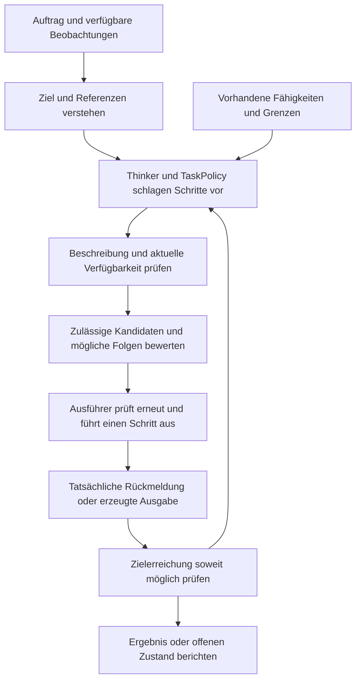

# Aktionen, Instruktionen und Ausführung

18. September 2026. Antwort auf Alex' Fragen nach Aktionsrepräsentation,
Erkennung aus Beobachtungen, expliziten Eingaben, Machbarkeit, Planung und
internen/externen Operationen. Diese Notiz erweitert den
[Architekturdurchgang](architecture-walkthrough.md) und präzisiert den bestehenden
[Entscheidungsentwurf](decision-design.md). Empfehlungen sind keine angenommenen
Implementierungsdetails. Die zuvor angenommene TaskPolicy-Zuständigkeit bleibt
erhalten; kein Modellcode, Training oder neuer Aktionsausführer in dieser Runde.

## 1. Vier unterschiedliche Inhalte

| Inhalt | Beispiel | Bedeutung für das Modell |
| --- | --- | --- |
| Beobachtung | Ein Ball bewegt sich nach rechts; ein Text oder Audiosignal kommt an | Evidenz darüber, was wahrgenommen wurde, einschließlich Herkunft und Verfügbarkeit |
| Aufgezeichnete eigene Aktion | Ein Steuerbefehl wurde gesendet; der Ausführer meldet Annahme oder eine gemessene Bewegung | Expliziter Aktions-/Ausführungsverlauf, mit noch separat zu beobachtendem Effekt |
| Erkannte fremde oder unbekannte Aktion | Vermutlich hat jemand den Ball angestoßen | Aus Beobachtungen abgeleitete Hypothese, nicht automatisch ein eigener Steuerbefehl |
| Instruktion, Ziel oder Frage | „Mach die Tasse im Bild blau“; „Welche Farbe hat sie?“ | Gewünschtes Ergebnis beziehungsweise Informationsbedarf; noch keine ausgeführte Handlung |

Die interne Wahl `think`, `recall` oder `emit` ist wiederum ein Vorschlag für den
nächsten Verarbeitungsschritt. Ein latenter Beobachtungscode ist nicht automatisch
ein Aktionscode. Derselbe physikalische Verlauf kann verschiedene Ursachen haben;
derselbe Auftrag kann mehrere zulässige Handlungsfolgen haben.

## 2. Repräsentation: genaue Aktion plus gelerntes Encoding

Für die ausführbare Schnittstelle empfehlen wir eine kleine typisierte Beschreibung,
beispielsweise `image.edit(target=image_17, object=cup_3, color=blue)`. Dies ist ein
Schema-Beispiel, keine vorhandene PATH-WM-Funktion. Sie beschreibt Operation, Ziel
und Parameter. Je nach Aktionsart kommen Einheiten, erlaubte Werte, Quelle,
Aufgaben-/Zustandsversion, ausführendes Interface und erwartete Dauer hinzu.
Vorschlag, gesendet, angenommen, teilweise ausgeführt, beendet, fehlgeschlagen und
Ergebnis unbekannt sind unterscheidbare Zustände; nicht jede Operation braucht
alle Zustände. Ein Ausführungsfehler ist nicht automatisch eine Nullaktion.

Neuronale Module lesen ein gelerntes Encoding des Aktionstyps, seiner Argumente
und des relevanten Kontextes. Motorische Parameter können kontinuierlich sein;
Toolwahl oder interne Operationen diskret; Ziele können konkrete Entity-/Datei-
Referenzen besitzen. Mehrschrittige Skills können vorhandene Operationen zusammensetzen.
Lesbare Operationsnamen zwingen den Weltzustandsvektoren keine feste Semantik auf.
Präzise Ausführungsdaten werden nicht allein aus einem beliebigen latenten Vektor
zurückgewonnen. Unbekannte Namen schaffen keine neue ausführbare Schnittstelle.

Der Aufrufer stellt eine kleine Menge tatsächlich nutzbarer Funktionen/Adapter
mit ihren Parameterverträgen bereit. Normale Python-Objekte und explizite
Konstruktion in einer Recipe reichen; kein universelles Registry-/Plugin-Framework.
Opaque IDs und Befugnisse bleiben exakte Metadaten. Nur semantisch relevante
Information sollte als Lernsignal dienen; IDs dürfen keine Zielantwort verraten.

## 3. Explizite Aktionen und Inferenz ergänzen sich

**Eigene bekannte Aktionen explizit zuführen.** Das System kennt den gesendeten
Befehl aus seinem Ausführungspfad. Annahme, tatsächliche Ausführung, Zeit und
gemessene Wirkung bleiben getrennt. Training mit entsprechenden Logs kann
`bisheriger Zustand + Aktion + Zeit → Folgezustand` lernen. Ein erfolgloser Befehl
belegt keinen eingetretenen Zielzustand. Auch verlässliche Aktionslogs garantieren
keine korrekte kausale Vorhersage unter neuen Eingriffen: Auswahl durch die
Datenpolitik, verborgene Zustände und zeitliche Fehlzuordnung bleiben Risiken.

**Fehlende/fremde Aktionen gegebenenfalls inferieren.** Ein gelernter inverser
Prädiktor kann eine Verteilung über mögliche Aktionen aus einer beobachteten
Sequenz schätzen. Dafür braucht er geeignete Trainingsziele oder eine ausgewiesene
latente Lernaufgabe. Bewegung allein identifiziert weder Verursacher noch Befehl;
Kameraänderung, Trägheit, Umwelteinfluss und andere Akteure können verwechselt werden.
Ungenügende Evidenz bleibt unbekannt oder mehrdeutig. Das derzeitige Presence-Bit
für fehlende Aktionswerte ist keine Implementierung dieser Inferenz.

Für eine **bereits abgeschlossene** Transition darf der inverse Prädiktor die
Beobachtung danach sehen. Bei einer Vorhersage dieser nächsten Beobachtung darf
derselbe zukünftige Inhalt nicht heimlich als Eingang dienen. Ein nachträgliches
Aktionslabel und eine vorwärts gerichtete Online-Entscheidung sind verschiedene
Auswertungsaufgaben. Nachträglich abgeleitete Labels dürfen als solche Trainings-
oder historische Inferenzdaten sein, ohne zu einem damals vorhandenen Signal zu werden.

[Genie](https://arxiv.org/html/2402.15391v1#S2.SS1) zeigt eine verwandte Lernidee:
latente Aktionen aus Videos ohne Aktionslabels. Sein Trainingsencoder sieht auch
das nächste Bild; bei der Generierung werden Aktionen gewählt und der nächste
Frame erzeugt. Daraus folgt weder eine eindeutige physikalische Aktionsidentität
noch eine fertige Zuordnung zu unseren Aktuatoren oder Tools. Für reale Steuerung
ist diese Zuordnung gesondert zu lernen/prüfen. Es ist keine hier übernommene Architektur.

**Instruktionen explizit als Auftrag führen, Bedeutung lernen.** Text kann durch
den gemeinsamen Textencoder laufen; ein Sprachauftrag benötigt einen passenden
trainierten Audio-/Sprachinterpretationspfad. Quelle, Auftraggeber und Originalinhalt
bleiben erhalten. Aus „Mach die Tasse blau“ werden beispielsweise gewünschtes
Ergebnis, Referenz auf die gemeinte Tasse und Bedingungen. Das ist nicht gleich
dem Zustandsfakt „die Tasse ist blau“. Ein zitierter Befehl oder Text in einem
Bild ist auch nicht allein durch seinen Wortlaut ein eigener ausführbarer Auftrag.

## 4. Verstehen, verfügbar sein und gelingen sind verschiedene Prüfungen

| Frage | Prüfung und mögliche Reaktion |
| --- | --- |
| Was ist gemeint? | Gelernte Interpretation/Referenzauflösung; bei entscheidender Mehrdeutigkeit gezielt nachfragen |
| Gibt es einen Ausführungspfad? | Tatsächlich bereitgestellter Decoder, Tooladapter, Aktuator oder zusammengesetzter Skill; sonst Alternative suchen oder fehlende Fähigkeit benennen |
| Ist die Beschreibung gültig? | Parametertypen, Einheiten, Zielreferenzen und bekannte Grenzen direkt prüfen |
| Ist sie in diesem Kontext verfügbar/zulässig? | Vom Aufrufer verwaltete aktuelle Befugnisse und Ressourcen prüfen; ein Graph-Eintrag oder Modellscore erteilt keine neue Befugnis |
| Sind die Voraussetzungen erfüllt? | Sicher bekannte Bedingungen direkt prüfen; unsichere Bedingungen mit Beobachtung, Abruf oder einem trainierten Erfolgsmodell einschätzen |
| Beherrscht das System die Aufgabe voraussichtlich? | Task-/zustandsabhängige Lernergebnisse und Erfolgsschätzung; bekannte Begriffe oder ein installiertes Modul sind dafür kein Beweis |
| Ist das Ziel erreicht? | Ergebnis mit dem Ziel vergleichen, soweit möglich unabhängig prüfen; sonst als ungeprüft/teilweise/unbekannt ausweisen |

Ein Wissensgraph kann Bedeutung, Beispiele, benötigte Ressourcen und bekannte
Erfahrungen einer Handlung speichern. Das hilft beim Finden und Bewerten von
Skills, ersetzt aber weder einen Ausführer noch dessen trainierte Fähigkeit.
Eine zusammengesetzte Handlung kann neu sein und dennoch aus vorhandenen
Operationen machbar werden. Umgekehrt ist eine bekannte Handlung nicht in jeder
Situation ausführbar.

[SayCan](https://say-can.github.io/) ist ein belegtes Beispiel dafür, sprachlich
passende Handlungsvorschläge mit zustandsabhängigen Erfolgswerten vorhandener
Skills zu verbinden. Das motiviert die Trennung von Aufgabenrelevanz und
Ausführbarkeit; es beweist weder unsere Scores noch einen universellen Prüfer.
Latente Entropie, TaskPolicy-Wahrscheinlichkeit und Completion-Logit sind keine
kalibrierten Erfolgswahrscheinlichkeiten. Die
[Kalibrierungsdiskussion](decision-design.md#calibration-training-and-the-jevrlcd-comparison)
gehört später zu beobachtbaren Erfolgsereignissen mit überprüfbaren Labels.

## 5. Interne und externe Operationen nach Wirkung unterscheiden

Die Grenze ist nicht „ändert die Observations“. Passende Betrachtungsachsen sind
**wo etwas ausgeführt wird**, **welcher Zustand betroffen ist**, **welche Information
zurückkommt** und **welche Kosten/Abhängigkeiten entstehen**. Kategorien können
überlappen; das tatsächliche Interface legt die Wirkung fest.

| Beispiel | Wirkung und Zuständigkeit |
| --- | --- |
| Länger denken, Kandidaten vergleichen | Arbeitszustand und Rechenbudget; keine erfundene neue Weltbeobachtung |
| Fokus setzen, Local/Global auswählen | Zugriffs-/Aufbewahrungsentscheidung der erweiterten TaskPolicy; keine automatische Änderung des Quellfakts |
| Knowledge Graph lesen | Interner Wissensabruf oder externer Dienstaufruf je nach Betrieb; abgerufene historische Quelle bleibt historisch |
| Kamera aufnehmen, Datei/API lesen | Informationsgewinn an einer Schnittstelle; muss die beobachtete physische Welt nicht verändern |
| Eine Frage beantworten, ein Bild erzeugen | Interne Verarbeitung und anschließend Ausgabe; Kommunikation beziehungsweise Artefakt hat eine Außenwirkung |
| Ein Bild editieren oder eine Datei speichern | Kann zuerst einen privaten Entwurf erzeugen; Veröffentlichung/Überschreiben ist ein gesonderter Effekt |
| Tool verwenden | Kann lesen, rechnen, schreiben oder physisch wirken; „Tool“ bestimmt den Effekttyp nicht |
| Roboter bewegen | Aktuatorbefehl und möglicherweise physische Veränderung; Wirkung durch tatsächliche Rückmeldung/Beobachtung feststellen |
| Internen Zustand ändern | Arbeitswerte ändern, Kontext auswählen, eine Inferenz revidieren oder Modellgewichte trainieren sind verschiedene Operationen |

Die Anfrage „Beantworte diese Frage“ ist ein Ziel. Mögliche Schritte dazu sind
Abrufen, Denken, Prüfen und Ausgeben. Ebenso ist „Benutze Tool X“ zunächst eine
Instruktion, aus der ein konkreter gültiger Aufruf entstehen muss. Eine Änderung
an einem Gedanken ist keine Berechtigung, die Beobachtungshistorie zu ändern.
Gewichtslernen ist nicht implizit durch eine gewöhnliche Arbeitszustandsänderung
freigeschaltet.

## 6. Aufgabensteuerung, Planung, Ausführung und Rückmeldung

**TaskPolicy:** wählt den nächsten Operationstyp und seine Argumente anhand von
Aufgabe, Denkzustand und Kontext. Die angenommene Erweiterung um Kontextaktionen
passt hier hinein. Interpretation, Kandidatenbildung und Operationswahl können
kleine Köpfe desselben Kerns sein; dafür ist kein zweiter allgemeiner Agent nötig.

**Planung:** vergleicht innerhalb eines Budgets Alternativen. Physische oder
andere äußere Zustandsänderungen benötigen ein geeignetes gelerntes oder
bereitgestelltes Übergangsmodell. Interne Denk-/Abrufschritte benötigen dagegen
eine Bewertung ihres erwarteten Aufgabenfortschritts gegen Kosten. Nicht jede
Operation wird als Roboteraktion an dieselbe physikalische Dynamik gegeben.
Ein langer Denkschritt kostet reale Zeit; externe Veränderung währenddessen wird
über tatsächliche Zeit/Rückmeldung erfasst, nicht als erfundene Sensorevidenz.

Bei einem Informationsabruf können Ergebnisse unterschiedlich ausfallen. Der
Folgeschritt muss vom tatsächlich erhaltenen Inhalt abhängen können. Beispiel:
erst prüfen, ob die Datei existiert, dann öffnen oder den fehlenden Eingang melden.
Ein bloßes Vorhersagen ohne Beobachtungskorrektur genügt dafür nicht. Nach jedem
äußeren Schritt gegen den aktuellen Zustand neu prüfen und bei Bedarf neu planen;
imaginierte Zweige bleiben von echten Ereignissen getrennt.

**Ausführung:** direkt vor dem Aufruf aktuell prüfen, nicht allein bei der
Planerstellung. Atomare Versionsprüfungen, Idempotenz und Wiederherstellung nur
dort zusagen, wo der jeweilige Ausführer sie tatsächlich unterstützt. Unsichere
physische Voraussetzungen lassen sich nicht allgemein atomar sperren. Ein
Timeout kann einen unbekannten oder teilweise eingetretenen Effekt bedeuten;
nicht automatisch Fehler, Erfolg oder sicheren Wiederholungsbedarf behaupten.

**Verifikation:** „Aufruf angenommen“, „Ausgabe erzeugt“ und „Nutzerziel erfüllt“
sind getrennte Ereignisse. Verifizierbares direkt prüfen; unbekannte Zielerfüllung
sichtbar lassen. Kosten fallen auch bei erfolglosen/unklaren Versuchen an. Ein
Prüfer validiert seinen angegebenen Bereich, nicht automatisch alle semantischen
oder physikalischen Eigenschaften.

## 7. Beispiel: eine Tasse in einem Bild blau machen

Illustrativer Zielpfad, kein vorhandener allgemeiner Bildeditor:

1. Bild und Auftrag getrennt erfassen; gemeinte Tasse und Änderungsziel bestimmen.
2. Relevante Bildmerkmale, Objektbezug und Auftragsbedingungen im Local Context
   verfügbar machen; länger nötige Auftragsinformation im Global Context halten.
3. Feststellen, ob ein geeigneter trainierter Editor/Adapter vorhanden ist und
   welche Eingaben, Masken, Ressourcen und Ausgabemöglichkeiten er tatsächlich hat.
4. Eine Operation wie `image.edit(...)` mit gebundener Bild-/Objektreferenz
   vorschlagen; bei zwei gleich plausiblen Tassen die Referenz erst klären.
5. Nach Prüfung eine Ergebnisvariante erzeugen. Das verändert nicht automatisch
   das Originalbild oder die physische Tasse in der beobachteten Welt.
6. Soweit prüfbar vergleichen, ob das Ziel erreicht und übriger Bildinhalt
   erhalten wurde; daraus Ergebnis, Korrekturversuch oder benannte Grenze ableiten.
7. Das Bild ausgeben und den Erzeugungs-/Änderungspfad festhalten. Die generierte
   Darstellung wird nicht als neue Kamerabeobachtung gespeichert.

Fehlt der Editor, kann das Modell den Auftrag trotzdem verstehen. Es muss dann
einen tatsächlich möglichen Alternativpfad wählen oder die fehlende Fähigkeit
benennen. Vorhandene RGB-/Video-Decoder belegen keine allgemeine Editierfähigkeit.

## 8. Tatsächlicher Implementierungsstand

| Vorhandener Baustein | Was er heute tut | Was dadurch nicht gegeben ist |
| --- | --- | --- |
| `BeliefDynamics` | Liest vorherigen rekurrenten Zustand/Code, expliziten Vektor `[B, action_width]`, eigenes Presence-Bit, Zeit und Memory | Keine automatische Aktionserkennung aus Sensorcodes; kein allgemeiner Tool-Aktionsraum |
| `ActionHead` / `propose_action` | Erzeugt normalisierte kontinuierliche Vektoren mit `tanh`; Dimension und Bedeutung werden konfiguriert | Keine Garantie auf richtige physische Wirkung oder allgemeine API-Aufrufe |
| `TaskRequest` / `TaskInterpreter` | Bewahrt expliziten Auftrag; codiert Text und Metadaten zusammen mit Zustand in Task-Tokens | Keine validierte allgemeine Instruktionssemantik oder beliebige Sprachaufnahme-Verarbeitung |
| `TaskPolicy` | Logits für `think`, `recall`, `imagine`, `act`, `emit`, `ask`, `finish`; Modalitäts- und Completion-Ausgaben | Noch keine vollständige Kontext-, Tool-, Skill- oder Machbarkeitspolitik |
| `TaskPrediction.select` / `TaskSession` | Prüft und führt Modalitäts-/Outputvorgaben, gültige Scores und Abschluss-/Fehlerzustand | Output erfüllt heißt nicht Inhalt korrekt oder reales Ziel erreicht |
| `step_task` | Führt vorhandene interne Pfade aus; `act` gibt einen Aktionsvorschlag zurück; `ask` bleibt ein Signal an den Aufrufer | Betätigt keinen allgemeinen externen Tool-/Roboterausführer |
| `plan` | Bewertet übergebene Sequenzen `[B,C,H,A]` mit numerischen Grenzen, imaginierten Rollouts und Kostenfunktion | Kein allgemeiner Instruktionsplaner, keine beliebigen Tool-/internen Operationsfolgen und keine Beobachtungsverzweigung nach einem Abruf |
| `ControlBinding` / `select_action` | Optionaler Filter für erlaubte Aktionsnamen/Budget; Auswahl aus gelieferten Vorschlägen/Scores | Keine gelernte Fähigkeitsprüfung, keine generelle Ausführung und kein Erfolgsbeweis |

Code: [belief.py](../pathwm/models/belief.py), [agent.py](../pathwm/models/agent.py),
[tasks.py](../pathwm/models/tasks.py), [Planer](../pathwm/evaluation/agent.py),
[optionale Aktionsclients](../pathwm/world_state/extensions.py).

## 9. Kleinste sinnvolle Fortsetzung und Gestaltungsprinzipien

Zuerst für **eine** konkrete nutzbare Fähigkeit Auftrag, typisierten Aufruf,
Ausführer und Ergebnisprüfung verbinden. Die kleinen Schnittstellen in der
bestehenden Recipe konstruieren. Keine Spekulation über einen Universalplaner
oder einen zweiten Trainer. Fähigkeit und Budget werden vor Umsetzung ausgewählt;
diese Diskussion startet keinen Lauf.

Für die Aktionsinferenz zwei Fragen getrennt untersuchen: Erkennung vergangener
Aktionen auf abgeschlossenen Sequenzen gegen vorhandene Labels; vorwärtsgerichtete
Vorhersage neuer Eingriffe nur aus zur Entscheidung verfügbaren Eingaben.
Explizite Logs sind eine informative Referenz, keine automatisch faire
Gleichinformationskontrolle. Anzahl verfügbarer Labels, Beobachtungen, Training
und Rechenbudget deklarieren. Eine inferierte Variante kann gegenüber fehlender
Aktionsinformation hilfreich sein, auch wenn sie die explizite Referenz nicht
erreicht. Interventions-/Verteilungstests sind nötig, bevor ein guter Replay-Score
als Planungsfähigkeit ausgelegt wird. Numerische Gates sind noch nicht gewählt.

Für den durchgehenden Aufgabenpfad zunächst sinnvolle Fälle prüfen: unbekannte
Operation, fehlende/mehrdeutige Zielreferenz, ungültige Argumente, verschwundene
Fähigkeit, unbekannter/teilweiser Ausgang, geändertes Ziel und saubere Trennung
von Arbeitszustand, Hypothese und realem Ereignis. Mechanik und Aufgabenqualität
werden getrennt bewertet. Keine neuen Tests für diese reine Dokumentationsrunde.

Stehende Prinzipien: gemeinsame Eingangsmerkmale mehrfach verwenden; exakte
Aktions-/Quellenrecords von erlernten Encodings und hypothetischen Zweigen trennen;
Vorschläge von Vertrags- und Ergebnisprüfung unterscheiden; Denk-/Abruf-/Suchkosten
begrenzen; genau die spätere Aktionsschnittstelle trainieren und auswerten.
Erwarteter Nutzen sind nachvollziehbare Ausführung und klarere Lernziele; Kosten
sind Aktionscodierung, Kandidatenbewertung, zusätzliche Ausführer-/Fehlerpfade
und Verifikationsaufwand. Eingesparte Kopien oder höhere Erfolgsraten sind noch
zu messen. Interne Arbeitszustände und Graph-Wissen bleiben getrennte Besitzer.

Bei aus Sequenzen erzeugten Aktionslabels zusätzlich ihre Fehler und deren Einfluss
auf das Vorwärtsmodell ausweisen; Trainingsdaten des inversen Modells und Daten
der abschließenden Vorwärtsauswertung trennen. Eine Zielprüfung kann feststellen,
dass das beobachtete Ergebnis zum Auftrag passt, ohne damit zu beweisen, dass der
eigene Befehl allein die Ursache war. Zeitfenster und Toleranz des jeweiligen
Prüfers explizit festlegen. Aufgezeichnete Auswahlwahrscheinlichkeiten entfernen
verborgene Konfundierung nicht automatisch.

## Review und Status

Tatsächlicher Claude-Review mit öffentlichen generischen Methodikfragen, ohne
private Quelltexte, Daten oder Messwerte. Receipts:
`runs/reviews/action-semantics-20260918-210948/`.
Review und Rücksprache sind abgeschlossen. Claude nimmt die zu starke Forderung
zurück, inferierte Aktionen müssten die explizite Referenz erreichen, und bestätigt
den notwendigen Ausschluss zukünftiger Frames aus kausalen Vorhersageeingaben.
Pauschale Forderungen nach Locks/Idempotenz/Kompensation sind auf tatsächlich
unterstützende Ausführer begrenzt. Relevante offene Grenzen sind explizite Logs
ohne pauschale Kausalgarantie, inverse Labelfehler, getrennte inverse/kausale
Auswertung, echte Ausführergrenzen und sichtbare unklare Ergebnisse.
Kein neuer Aktionsmechanismus ist allein durch Peer-Übereinstimmung angenommen
oder validiert. Der vollständige Nutzer-Durchgang und eine konkrete nächste
Implementierung bleiben offen.
