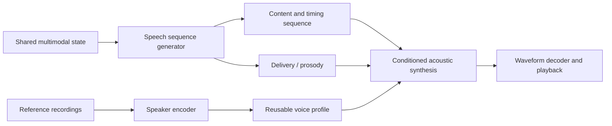

# Agent voice from reference recordings

Discussion proposal, 22 September 2026. Alex asks how the agent gets and uses a
voice, and whether recordings can teach it that voice. No model selection,
installation, training, audio generation or capability validation has occurred.

Alex's follow-up asks for a direct latent connection and proposes a generated
latent sequence combined with a learned voice profile. This matches the standing
multimodal output direction. The text bridge below is an optional baseline; it is
not a prerequisite or a selected architecture. Lower cost, latency or better
quality do not follow from removing text alone.

## What bypassing text actually saves

Alex challenges the cost qualification: direct speech avoids serializing the shared
state into written language and processing that language again. This is a real
optimization opportunity. For a matched acoustic backend, compare total compute as
`C_text = C(state→text) + C(text→speech units) + C(waveform)` versus
`C_direct = C(state→speech units) + C(waveform)`. The direct route wins when its
sequence generator costs less than the two upstream operations combined. It may
fuse duplicated linguistic work and preserve conditioning that plain text omits.
The previous qualification means unmeasured gain, not absence of an advantage.

Counting encoder/decoder boxes is insufficient. The text-output generator is
replaced by a speech-output generator, while wording, ordering, pronunciation and
timing still need computation. Consuming text means token embedding/context
processing, not rendering and visually reading letters. Some systems have no
separate text encoder: CosyVoice 2 explicitly removes it and uses its text-speech
language model for alignment. Removing an output vocabulary projection or an
embedding lookup is different from removing a full autoregressive model.

Direct speech should not require rerunning the complete Thinker for every audio
unit. Reuse the selected state and fixed-source projections in the speech consumer;
refresh them only when the source/context changes. Autoregressive unit rate,
generator size, decoder work and cache traffic can dominate the saved text work.
Measure total GPU work separately from first-audio latency: streaming text and
speech can overlap, so serial compute sums do not predict wall-clock delay.

The design hypothesis is lower redundant processing and richer speech conditioning
with a trained direct readout. Compare both routes at matched task accuracy,
intelligibility, voice consistency, hardware and streaming conditions; report
first-audio delay, sustained synthesis rate and peak memory. This follow-up supplies
no measurements or new architecture adoption.

## Direct latent speech: proposed target

The generator reads the shared state and selected multiscale evidence with its
own transformer loop, then generates successive speech units using the previous
units and current task context. These units specify the actual utterance, including
its linguistic realization and temporal alignment. They are not arbitrary core
state vectors. Discrete codebook indices or continuous acoustic features are both
possible; either requires a compatible trained downstream representation.

Conceptually, `c_t = G(state, c_<t)` and `audio = D(c_1:T, voice, delivery)`.
`D` may contain an acoustic generator followed by a vocoder/codec decoder; voice
conditioning can use projected embeddings, cross-attention or feature modulation.
It must enter a stage trained to use it, before speaker-specific acoustic details
are fixed. No universal decoder accepts arbitrary latent units plus a voice vector.
Chunked synthesis requires a causal/chunk-trained path, duration/stop decisions
and explicit lookahead/playback budgets, not just splitting a completed waveform.

Content, relatively stable timbre and time-varying prosody are useful separate
controls. Ordinary reconstruction codec tokens can already encode all three, so
separate tensor names do not establish disentanglement. Pitch range, accent and
delivery interact with perceived identity. The voice profile may need several
reference tokens as well as a pooled embedding; it is not necessarily one vector.

For a concrete reference, [CosyVoice 2](https://arxiv.org/html/2412.10117v1)
uses supervised semantic speech tokens, then speaker/reference-conditioned flow
matching to Mel features and a vocoder. Its standard upstream generator is still
text-conditioned. Its authors also report language/paralanguage leakage in speaker
embeddings. This supports the component separation, not an already implemented
connection from PATH-WM state or perfectly independent identity/prosody controls.

[NaturalSpeech 3 / FACodec](https://speechresearch.github.io/naturalspeech3/)
explicitly models content, prosody, timbre and acoustic detail in separate codec
subspaces and demonstrates attribute manipulation. This is an architectural
reference for the user's proposed factorization, not a demonstrated German,
streaming or 8-GB PATH-WM solution. Codec availability alone does not supply our
state-to-speech generator.

Proposed learning sequence: first test a compatible pretrained tokenizer and
speaker-conditioned acoustic decoder with actual target-speech tokens; then train
a state-conditioned speech generator to predict those targets on paired task
contexts and intended spoken responses. Freeze the acoustic stack initially to
isolate the interface. A small projection alone need not learn wording, syntax,
duration and pronunciation. Transcripts can supervise content during training
without requiring a text intermediate at inference.

Learning separation from scratch requires varied speakers and utterances, suitable
content supervision/invariance constraints and speaker-consistency objectives.
Use a different utterance from the same speaker as reference, avoiding a shortcut
through the target recording. New profiles can then be extracted by the pretrained
speaker encoder without updating weights; optimizing a profile or fine-tuning a
voice is a separate choice. User recordings alone do not teach the entire speech
system language or general disentanglement.

Smallest useful checks: hold content fixed and swap voice references; hold voice
fixed and vary content; change requested delivery and test both content and speaker
consistency. Evaluate held-out utterances and contexts, reference contamination,
independent transcript/content checks and listening quality. For the core bridge,
include absent/swapped context controls. Compare text and direct-latent interfaces
only with declared, matched task/resource budgets; no comparison has run.

## Optional text bridge baseline

Shared multimodal state → speech content readout → spoken text → pretrained TTS
conditioned on a reusable voice prompt → waveform chunks → playback buffer.

Text is a practical interface to an existing speech producer; the Thinker remains
multimodal. A future direct state-to-audio producer would require its own learned
conditioning and evaluation. Existing native audio tests learn controlled tones,
not general speech. Adding TTS also does not teach the core what to say.

Prepare a voice profile from a clean single-speaker recording and, where required,
its accurate transcript. Use Alex's own or permissioned recordings. Retain the
source, transcript, model/tokenizer version and preparation settings on disk;
cache the derived voice prompt in RAM and place active tensors on the GPU as
needed. A graph entity can reference the profile; it need not own model weights.
Invalidate derived prompts when their source or preparation model changes.

For each utterance, generate the intended content, select the profile and supported
language/style settings, synthesize audio and feed playback incrementally where
the selected runtime supports streaming. Cancellation should stop queued playback
and release utterance caches. Stable voice identity and current delivery
(pace, emphasis, expression) are separate controls, with support varying by model.

## Conditioning versus training

Reference-conditioned synthesis extracts a reusable prompt from example speech;
the pretrained synthesizer's weights stay fixed. It can say new text in an
approximation of the reference voice. Similarity and pronunciation need listening
checks; a short clip does not guarantee an exact match across all expressions.

Fine-tuning instead updates model weights using a collection of recordings and
transcripts. It is a later option if reference conditioning is insufficient, not
a prerequisite for each new voice or utterance. Keep evaluation sentences separate
from training/reference content and cover German numbers, names and new wording.

Source-backed candidates, checked 22 September:

- [Qwen3-TTS](https://github.com/QwenLM/Qwen3-TTS): the 0.6B Base variant supports
  reference cloning and German; its documented `create_voice_clone_prompt` can
  prepare reference conditioning once for later generations. Default cloning takes
  reference audio plus transcript; embedding-only mode omits the transcript with
  a documented possible quality loss. The authors advertise three-second cloning;
  that is not a local quality or latency result. CustomVoice and VoiceDesign are
  distinct variants with different controls.
- [Official fine-tuning recipe](https://github.com/QwenLM/Qwen3-TTS/blob/main/finetuning/README.md):
  single-speaker fine-tuning uses audio, text and reference audio, followed by audio
  code preparation. No local 8-GB training fit is established.
- [Chatterbox](https://github.com/resemble-ai/chatterbox): Multilingual V3 (500M)
  supports German and a reference audio prompt; it is a possible comparison.
  The smaller English Turbo/Nano variants are not substitutes for this German test.

## Budget and smallest useful check

For the optional text baseline, evaluate Qwen's smaller Base candidate with one
clean reference and held-out German sentences. The direct latent target has the
separate compatibility/readout checks above; it does not require adopting this
baseline first. Neither is an adopted dependency or benchmark result. Record first-audio latency,
generation time divided by audio duration, playback underruns, peak whole-process
VRAM, intelligibility and perceived voice consistency. Compare uncached versus
reused reference preparation with matching inputs and settings.

The RTX3050's 8 GiB must accommodate the agent, speech model, codec, activations,
caches and concurrent vision work. Retain the proposed 6-GiB whole-process target;
parameter count alone cannot establish fit or real-time speech. On-demand loading
saves residency but adds startup delay; frequent conversation may justify keeping
the selected speech producer warm. GPU fine-tuning has a separate memory budget.

This applies prepare-once reuse, explicit ownership/lifetimes and conditional
compute. Multiscale evidence remains available to the content consumer; the first
external TTS bridge consumes text rather than assuming compatible visual/latent
features. Source recordings remain authoritative; voice prompts and utterance
caches are derived. Quantization and direct latent conditioning are separate
quality/cost changes. For the direct path, retain reusable speaker conditioning
while the temporal speech sequence and utterance caches change; audit retained
evidence versus the subset read by the speech consumer. No fixed token rate or
assumed smaller decoder budget.
