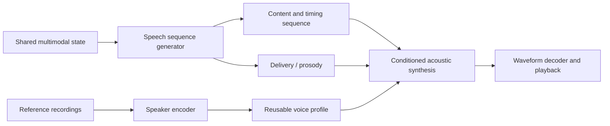

# Agent voice from reference recordings

Current proposal after actual Claude review:
[Grounded spoken dialogue and commands](grounded-speech-plan.md). It refines the
initial discussion below: acoustic reconstruction is not a prerequisite for
semantic-input experiments; input grounding and output preparation can proceed
independently under a shared time/representation contract. Planning only.

## First grounded conversation: proposed starting point, 25 September

While decoder-feedback experiments run, Alex asks what is missing for spoken
conversation and how to approach it. Existing audio/text encoders, output modules
and episode records do not establish learned speech understanding, grounded answer
formation or intelligible speech. Tone tests and conversation storage are separate
from these learned capabilities. No speech implementation or training is authorized
by this discussion; no pretrained component, dataset or codec has been selected.

Proposed first end-to-end task: answer a spoken question about a small observed
scene, then resolve a follow-up such as "and the other one?" using the same session.
Choose attributes already validated in the actual model when registering the task;
the conversational red-object example does not qualify existing color grounding.
First train/check spoken content against object/property/state access with swapped
question and scene controls. Then train a compatible state-conditioned speech
sequence generator and acoustic output, potentially using a pretrained speech
component after interface/resource review. Written transcripts may supervise or
score learning without becoming a mandatory runtime text bridge.

The proposed order is grounded question/answer alignment, intelligible direct
speech, varied wording and follow-ups/corrections, then streaming and interruption
behavior. Reuse the current shared state and episode ownership; do not introduce a
separate conversation store or replace the real model with a toy dialogue system.
Success must use held-out utterances and scenes, independent content checks and
listening quality. All data, compute budgets, targets and thresholds remain to be
registered before implementation. Free conversation is a broader objective than
this bounded demonstration. This assistant proposal is awaiting Alex's discussion,
not an adopted architecture or a capability validation.

Alex follows up that latent codes should control the path, then asks whether to
start with the encoder, decoder or joint training. Proposed staging: first verify
real-speech codec reconstruction (acoustic preservation/intelligibility, not
understanding); next train audio-to-shared-state grounding together with the core,
using an independently checkable answer readout; next learn state-to-speech sequence
generation; finally jointly fine-tune the connected conversation path. Understanding
is not assigned to the encoder alone. A state vector needs a compatible temporal
speech generator before acoustic decoding. These are discussion stages, not adopted
training recipes, selected components or permission to run speech jobs.

Alex then asks whether conversation repeatedly reprocesses the whole recording or
handles arriving speech incrementally. Proposed streaming behavior: timestamped
audio chunks with bounded acoustic context, compatible cached encoder state and
versioned provisional interpretations in the shared session. Audio chunks are not
speaker turns or semantic sentence boundaries. Later evidence can revise incomplete
interpretations; retain source audio/provenance separately from derived working
state. Endpointing and speaker changes need their own evidence, and silence alone
does not guarantee turn completion. Begin with complete-utterance input, then train
and verify the same path under chunked access, bounded lookahead and interruptions.
Do not claim the current audio encoder already supports exact incremental caching,
diarization or conversational streaming; interfaces and equivalence/quality tests
remain to be designed. No speech training is launched by this explanation.

Further questions concern control ownership, existing output and text alignment.
Proposed control remains around the shared thinker: distinguish waiting for more
input, useful additional reasoning, and an information gap requiring a question.
Stable latent iterations alone do not establish correctness or resolved ambiguity.
The audio front end supplies provisional evidence; it does not become a separate
authoritative conversational state. These criteria remain to be specified/trained.

Code inspection confirms `TaskPolicy` has operation/modality selection and the agent
has an `emit` path. The native `AudioDecoder` attends state with four learned queries
and emits a fixed-length waveform; it is not a trained variable-length speech
sequence producer. `EpisodeClient.emit` can record/revalidate output chunks, including
completion and obsolete-read/abort guards, but performs no external playback. These
interfaces are groundwork, not evidence of learned conversational policy.

For text that must match spoken wording, propose paired text/speech segments for one
utterance, with explicitly trained alignment or a separate alignment step. Independent
decoders reading the same state do not guarantee matching wording. Drive displayed/
highlighted segments from playback progress rather than synthesis completion time.
Interruptions cancel unplayed audio and pending display; already spoken source
history is retained. Segment alignment is the first proposed scope; word highlighting
additionally requires timestamps. No aligned generator, playback clock or text/audio
synchronization is implemented by this discussion.

Alex asks how audio can carry meaning, emotion and references to actual things.
Proposed learning separates acoustic retention from contextual understanding:
paraphrase/intent agreement, grounded spoken references with matched and mismatched
scenes, non-speech event/source hypotheses, and prosody/context contrasts. Preserve
observable acoustic cues separately from inferred emotion; loudness alone does not
establish anger, and ambiguous sources/referents should remain uncertain. Grounding
requires the audio encoder, shared core and memory together; no audio-only head is
assumed to supply general semantics. Proposed tests vary scene, wording, prosody
and prior referent independently and score the resulting answer or state against
known evidence. These are candidate tasks, not selected data, objectives, thresholds
or established emotion/intent understanding.

Discussion proposal, 22 September 2026. Alex asks how the agent gets and uses a
voice, and whether recordings can teach it that voice. No model selection,
installation, training, audio generation or capability validation has occurred.

Alex's follow-up asks for a direct latent connection and proposes a generated
latent sequence combined with a learned voice profile. This matches the standing
multimodal output direction. The text bridge below is an optional baseline; it is
not a prerequisite or a selected architecture. Lower cost, latency or better
quality do not follow from removing text alone.

## What bypassing text actually saves

Alex challenges the cost qualification: direct speech avoids serializing the shared
state into written language and processing that language again. This is a real
optimization opportunity. For a matched acoustic backend, compare total compute as
`C_text = C(state→text) + C(text→speech units) + C(waveform)` versus
`C_direct = C(state→speech units) + C(waveform)`. The direct route wins when its
sequence generator costs less than the two upstream operations combined. It may
fuse duplicated linguistic work and preserve conditioning that plain text omits.
The previous qualification means unmeasured gain, not absence of an advantage.

Counting encoder/decoder boxes is insufficient. The text-output generator is
replaced by a speech-output generator, while wording, ordering, pronunciation and
timing still need computation. Consuming text means token embedding/context
processing, not rendering and visually reading letters. Some systems have no
separate text encoder: CosyVoice 2 explicitly removes it and uses its text-speech
language model for alignment. Removing an output vocabulary projection or an
embedding lookup is different from removing a full autoregressive model.

Direct speech should not require rerunning the complete Thinker for every audio
unit. Reuse the selected state and fixed-source projections in the speech consumer;
refresh them only when the source/context changes. Autoregressive unit rate,
generator size, decoder work and cache traffic can dominate the saved text work.
Measure total GPU work separately from first-audio latency: streaming text and
speech can overlap, so serial compute sums do not predict wall-clock delay.

The design hypothesis is lower redundant processing and richer speech conditioning
with a trained direct readout. Compare both routes at matched task accuracy,
intelligibility, voice consistency, hardware and streaming conditions; report
first-audio delay, sustained synthesis rate and peak memory. This follow-up supplies
no measurements or new architecture adoption.

## Direct latent speech: proposed target

Alex further emphasizes architecture and training that reflect required serial
dependencies. Proposed execution separates conditioning prepared once, temporal
generation and acoustic blocks that can run together given their inputs. Serial
dependency is specified by the computation graph, recurrent state and allowed
attention, not merely a label telling the model to be serial. Causal masks prohibit
unavailable future evidence; bounded lookahead must have an explicit delay budget.
Train under those access restrictions and evaluate free-running output.

A coarse-to-fine candidate generates successive speech blocks while synthesizing
detail within an available block in parallel where the chosen decoder permits.
Playback of a completed block can overlap later generation. Dependencies within
the block, flow iterations, hardware contention and cache traffic still count;
simultaneous scheduling alone does not guarantee overlap or speedup.

Alex clarifies that latent processing is the general multimodal architecture,
including thinking, and then asserts that audio tokens require serial generation
and decoding. Qualify this: temporal ordering is necessary for playback; tokenwise
serial computation is required by an autoregressive dependency, not by audio as
a modality. Block/non-autoregressive generation and blockwise acoustic decoding
are possible when designed/trained for their access pattern. This does not imply
arbitrarily reordering tokens or running an existing autoregressor independently.
The general direction is recorded in docs/latent-core.md.

Teacher-forced training can compute many causally masked positions in parallel
because preceding target units are supplied with the proper shift; inference may
still be sequential because those units must first be generated. Preserve this
distinction and check errors accumulating on self-generated history. CosyVoice 2's
full-causal/chunk-aware flow masks illustrate training for bounded future access.
For PATH-WM this is a design explanation, not a selected mask/chunk size or run.
The smallest comparison holds data/quality targets fixed and varies declared chunk
access; check future leakage, continuity, content/voice consistency, first-audio
delay and whole-process memory. Retain shared multiscale source access, versioned
voice conditioning and per-utterance caches with their existing ownership rules.

The generator reads the shared state and selected multiscale evidence with its
own transformer loop, then generates successive speech units using the previous
units and current task context. These units specify the actual utterance, including
its linguistic realization and temporal alignment. They are not arbitrary core
state vectors. Discrete codebook indices or continuous acoustic features are both
possible; either requires a compatible trained downstream representation.

Conceptually, `c_t = G(state, c_<t)` and `audio = D(c_1:T, voice, delivery)`.
`D` may contain an acoustic generator followed by a vocoder/codec decoder; voice
conditioning can use projected embeddings, cross-attention or feature modulation.
It must enter a stage trained to use it, before speaker-specific acoustic details
are fixed. No universal decoder accepts arbitrary latent units plus a voice vector.
Chunked synthesis requires a causal/chunk-trained path, duration/stop decisions
and explicit lookahead/playback budgets, not just splitting a completed waveform.

Content, relatively stable timbre and time-varying prosody are useful separate
controls. Ordinary reconstruction codec tokens can already encode all three, so
separate tensor names do not establish disentanglement. Pitch range, accent and
delivery interact with perceived identity. The voice profile may need several
reference tokens as well as a pooled embedding; it is not necessarily one vector.

For a concrete reference, [CosyVoice 2](https://arxiv.org/html/2412.10117v1)
uses supervised semantic speech tokens, then speaker/reference-conditioned flow
matching to Mel features and a vocoder. Its standard upstream generator is still
text-conditioned. Its authors also report language/paralanguage leakage in speaker
embeddings. This supports the component separation, not an already implemented
connection from PATH-WM state or perfectly independent identity/prosody controls.

[NaturalSpeech 3 / FACodec](https://speechresearch.github.io/naturalspeech3/)
explicitly models content, prosody, timbre and acoustic detail in separate codec
subspaces and demonstrates attribute manipulation. This is an architectural
reference for the user's proposed factorization, not a demonstrated German,
streaming or 8-GB PATH-WM solution. Codec availability alone does not supply our
state-to-speech generator.

Proposed learning sequence: first test a compatible pretrained tokenizer and
speaker-conditioned acoustic decoder with actual target-speech tokens; then train
a state-conditioned speech generator to predict those targets on paired task
contexts and intended spoken responses. Freeze the acoustic stack initially to
isolate the interface. A small projection alone need not learn wording, syntax,
duration and pronunciation. Transcripts can supervise content during training
without requiring a text intermediate at inference.

Learning separation from scratch requires varied speakers and utterances, suitable
content supervision/invariance constraints and speaker-consistency objectives.
Use a different utterance from the same speaker as reference, avoiding a shortcut
through the target recording. New profiles can then be extracted by the pretrained
speaker encoder without updating weights; optimizing a profile or fine-tuning a
voice is a separate choice. User recordings alone do not teach the entire speech
system language or general disentanglement.

Smallest useful checks: hold content fixed and swap voice references; hold voice
fixed and vary content; change requested delivery and test both content and speaker
consistency. Evaluate held-out utterances and contexts, reference contamination,
independent transcript/content checks and listening quality. For the core bridge,
include absent/swapped context controls. Compare text and direct-latent interfaces
only with declared, matched task/resource budgets; no comparison has run.

## Optional text bridge baseline

Shared multimodal state → speech content readout → spoken text → pretrained TTS
conditioned on a reusable voice prompt → waveform chunks → playback buffer.

Text is a practical interface to an existing speech producer; the Thinker remains
multimodal. A future direct state-to-audio producer would require its own learned
conditioning and evaluation. Existing native audio tests learn controlled tones,
not general speech. Adding TTS also does not teach the core what to say.

Prepare a voice profile from a clean single-speaker recording and, where required,
its accurate transcript. Use Alex's own or permissioned recordings. Retain the
source, transcript, model/tokenizer version and preparation settings on disk;
cache the derived voice prompt in RAM and place active tensors on the GPU as
needed. A graph entity can reference the profile; it need not own model weights.
Invalidate derived prompts when their source or preparation model changes.

For each utterance, generate the intended content, select the profile and supported
language/style settings, synthesize audio and feed playback incrementally where
the selected runtime supports streaming. Cancellation should stop queued playback
and release utterance caches. Stable voice identity and current delivery
(pace, emphasis, expression) are separate controls, with support varying by model.

## Conditioning versus training

Reference-conditioned synthesis extracts a reusable prompt from example speech;
the pretrained synthesizer's weights stay fixed. It can say new text in an
approximation of the reference voice. Similarity and pronunciation need listening
checks; a short clip does not guarantee an exact match across all expressions.

Fine-tuning instead updates model weights using a collection of recordings and
transcripts. It is a later option if reference conditioning is insufficient, not
a prerequisite for each new voice or utterance. Keep evaluation sentences separate
from training/reference content and cover German numbers, names and new wording.

Source-backed candidates, checked 22 September:

- [Qwen3-TTS](https://github.com/QwenLM/Qwen3-TTS): the 0.6B Base variant supports
  reference cloning and German; its documented `create_voice_clone_prompt` can
  prepare reference conditioning once for later generations. Default cloning takes
  reference audio plus transcript; embedding-only mode omits the transcript with
  a documented possible quality loss. The authors advertise three-second cloning;
  that is not a local quality or latency result. CustomVoice and VoiceDesign are
  distinct variants with different controls.
- [Official fine-tuning recipe](https://github.com/QwenLM/Qwen3-TTS/blob/main/finetuning/README.md):
  single-speaker fine-tuning uses audio, text and reference audio, followed by audio
  code preparation. No local 8-GB training fit is established.
- [Chatterbox](https://github.com/resemble-ai/chatterbox): Multilingual V3 (500M)
  supports German and a reference audio prompt; it is a possible comparison.
  The smaller English Turbo/Nano variants are not substitutes for this German test.

## Budget and smallest useful check

For the optional text baseline, evaluate Qwen's smaller Base candidate with one
clean reference and held-out German sentences. The direct latent target has the
separate compatibility/readout checks above; it does not require adopting this
baseline first. Neither is an adopted dependency or benchmark result. Record first-audio latency,
generation time divided by audio duration, playback underruns, peak whole-process
VRAM, intelligibility and perceived voice consistency. Compare uncached versus
reused reference preparation with matching inputs and settings.

The RTX3050's 8 GiB must accommodate the agent, speech model, codec, activations,
caches and concurrent vision work. Retain the proposed 6-GiB whole-process target;
parameter count alone cannot establish fit or real-time speech. On-demand loading
saves residency but adds startup delay; frequent conversation may justify keeping
the selected speech producer warm. GPU fine-tuning has a separate memory budget.

This applies prepare-once reuse, explicit ownership/lifetimes and conditional
compute. Multiscale evidence remains available to the content consumer; the first
external TTS bridge consumes text rather than assuming compatible visual/latent
features. Source recordings remain authoritative; voice prompts and utterance
caches are derived. Quantization and direct latent conditioning are separate
quality/cost changes. For the direct path, retain reusable speaker conditioning
while the temporal speech sequence and utterance caches change; audit retained
evidence versus the subset read by the speech consumer. No fixed token rate or
assumed smaller decoder budget.
