# PATH-WM · Architecture atlas

A map of the implemented components and their interfaces, from the agent loop to attention blocks. The general categorical agent, the Gaussian photo experiment, and the entity experiments are distinct configurations. A drawn module indicates implementation, not proven general capability.

Source review: 2026-09-14, repository snapshot `5ad801d`. [Open the rendered atlas](architecture-atlas.html).

Overview (1): Red: to discuss. Blue: discussed. Green: validated within the labelled scope. [Discussion and validation checklist](architecture-discussion.md).

Detail diagrams (2–13): blue = learned modules; gray = state/mechanics; green = external I/O; purple = optional; amber = training/control; dashed = proposed or labelled training-only connections.

- [1 · The agent loop](#01-overview)
- [2 · Modality encoders and feature hierarchy](#02-encoders)
- [3 · Inside a residual attention block](#03-attention)
- [4 · Predict, correct and expose world state](#04-belief)
- [5 · Short and long session memory](#05-memory)
- [6 · Tasks, focus, thinking and output control](#06-workspace)
- [7 · How state reaches each output modality](#07-decoders)
- [8 · The current real-photo experiment](#08-photo-path)
- [9 · Latent-guided image production](#09-image-generator)
- [10 · Entity identity, state and relations](#10-entities)
- [11 · Planning and the proposed action DAG](#11-planning)
- [12 · Training signals and gradient routes](#12-learning)
- [13 · The broader entity graph we discussed](#13-target-graph)

## 1 · The agent loop

General categorical agent · runtime data and control flow

Red = a dedicated discussion remains. Blue = discussed, with validation still incomplete. Green = validated within the explicitly labelled test scope, not general capability. Discussion coverage is retained separately, including for green parts that still need a walkthrough. Evidence refers to the recorded configurations and must be revisited after relevant changes.

Red: to discuss. Blue: discussed. Green: validated within the labelled scope. [Coverage, validation evidence and remaining questions](architecture-discussion.md).

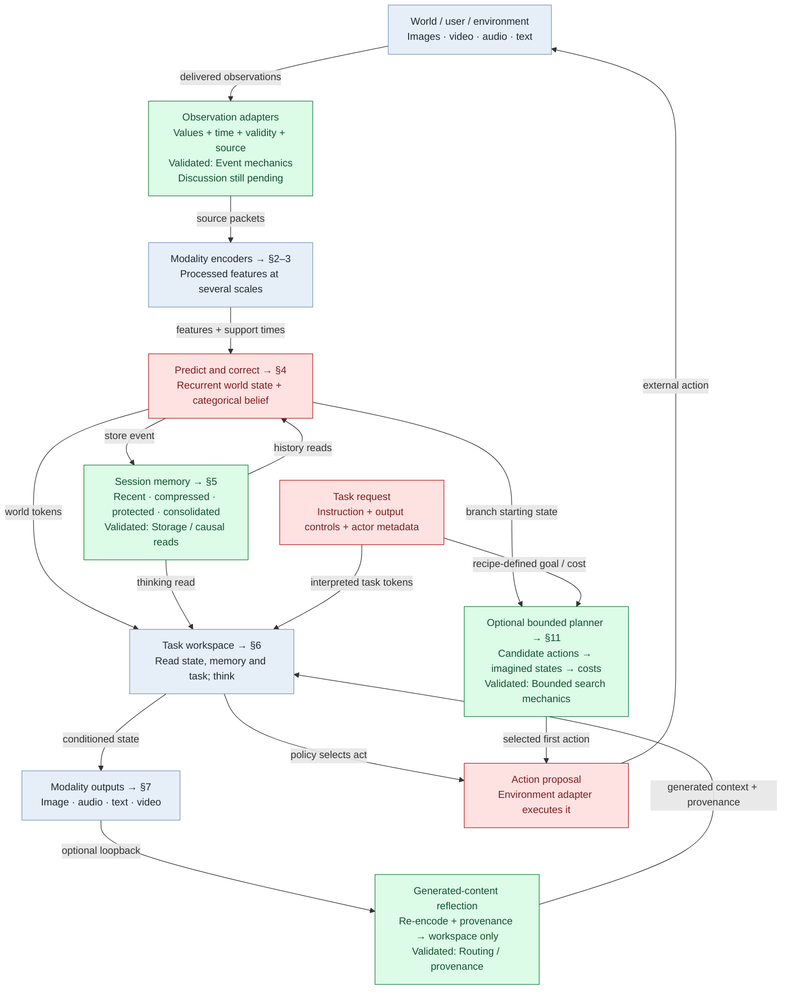

[Full-size SVG](diagrams/atlas/01-overview.svg)

The caller owns state, event transactions, action execution and task lifetime. The model returns proposals and tensors; it does not execute arbitrary software tools itself.

Imagination uses the dynamics without future observations. Reflection and thinking leave the live world clock unchanged. Generated content is kept out of source-evidence writes.

The categorical recipe is the CLI default. The recent photo model uses the separate Gaussian configuration in §8. Entity storage and the key-box connection in §10–11 are optional experiments, not an invisible extra store in every agent.

Source: [experiments/multimodal.py · build_model:103](../experiments/multimodal.py), [pathwm/models/belief.py · BeliefAgent:102](../pathwm/models/belief.py), [pathwm/models/agent.py · step_task:637](../pathwm/models/agent.py).

## 2 · Modality encoders and feature hierarchy

Same hierarchy pattern, separately instantiated parameters per modality

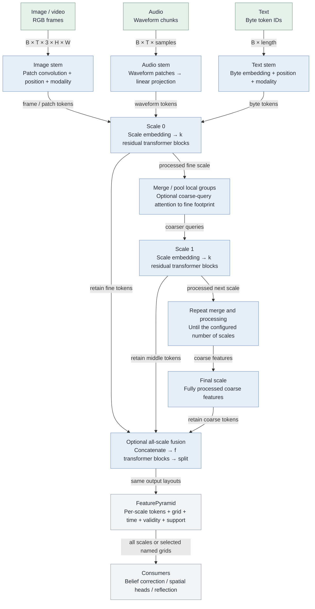

[Full-size SVG](diagrams/atlas/02-encoders.svg)

Each later scale consumes the fully processed previous scale. The final fusion is optional: f=0 in the general defaults, f=2 in the current photo checkpoint. k and scale count are recipe choices.

Image merging pools 2×2 spatial patches. Video also pools adjacent frames; audio and text pool adjacent sequence positions. Video has causal temporal attention and pooling within the supplied window, not a separate persistent recurrent video cell.

Masks prevent reading later support. The categorical source-evidence path uses no task, belief or feature-controller conditioning. Optional controls apply on permitted task/reflection paths.

Example for the photo configuration: RGB64 → 16×16 → 8×8 → 4×4, all width32; k=2 and f=2. The hierarchy emits 336 tokens.

Source: [pathwm/models/multiscale.py · FeatureHierarchy:207](../pathwm/models/multiscale.py), [pathwm/models/multiscale.py · MultiScaleImageEncoder:330](../pathwm/models/multiscale.py), [pathwm/models/multiscale.py · MultiScaleAudioEncoder:375](../pathwm/models/multiscale.py), [pathwm/models/multiscale.py · MultiScaleTextEncoder:436](../pathwm/models/multiscale.py), [pathwm/models/belief.py · _features:253](../pathwm/models/belief.py).

## 3 · Inside a residual attention block

Attention reads representations; a query head is not a persistent memory slot

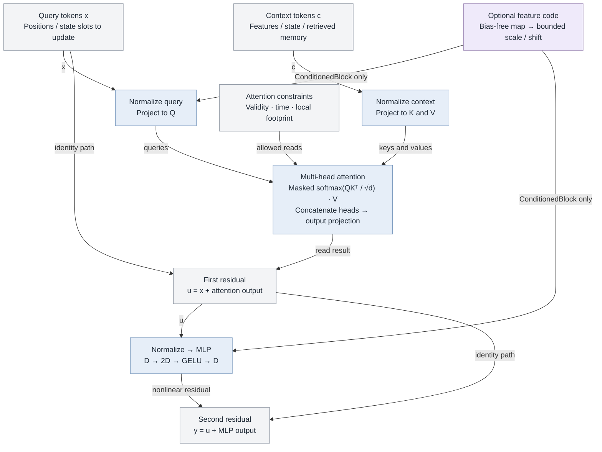

[Full-size SVG](diagrams/atlas/03-attention.svg)

Self-attention uses the same token set as query and context; cross-attention uses distinct sets. Attend uses four heads by default. Learned query tokens acquire roles through their consumer and training targets.

Q/K/V projection weights are learned parameters. Their per-input activations perform a read; memory records are stored separately. Neither attention weights nor readable slot names guarantee a semantic interpretation.

ConditionedBlock adds bounded scale/shift on query and MLP normalization; code zero is neutral. Its time/support masks are richer than the simpler Attend block. OutputBlock (§9) adds separate self-attention and context-attention residuals.

Source: [pathwm/models/modalities.py · Attend:75](../pathwm/models/modalities.py), [pathwm/models/multiscale.py · ConditionedBlock:88](../pathwm/models/multiscale.py), [pathwm/models/conditional_image.py · OutputBlock:47](../pathwm/models/conditional_image.py).

## 4 · Predict, correct and expose world state

Categorical BeliefAgent · nominal width32 configuration

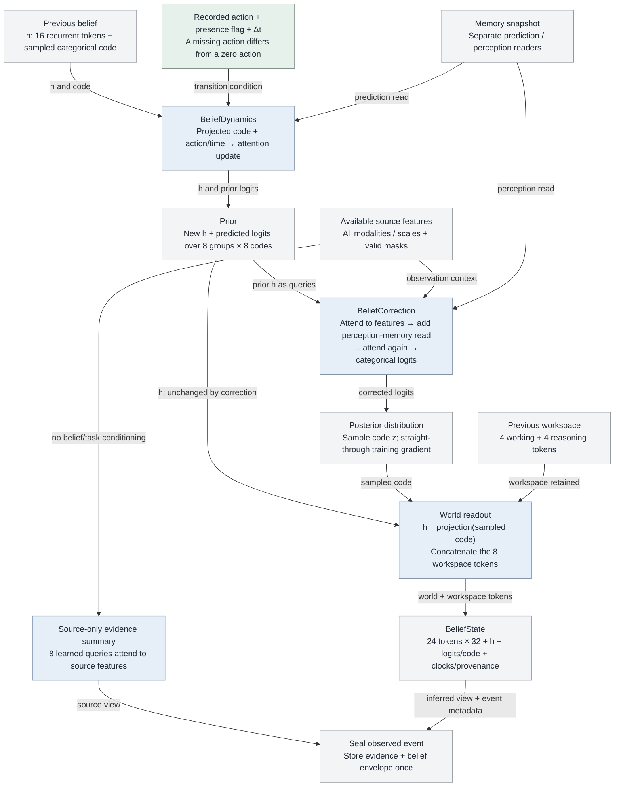

[Full-size SVG](diagrams/atlas/04-belief.svg)

The observation correction changes the categorical distribution, not the recurrent h directly. Its sampled code changes world readout immediately and influences h on the next transition.

With no usable observation, the prior is retained and no source-memory record is written. Imagination runs the prior transition without correction, marks the result hypothetical and shares live memory read-only.

Events are caller-owned transactions with ordered IDs. Partial packet arrivals are corrected against one prior and one memory snapshot. Source times and state time remain distinct.

Categorical entropy is a diagnostic; it is not established calibrated confidence or model-parameter uncertainty. The Gaussian log_scale inherited for compatibility is zero here, not the belief uncertainty.

Source: [pathwm/models/belief.py · BeliefDynamics:33](../pathwm/models/belief.py), [pathwm/models/belief.py · BeliefCorrection:74](../pathwm/models/belief.py), [pathwm/models/belief.py · correct_packets:352](../pathwm/models/belief.py), [pathwm/models/belief.py · _readout:190](../pathwm/models/belief.py), [pathwm/models/belief_state.py · BeliefState:91](../pathwm/models/belief_state.py).

## 5 · Short and long session memory

HybridMemory · bounded storage mechanics plus learned compression and reading

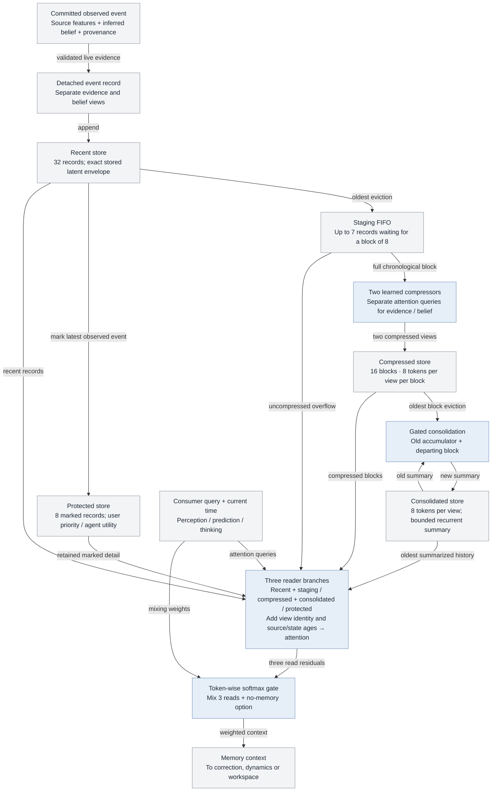

[Full-size SVG](diagrams/atlas/05-memory.svg)

These capacities are general defaults, not universal constants. Source and inferred views stay separate through compression; categorical probabilities, not only sampled codes, reach belief readers.

Storage is caller-owned bounded tensors and records. Reading attends over the stores directly; this is not yet a scalable indexed external database or an unbounded raw-media archive.

Exact recent storage means exact latent copies, not exact raw pixels. Compression loses detailed source alignment; support intervals and bounded source labels are retained. Learned read/compression quality needs its own evaluation.

The photo experiment uses simpler episodic top-k snapshots instead (§8). The explicit entity store (§10) is another separate mechanism.

Source: [pathwm/models/hybrid_memory.py · HybridMemory:98](../pathwm/models/hybrid_memory.py), [pathwm/models/hybrid_memory.py · MemoryRead:28](../pathwm/models/hybrid_memory.py), [pathwm/models/belief_state.py · MemoryRecord:26](../pathwm/models/belief_state.py), [docs/belief-model.md](../docs/belief-model.md).

## 6 · Tasks, focus, thinking and output control

Workspace updates are internal computation; external actions return to the caller

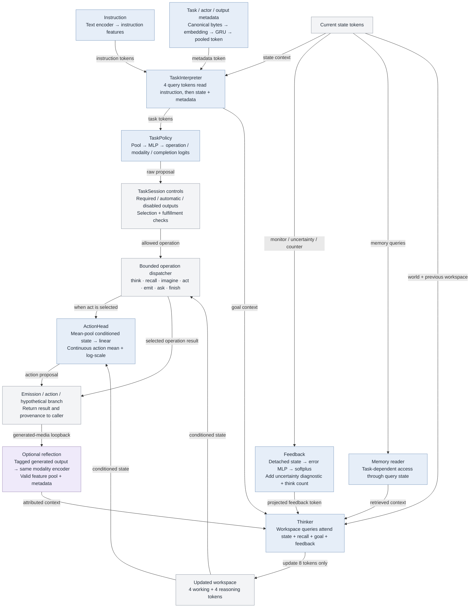

[Full-size SVG](diagrams/atlas/06-workspace.svg)

Thinker uses the same residual attention primitive as §3. More thinking repeats this read/update loop; it does not advance the live world clock or by itself acquire evidence.

In emit, task tokens first condition a thinking step, then modality decoders consume the conditioned state. General decoders see all state tokens; the photo wrapper intentionally exposes only its working/reasoning tokens.

The feature controller can propose a bounded feature code for supported reads. It is excluded from categorical source encoding. Reflection uses shared encoder weights but preserves generated ancestry; it is not a new camera event.

finish is a policy/session operation, not independent proof of task success. The historical-recall experiment has an external verifier based on the delivered event log. General tool execution, open-ended decomposition and calibrated stopping remain incomplete.

Source: [pathwm/models/tasks.py · TaskInterpreter:419](../pathwm/models/tasks.py), [pathwm/models/tasks.py · TaskPolicy:442](../pathwm/models/tasks.py), [pathwm/models/tasks.py · MetadataEncoder:397](../pathwm/models/tasks.py), [pathwm/models/agent.py · think:709](../pathwm/models/agent.py), [pathwm/models/agent.py · emit:508](../pathwm/models/agent.py), [pathwm/models/agent.py · reflect:404](../pathwm/models/agent.py), [pathwm/models/recall.py · verify_recall:144](../pathwm/models/recall.py).

## 7 · How state reaches each output modality

General multimodal recipe · reference decoders are small learned readouts

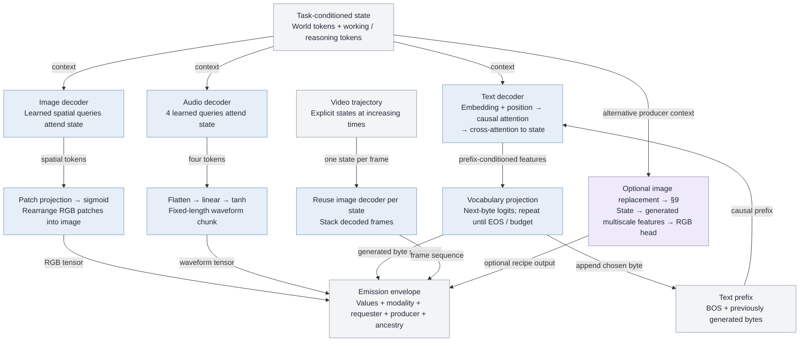

[Full-size SVG](diagrams/atlas/07-decoders.svg)

An output does not require an input of the same modality: decoder inputs are internal state. Whether useful content is present depends on learned representations, memory, objectives and training data.

The text path is a byte autoregressor, not a pretrained language model. The waveform path is not established general speech synthesis. Video currently decodes a supplied state trajectory; there is no general video diffusion generator in this recipe.

Image resolution and audio length are constructor settings. Output size alone does not establish reconstructed detail. The stronger conditional image producer is an optional controlled experiment, not a common generator already implemented for every modality.

Source: [pathwm/models/modalities.py · ImageDecoder:224](../pathwm/models/modalities.py), [pathwm/models/modalities.py · AudioDecoder:249](../pathwm/models/modalities.py), [pathwm/models/modalities.py · TextDecoder:267](../pathwm/models/modalities.py), [pathwm/models/agent.py · decode_video:795](../pathwm/models/agent.py), [pathwm/models/tasks.py · GeneratedOutput:155](../pathwm/models/tasks.py).

## 8 · The current real-photo experiment

MemoryOutput · Gaussian reference configuration, not BeliefAgent

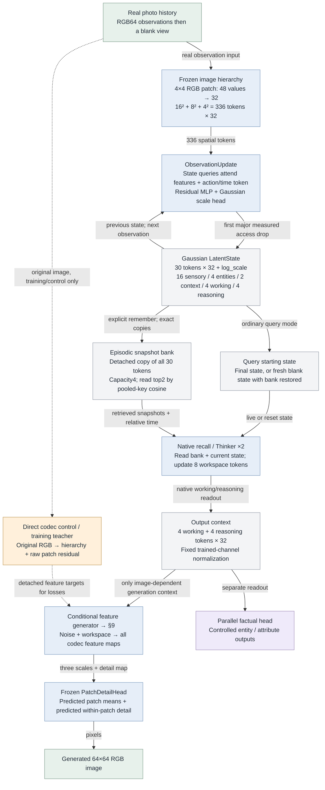

[Full-size SVG](diagrams/atlas/08-photo-path.svg)

Checkpoint: runs/real_photo_v1/training/weights.pt. This model has image input/output only. A new session starts from learned initial tokens; each observation updates the preceding state. Group names such as entities are token-slice labels, not an explicit knowledge graph or verified object slots.

The latest continuation trained only the 314,576-parameter generator. Encoder, state updates, recall and codec stayed frozen. The photo route bypasses the teacher's raw-detail branch; no source pixels are silently fed to the generator during recall.

The frozen diagnostic found the largest spatial-accessibility drop at encoder → first state, with another drop on recall. Memory writes themselves are exact. A failed readout does not prove all information is absent.

The direct codec sees extra within-patch residual detail. Its good reconstruction is not evidence that this smaller state/memory path retains those pixels. General photographic generation remains open.

Source: [pathwm/models/memory_output.py · build_model:496](../pathwm/models/memory_output.py), [pathwm/models/memory_output.py · MemoryOutput:340](../pathwm/models/memory_output.py), [pathwm/models/agent.py · ObservationUpdate:33](../pathwm/models/agent.py), [pathwm/models/agent_state.py · EpisodicMemory:88](../pathwm/models/agent_state.py), [docs/real-photo-plan.md](../docs/real-photo-plan.md), [docs/photo-detail-plan.md](../docs/photo-detail-plan.md).

## 9 · Latent-guided image production

ConditionalFeatureGenerator · current flow configuration uses 8 Euler steps

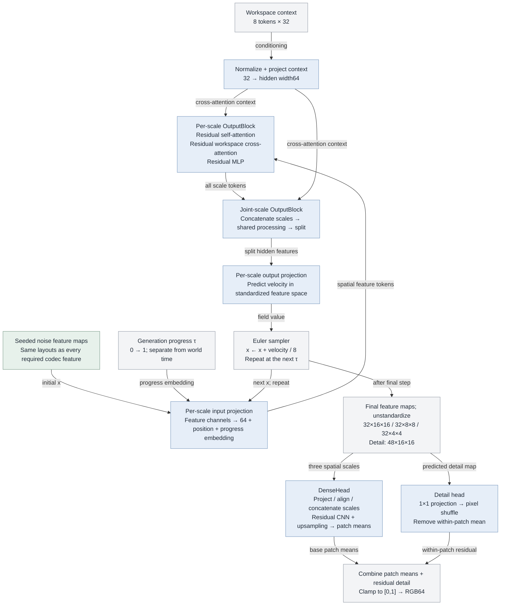

[Full-size SVG](diagrams/atlas/09-image-generator.svg)

Every decoder feature, including fine detail, is produced from workspace and noise at inference. Noise allows sampling; it does not supply missing facts about a particular remembered image.

The head owns no encoder or raw-image input. A direct regression variant also exists; older exports instead use StateFeatureDecoder: spatial queries attend state → project each scale → the same head.

The current image experiment uses a fixed selected-object/recall request. The architecture is conditional, but arbitrary language-to-image control has not been established. Replacing a producer later is possible if the feature interface and conditioning contract are kept compatible.

Source: [pathwm/models/conditional_image.py · ConditionalFeatureGenerator:73](../pathwm/models/conditional_image.py), [pathwm/models/conditional_image.py · OutputBlock:47](../pathwm/models/conditional_image.py), [pathwm/models/conditional_image.py · integrate:30](../pathwm/models/conditional_image.py), [pathwm/models/decoders.py · PatchDetailHead:11](../pathwm/models/decoders.py), [pathwm/models/decoders.py · DenseHead:217](../pathwm/models/decoders.py), [pathwm/models/decoders.py · StateFeatureDecoder:49](../pathwm/models/decoders.py).

## 10 · Entity identity, state and relations

Implemented controlled experiments · supplied descriptors and relation semantics

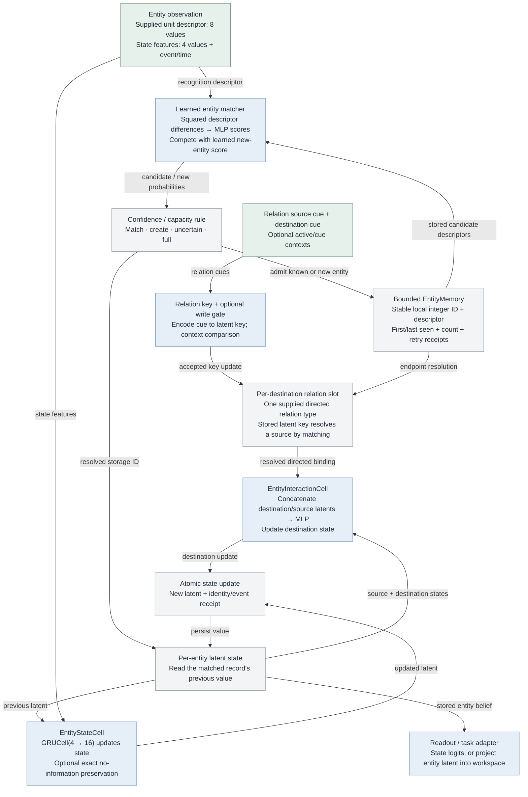

[Full-size SVG](diagrams/atlas/10-entities.svg)

The model does not predict an arbitrary universal integer. Learned matching selects a record; the integer is the store's address. Uncertain matches can remain unresolved. Unique record IDs do not prevent mistaken identity merges.

These experiments start with supplied descriptors and state cues. They do not yet implement discovery of arbitrary people/objects from webcam pixels. Matching, state updating and relation keys are learned; storage bookkeeping is explicit.

EntityRelationMemory has one supplied relation type and one slot per destination. This is not yet learned open-ended graph structure or a general concept/instance taxonomy. The broader proposed graph appears in §13.

The key-box experiment actually connects an entity latent through projection and two Thinker steps to the general belief workspace, then a readout feeds a supplied planner. This remains a distinct experimental configuration.

Source: [pathwm/models/entities.py · EntityMatchReader:147](../pathwm/models/entities.py), [pathwm/models/entity_memory.py · EntityMemory:12](../pathwm/models/entity_memory.py), [pathwm/models/entity_state.py · EntityStateCell:10](../pathwm/models/entity_state.py), [pathwm/models/entity_state.py · EntityInteractionCell:48](../pathwm/models/entity_state.py), [pathwm/models/entity_relations.py · EntityRelationMemory:38](../pathwm/models/entity_relations.py), [pathwm/models/key_box.py · KeyBoxReader:27](../pathwm/models/key_box.py).

## 11 · Planning and the proposed action DAG

Existing finite candidate rollouts; broader DAG search remains a target

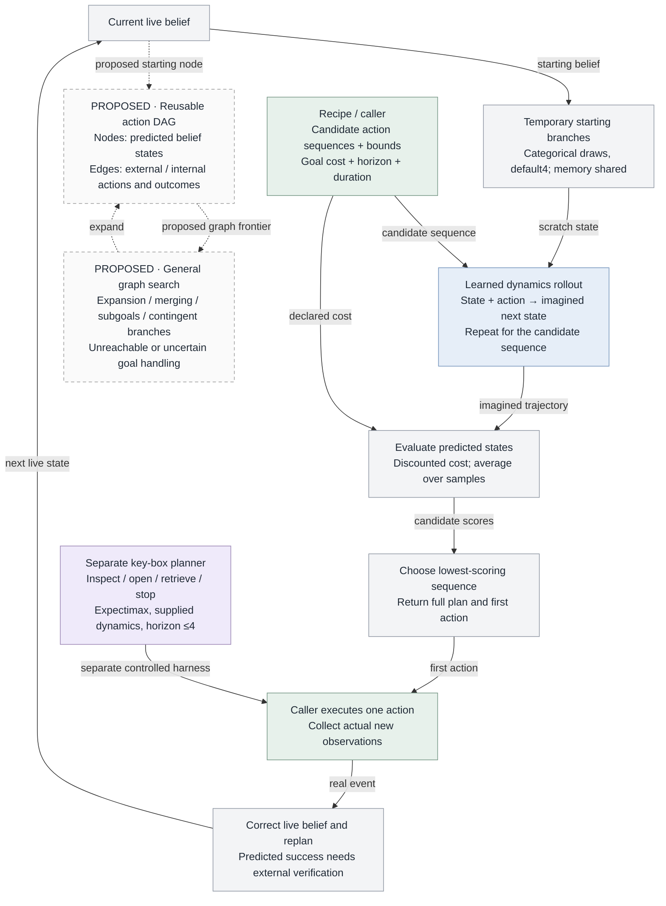

[Full-size SVG](diagrams/atlas/11-planning.svg)

The general planner scores caller-provided sequences; it does not currently construct a persistent, general action DAG. Candidate generation, action units and goal cost are recipe-owned. There is no guarantee that the supplied candidates can reach a goal.

Hypothetical branches do not consume real event ordinals or write live evidence. General prior rollouts do not yet support observation-conditioned sensing branches; key-box expectimax handles sensing in a separate finite supplied model.

The task dispatcher already distinguishes internal think/recall/imagine from external act/ask/emit. General learned task decomposition, automatic state equivalence/graph merging, a universal success verifier and broad software-tool skills remain open.

Prediction quality, goal readout quality and search coverage all constrain planning. A low imagined cost is not proof of realized success.

Source: [pathwm/evaluation/agent.py · plan:23](../pathwm/evaluation/agent.py), [pathwm/models/belief.py · imagine:495](../pathwm/models/belief.py), [pathwm/models/agent.py · step_task:637](../pathwm/models/agent.py), [pathwm/models/key_box.py · plan_key:59](../pathwm/models/key_box.py), [docs/decision-design.md](../docs/decision-design.md).

## 12 · Training signals and gradient routes

Recipe-selected objectives; no single checkpoint currently proves all capabilities

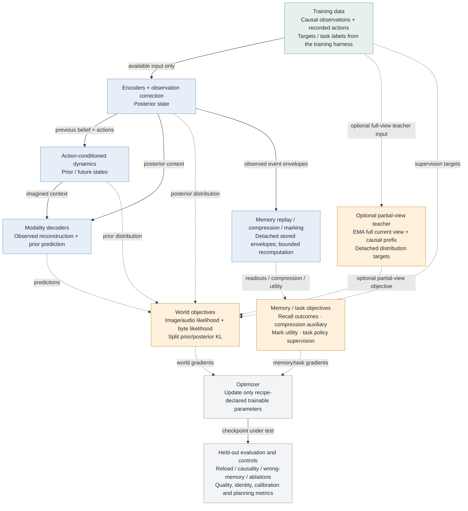

[Full-size SVG](diagrams/atlas/12-learning.svg)

This is a map of available learning paths, not a claim that every loss runs in every recipe. Runtime memory writes detach; training deliberately recomputes bounded windows where needed.

The separate photo training path (§8–9) uses detached codec features and real pixels as feature/flow/decoded-image targets. Only the generator learned in the latest run. Frozen encoder/state/memory parameters blocked upstream repairs; the frozen RGB head still transmitted gradients to generator inputs.

Offline probes measure what a different reader can recover at each stage. They do not become inference shortcuts. Longer training, larger width, data coverage and architecture changes need separate controlled comparisons.

The next proposed photo repair is intermediate spatial supervision of observation/state updates and recall. It is not implemented by this diagram work.

Source: [pathwm/training/belief.py](../pathwm/training/belief.py), [experiments/multimodal.py](../experiments/multimodal.py), [experiments/real_photo.py](../experiments/real_photo.py), [pathwm/models/conditional_image.py](../pathwm/models/conditional_image.py), [pathwm/evaluation/photo_detail.py](../pathwm/evaluation/photo_detail.py), [docs/photo-detail-plan.md](../docs/photo-detail-plan.md).

## 13 · The broader entity graph we discussed

Proposed organization · beyond the implemented controlled entity store

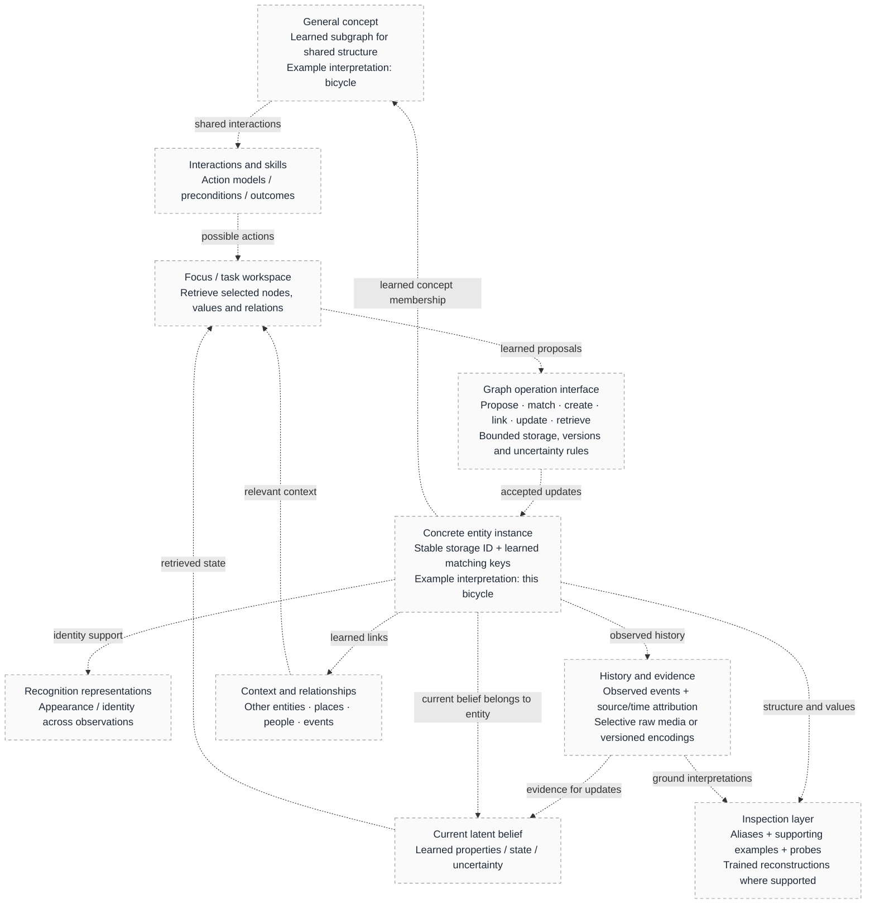

[Full-size SVG](diagrams/atlas/13-target-graph.svg)

The intended agent learns representations and which connections are useful. Stable IDs are bookkeeping; readable labels are revisable interpretations. These boxes are conceptual distinctions, not mandatory database fields or one vector each.

Only bounded matching, per-entity state, a supplied relation slot and a controlled workspace connection exist today (§10). Open-ended concept discovery, learned graph topology, scalable indexing and general skill links remain to be specified and trained.

A recognition latent cannot automatically be decoded into a faithful face or image. That requires a compatible trained decoder and retained information; a reconstruction is evidence about a readout, not a literal picture of all the agent's beliefs.

Source: [docs/entity-memory-design.md](../docs/entity-memory-design.md), [docs/entity-learning-task.md](../docs/entity-learning-task.md), [pathwm/models/entity_relations.py · EntityRelationMemory:38](../pathwm/models/entity_relations.py).
