# PATH-WM · Architecture atlas

A map of the implemented components and their interfaces, from the agent loop to attention blocks. The general categorical agent, the Gaussian photo experiment, and the entity experiments are distinct configurations. A drawn module indicates implementation, not proven general capability.

Source review: 2026-09-16, repository snapshot `5fe9c75`. [Open the rendered atlas](architecture-atlas.html).

Overview (1): Red: to discuss. Blue: discussed. Green: validated within the labelled scope. [Discussion and validation checklist](architecture-discussion.md).

Detail diagrams (2–13): blue = learned modules; gray = state/mechanics; green = external I/O; purple = optional; amber = training/control; dashed = proposed or labelled training-only connections.

- [1 · The agent loop](#01-overview)
- [2 · Modality encoders and feature hierarchy](#02-encoders)
- [3 · Inside a residual attention block](#03-attention)
- [4 · Predict, correct and expose world state](#04-belief)
- [5 · Short and long session memory](#05-memory)
- [6 · Tasks, focus, thinking and output control](#06-workspace)
- [7 · How state reaches each output modality](#07-decoders)
- [8 · The current real-photo experiment](#08-photo-path)
- [9 · Latent-guided image production](#09-image-generator)
- [10 · Entity identity, state and relations](#10-entities)
- [11 · Planning and the proposed action DAG](#11-planning)
- [12 · Training signals and gradient routes](#12-learning)
- [13 · Persistent World State foundation](#13-target-graph)
- [14 · Inside the latent core](#14-latent-core)
- [15 · Shared latent thought, modality-specific readout](#15-output-plan)
- [16 · Shared image codec and causal video extension](#16-shared-video-codec)

<a id="01-overview"></a>

## 1 · The agent loop

General categorical agent · runtime data and control flow

Red = a dedicated discussion remains. Blue = discussed, with validation still incomplete. Green = validated within the explicitly labelled test scope, not general capability. Discussion coverage is retained separately, including for green parts that still need a walkthrough. Evidence refers to the recorded configurations and must be revisited after relevant changes.

Red: to discuss. Blue: discussed. Green: validated within the labelled scope. [Coverage, validation evidence and remaining questions](architecture-discussion.md).

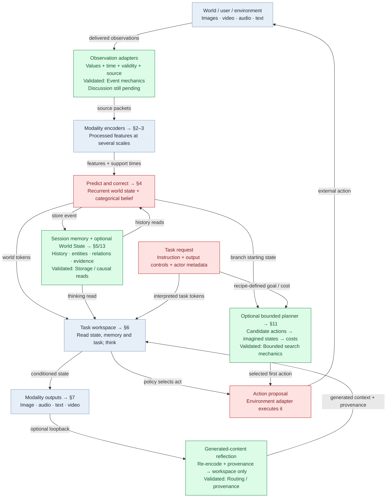

[Full-size SVG](diagrams/atlas/01-overview.svg)

The caller owns state, event transactions, action execution and task lifetime. The model returns proposals and tensors; it does not execute arbitrary software tools itself.

Imagination uses the dynamics without future observations. Reflection and thinking leave the live world clock unchanged. Generated content is kept out of source-evidence writes.

The categorical recipe is the CLI default. The recent photo model uses the separate Gaussian configuration in §8. Entity experiments in §10–11 and the modular persistent World State in §13 are opt-in paths. WorldSession connects the latter to the actual BeliefAgent; it is not an invisible extra store in every agent.

Source: [experiments/multimodal.py · build_model:103](../experiments/multimodal.py), [pathwm/models/belief.py · BeliefAgent:102](../pathwm/models/belief.py), [pathwm/models/agent.py · step_task:637](../pathwm/models/agent.py).

<a id="02-encoders"></a>

## 2 · Modality encoders and feature hierarchy

Same hierarchy pattern, separately instantiated parameters per modality

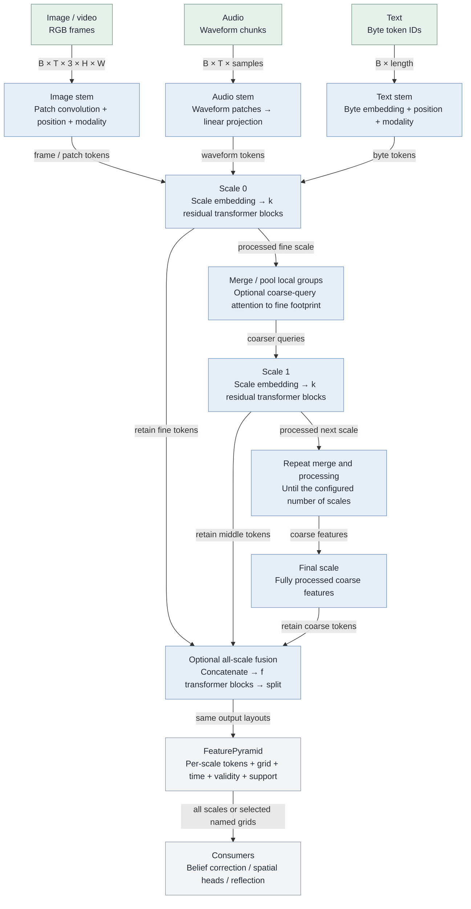

[Full-size SVG](diagrams/atlas/02-encoders.svg)

Each later scale consumes the fully processed previous scale. The final fusion is optional: f=0 in the general defaults, f=2 in the current photo checkpoint. k and scale count are recipe choices.

Image merging pools 2×2 spatial patches. Video also pools adjacent frames; audio and text pool adjacent sequence positions. Video has causal temporal attention and pooling within the supplied window, not a separate persistent recurrent video cell.

Masks prevent reading later support. The categorical source-evidence path uses no task, belief or feature-controller conditioning. Optional controls apply on permitted task/reflection paths.

Example for the photo configuration: RGB64 → 16×16 → 8×8 → 4×4, all width32; k=2 and f=2. The hierarchy emits 336 tokens.

Image/video/audio/text encoders now share output-neutral attention diagnostics: traced and ordinary outputs, gradients and RNG agree exactly in train/eval checks. Masks exclude invalid values before learned operations. The isolated modality audit fits tiny examples; real AV/text is a resampled transport check, not learned understanding.

16 September video follow-up:12 controlled fits compare requested time in source/query and an optional learned palette. Paired video-quality benefit fails; palette mixture fields become nearly constant. Defaults unchanged. Oracle motion works better than actual video-state output; symmetric reverse-pair probes give69-78% direction at encoder and28-39% at final state on new positions, not a unique loss proof. See docs/video-readout-plan.md and runs/video_readout_v1/report.html. The video branch uses its own framewise image patch weights, time features, causal attention and adjacent-frame pooling; no weight sharing with image input and no automatic spatial-VAE integration. No natural-video or forecast validation.

16 September: user requests actual trained image-encoder reuse for video and frame reconstruction training. The new optional VideoVAE owns one existing spatial image VAE, shared encoder AND decoder, plus causal posterior-mean refinement. This is a separate measured codec path, not an implicit replacement of the categorical agent patch encoder. See diagram16 and docs/shared-video-vae-plan.md. General video capability remains open.

Source: [pathwm/models/multiscale.py · FeatureHierarchy:209](../pathwm/models/multiscale.py), [pathwm/models/multiscale.py · MultiScaleImageEncoder:332](../pathwm/models/multiscale.py), [pathwm/models/multiscale.py · MultiScaleAudioEncoder:377](../pathwm/models/multiscale.py), [pathwm/models/multiscale.py · MultiScaleTextEncoder:438](../pathwm/models/multiscale.py), [pathwm/models/belief.py · _features:259](../pathwm/models/belief.py), [docs/modality-foundation-plan.md](../docs/modality-foundation-plan.md).

<a id="03-attention"></a>

## 3 · Inside a residual attention block

Attention reads representations; a query head is not a persistent memory slot

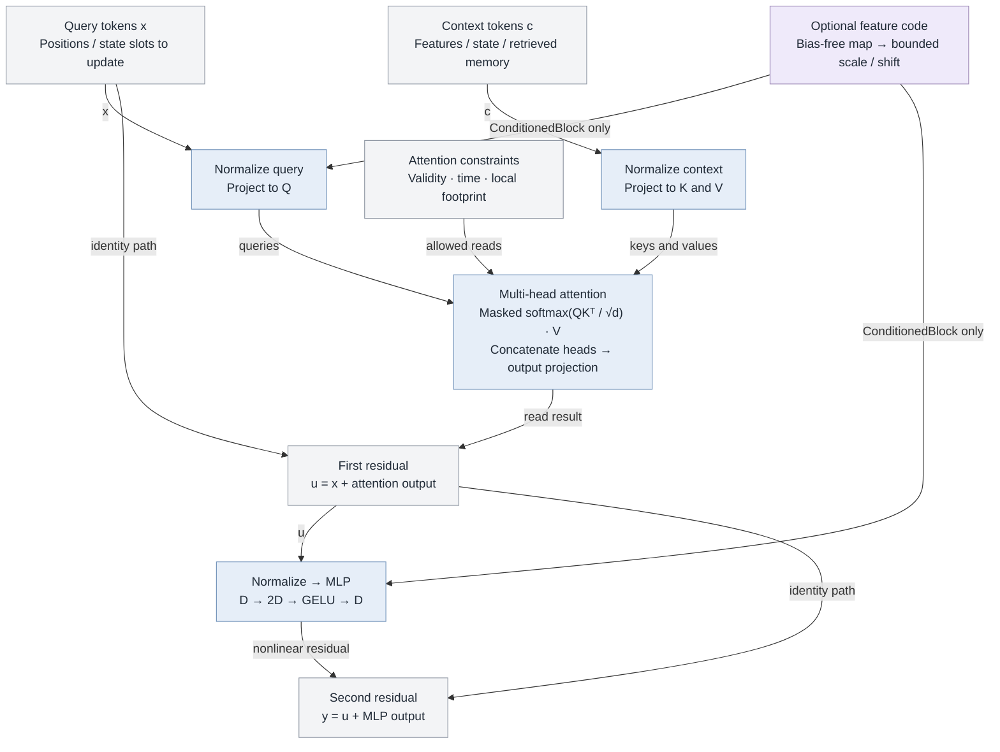

[Full-size SVG](diagrams/atlas/03-attention.svg)

Self-attention uses the same token set as query and context; cross-attention uses distinct sets. Attend uses four heads by default. Learned query tokens acquire roles through their consumer and training targets.

Q/K/V projection weights are learned parameters. Their per-input activations perform a read; memory records are stored separately. Neither attention weights nor readable slot names guarantee a semantic interpretation.

ConditionedBlock adds bounded scale/shift on query and MLP normalization; code zero is neutral. Its time/support masks are richer than the simpler Attend block. OutputBlock (§9) adds separate self-attention and context-attention residuals.

Attend and ConditionedBlock use one detached attention_probabilities helper for pre-dropout inspection. Native attention keeps need_weights=False even when recording; diagnostic weights do not switch the output kernel. Invalid decoder context is zeroed before normalization/projection. Tests cover exact output, gradient and RNG neutrality for all four multiscale encoders.

Source: [pathwm/models/modalities.py · Attend:111](../pathwm/models/modalities.py), [pathwm/models/multiscale.py · ConditionedBlock:89](../pathwm/models/multiscale.py), [pathwm/models/conditional_image.py · OutputBlock:47](../pathwm/models/conditional_image.py), [pathwm/models/modalities.py · attention_probabilities:77](../pathwm/models/modalities.py).

<a id="04-belief"></a>

## 4 · Predict, correct and expose world state

Categorical BeliefAgent · nominal width32 configuration

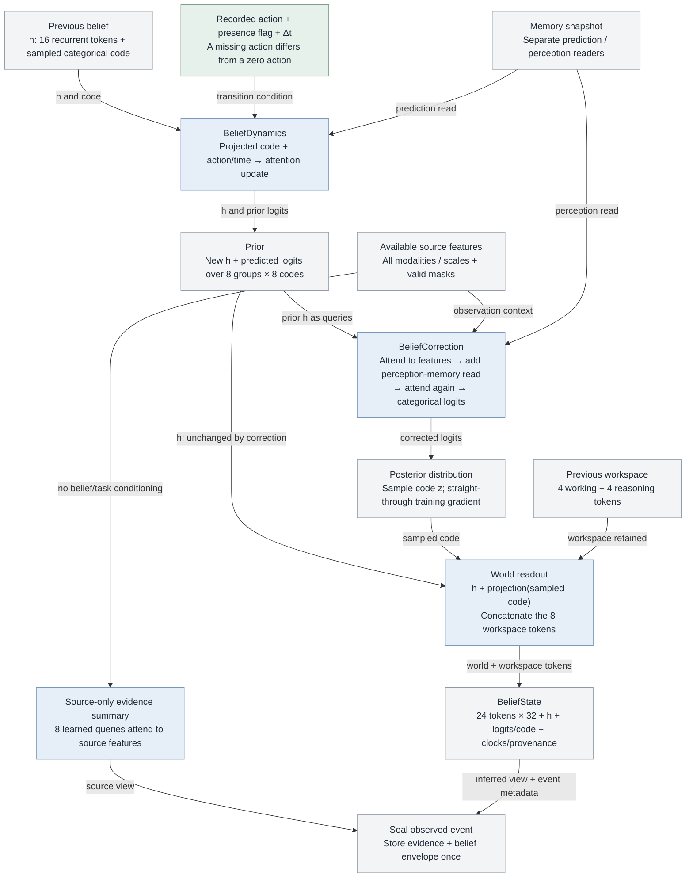

[Full-size SVG](diagrams/atlas/04-belief.svg)

The observation correction changes the categorical distribution, not the recurrent h directly. Its sampled code changes world readout immediately and influences h on the next transition.

With no usable observation, the prior is retained and no source-memory record is written. Imagination runs the prior transition without correction, marks the result hypothetical and shares live memory read-only.

Events are caller-owned transactions with ordered IDs. Partial packet arrivals are corrected against one prior and one memory snapshot. Source times and state time remain distinct.

Categorical entropy is a diagnostic; it is not established calibrated confidence or model-parameter uncertainty. The Gaussian log_scale inherited for compatibility is zero here, not the belief uncertainty.

Source: [pathwm/models/belief.py · BeliefDynamics:33](../pathwm/models/belief.py), [pathwm/models/belief.py · BeliefCorrection:74](../pathwm/models/belief.py), [pathwm/models/belief.py · correct_packets:358](../pathwm/models/belief.py), [pathwm/models/belief.py · _readout:196](../pathwm/models/belief.py), [pathwm/models/belief_state.py · BeliefState:91](../pathwm/models/belief_state.py).

<a id="05-memory"></a>

## 5 · Short and long session memory

HybridMemory · bounded storage mechanics plus learned compression and reading

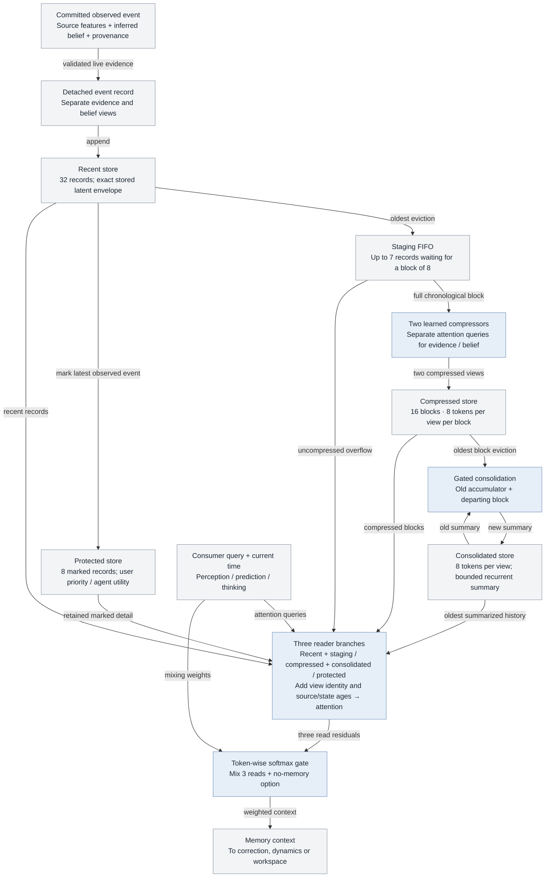

[Full-size SVG](diagrams/atlas/05-memory.svg)

These capacities are general defaults, not universal constants. Source and inferred views stay separate through compression; categorical probabilities, not only sampled codes, reach belief readers.

Storage is caller-owned bounded tensors and records. Reading attends over the stores directly; this is not yet a scalable indexed external database or an unbounded raw-media archive.

Exact recent storage means exact latent copies, not exact raw pixels. Compression loses detailed source alignment; support intervals and bounded source labels are retained. Learned read/compression quality needs its own evaluation.

The photo experiment uses simpler episodic top-k snapshots instead (§8). The explicit entity store (§10) is another separate mechanism.

Source: [pathwm/models/hybrid_memory.py · HybridMemory:98](../pathwm/models/hybrid_memory.py), [pathwm/models/hybrid_memory.py · MemoryRead:28](../pathwm/models/hybrid_memory.py), [pathwm/models/belief_state.py · MemoryRecord:26](../pathwm/models/belief_state.py), [docs/belief-model.md](../docs/belief-model.md).

<a id="06-workspace"></a>

## 6 · Tasks, focus, thinking and output control

Workspace updates are internal computation; external actions return to the caller

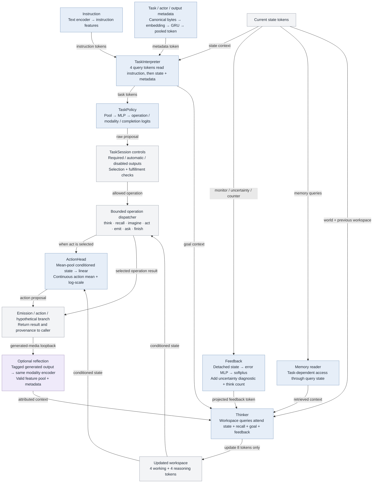

[Full-size SVG](diagrams/atlas/06-workspace.svg)

Thinker uses the same residual attention primitive as §3. More thinking repeats this read/update loop; it does not advance the live world clock or by itself acquire evidence.

In emit, task tokens first condition a thinking step, then modality decoders consume the conditioned state. General decoders see all state tokens; the photo wrapper intentionally exposes only its working/reasoning tokens.

The feature controller can propose a bounded feature code for supported reads. It is excluded from categorical source encoding. Reflection uses shared encoder weights but preserves generated ancestry; it is not a new camera event.

finish is a policy/session operation, not independent proof of task success. The historical-recall experiment has an external verifier based on the delivered event log. General tool execution, open-ended decomposition and calibrated stopping remain incomplete.

The current Thinker already repeats the same Attend parameters; only working/reasoning tokens change. General answer planning is not established by these named token slices. Atlas14-15 and docs/latent-core.md separate this shared multimodal mechanism from optional modality-specific readout adapters.

Source: [pathwm/models/tasks.py · TaskInterpreter:419](../pathwm/models/tasks.py), [pathwm/models/tasks.py · TaskPolicy:442](../pathwm/models/tasks.py), [pathwm/models/tasks.py · MetadataEncoder:397](../pathwm/models/tasks.py), [pathwm/models/agent.py · think:709](../pathwm/models/agent.py), [pathwm/models/agent.py · emit:508](../pathwm/models/agent.py), [pathwm/models/agent.py · reflect:404](../pathwm/models/agent.py), [pathwm/models/recall.py · verify_recall:144](../pathwm/models/recall.py).

<a id="07-decoders"></a>

## 7 · How state reaches each output modality

General multimodal recipe · reference decoders are small learned readouts

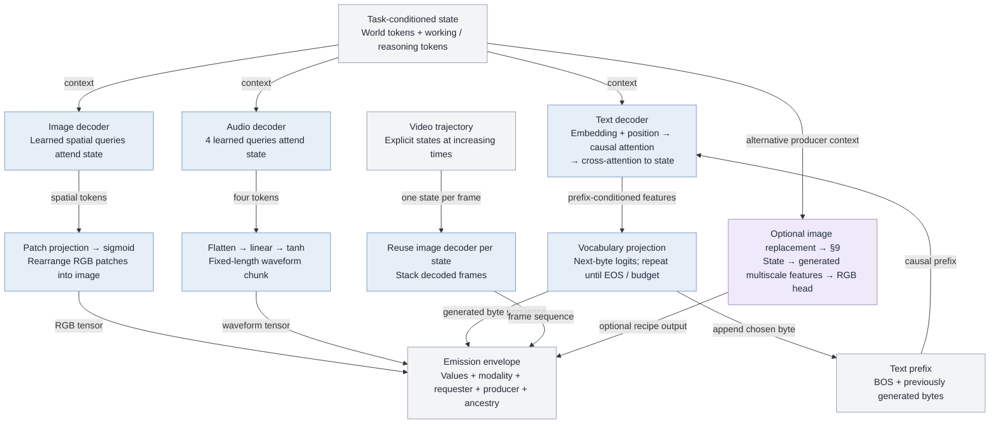

[Full-size SVG](diagrams/atlas/07-decoders.svg)

An output does not require an input of the same modality: decoder inputs are internal state. Whether useful content is present depends on learned representations, memory, objectives and training data.

The text path is a byte autoregressor, not a pretrained language model. The waveform path is not established general speech synthesis. Video currently decodes a supplied state trajectory; there is no general video diffusion generator in this recipe.

Image resolution and audio length are constructor settings. Output size alone does not establish reconstructed detail. The stronger conditional image producer is an optional controlled experiment, not a common generator already implemented for every modality.

Native image/audio/text decoders accept context validity; text keeps a separate causal prefix mask. Video validates every state, including singleton trajectories. The independent codec audit learns four words and four tones; weighted video reconstruction improves object/motion but degrades total RGB. Its state-to-output path is untrained and measured only on the first example; no bottleneck-location or general generation claim.

Native text decoding reads the entire state through prefix-conditioned cross-attention; image/audio use learned queries. Alex wants the core to remain multimodal. Extend each output readout only as needed, preserving the current path as the reference. A common text plan is not required; no decoder-size minimum or capacity-saving result follows yet.

16 September video follow-up:12 controlled fits compare requested time in source/query and an optional learned palette. Paired video-quality benefit fails; palette mixture fields become nearly constant. Defaults unchanged. Oracle motion works better than actual video-state output; symmetric reverse-pair probes give69-78% direction at encoder and28-39% at final state on new positions, not a unique loss proof. See docs/video-readout-plan.md and runs/video_readout_v1/report.html. The video branch uses its own framewise image patch weights, time features, causal attention and adjacent-frame pooling; no weight sharing with image input and no automatic spatial-VAE integration. No natural-video or forecast validation.

16 September: user requests actual trained image-encoder reuse for video and frame reconstruction training. The new optional VideoVAE owns one existing spatial image VAE, shared encoder AND decoder, plus causal posterior-mean refinement. This is a separate measured codec path, not an implicit replacement of the categorical agent patch encoder. See diagram16 and docs/shared-video-vae-plan.md. General video capability remains open.

Source: [pathwm/models/modalities.py · ImageDecoder:282](../pathwm/models/modalities.py), [pathwm/models/modalities.py · AudioDecoder:347](../pathwm/models/modalities.py), [pathwm/models/modalities.py · TextDecoder:366](../pathwm/models/modalities.py), [pathwm/models/agent.py · decode_video:795](../pathwm/models/agent.py), [pathwm/models/tasks.py · GeneratedOutput:155](../pathwm/models/tasks.py), [docs/modality-foundation-plan.md](../docs/modality-foundation-plan.md).

<a id="08-photo-path"></a>

## 8 · The current real-photo experiment

MemoryOutput · Gaussian reference configuration, not BeliefAgent

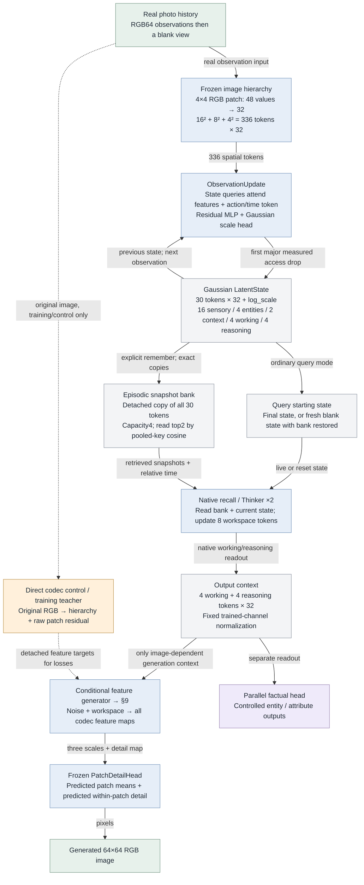

[Full-size SVG](diagrams/atlas/08-photo-path.svg)

Checkpoint: runs/real_photo_v1/training/weights.pt. This model has image input/output only. A new session starts from learned initial tokens; each observation updates the preceding state. Group names such as entities are token-slice labels, not an explicit knowledge graph or verified object slots.

The latest continuation trained only the 314,576-parameter generator. Encoder, state updates, recall and codec stayed frozen. The photo route bypasses the teacher's raw-detail branch; no source pixels are silently fed to the generator during recall.

The frozen diagnostic found the largest spatial-accessibility drop at encoder → first state, with another drop on recall. Memory writes themselves are exact. A failed readout does not prove all information is absent.

The direct codec sees extra within-patch residual detail. Its good reconstruction is not evidence that this smaller state/memory path retains those pixels. General photographic generation remains open.

Source: [pathwm/models/memory_output.py · build_model:496](../pathwm/models/memory_output.py), [pathwm/models/memory_output.py · MemoryOutput:340](../pathwm/models/memory_output.py), [pathwm/models/agent.py · ObservationUpdate:33](../pathwm/models/agent.py), [pathwm/models/agent_state.py · EpisodicMemory:88](../pathwm/models/agent_state.py), [docs/real-photo-plan.md](../docs/real-photo-plan.md), [docs/photo-detail-plan.md](../docs/photo-detail-plan.md).

<a id="09-image-generator"></a>

## 9 · Latent-guided image production

ConditionalFeatureGenerator · current flow configuration uses 8 Euler steps

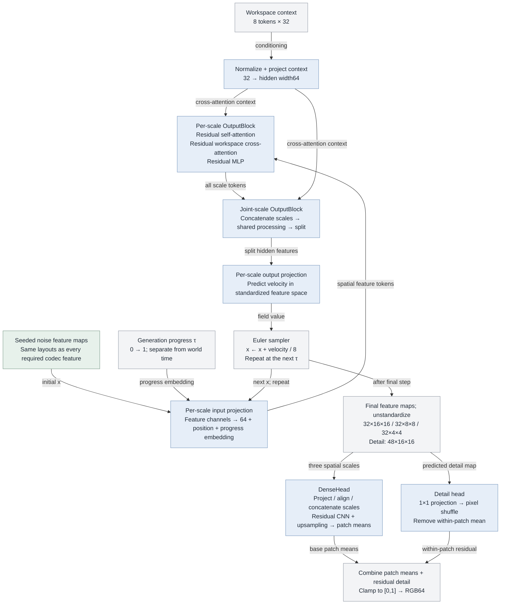

[Full-size SVG](diagrams/atlas/09-image-generator.svg)

Every decoder feature, including fine detail, is produced from workspace and noise at inference. Noise allows sampling; it does not supply missing facts about a particular remembered image.

The head owns no encoder or raw-image input. A direct regression variant also exists; older exports instead use StateFeatureDecoder: spatial queries attend state → project each scale → the same head.

The current image experiment uses a fixed selected-object/recall request. The architecture is conditional, but arbitrary language-to-image control has not been established. Replacing a producer later is possible if the feature interface and conditioning contract are kept compatible.

Source: [pathwm/models/conditional_image.py · ConditionalFeatureGenerator:73](../pathwm/models/conditional_image.py), [pathwm/models/conditional_image.py · OutputBlock:47](../pathwm/models/conditional_image.py), [pathwm/models/conditional_image.py · integrate:30](../pathwm/models/conditional_image.py), [pathwm/models/decoders.py · PatchDetailHead:11](../pathwm/models/decoders.py), [pathwm/models/decoders.py · DenseHead:217](../pathwm/models/decoders.py), [pathwm/models/decoders.py · StateFeatureDecoder:49](../pathwm/models/decoders.py).

<a id="10-entities"></a>

## 10 · Entity identity, state and relations

Implemented controlled experiments · supplied descriptors and relation semantics

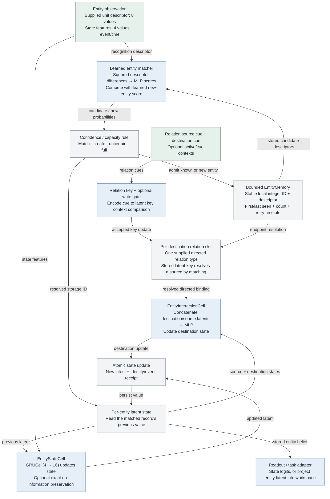

[Full-size SVG](diagrams/atlas/10-entities.svg)

The model does not predict an arbitrary universal integer. Learned matching selects a record; the integer is the store's address. Uncertain matches can remain unresolved. Unique record IDs do not prevent mistaken identity merges.

These experiments start with supplied descriptors and state cues. They do not yet implement discovery of arbitrary people/objects from webcam pixels. Matching, state updating and relation keys are learned; storage bookkeeping is explicit.

EntityRelationMemory has one supplied relation type and one slot per destination. This is not yet learned open-ended graph structure or a general concept/instance taxonomy. The broader proposed graph appears in §13.

The key-box experiment actually connects an entity latent through projection and two Thinker steps to the general belief workspace, then a readout feeds a supplied planner. This remains a distinct experimental configuration.

Source: [pathwm/models/entities.py · EntityMatchReader:147](../pathwm/models/entities.py), [pathwm/models/entity_memory.py · EntityMemory:12](../pathwm/models/entity_memory.py), [pathwm/models/entity_state.py · EntityStateCell:10](../pathwm/models/entity_state.py), [pathwm/models/entity_state.py · EntityInteractionCell:48](../pathwm/models/entity_state.py), [pathwm/models/entity_relations.py · EntityRelationMemory:38](../pathwm/models/entity_relations.py), [pathwm/models/key_box.py · KeyBoxReader:27](../pathwm/models/key_box.py).

<a id="11-planning"></a>

## 11 · Planning and the proposed action DAG

Existing finite candidate rollouts; broader DAG search remains a target

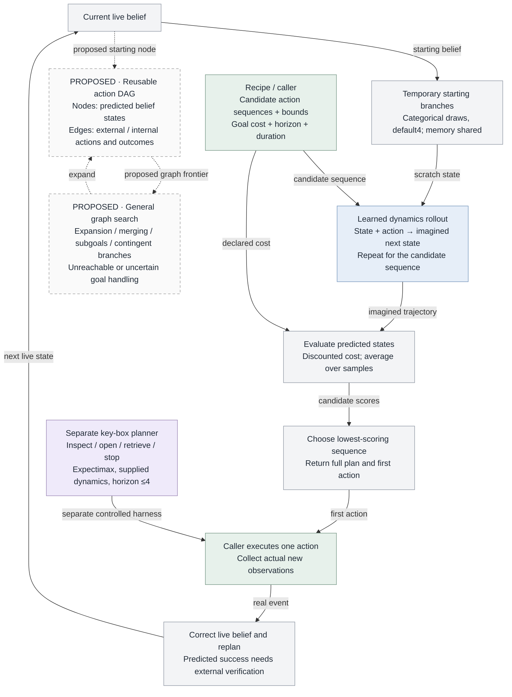

[Full-size SVG](diagrams/atlas/11-planning.svg)

The general planner scores caller-provided sequences; it does not currently construct a persistent, general action DAG. Candidate generation, action units and goal cost are recipe-owned. There is no guarantee that the supplied candidates can reach a goal.

Hypothetical branches do not consume real event ordinals or write live evidence. General prior rollouts do not yet support observation-conditioned sensing branches; key-box expectimax handles sensing in a separate finite supplied model.

The task dispatcher already distinguishes internal think/recall/imagine from external act/ask/emit. General learned task decomposition, automatic state equivalence/graph merging, a universal success verifier and broad software-tool skills remain open.

Prediction quality, goal readout quality and search coverage all constrain planning. A low imagined cost is not proof of realized success.

Source: [pathwm/evaluation/agent.py · plan:23](../pathwm/evaluation/agent.py), [pathwm/models/belief.py · imagine:501](../pathwm/models/belief.py), [pathwm/models/agent.py · step_task:637](../pathwm/models/agent.py), [pathwm/models/key_box.py · plan_key:59](../pathwm/models/key_box.py), [docs/decision-design.md](../docs/decision-design.md).

<a id="12-learning"></a>

## 12 · Training signals and gradient routes

Recipe-selected objectives; no single checkpoint currently proves all capabilities

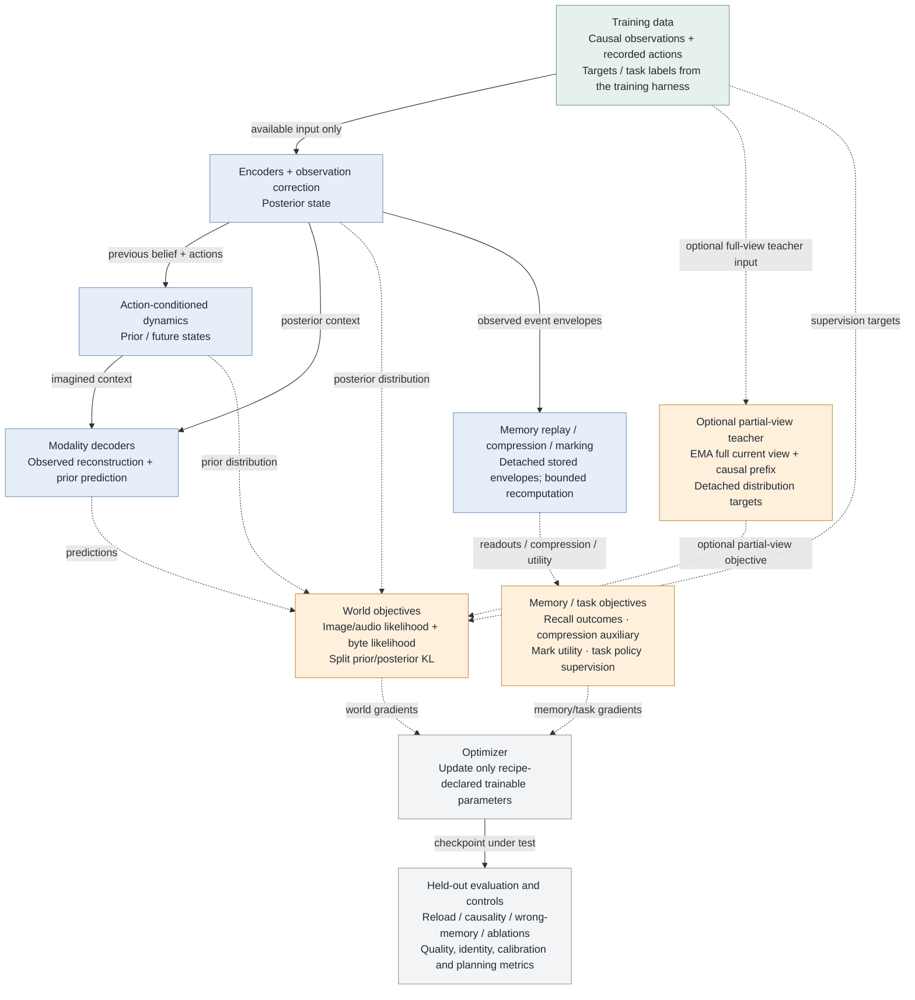

[Full-size SVG](diagrams/atlas/12-learning.svg)

This is a map of available learning paths, not a claim that every loss runs in every recipe. Runtime memory writes detach; training deliberately recomputes bounded windows where needed.

The separate photo training path (§8–9) uses detached codec features and real pixels as feature/flow/decoded-image targets. Only the generator learned in the latest run. Frozen encoder/state/memory parameters blocked upstream repairs; the frozen RGB head still transmitted gradients to generator inputs.

Offline probes measure what a different reader can recover at each stage. They do not become inference shortcuts. Longer training, larger width, data coverage and architecture changes need separate controlled comparisons.

The next proposed photo repair is intermediate spatial supervision of observation/state updates and recall. It is not implemented by this diagram work.

Source: [pathwm/training/belief.py](../pathwm/training/belief.py), [experiments/multimodal.py](../experiments/multimodal.py), [experiments/real_photo.py](../experiments/real_photo.py), [pathwm/models/conditional_image.py](../pathwm/models/conditional_image.py), [pathwm/evaluation/photo_detail.py](../pathwm/evaluation/photo_detail.py), [docs/photo-detail-plan.md](../docs/photo-detail-plan.md).

<a id="13-target-graph"></a>

## 13 · Persistent World State foundation

Implemented storage and neural interfaces · general learned capabilities remain unvalidated

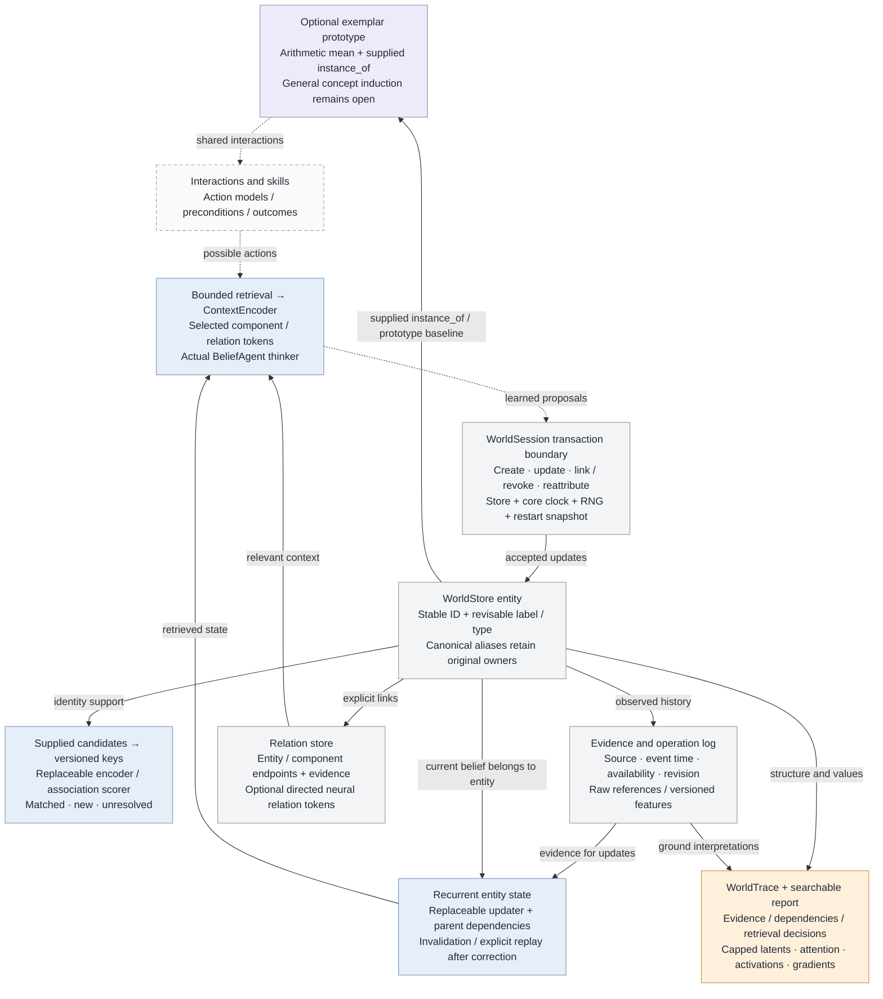

[Full-size SVG](diagrams/atlas/13-target-graph.svg)

The intended agent learns representations and which connections are useful. Stable IDs are bookkeeping; readable labels are revisable interpretations. These boxes are conceptual distinctions, not mandatory database fields or one vector each.

The opt-in pathwm.world_state package implements the store, binding, recurrent update, bounded retrieval, context projections and actual thinker connection. Optional prototype, self/control, feedback, prediction and modulation clients have concrete tensor/record APIs; their useful learned behavior is not established. Discrete storage is outside autograd; neural forwards remain trainable. Action authority belongs to the harness.

81 scoped tests and 3293 independent checks pass; a 96-update CPU task using supplied descriptors preserves two identities and answers paired histories. Complete checkpoints match a 48+48 resumed run exactly. This is development evidence, not real-image recognition or sample-efficiency proof. General concept discovery, learned graph topology, retrieval calibration, scalable indexing and skill acquisition remain open. Structural report QA passes; browser interaction QA is unavailable under the existing local-file policy.

A recognition latent cannot automatically be decoded into a faithful face or image. That requires a compatible trained decoder and retained information; a reconstruction is evidence about a readout, not a literal picture of all the agent's beliefs.

The foundation now connects audio/video/text/image packets with masked CandidateEncoder.pool over supplied regions/spans. Whole-window pooling is a lossy baseline, not discovery. Candidate provenance must retain source ancestry; generated/recalled candidates cannot become new evidence. Modality representation spaces remain separately versioned until alignment is trained. 112 scoped tests and actual real audiovisual/UTF-8 transport pass; general identity and state-to-output learning remain open.

Source: [pathwm/world_state/store.py · WorldStore:175](../pathwm/world_state/store.py), [pathwm/world_state/session.py · WorldSession:77](../pathwm/world_state/session.py), [pathwm/world_state/modules.py · ContextEncoder:346](../pathwm/world_state/modules.py), [pathwm/world_state/inspection.py · WorldTrace:37](../pathwm/world_state/inspection.py), [docs/world-state.md](../docs/world-state.md), [docs/world-state-foundation-plan.md](../docs/world-state-foundation-plan.md), [pathwm/world_state/modules.py · CandidateEncoder:30](../pathwm/world_state/modules.py), [docs/modality-foundation-plan.md](../docs/modality-foundation-plan.md).

<a id="14-latent-core"></a>

## 14 · Inside the latent core

Current categorical agent plus opt-in WorldSession · named roles are not guaranteed learned semantics

```mermaid
flowchart TB
    input["Encoded source features<br/>Image / audio / video / text"]
    class input external;
    previous["Previous h and sampled categorical code<br/>Recorded action / elapsed time"]
    class previous store;
    dynamics["BeliefDynamics<br/>Shared attention transition -&gt; new h<br/>Prior categorical distribution"]
    class dynamics learned;
    correct["BeliefCorrection<br/>Observation attention + memory + refine<br/>Correct categorical logits"]
    class correct learned;
    world["World readout<br/>h + projection of categorical code<br/>Default16 tokens x width32"]
    class world store;
    memory["HybridMemory<br/>Bounded source and belief history<br/>Perception / prediction / thinking reads"]
    class memory store;
    graph["Optional WorldStore<br/>Versioned entities / relations / evidence"]
    class graph optional;
    retrieve["Retriever + ContextEncoder<br/>Selected graph records -&gt; latent context"]
    class retrieve learned;
    goal["Task / question / goal context<br/>Detached error / entropy / step feedback"]
    class goal external;
    work["Working and reasoning tokens<br/>Default4 + 4 tokens x width32"]
    class work store;
    think["Thinker: one shared Attend block<br/>Normalize -&gt; attention -&gt; residual<br/>Normalize -&gt; MLP -&gt; residual"]
    class think learned;
    next["Updated working / reasoning tokens<br/>Repeat with same weights for k steps"]
    class next store;
    decode["Current native decoders<br/>Read world + working + reasoning tokens"]
    class decode learned;
    previous -->|"advance event or imagined branch"| dynamics
    dynamics -->|"prior h and logits"| correct
    input -->|"valid available features"| correct
    memory -->|"prediction read"| dynamics
    memory -->|"perception read"| correct
    correct -->|"posterior code; h from prior"| world
    dynamics -->|"prior-only hypothetical branch"| world
    memory -->|"thinking read"| think
    graph -->|"pinned bounded query"| retrieve
    retrieve -->|"optional goal-context tokens"| think
    goal -->|"task and diagnostic context"| think
    world -->|"world tokens"| think
    work -->|"query and context"| think
    think -->|"workspace update"| next
    next -->|"next internal iteration"| work
    world -->|"unchanged during thinking"| decode
    next -->|"refined workspace"| decode
    classDef learned fill:#e6eef8,stroke:#7696bc,color:#202a36;
    classDef store fill:#f3f4f6,stroke:#9098a4,color:#202a36;
    classDef external fill:#e7f1eb,stroke:#789887,color:#202a36;
    classDef optional fill:#efeafa,stroke:#9c87b5,color:#202a36;
    classDef training fill:#fff0db,stroke:#bd934d,color:#202a36;
    classDef proposal fill:#fafafa,stroke:#9b9b9b,color:#202a36,stroke-dasharray:5 4;
```

[Full-size SVG](diagrams/atlas/14-latent-core.svg)

The diagram omits storage writes; observed events commit source/belief envelopes, while WorldSession separately stages entity/graph updates. Thinking never writes new observations. HybridMemory and the optional persistent graph are distinct stores.

Default shapes describe build_model(state_model="belief", width=32), not the Gaussian agent or the width16 modality audit. h is16x32; categorical logits are8 groups x8 codes; the derived world readout is16x32, and workspace is8x32. Code IDs are not predefined entity or word IDs.

BeliefCorrection returns posterior logits; the recurrent h was produced by dynamics. think() changes only working/reasoning tokens, not h/logits, live event time or source memory. A reasoned graph belief revision would need a distinct inferred transaction, not an observational write.

Thinker parameters are shared across the caller-specified step count. More iterations are not proven to improve quality. An optional TaskPolicy already proposes think/recall/imagine/emit/act/finish, but general answer readiness and truth checking are unvalidated.

Imagination uses the existing dynamics on a separate hypothetical state. Automatic search and integration of branch results into general answer planning remain outside this small loop. No model or training change accompanies this drawing.

16 September: eight fresh-updater controls (direction-only/joint, sampled/continuous working readout) all fail the task screens. Frozen encoders retain100% known/held-out factor access, but updater query direction access is60–75%. No unique causal loss layer or default repair established. Next isolate one input modality before mixing modes. See docs/modality-readout-plan.md and runs/direction_learning_v1/report.html. Colors and general capability scopes stay unchanged.

16 September follow-up: six isolated-input fits and four matched checkpoint continuations preserve the shared latent architecture. Text-only known direction is100% in both seeds; audio46%/100%, simultaneous-all48%/60%. Text warm-up improves complete-input scores, but repeated-draw means100%/74% fall to50%/51% without text. Narrow text access works; multimodal transfer remains open. Frozen audio grids AND their means permit100% known-direction access, while learned first queries give40%/98%. No unique loss layer, new default or general capability promotion. Next test gradual source rotation/dropout with matched controls. See runs/direction_inputs_v1/report.html and docs/modality-readout-plan.md.

16 September video follow-up:12 controlled fits compare requested time in source/query and an optional learned palette. Paired video-quality benefit fails; palette mixture fields become nearly constant. Defaults unchanged. Oracle motion works better than actual video-state output; symmetric reverse-pair probes give69-78% direction at encoder and28-39% at final state on new positions, not a unique loss proof. See docs/video-readout-plan.md and runs/video_readout_v1/report.html. The video branch uses its own framewise image patch weights, time features, causal attention and adjacent-frame pooling; no weight sharing with image input and no automatic spatial-VAE integration. No natural-video or forecast validation.

Source: [pathwm/models/belief.py · BeliefDynamics:33](../pathwm/models/belief.py), [pathwm/models/belief.py · BeliefCorrection:74](../pathwm/models/belief.py), [pathwm/models/belief.py · _readout:196](../pathwm/models/belief.py), [pathwm/models/agent.py · Thinker:105](../pathwm/models/agent.py), [pathwm/models/agent.py · think:709](../pathwm/models/agent.py), [pathwm/models/agent.py · decode:779](../pathwm/models/agent.py), [pathwm/world_state/session.py · think:425](../pathwm/world_state/session.py), [docs/latent-core.md](../docs/latent-core.md).

<a id="15-output-plan"></a>

## 15 · Shared latent thought, modality-specific readout

Optional readout loops tested; bounded repairs improve known fitting but direction and new combinations remain open

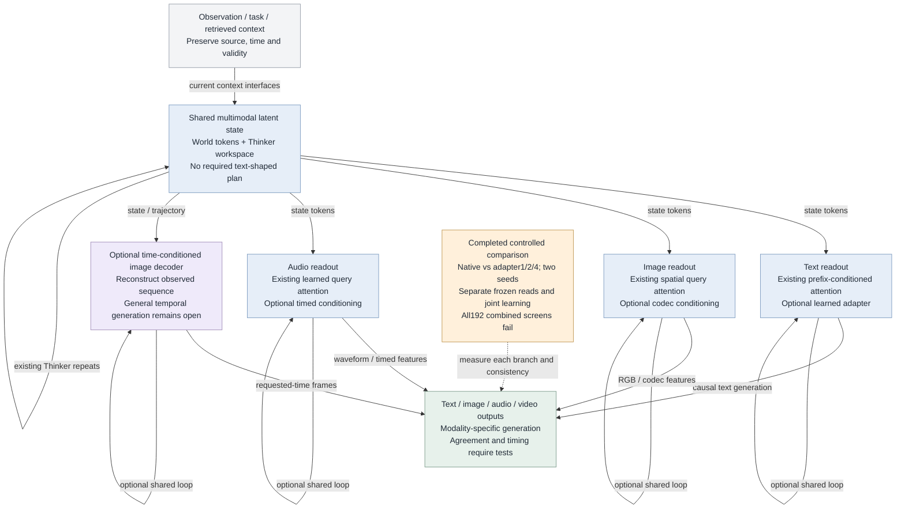

[Full-size SVG](diagrams/atlas/15-output-plan.svg)

The common latent core stays multimodal. The user proposes optional modality-specific extraction before decoding, not a compulsory common answer plan. The optional adapter is now implemented and tested.

Native text/image/audio decoders already learn cross-attention reads. Text queries depend on the generated prefix; image/audio queries are learned parameters. Extra adapters must add a measured benefit rather than duplicate that readout.

The separate ConditionalFeatureGenerator already illustrates context-to-image-codec features. Current video uses ordered state-to-image decoding, not a validated general temporal generator. Common shape is not common semantics.

Compare existing reads with a small adapter on fixed core states first; then consider joint training. Output losses must test task content and held-out combinations, including empty/swapped contexts. Track total resources and separate core retention, readout access and generation quality.

Extraction cannot recover unretained evidence. A generator can fill unspecified details using learned priors; this does not recover the original missing details. Preserve evidence metadata and test disagreement across simultaneous modalities.

The earlier workspace-only answer-plan proposal remains an optional ablation, not adopted architecture. The following readout study adds optional modules; it does not replace the default model.

User-proposed nested loops: an outer shared Thinker and inner modality-specific token refinement can reuse weights within each loop. Do not require the same weights across modalities. Begin with fixed budgets; repetitions add compute and potentially training activation memory. Autoregressive steps multiplied by inner/outer loops can become expensive. Local refinement does not mutate world evidence or trigger outer thinking automatically.

Evidence: runs/modality_readout_v1/verification.json and controls-verification.json; docs/modality-readout-plan.md.42 primary runs plus8 explicit-factor controls. Held-out all-four-correct remains0% for every variant. Iterative adapters run after two fixed outer Thinker steps; adaptive inner-to-outer feedback is not implemented. Mechanical passing tests do not validate content learning. Follow-up: eight longer native oracle fits now pass known-output gates, but new text/image combinations and video quality still fail. Training-only raw-logit supervision improves known position to97–100%, not direction; full core gates fail. Frozen probability-to-code probes and measured direction collisions motivate paired updater learning. See docs/modality-readout-plan.md and runs/modality_repair_v1/report.html. No default or green capability promotion. This follow-up does not rerun the complete combined-output sweep. Direction localization is a linear accessibility diagnostic on saved checkpoints, not an irreversible information-loss proof.

16 September: eight fresh-updater controls (direction-only/joint, sampled/continuous working readout) all fail the task screens. Frozen encoders retain100% known/held-out factor access, but updater query direction access is60–75%. No unique causal loss layer or default repair established. Next isolate one input modality before mixing modes. See docs/modality-readout-plan.md and runs/direction_learning_v1/report.html. Colors and general capability scopes stay unchanged.

16 September follow-up: six isolated-input fits and four matched checkpoint continuations preserve the shared latent architecture. Text-only known direction is100% in both seeds; audio46%/100%, simultaneous-all48%/60%. Text warm-up improves complete-input scores, but repeated-draw means100%/74% fall to50%/51% without text. Narrow text access works; multimodal transfer remains open. Frozen audio grids AND their means permit100% known-direction access, while learned first queries give40%/98%. No unique loss layer, new default or general capability promotion. Next test gradual source rotation/dropout with matched controls. See runs/direction_inputs_v1/report.html and docs/modality-readout-plan.md.

16 September video follow-up:12 controlled fits compare requested time in source/query and an optional learned palette. Paired video-quality benefit fails; palette mixture fields become nearly constant. Defaults unchanged. Oracle motion works better than actual video-state output; symmetric reverse-pair probes give69-78% direction at encoder and28-39% at final state on new positions, not a unique loss proof. See docs/video-readout-plan.md and runs/video_readout_v1/report.html. The video branch uses its own framewise image patch weights, time features, causal attention and adjacent-frame pooling; no weight sharing with image input and no automatic spatial-VAE integration. No natural-video or forecast validation.

16 September: user requests actual trained image-encoder reuse for video and frame reconstruction training. The new optional VideoVAE owns one existing spatial image VAE, shared encoder AND decoder, plus causal posterior-mean refinement. This is a separate measured codec path, not an implicit replacement of the categorical agent patch encoder. See diagram16 and docs/shared-video-vae-plan.md. General video capability remains open.

Source: [pathwm/models/agent.py · Thinker:105](../pathwm/models/agent.py), [pathwm/models/agent.py · emit:508](../pathwm/models/agent.py), [pathwm/models/modalities.py · TextDecoder:366](../pathwm/models/modalities.py), [pathwm/models/modalities.py · ImageDecoder:282](../pathwm/models/modalities.py), [pathwm/models/modalities.py · AudioDecoder:347](../pathwm/models/modalities.py), [pathwm/models/conditional_image.py · ConditionalFeatureGenerator:73](../pathwm/models/conditional_image.py), [docs/multimodal.md](../docs/multimodal.md), [docs/latent-core.md](../docs/latent-core.md), [pathwm/models/readout.py · RecurrentOutputAdapter:9](../pathwm/models/readout.py), [pathwm/models/readout.py · TemporalImageDecoder:72](../pathwm/models/readout.py), [docs/modality-readout-plan.md](../docs/modality-readout-plan.md).

<a id="16-shared-video-codec"></a>

## 16 · Shared image codec and causal video extension

Experimental spatial VAE path; existing agent token encoder remains separate

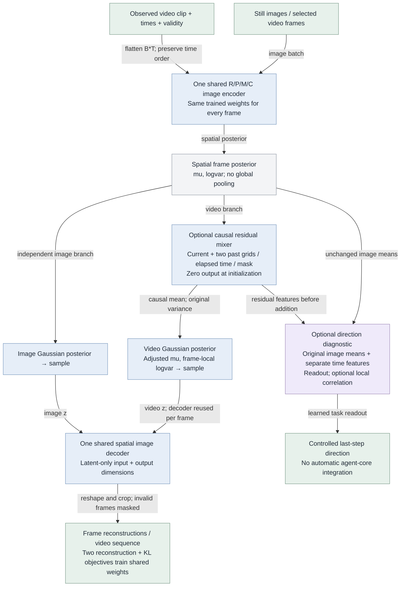

[Full-size SVG](diagrams/atlas/16-shared-video-codec.svg)

An encoder-decoder codec, not the complete agent. No target RGB skip, future access, learned temporal prior or persistent streaming state.

The image-only path and video path have one owner/checkpoint for the actual image weights. Optional temporal processing adds parameters; its benefit must be measured separately.

Seven contract tests cover sharing, exact neutral initialization, causality, gradients, invalid frames, variable sizes and checkpoint restoration. Quality evidence is in the bounded real-video comparison; no high-level capability promotion.

Four128-update real-video development fits (two seeds) complete in24.80s CPU. Temporal frame-difference benefit0.22%/0.14% fails5% screen. Both trained arms worsen reserved-source RGB vs untouched image weights.61 tests plus exact resume and raw audits validate mechanics only. Temporal remains opt-in; no general-quality or high-level green promotion. See runs/shared_video_vae_v1/report.html.

Literature: docs/video-codec-literature.md distinguishes published image-weight reuse, temporal decoding and time compression. Local source-regression also confounds beta0.1→0.01 and color weight6→0; paired arms remain matched. No paper proves the local failure cause. User walked through actual late causal mean refinement before sampling and per-frame shared decoder.

User proposes images as one-frame videos or repeated stills. Existing wrapper accepts both; a new gradient check confirms only repeated multi-frame examples train past-frame kernel taps. Current measured auxiliary image loss bypasses temporal processing. Mixed single-frame/real-video/repeated-still training remains proposed, with static-ratio and exposure controls; no efficacy claim.

Discussed spatial receptive field versus temporal horizon: current3x3 operates on the latent grid, while current/two previous frames set history. Larger kernels, stacked/shared local blocks and coarser-scale context are proposed comparisons, not validated repairs. Global attention already has global spatial access. See docs/video-codec-literature.md; no architecture or validation-color change.

Frozen-codec context comparison implemented and measured: injected mixer supports spatial5x5 or repeated shared spatial-only3x3 refinement, preserving three-frame causality. Twelve256-update fits with per-architecture current-only controls:3x3 history helps47–57%, but larger candidates worsen masked MSE and correct-vs-different-clip history benefit stays below1.4%. No motion understanding or expanded-default adoption.68 scoped tests,1447 exact-resume and405 raw artifact checks; see docs/video-context-plan.md and runs/video_context_v1/report.html. Validation colors unchanged.

Paired-order study: reconstruction-trained frozen temporal readouts stay near chance; direction training fits crop pans but a static cue fails the original gate. Exhaustive-phase periodic evaluation removes single-frame label cues. Four balanced-data fits reach79–99%, with only one passing seed per variant. Neither variant passes the two-seed gate. Separate temporal features and optional correlation are implemented, not general motion/forecasting or core integration. See docs/video-order-plan.md and runs/video_order_v1/balanced_training/report.html; validation colors unchanged.

Source: [pathwm/models/video_vae.py · VideoVAE:96](../pathwm/models/video_vae.py), [pathwm/models/video_vae.py · CausalLatentMixer:19](../pathwm/models/video_vae.py), [experiments/video_vae.py](../experiments/video_vae.py), [tests/test_video_vae.py](../tests/test_video_vae.py), [docs/shared-video-vae-plan.md](../docs/shared-video-vae-plan.md), [docs/video-context-plan.md](../docs/video-context-plan.md), [pathwm/models/video_vae.py · local_correlation:71](../pathwm/models/video_vae.py), [pathwm/data/video_order.py · cyclic_pan_pairs:45](../pathwm/data/video_order.py), [experiments/video_order.py · OrderReadout:49](../experiments/video_order.py), [docs/video-order-plan.md](../docs/video-order-plan.md).
