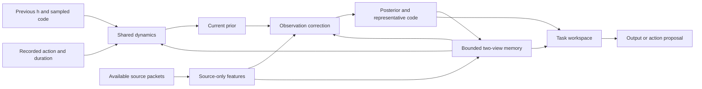

# Categorical belief and bounded session memory

[German visual walkthrough: latent core, existing thinking loop and
modality-specific output readout](latent-core.md).

The multimodal CLI now defaults to `--state-model belief`. The existing Gaussian
model remains available with `--state-model gaussian`; Python `build_model()` keeps
its Gaussian default for existing callers. Request `build_model(state_model="belief")`
explicitly in code. Both use the same recipe, task/output adapters, trainer, reports
and safe checkpoint/resume machinery.

The default belief model has 515,553 parameters at width 32. Its contents have learned
semantics: 16 recurrent context tokens, eight categorical groups with eight codes
each, and eight workspace tokens. It does not reserve places, objects or documents
as latent fields. These are initial development capacities, not selected optima.



## Calling the model

```python
from experiments.multimodal import build_model
from pathwm.models.belief_state import Packet

model = build_model(state_model="belief")
state = model.initial_state(batch_size=1)

# A single call supplies one complete event and commits memory once.
state = model.observe(state, observations, time=1.0, previous_action=action)

# For separate arrivals, hold one transaction until its packet set is complete.
pending = model.begin_event(state, event_id="frame-2", ordinal=2,
                            time=2.0, action=action)
pending = model.add_packet(pending, Packet("camera/frame-2", "image", image))
pending = model.add_packet(pending, Packet("microphone/chunk-2", "audio", audio))
state = model.commit_event(pending)
state = model.mark(state, author="user", detail="remember this event")
state = model.think(state, steps=2, goal=goal_tokens)
branch = model.imagine(state, action, dt=1.0)
```

`observations` uses the existing `Observation(values, times, valid)` adapters. In
this recipe, times/durations are recorded-transition units, consistently across all
modalities. The library also accepts an explicitly constructed seconds-based model.
Missing actions differ from recorded zero actions. Zero-duration recorded actions
are valid. No observation carries the prior without a source-memory write; different
batch members can be unobserved independently.

The caller owns state and transaction lifetimes. Identity is the session plus a
strictly increasing event ordinal, with a bounded event label. Equal timestamps
need distinct ordinals. Closed ordinals are rejected; there is no history rewind.
Older input windows may be supplied as context for a new event, retaining their
original source times. This does not edit earlier committed events. Packet IDs must
identify the source item/version, not merely name the sensor. Deduplication is within
an open event; a trusted adapter must not relabel duplicate events as new ordinals.

Partial corrections use the same prior, memory snapshot and saved sampling noise.
Packet order cannot change the resulting union. Duplicate identical packets are
no-ops; conflicting duplicates raise. Sealing is a pure operation returning a new
state: repeating it on the same transaction returns equal values, and a sealed
`BeliefState` cannot itself be sealed. There is no mutable global memory log.

`initial_state()` starts a fresh session: initialized belief/workspace and empty
recent, staged, compressed, protected and consolidated stores, with unchanged model
parameters. Discard old task sessions and pending plans as well; create a new
`TaskSession(request)` if starting a task. No selective memory-reset API was added.

## What is retained and what it costs

| Store | Default bound | Contents |
| --- | ---: | --- |
| Recent | 32 records | Exact h, categorical logits/code, cached world readout and 8 source-only feature tokens |
| Staging | At most 7 records | Oldest recent records waiting for a chronological block of 8 |
| Compressed | 16 blocks | 8 learned tokens per view per block |
| Protected | 8 records | Complete event detail at the recent representation's fidelity |
| Consolidated | 8 tokens per view | Gated accumulation when the oldest compressed block leaves |

Short-term retention is exact **for the stored latent envelope**, not raw sensor
reconstruction. The source encoder is already learned and lossy. Protected marks
retain the complete event envelope; the detail description is metadata, not a
learned selector that guarantees preservation of a named pixel or fact.

Source and inferred paths remain separately addressable through compression. Both
recent readers and the inferred compressor receive the full categorical distribution,
not only its sampled code. Separate perception, prediction and thinking readers
attend across the scales with token-wise normalized gates and a no-memory option.
Source features never take belief, task or reflection values as encoder conditioning.
Clocks distinguish inferred-state time from original evidence support. Recent
source validity and time intervals are retained per batch member. Older blocks keep
support intervals and at most 32 source IDs, explicitly counting omitted labels;
exact per-source alignment is lost at that compression boundary.

The conservative maximum **tensor payload** at width 32, FP32, batch 1 is 318,040
bytes (about 311 KiB), including full source-support tables and conservatively
counting shared protected records twice. At width 16 it is 180,312 bytes. Use
`model.memory.storage_bytes(state.memory)` for current occupancy or
`model.memory.capacity_bytes(16, 8, 8, 8)` for the default shape bound. Metadata strings
and Python containers, live state, weights, attention keys and training activations
are additional. IDs/descriptions are length-bounded; event packet count is capped at
32. Input-window sizes still belong to the modality adapter and caller.

Reads currently attend over the bounded stores directly; this is not an indexed
retrieval implementation. Increasing stored tokens increases attention and copying
cost. Four planning branches share immutable memory, while their forward computation
still costs roughly four rollouts. This implementation does not establish a scaling
or latency result at larger capacities.

User marks have priority. Positive agent utility scores can admit an agent mark;
the lowest-scoring agent record is displaced when needed. A store full of user
marks explicitly rejects an additional user admission rather than silently evicting
one. The API currently marks the latest committed observed event. There is no
unbounded raw archive.

## Learning and evaluation meaning

The recipe declares image/audio Gaussian likelihoods with fixed sigma 0.1 in its
normalized data units, and autoregressive categorical byte likelihoods. Each
modality's joint log likelihood is averaged over two sampled complete latent codes
with log-mean-exp, then normalized per target dimension for the weighted objective.
This is a composite per-modality score, not a joint cross-modal likelihood. Its
finite-sample marginal NLL and straight-through categorical gradient are biased
estimators. The sample count and scaling are explicit development choices.

Posterior reconstruction and prior-only future rollouts ground the state. Dynamics
and representation KL losses have separate stop-gradient arguments, coefficients
1 and 0.1, and a one-nat floor **after** summing groups per labelled event. Prior and
posterior probabilities use a 0.01 uniform mixture. Shared context can still receive
gradients through active arguments. Latent entropy is a diagnostic, not calibrated
confidence or an estimate of uncertainty over model parameters.

Partial-view masking happens before encoders or memory writes. Duplicated image/video
frames share their random visibility mask. The full-view EMA teacher reads the same
partial causal prefix and current full packet set under no-grad, and never commits.
The student learns a distributional KL target and observable likelihood, including
held-out contents. Masking reveals declared random availability, not hidden values.
The teacher target does not establish that every student draw should equal the
actual hidden outcome.

Inference writes detach the memory. Training replays bounded raw windows with the
same deterministic FIFO policy; detached snapshots feed recomputed compressors.
Consolidation detaches the old accumulator before each update. Frozen-reader
softmax feature distributions provide a small compression auxiliary; those feature
probabilities are not world-event confidence. Delayed image recall uses memory and
a time query without the current belief as a shortcut. Mark scoring regresses the
later loss difference with/without extra detail, minus storage cost, under the same
protected capacity. These are initial task-specific training signals, not proof of
useful general memory or calibrated mark scores.

The default two-observation history exercises filtering but cannot teach delayed
memory across a 32-record recent store. Use the explicit small-memory development
command below to exercise that learning path. Training at long deployed horizons,
rich partial-observation distributions and broader marking tasks remains substantive
research work.

## Run and inspect

```bash
source .venv/bin/activate
python experiments/multimodal.py --state-model belief --check
python experiments/multimodal.py --state-model belief --width 16 \
  --history 8 --horizon 2 --memory-recent 2 --memory-block 2 --memory-blocks 1 \
  --steps 8 --improve-every 0 --output runs/my_belief
python experiments/multimodal.py --resume runs/my_belief
```

Add `--dataset instructions` to exercise task heads, or `--dataset pusht` for the
existing real image/action data. Reports use the existing offline HTML pipeline.
Snapshots use `pathwm-belief-v1`, preserve integer codes and float64 clocks, and
load with `torch.load(..., weights_only=True)` plus `BeliefState.from_dict`.
Gaussian snapshots are not silently converted. Model checkpoints remain protected
by the existing code/settings/data/runtime compatibility checks. Run-owned source
snapshots preserve the exact implementation when the working tree later changes.

The executed SVG diagram exporter currently depicts the Gaussian reference; the
flow above describes the new categorical model. Use
`python experiments/multimodal.py --diagram --state-model gaussian` for that reference.
See [the implementation record](belief-implementation-plan.md) for validation and
Claude reconciliation, and [current work](project-state.md) for measured limits.
