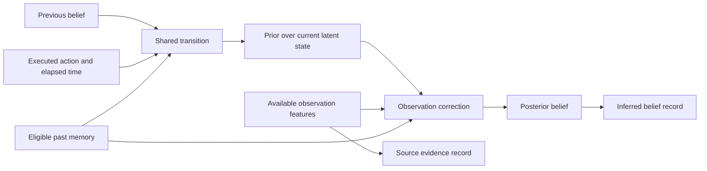

# Belief updating and uncertainty: recommended starting design

Status: architecture proposal, 9 September 2026. The user requested a Claude
discussion and a concrete recommendation. No model implementation, training or
checkpoint conversion is authorized by this document. The existing negative
learning result remains unchanged. This extends the
[state and memory design](state-memory-design.md); individual memory resets remain
withdrawn in favor of a fresh agent session.

## Recommendation and rationale

Use a compact stochastic latent state with a transition prior and a separately
learned observation-conditioned posterior, alongside recurrent context. This gives
the agent an explicit way to sample possible current states and predict from them
with the same dynamics module. Maintain one recurrent continuation in ordinary use;
draw a bounded number of temporary alternatives when making decisions.

A deterministic token bundle could also encode a distribution implicitly. The
reason for this proposal is its concrete sampling/update interface, not proof of
greater expressiveness or accuracy. A persistent particle bank would introduce
proposal, weighting and retention choices that are unnecessary for this first
interface. It remains an option if distinct historical explanations must survive
many events and the proposed approximation proves inadequate.

[PlaNet](https://arxiv.org/abs/1811.04551) provides a precedent combining deterministic
and stochastic latent dynamics for planning.
[DreamerV3](https://arxiv.org/html/2301.04104v2), equations 1–3, specifies recurrent
context, categorical latent prior/posterior, observable prediction and separate
dynamics/representation KL losses. These support the mechanism choice; they do not
validate the added memory, domain adapters or model quality proposed here.

## What the live state contains

| Part | Shape | Meaning |
| --- | --- | --- |
| Recurrent context `h` | `[B,N_h,D]` | Learned history representation; deterministic computation does not mean certain knowledge |
| Categorical logits `ell` | `[B,S,J]` | One distribution over J learned codes for each of S groups |
| Representative latent `z` | `[B,S]` integer indices | One sampled complete code used for ordinary recurrent continuation |
| Exact metadata | Per-session/event records | State time, evidence time/support, transition/event identity, prior/posterior status and live/hypothetical branch role |

Code meanings and context-token meanings are learned. They are not named object,
place, document or confidence slots. Prior and posterior use the same code layout
and embeddings. A draw samples all groups and produces a full latent code that the
dynamics and output modules can consume together.

The carried belief is the complete `(h, ell, z, metadata)` bundle. Keeping only a
decoded mean or the representative sample would lose its explicit distribution.
The posterior is conditional on the sampled history that produced `h`; this is an
approximate filter, not the exact marginal over every possible past. Factorized
groups can miss correlations. Sampling a whole code avoids averaging latent states,
but does not guarantee that every decoded alternative is coherent or covers a rare
possibility. A Gaussian latent with a nonlinear decoder is also a viable alternative;
it is not inherently forced to average observable modes.

## Prediction, correction and commitment

**Advance once.** The live wrapper uses the action actually recorded, its duration
and a causal memory snapshot to compute:

`h_minus = F(h_previous, z_previous, action, dt, memory_context)`

`p_minus(z) = categorical_prior(h_minus)`

The transition learns through token attention and the existing action/time and
memory interfaces; it need not use a particular recurrent cell. Its prior head
emits `[B,S,J]` logits. Missing action, verified no-op and missing observation are
different conditions. Duration has declared units and a presence/unknown policy.
Transition identity prevents applying an action twice. A recorded instantaneous
action may have zero duration and still change state; timestamp equality alone is
not permission to skip or repeat it.

**Correct without advancing again.** Keep `h_minus` as the recurrent context and
compute `q(z | h_minus, available_observations, eligible_memory)` with a separate
head. Adapt the proposed perception path: observation attention, consumer-specific
memory reads, gated residual fusion and a final direct observation read, followed
by categorical logits. The current belief changes through `q`; context and latent
together feed the output modules. This is learned approximate inference, not an
analytic Bayesian update or multiplication of attention weights as likelihoods.

The correction head is not limited to reweighting the few alternatives already
sampled for a decision. It can assign probability to other code combinations when
observations contradict the prior. Prior matching must teach the dynamics to reach
these corrected states. This route permits revision but does not guarantee it;
neither a scalar surprise threshold nor an automatic hard override is required.

**No observation.** Carry `p_minus` as the current distribution and use a sampled
representative for subsequent recurrence. State time can advance while evidence
time stays unchanged. Do not create an observation or source-evidence memory record.
There is no rule forcing entropy to increase: modelled dynamics may increase or
decrease ambiguity. Missingness itself can be an observed signal only when the
adapter explicitly provides it with that meaning.

**Group partial arrivals.** Before sealing an event, deduplicate source IDs and
accumulate the available observation union. Re-evaluate its posterior from the same
unchanged prior and pre-event memory snapshot. Do not use the previous partial
posterior as if it were an independent new prior, or reapply the action/time step.
Text/image positions and modality/source times remain in their encodings. Set
attention does not replace deduplication or event ownership. The starting interface
uses ordered event packets; late historical corrections need an explicit adapter
policy, not silent clock rewind.

Canonically order deduplicated packets by declared modality/source identity while
preserving positions inside each packet. Distinct events with equal timestamps use
an explicit caller-supplied ordinal. Recomputing a union from the frozen prior then
does not depend on the order in which that same packet set arrived.

**Commit once.** After a real observed event is sealed, store source-only observation
features and the full inferred belief bundle through their respective memory views.
Draw/finalize the representative used by the next live transition. Recalled history
can condition inference, but is not scored again as independent newly observed
evidence. Source IDs and availability masks enforce eligibility; they do not prove
that learned fusion is statistically optimal.

## Live dynamics, imagination and thinking

Live propagation and hypothetical rollouts share `F`, the prior head and their
physical inputs. Branch role controls routing and commitment; it is not a feature
that should make an identical physical transition differ. Modules may see relevant
timestamps and source ages without applying a second temporal transition.

The live branch may use predicted consequences of recorded actions as inferred
context, then correct them with observations. An imagined plan cannot become that
live branch merely by relabeling it. New source evidence is always separately
encoded; hypothetical and generated content never enters that evidence view.

For decisions that need possible outcomes, start with **four temporary draws** from
the current categorical distribution. Pair each with the same current `h`; use the
same initial draws for each candidate action. Propagate each entire branch under
its action sequence, drawing subsequent latents from its own priors and reading only
the real-memory snapshot pinned at the branch point. Score answers or action outcomes
per branch, then aggregate those decision quantities. Do not average the latent
worlds or multiply sample weights by their density again: draws from `q` already
have equal Monte Carlo weights.

Four is a proposed compute cap, not a selected optimum or protection against rare
outcomes. These draws explore uncertainty forward of one sampled history; they do
not recover histories already lost. A deterministic routing readout of `h` and the
logits can serve lightweight operations, but must not be described as integrating
every possibility through a nonlinear model. Thinking continues to update only the
working state; it does not advance world time or commit its alternatives as facts.

## Learning contract

1. Ground the latent through observable reconstruction and prediction distributions
   defined by each modality/target adapter. A current posterior draw conditions the
   current decoder. Future prediction uses action-conditioned prior rollouts with
   future observations confined to training targets. Avoid interpreting distances
   between changing latent encodings as a sufficient world-understanding objective.
2. Align categorical priors and posteriors using separate gradient routes:
   `L_dyn = max(tau, KL(stopgrad(q) || p))` and
   `L_rep = max(tau, KL(q || stopgrad(p)))`. Sum KL over groups for each event first,
   then apply its single floor, then average over valid labelled events.
   Proposed starting coefficients are 1 and 0.1 respectively, with `tau=1 nat`;
   they are tunable, not established optima for this design. A small uniform mixture
   in categorical probabilities can avoid exact zero support. It does not supply
   unknown facts or make a distribution calibrated. Shared context parameters receive
   gradients through whichever arguments remain active.
   Genuinely unobserved, unlabelled intervals have no posterior KL; their transitions
   receive gradients through later grounded observations or rollout targets. For a
   fully masked training view, inference retains the prior and any full-view target
   remains a teacher-only supervision path.
3. For withheld partial data, mask before all partial-branch encoders, caches and
   memory writes. A training-only full-view teacher at the same event can supply
   detached `q_full`; train the partial-view distribution through
   `KL(stopgrad(q_full) || q_partial)` across masking/episode samples and a scored
   predictive distribution over held-out observable content. Teacher and partial
   branch share only causal pre-event history. No teacher representation or hidden
   value enters live memory. This is population-level distribution matching, not
   pointwise equality of the partial and complete belief or a demand that every
   partial-state sample equal the actual hidden outcome.
   Its scope is the training masking distribution. Declare what the mask pattern
   itself reveals. Counts, timestamps, windows and normalization must use allowed
   visible metadata or fixed training statistics, never hidden per-example contents
   or full-view statistics. Observed absence is distinct from unavailable input.
4. Retain delayed recall and compression/consolidation supervision. Learning to
   retrieve a distribution-relevant distinction after recent eviction matters as
   much as one-step latent prediction. Keep source, inferred and generated labels
   through compression; an old compressed belief is not a new independent sensor.

For a concrete compression auxiliary objective, sample declared perception,
prediction and thinking queries and distil their fixed consumer/readout distributions
under old versus recomputed compressed memory. Detach the old-memory target; pass
student gradients through fixed readers into the compressor. Query sampling,
divergence and weights belong to the recipe. Grounded losses may reuse observable
targets with explicit weights: this is a composite objective, not an assertion that
overlapping targets are independent new evidence.

Score predictive marginals by exact summation when tractable or an explicitly
declared Monte Carlo approximation. A log of an unbiased likelihood average has
downward bias (upward NLL bias); its magnitude is not bounded here. The later recipe
must specify sample count, estimator and gradient method. Do not substitute
ranking latent samples by density or averaging point predictions. No loss above
guarantees that the stochastic code is used, that correlations survive factorization,
or that rare modes remain accessible.

## Resource and confidence boundaries

The original memory example counts only `[N,D]` state tensors. For this proposal,
an exact recent belief costs `N_h*D + S*J` floating values plus S code indices and
metadata. Evidence storage is additional and explicit. Recent/staged/protected
belief capacity must use this full envelope; older compressed blocks can retain
their bounded token count, with lossy uncertainty retention stated. Do not silently
keep the original byte estimate or allocate four persistent copies of all memory.
Temporary branches share an immutable memory snapshot; their computations and
activations still scale with branch and rollout counts. `N_h`, S and J remain recipe
capacity choices, not fixed semantic field counts.

The model represents uncertainty conditional on its learned dynamics, inference
family and retained history. It does not estimate a distribution over model weights.
Latent entropy, surprise and disagreement are diagnostics, not calibrated confidence.
Evaluate probabilities against observable events before using them as decision
confidence; reliability on one distribution does not establish it under a shift.
[Deep Ensembles](https://arxiv.org/abs/1612.01474) is a separate predictive-uncertainty
mechanism to consider later, not part of this starting model.

The next substantive contract is the **observable target and decoder distribution**
for each adapter, including observed absence versus unavailable input. This determines
what prediction errors and probability statements mean. Action/value aggregation and
when to seek another observation follow from those grounded targets.

## Review record and implementation boundary

Actual Claude first preferred deterministic state with distributional completion
heads. After comparing the missing joint-state sampler in that sketch with the
explicit latent interface, it supported this compact prior/posterior proposal. It
withdrew claims that Gaussian latents necessarily average observable worlds, that
all stochastic state models must use a single history, and that uncalibrated model
likelihoods invalidate importance weights. These corrections are reasoning outcomes,
not experimental findings. Independent notes preceded reading its first reply.

Four successful abstract exchanges are preserved. The final exchange withdrew an
objection to intentionally overlapping weighted training targets and narrowed the
factorization concern to correlation/support limitations rather than universal
variance inflation.

Exact abstract briefs, replies and receipts are under
`runs/reviews/state_memory_design_2026-09-09/belief*`. Private code, dimensions and
measurements were excluded from external briefs. Local source inspection confirms
the current updater is separate from dynamics and carries token/log-scale tensors;
it does not implement the proposed categorical prior/posterior filter. A future
implementation requires explicit state-schema, reader and checkpoint changes.
