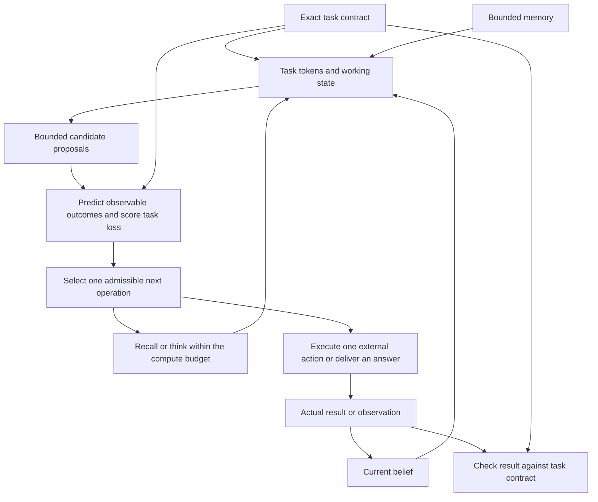

# From belief and memory to decisions

Status: design proposal requested by Alex on 9 September 2026, completed after
midnight on 10 September. This extends the
implemented [belief model](belief-model.md); it is not a claim that the new task
adapter, outcome verification or sensing planner already exists. No model changes
or training runs are part of this discussion.

The recommendation is to connect the existing task workspace and planner through
an explicit task objective, a learned predictor of task outcomes, and an external
check of the actual result. World-state meanings remain learned. A factory adapter
can expose machine operations; a document adapter can expose reading and editing.
Neither assigns fixed meanings to the model's world-state tokens.

## What is missing today

[`plan`](../pathwm/evaluation/agent.py) accepts candidate action sequences, numeric
bounds and `cost(next_state)`. It samples possible trajectories and sums that cost
at each step. The caller still supplies candidates and defines what is desirable.
The interface has no separate terminal loss, action-dependent cost or branches
conditioned on future observations.

[`TaskSession`](../pathwm/models/tasks.py) tracks output fulfillment. Its
`finished` flag and the learned completion head do not establish answer correctness
or a requested change in the external world. [`step_task`](../pathwm/models/agent.py)
can propose an action, but does not actuate an environment or inspect its result.
Those existing meanings must remain explicit during any migration.

## Task contract and learned goal

Keep a small exact objective record with the existing task request. The recipe
constructs it explicitly for the first task. General instruction interpretation
can propose a record later; a neural proposal must not silently change the caller's
resolved target, capabilities or preferences.

| Exact field | Purpose |
| --- | --- |
| Task ID and revision; requester | Identify which request a decision serves |
| Objective kind and query payload | Define the question or requested outcome |
| Temporal reference | Distinguish last observed, current, and desired future conditions |
| Allowed actions and parameter schemas | Name executable capabilities, units and deterministic bounds |
| Loss rule and cost units | State the costs of error, abstention, interaction and action |
| Budgets and termination rules | Bound thinking, actions, duration and search computation |
| Output controls and verifier version | Preserve required formats and define how results can be checked |

Validate the record before neural encoding: known objective/output schema, supported
capabilities, finite nonnegative costs, valid units and cutoff, and a usable bounded
termination path. A budget cannot authorize an unavailable capability. A verifier
identifier selects an ordinary supplied function; do not execute code serialized in
a task record. Runtime action availability is checked again immediately before use.

For historical recall, the payload is an entity identifier and a cutoff event
ordinal within a session. Use time plus ordinal where timestamps can tie. The
first slice fixes the cutoff at query creation after the distraction sequence;
it does not promise arbitrary historical snapshots of a continually changing agent.

Encode the instruction and resolved objective into learned task tokens through
the existing task path. These tokens condition memory queries, thinking, candidate
proposals and task-outcome predictions. The exact record remains available to the
executor and verifier without decoding it from latent tokens. A physical transition
receives belief, action and elapsed time; desired answers are not observations.

Changing tasks can change what the agent retrieves and proposes. For the same
physical inputs, task changes alone must not rewrite source history or make a
desired condition appear to have happened. A revised objective invalidates pending
decisions. Starting a fresh agent session discards the objective's progress and
pending decisions along with belief and memory, as already agreed.

Only semantically relevant objective fields should enter the new learned encoding.
Opaque task/session/branch IDs remain bookkeeping. Vary irrelevant absolute time
offsets and episode identities across data while preserving meaningful ordering,
elapsed time and query cutoff. Do not let a generator's IDs encode answer classes.

## A single decision path

Generated answers feed the output ledger, not the observation arrow. Actual sensor
or tool results use the existing event transaction and retain their source and
time. Thinking changes the workspace, not world time; any real elapsed time is
accounted for when the next real event arrives. The diagram describes the intended
connection, not a second controller or trainer.

An action proposal carries its kind, parameters, expected duration, task revision,
and the live state ordinal from which it was chosen. The executor checks current
capability availability and bounds, then reports the action actually executed,
duration, observations and any error. A rejected proposal is not a successful zero
action. Pure rejection need not cause a world transition; elapsed time or a partially
executed action must still be recorded. Do not execute a plan against a different
session, revised objective or superseded world observation.

Internal `think`/`recall`, external inspection/movement/editing, and terminal
answer/abstention have different execution paths. Internal operations consume a
compute budget; they do not become fictitious physical actions. Uncertain physical
preconditions are predictions. Numeric bounds and declared capabilities can be
enforced directly; a model's predicted precondition is not an execution guarantee.

## Predict outcomes; define their value explicitly

Add a small task-outcome head that reads the goal, task workspace and the appropriate
belief/memory context. For the first task it produces a categorical distribution
over the answer vocabulary. This is a learned distribution over observable task
labels, not a reinterpretation of latent-code entropy as confidence.

Keep the loss function explicit in the recipe. For answer `d` and target `y`, score
`sum_y p(y | available information, task) * loss(d, y)`. Abstention has a declared
cost and is included as a decision. There is no unconstrained scalar reward model
in the first slice and no learned long-horizon value head without a concrete need.

For example, with correct-answer loss 0, wrong-answer loss 1 and abstention loss
0.25, answer only when the best class has predicted probability greater than 0.75;
break ties in favor of abstention. These numbers are proposed benchmark preferences,
not measured calibration or universal deployment settings. A probability of 0.8
does not become a guarantee merely because a threshold is applied.

For later multi-step actions, the proposed score is:

`expected(sum of running/action costs + terminal task loss)`.

Charge terminal loss once. Time penalties belong to the explicit cost rule; use an
undiscounted bounded horizon initially. Discard deterministically invalid candidates
before scoring, include a bounded stop/abstain option, execute only the first chosen
external action, then replan from the observed result. The task recipe supplies
candidate enumeration for a small discrete task and a bounded proposal sampler for
a continuous task. Existing action heads can become proposal sources; they do not
establish the correct scoring rule.

This requires extending the planner's explicit arguments for running and terminal
costs when a multi-step consumer is implemented. Preserve its current interface for
existing callers. Historical answering itself is a horizon-zero decision and should
not be disguised as a zero-duration physical rollout.

## Delivery, prediction and verification

Track three separate facts: what was delivered, what outcome the model predicted,
and what outcome was verified. A completion logit may propose checking/stopping;
it must not produce its own verification record.

The proposed verification result is `verified`, `contradicted`, or `unknown`, tied
to task revision, candidate/output identity, verifier version and supporting source
records. Only the task's designated checker or authoritative feedback can write
that result. The checker evaluates the actual candidate and actual observations;
it cannot substitute the model's imagined outcome. Disjoint model parameters alone
would not solve this information problem.

For a document edit, a checker could read the resulting document version and check
the requested change. A tool's success status proves the call completed, not that
every semantic requirement was met. For factual recall, the offline evaluator can
check against the recorded observation sequence. That evaluator's hidden label and
full history are never given to the online policy. If no online evidence can verify
the answer, it remains delivered with verification `unknown`, even if the model is
confident. Verified success can be established later without resuming the policy
on test labels.

Unknown truth supplies no success/failure training label. It also must not quietly
disappear from evaluation: report verification coverage and unknown rates alongside
observed outcome loss, and still charge known action and compute costs. Specify how
missing evaluator records are handled before an experiment. A universal rule that
silently scores them as success, failure or zero-cost exclusions is inappropriate.
The proposed controlled historical task has complete evaluator records by design.

Abstention closes an attempt without claiming the substantive objective succeeded.
An explicit, correct factual answer of “not observed in the covered session” can
satisfy the historical task. It differs from “I cannot confidently recall.” A
deadline or exhausted budget also closes the attempt without inventing success.
Existing output-only tasks retain their fulfillment semantics; objective-bearing
tasks need the additional verification status and a versioned snapshot migration.

Memory compression may preserve only a coarse source interval. An answer based on
that representation cannot invent an exact supporting frame or event ID. Exact
citations are available only when the corresponding source reference survives;
missing citation detail and answer uncertainty should remain visible separately.

## Information gathering must allow a different next choice

For one acquisition action `a`, let `b` denote the agent's available information,
`o` a possible returned observation, and `b[a,o]` the updated private belief. Compare:

`J_now = min_d E[loss(d,Y) | b]`

`J_acquire(a) = cost(a) + E_o[min_d E[loss(d,Y) | b[a,o]]]`.

Choose acquisition only when its estimated loss is lower, within budget. For actions
that move the world, the prediction includes that transition and the objective's
time semantics; this simple expression first applies to an inspect-then-answer
task. The minimum inside the observation expectation matters: the next decision
depends on the information obtained. Belief updates and observation-conditioned
policies are established in the [POMDP formulation, sections 3.3 and 4.1](https://cs.brown.edu/courses/csci2951-k/papers/kaelbling98.pdf).
Applying that requirement to our interface is a design inference.

An illustrative two-location calculation makes the tradeoff concrete. Suppose the
belief is 60%/40%, wrong-answer loss is 1, abstention costs 0.25, and inspection
costs 0.1. The best immediate decision costs 0.25 (abstain). A perfect inspection
followed by answering costs 0.1; an uninformative inspection costs 0.35. With a
symmetric 80%-accurate sensor, updating on each possible observation and choosing
answer/abstain gives expected loss 0.29 including inspection, so abstaining now wins.
These are exact finite-model calculations, not results from the learned agent.

The bounded implementation should consider one acquisition followed by one answer
or abstention, with a finite candidate list and enumerated observation categories
for the first active task. Include unsuccessful acquisition/no usable observation
as an outcome. Continuations see only their observation-conditioned belief. They
must never see the sampled hidden target that was used to generate an observation.
When sampling replaces enumeration, avoid using one sampled hidden world as if it
were the full posterior; separate continuation selection from its outcome evaluation
to reduce optimistic selection bias.

For exact pure sensing with no cost and the option to ignore the result, information
cannot worsen the optimal expected decision loss. Net benefit after costs may be
negative; inconsistent learned probabilities or approximate search do not inherit
that guarantee. Test identical continuation inputs against different private
simulator states: the selected continuation must remain identical. An uninformative
observation is a useful control; a perfectly informative sensor would conceal some
hidden-state leaks because its legitimate output already reveals the answer.

The current prior-only planner cannot provide this path: `begin_event` intentionally
rejects imagined states. A future scratch-branch correction API must retain the
imagined origin, share real memory read-only, and prohibit live commits, marks or
verification. Do not bypass the guard by retagging a branch as observed. A small
finite observation model can first verify the decision algebra; giving it the true
kernel is an explicitly labelled diagnostic, not learned sensing capability. Learned
observation probabilities and correction need separate validation afterwards.

This adds bounded search computation, not larger persistent memory. With `C`
acquisition candidates and at most `O` outcome categories, there are at most `C*O`
posterior/continuation evaluations per decision. Process scratch branches in turn,
share the live memory snapshot, and cap candidate count, outcomes, inner retrieval
rounds and total model evaluations in the recipe. Report that compute in comparisons.

Scratch branches use `(base live event, branch ID, local step)` and simulated time;
they never consume real event ordinals. There is no branch compression or persistent
branch memory in this first sensing design. Every derived result remains hypothetical,
including after any future summarization. Deterministic invariance checks fix the
same random draws and execution mode; they do not compare unrelated stochastic runs.

Replanning after real observations is useful but does not itself assign value to a
pure sensing action ahead of time. An entropy bonus can also reward irrelevant
uncertainty reduction. We therefore propose task loss after the observation as the
criterion. Existing categorical draws sample uncertainty under one learned model;
they do not supply uncertainty over model parameters. [PETS, sections 4–5](https://proceedings.neurips.cc/paper/2018/file/3de568f8597b94bda53149c7d7f5958c-Paper.pdf)
distinguishes probabilistic predictions from model-ensemble uncertainty. It supports
that distinction, not a claim that this agent has PETS' calibration or capabilities.

Recall is computation over retained information. More attention rounds may improve
access for an approximate neural reader, but do not supply new external evidence.
Start the historical task with two fixed task-conditioned retrieval/thinking rounds
and then choose answer or abstain. This is a proposed compute default. Learning
whether another round is worth its cost is a later measured extension; confidence
increasing after self-reflection is insufficient supervision for it.

## First complete implementation slice

Use the previously discussed delayed historical task: observe item placements and
visible moves, process distractors beyond recent-memory capacity, then answer where
an item was last observed at the query cutoff. A hidden move does not change that
label. The output vocabulary contains locations and `not_observed_in_session` for
an entity absent from a declared complete delivered-observation history. The latter
does not claim the entity never existed. Operational `abstain` is a separate choice.

The agent gets only delivered observations, the query and bounded state/memory.
The training/evaluation harness owns a complete log of delivered input records to
derive labels; the policy cannot access that log. This is not an additional online
archive, and labels must never be reconstructed from the compressed memory being
evaluated. Include never-observed entities, visible later moves,
unseen moves and histories where the relevant record reaches consolidation.
Generate the query after the history so ordinary retention cannot rely on knowing
the future requested entity. Explicit user marks remain an intentionally separate
condition because they do reveal a retention preference.

Train the outcome head and relevant state/memory consumers against observed-history
labels, alongside the existing world objectives. No imagined success supplies a
ground-truth label. Initially use a transparent bounded operation schedule; evaluate
the existing learned operation policy separately before letting it control the loop.
Reported recall must distinguish full-agent access from a memory-only diagnostic,
because the current recurrent state may itself retain the target. No fixed memory
size or compression loss guarantees useful retention.

Implementation would add a small objective/verification record beside existing
task records, a task-outcome consumer, and a dataset/label path in the same editable
recipe. Reuse training, resume and local reporting. It does not require a new
trainer, an external runtime LLM, bigger memory or selective reset controls.

Before code, declare essential causal/status checks, a bounded development budget,
and a scientific comparison separately. Check that hidden labels cannot affect
inference, post-cutoff observations cannot become historical labels, `finish` cannot
self-verify, generated branches cannot commit, and wrong/missing evidence remains
distinguishable. Later comparisons should report answer accuracy, abstention and
coverage, task loss, observable probability calibration, latency and actual memory
occupancy under matched populations and budgets. No pass thresholds or training
budget are authorized by this design document.

## Recommendation and remaining decisions

Proceed first with historical recall, explicit abstention cost and independent
result verification. That supplies a concrete answer to how memory influences a
useful decision without changing the world-model semantics. Then add a separate
current-location inspect-then-answer task to exercise sensing; it must specify
whether objects can move during the inspection and what the sensor can observe.
Looking at the world now is not a historical-record API.

For that first active task, propose stationary objects between query and answer and
a declared finite observation kernel. Its target is current location at answer
time, derived from the evaluator's environment state. An inspection supplies evidence
about that target; it does not define the truth by itself. The historical target
continues to use the last delivered observation at or before its fixed cutoff.
Moving objects during inspection are a later dynamics variant, not an implicit
assumption. The policy's currently available observations and the target's reference
time are separate fields even when they happen to coincide.

The follow-up [selective-recall contract](recall-task-design.md) works out the initial
defaults: wrong=1, abstain=0.25, two retrieval rounds and no external acquisition.
It specifies factual labels, complete session replay, independent calibration and
metrics that distinguish old-location recall from recognizing unseen entities.
These are research defaults; application-specific costs remain caller-owned.
The next step is an implementation budget for that concrete path. Broader
language-to-objective interpretation, learned stopping, model-error estimation and
deeper contingent planning remain later extensions with distinct evidence requirements.

## Claude review record

Two actual isolated Claude CLI exchanges completed: `decision-interface` and
`decision-interface-reconcile`. Independent notes preceded reading each response.
Only abstract concepts were exported, with no private source, measurements or
dimensions. The review did not inspect implementation. Exact briefs, replies and
execution receipts are under
`runs/reviews/state_memory_design_2026-09-09/decision-interface*`.

Adopted suggestions: an independently retained evaluation log, contract validation,
environment-owned event ordering, unknown verification status, and a finite sensing
diagnostic. Claude explicitly withdrew demands for mandatory proposer/predictor
parameter separation or stop-gradient, mandatory masking of unverifiable outcomes,
conflation of factual not-observed with abstention, the claim that predicted planning
scores necessarily favor early emission, and a guaranteed degradation from leaking
hidden state into a perfectly informative sensing example. Shared task encoding is
compatible with an independent evidence-based verifier; parameter sharing is an
empirical error-correlation question.

Remaining review concerns are handled by explicit target versus availability times,
static objects in the first active task, fixed random draws for structural checks,
separate branch-local ordering, and metadata controls. Verification failure caused
by the agent itself would require an explicitly declared task policy; coverage
reporting alone cannot remove that incentive. The proposed first task has an
always-available offline checker and no agent action that can disable its log.
General external tasks still need that failure policy specified in their contract.

Selection can magnify predictor errors, so later evaluation should compare predicted
and realized loss for chosen decisions and fixed reference decisions. Evaluate
unselected alternatives only where the environment or retained dataset actually
supports their outcomes; do not invent counterfactual feedback from real executions.
Primary-source checks support the belief-policy and model-uncertainty distinctions
cited above. The illustrative sensing arithmetic was checked with exact fractions.
Peer agreement and arithmetic checks do not establish learned capability.
