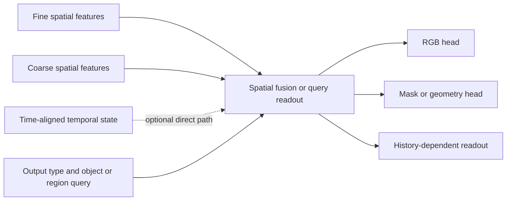

# Multiscale decoder inputs, temporal state and output conditioning

8 September 2026. Design clarification following the
[requirements-first review](requirements-first-perception-design-2026-09-08.md).
The user asks whether decoding should consume fine and coarse features, internal
state and task/output conditioning, and how convolution and transformers fit
these requirements. No model, training, inference evaluation or frozen protocol
was changed in this turn.

**Recommendation:** keep spatial features at useful scales accessible to output
modules. Permit a direct temporal-state input for outputs that benefit from
history. Make requested output semantics explicit, using separate heads first or
conditional shared decoding when justified. Convolution versus attention, spatial
resolution, temporal evidence and output type are separate design decisions.

## What is already implemented

The shared [Decoder](../world_model/paddle/models.py) already reads both exported
scales through `ObservationLatent`: fine 16×16×64 and coarse 8×8×64. It upsamples
coarse to 16×16, concatenates the maps, then applies ordinary convolutions and
nearest upsampling to reconstruct RGB64. There is no direct memory or task input.
PushT imports this decoder from the paddle module.

The [Predictor](../world_model/paddle/models.py) already reads both scales, memory
and a candidate action. It produces predicted fine/coarse features. The
[rollout](../world_model/paddle/rollout.py) then updates memory from that predicted
observation and action. Consequently the current decoder can already receive
history-dependent predictions indirectly. Giving D a direct memory input is an
additional path, not the first introduction of history into future decoding.

Encoder cross-scale attention and decoder multiscale fusion are different
operations: the former changes features before downstream prediction/readout;
the latter combines features to produce an output. Their benefits must be
measured separately. A visually unusual coarse PCA does not decide either one.

## Convolution and attention are not spatial/semantic compartments

Ordinary convolution applies shared learned kernels over local neighborhoods.
Stacking layers, larger kernels and downsampling expand the receptive field.
This supplies a useful spatial bias and can learn high-level concepts as well as
edges or textures. Stride-one translation equivariance has boundary assumptions;
striding, padding and absolute positions mean exact arbitrary-shift equivariance
should not be assumed for a complete network.

Attention uses input-dependent weights to combine tokens within the allowed
connectivity pattern. A global layer can connect distant locations directly;
windowed attention has a restricted pattern. Spatial positions or other spatial
structure remain relevant. A transformer can learn boundaries and coordinates;
attention does not guarantee object semantics, identity or reasoning.

[ConvNeXt](https://arxiv.org/abs/2201.03545) demonstrates classification and dense
prediction with convolutional models, while
[Swin](https://arxiv.org/abs/2103.14030) demonstrates hierarchical windowed
transformers for classification, detection and segmentation. These are direct
counterexamples to assigning semantics exclusively to transformers or spatial
reasoning exclusively to CNNs. They do not establish the better family for our
data or budget.

Fine/coarse describes grid resolution. Context and semantic content also depend
on processing and training: a fine feature can already have global context, and
a coarse feature can contain geometric detail. [FPN](https://arxiv.org/abs/1612.03144)
uses top-down and lateral connections to enrich multiple resolutions. The
decoder should be allowed to use relevant levels; no learned scale is guaranteed
to correspond to a named conceptual level.

## A concrete output interface

Conceptually, `output = readout(fine, coarse, optional_memory, output_query)`.
This is a family of typed outputs, not one fixed tensor expected to represent
RGB, a mask, velocity and an executable action interchangeably.

| Requested output | Inputs and interpretation |
|---|---|
| Current visible RGB | Current fine/coarse features; direct memory is an optional measured addition |
| Visible mask or extent | Current spatial features and object definition; matching and coordinates must be explicit |
| Velocity, hidden-object estimate or remembered UI selection | History-bearing state, plus current evidence and a defined query where useful |
| Future RGB or mask | Features/state from the requested causal rollout time; not target future observations |
| Next action or generated artifact | A policy/generator reads available state and goal under its own action/output contract |

An object's estimated hidden position and its visible mask are different targets.
Current RGB should render its occluder. A belief readout may estimate the object
behind it with uncertainty. Direct memory is useful when required evidence is
otherwise inaccessible, but the history may already be in a predicted feature or
temporally conditioned encoder. We should test the additional input path rather
than assume it is always needed.

Temporal evidence is needed to distinguish states differing only in unobserved
history. It is not a theorem that every prediction requires recurrent memory:
some systems are fully observed, and a less-informed conditional distribution can
still be valid. Stacked observations and explicit telemetry can also supply
missing state. The relevant requirement is information availability, not a
particular recurrent module.

For every belief target, declare the supervision and verification source:
instrumented simulator/UI state, suitable labels or multiple views, or specified
delayed observable outcomes and horizon. Reappearance can supervise useful
memory, but observationally indistinguishable hidden explanations are not made
identifiable by a decoder. Static COCO alone cannot train motion or persistence.

## Where the conditioning belongs

- **Output type/object/region:** selects what to read or render. Separate heads
  already encode type in their identity. A shared decoder can receive a learned
  task/query input. One unchanged output branch cannot select two conflicting
  target definitions from identical inputs without a distinguishing input;
  separate heads can validly emit both at once.
- **Goal:** normally conditions action selection or generation. It need not
  rewrite the observed physical state when the requested action changes.
- **Action and elapsed time:** determine which transition to predict. A
  reconstruction/prediction label alone is not a substitute for dynamics.
- **Domain/view convention:** may specify observation or rendering differences.
  COCO and PushT both request RGB reconstruction, so an RGB output tag does not
  by itself solve their measured retention tradeoff.

These are functional roles. One network can implement more than one role if its
inputs, outputs and causal timing are explicit. A selected conditional route
still requires training data/losses for its intended output; conditioning does
not preserve an old domain whose behavior is no longer trained or protected.

## Mix mechanisms according to the missing capability

For dense RGB/masks, begin with per-scale projections, spatial resizing and
concatenation/addition followed by convolutions. This preserves a cheap local
output route. For object-, region- or history-dependent reads, output queries can
cross-attend to spatially indexed features and projected memory tokens, with
level/role/time metadata. Separate output projections preserve distinct value
types. [Perceiver IO](https://arxiv.org/abs/2107.14795) supports the query mechanism;
it does not supply arbitrary untrained output semantics.

If context only needs to modulate a convolutional decoder, feature-wise scale
and bias conditioned on task/memory is a simpler control than a full attention
decoder. This is the mechanism in [FiLM](https://arxiv.org/abs/1709.07871). A gate
or FiLM path is an architectural option, not guaranteed protection against
forgetting or a guarantee the model uses memory correctly.

A small custom hybrid could apply local convolutional processing at high
resolution, content-dependent mixing where token count is affordable, then
coarse-to-fine context fusion. [CoAtNet](https://arxiv.org/abs/2106.04803) supports
combining the two families, but its classification results do not validate this
world-model proposal. This remains an alternative to the earlier pretrained-ViT
candidate; it is not a reason to discard pretraining or change every component.

Fine skip features can improve current reconstruction. Every feature used for
future decoding must also be available at rollout time: predicted features or
declared causal past appearance are valid possibilities. Target future features
or memory updated with actual future observations would change the prediction
question. A model that copies old object pixels can look good on static
backgrounds while predicting motion incorrectly. Exact source timestep and
observed-versus-imagined memory must therefore be part of each decoder contract.

The training signal must exercise each intended capability. Static multiscale
reconstruction does not require a useful recurrent state; a powerful fine path
may let the decoder ignore coarse features or memory. Conversely, strong memory
conditioning may let reconstruction tolerate impoverished spatial features.
Specify which losses update E/D/U/P and measure needed outputs and action
outcomes. Entropy or an appealing reconstruction is not that measurement.

## Bounded follow-up choices

Reuse the current fine-plus-coarse decoder as an existing reference. Freeze a
candidate encoder before comparing readout fusion, so encoder changes do not
obscure the question. Add either direct memory on a genuinely history-dependent
target or conditional sharing for two named outputs as a separate intervention.
For a perception-only first slice, RGB and visible foreground segmentation are
already concrete outputs; instance extent or amodal shape needs additional
target/matching work. A velocity or delayed-reappearance slice requires sequence
data and its declared supervision.

Use matched valid histories with the same current image to test whether history
changes the required answer. Complement reset/shuffle interventions with a
trained no-memory control; corrupted memory alone can be out of distribution.
Evaluate predicted-state decoding as well as observed-state decoding. Predeclare
budgets, validation selection and application-relevant pass rules before running.
No such protocol or additional run is authorized or launched by this discussion.

## Claude review record

A focused public-only follow-up and correction were sent through the adopted
CLI workflow after ListAgents found no reachable Claude agent. Exact artifacts
are `runs/requirements_first_perception_2026-09-08/collaboration/multiscale_conditioning_*`.
The reviewer did not receive local code, results or datasets. Codex verified the
current decoder and recurrence locally and checked the primary sources above.

Claude's useful addition was to require a target/verification source for belief
outputs and explicit source timesteps for decoding. Its first response overstated
memory necessity, convolution equivariance, the lack of context in fine features
and mandatory learned task conditioning. Codex challenged those claims: history
can reach D through P; fully observed prediction exists; fine features may already
have context; separate typed heads can emit different outputs without a task
token. These are design distinctions, not experimental findings.

The reconciliation explicitly accepts all five corrections and withdraws the
claimed conceptual error about optional direct decoder memory. Both calls finish
successfully, with no permission denials. Their receipt cost fields sum to
$0.36825425 API-equivalent cost, not a subscription bill. No remaining peer
disagreement requires another exchange; the proposed usefulness of the new paths
remains an empirical question.
