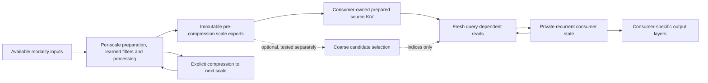

# DeepSeek V4.1: engineering transfers to PATH-WM

18 September 2026. Local source audited at `0700a68`. This is a concrete design
proposal requested by Alex, not an implemented architecture or a learning result.
It extends the [multiscale modality design](multiscale-modality-design.md), including
the accepted pre-compression exports and conditional preference for invertibility.

Alex subsequently adopted the abstract principles as standing guidance for all
future model design. The [workflow](experiment-workflow.md#standing-design-principles)
requires actively considering and integrating relevant ideas, with explicit
trade-offs and checks. Particular mechanisms below remain proposals until selected
and evaluated; the workflow commitment does not establish their empirical benefit.

**Recommendation:** organize the next design around reusable evidence, private
consumer computation, and explicit costs for reading and retaining information.
Start engineering with repeated fixed-context projections. Start capability work
with independently verifiable tasks. Sparse reading, learned sharing and reduced
precision are subsequent comparisons, each with its own control.

## Source and interpretation

Read: [DeepSeek-V4.1-Flash: Pushing the Limits of KV Cache Compression](https://huggingface.co/deepseek-ai/DeepSeek-V4.1-Flash/resolve/main/DeepSeek_V41_Tech_Report.pdf),
51 pages, September 2026. The official file's Xet hash matches Alex's signed link;
downloaded PDF SHA-256 is
`ba68e2e40408125ae6d2f63a9a241b61c73910691c74ec1a2a7023c851eac08d`.
Paper references below use printed PDF pages. The PDF, extraction, inspected
architecture/effort figures and review receipts are retained locally in
`runs/reviews/deepseek-v41-20260918/`.

The report combines architecture, precision, serving, data and training changes.
Its whole-model benchmarks do not isolate the contribution of every component.
Reported speed/cache ratios are properties of its workload and implementation;
they are not predictions for our small model. Its own limitations discuss sparse
selection errors and approximate replay boundaries (§6, p37).

## Abstract principles behind the mechanisms

Follow-up explanation requested by Alex. These are our abstractions of the
mechanisms, not additional claims that the report proves or new adopted changes.
The common question is: **what should be represented, retained, recomputed,
selected, approximated or checked for this particular computation?**

| Mechanism | Abstract idea | Distinction that matters |
| --- | --- | --- |
| CED | Separate preparing information from using it. Pay for a reusable source representation once, then spend task-dependent computation on queries and outputs. | Consumers can share the source while keeping their own projections and local processing. |
| CSA2 K/V and index reuse | Reuse the invariant part and refresh the changing part. Source representation, matching query and selected addresses are different objects. | Stable source K/V do not imply a stable set of relevant positions. Reusing existing identical computation differs from learning to share formerly different computation. |
| Local/global attention and multiscale features | Represent context at several resolutions: broad coverage cheaply, detailed access where needed. | A coarse summary is not a substitute for all fine evidence; keeping fine evidence and reading it are separate costs. |
| Hierarchical sparse indexing | Make selection in stages. An initial search creates a candidate set, and later computation concentrates on that set. | It amortizes later search, not the initial full scan. An excluded candidate cannot be recovered by reranking only the shortlist. |
| Grouping, pixel-unshuffle, geometry-aware positions | Change the organization of information before deciding what to discard; make location and neighborhood relations explicit. | Fewer positions with wider vectors can preserve the same values. A subsequent reducing projection is a separate information loss. Geometry awareness alone does not guarantee arbitrary-resolution accuracy. |
| Persistent/transient cache separation | Match retention to reuse, reconstruction cost and ownership. Different kinds of state deserve different lifetimes. | Committed evidence, exact restart state and expendable intermediate results have different obligations. |
| Bounded replay | Trade storage for recomputation, and possibly exactness for less recomputation. Recover recent working intermediates from a retained basis. | A shorter replay can only approximate a state whose dependencies extend outside that replay. Deleting the only copy of evidence is a different operation. |
| Multi-stream mHC | Keep several paths for information and learn how computation reads, mixes and updates them. | Multiple streams do not automatically acquire distinct semantics or guarantee an inverse. |
| Single-pass mHC and kernel fusion | Organize dependencies so one visit to memory can serve several operations. Sometimes a small architectural relaxation enables a much cheaper execution schedule. | Moving fewer bytes can matter as much as doing fewer arithmetic operations. The coefficient shift is a model change that needs evaluation. |
| Engram | Separate familiar-pattern lookup from contextual computation. Let stored learned associations handle recurring patterns while computation handles relationships and exceptions. | A learned pattern table is parametric knowledge; an episode store records particular occurrences with provenance. |
| MoE and modality-specific balancing | Separate total capacity from work per input by selecting specialists; inspect resource use within meaningful populations. | Balanced aggregate traffic can hide modality-specific imbalance. Balanced traffic is not equal accuracy or equal training influence. |
| FP4 and selective precision | Spend numerical precision according to sensitivity, treating bits and data movement as limited resources. | Rounding a key can alter a ranking; rounding a value can alter the returned content. Low tensor error need not mean unchanged decisions. |
| DSpark | Separate proposing from checking. A cheap proposal can be useful even when it is imperfect if a stronger checker can accept or correct it efficiently. | Acceptance under a target decoder concerns that decoder's output behavior; it does not establish truth or environmental success. |
| Effort conditioning | Learn how much computation to spend given a requested resource preference. Treat additional reasoning as an action with a cost and an uncertain benefit. | A preference signal is not a hard cap; more computation need not improve the result. |
| DAG latency accounting | Distinguish total work from the sequential dependencies that determine completion time. | Parallel execution may shorten the critical path while increasing total resource consumption. |
| Training-aware restrictions | Optimize the system under the conditions in which it will actually run. Restrictions and approximations are part of the learned problem. | Adaptation can reduce train/deploy mismatch, but cannot guarantee recovery of information excluded by the design. |
| Verified task/environment construction | Improve learning by making tasks informative and success independently checkable. Separate the learner, task generator and evaluator's roles. | Producing more examples is not the same as producing more independent information; inspected failures and fresh generalization tests differ. |
| Head-wise Muon and Sinkhorn-balanced updates | Let update geometry reflect the structure of the parameters: heads, rows and columns have different roles and scales. | This is a proposal about conditioning learning, not a claim that one optimizer dominates everywhere. |
| Distributed encoding, shared-state ownership and asynchronous rollouts | Separate workloads with different execution/lifetime needs; overlap independent work and make ownership, dependencies and version changes explicit. | Concurrency can bias which samples finish first and can mix policy versions. Throughput and learning distribution must both be accounted for. |
| Heterogeneous-teacher distillation | Transfer useful behavior through observable outputs instead of requiring compatible internal coordinates. | Agreement with teachers is a learning signal, not independent evidence of truth; it differs from averaging or decomposing weights. |

These mechanisms act on different budgets: representational capacity, retained
information, accessible information, numerical fidelity, arithmetic work, memory
traffic and sequential latency. Improvement in one budget can worsen another.
This is why the proposal keeps exact reuse, learned sharing, selective access and
lossy approximation as separate decisions.

## Where each idea fits

| Report idea and source | Proposed PATH-WM application | Priority and boundary |
| --- | --- | --- |
| Causal Encoder–Decoder, §2.2, p9: derive decoder global K/V from encoder output | Shared multiscale source bank, then private consumer loops. Prepare fixed source reads once per consumer invocation. | **Core design fit.** This is a functional analogy; our recurrent belief is not the report's text prefix. Keep observation updates mandatory. |
| CSA2 K/V reuse separated from index reuse, §2.3.1, pp10–11 | Reuse identical source projections within one loop; later compare projection sharing across blocks independently of sparse-selection refresh. | **First engineering slice.** Identical projections can be reused without changing the mathematical model. Sharing previously different projections changes it. |
| Local attention plus compressed global context, §§2.2–2.3, pp9–11 | Fine/local reads for detail, coarse/global reads for broad context, using the already requested scale exports. | **Strong fit for larger inputs.** Keep available fine evidence and source identity; do not replace all scales with a pooled vector. |
| Hierarchical sparse indexer, §2.3.2, pp11–12 | Query-specific candidate regions or memory records, followed by consumer-specific reranking. | **After dense reference.** Measure missed evidence; include full-search recovery. The report's first indexer still scans the full range. |
| Separate persistent and transient cache lifetimes, §3.2.1, p19 | Distinguish committed records/checkpoints, encoded source features, consumer K/V and private workspaces. | **Adopt in design.** Retention follows semantic ownership and measured reuse, not a single cache policy. |
| SWA bounded replay, §3.2.2, p20 | Optional approximation for disposable, reconstructible reader state if a future streaming reader needs it. | **Low priority.** Never substitute it for exact event history, belief restart or optimizer/RNG restoration. |
| Grouping before projection and variable geometry, §2.1.1, p8 | Reversible modality preparation, geometry-aware position handling, explicit compression. Compare 2D-RoPE for future spatial readers. | **Compatible with current direction.** Pixel-unshuffle preserves values; the subsequent reducing projection does not. It is not a learnable filter bank by itself. |
| Single-Pass mHC, §2.4.1, pp12–13 | Optional multiple latent streams inside a consumer, with learned mixing, if single-stream processing is a demonstrated bottleneck. | **Later experiment.** Mixing stability is not invertibility; do not replace the chosen coupling construction with mHC. |
| Engram, §2.4.2, p13 | Small learned lookup for recurring byte/event patterns or reusable parametric associations. | **Later, task-specific.** Learned associations supply priors; they do not become episode evidence or World State records. |
| FP4 main K/V with QAT, §2.4.4, p14 | Quantize expendable projected caches first, starting with a simpler supported precision; measure real allocated bytes and task effects. | **Only after a memory bottleneck.** Preserve higher precision for sensitive state and routing where needed. |
| DSpark, §2.4.3, pp13–14 | Potential future acceleration of sufficiently long native text output. A broader cheap-proposal/expensive-check pattern may inform candidate planning. | **Defer.** Text distribution verification and real-world action correctness are different contracts. Current short byte outputs give weak amortization. |
| Modality-specific MoE balancing, §2.1.1, p8 | Monitor per-modality/task exposure and gradient influence now; if experts become useful, balance routes within each modality. | **Diagnostics now; MoE later.** Expert load balancing does not establish equal task benefit. |
| Structured optimizers and memory-traffic-aware implementation, §§2.5, 3.1–3.2, pp14–19 | Profile whole consumer calls and source processing; compare optimizer families separately if optimization is limiting. | **Profile now.** No giant tables, custom kernels or optimizer stack without a measured consumer. |
| Verifiable tasks/environments and failure reuse, §§5.1.1–5.1.2, pp25–27 | Improve existing controlled multimodal tasks and independent validators; vary requests, scenes and observation conditions. | **First capability priority.** Fresh compositions and preserved tasks matter more than fitting inspected failure templates. |
| Effort conditioning and DAG latency cost, §§5.1.4, 5.3.5, pp29–30, 36 | Train a bounded policy over think/read/imagine/output work; price the critical path of a future action DAG. | **After fixed budgets help.** More effort does not guarantee more accuracy; keep a hard external resource cap. |
| Asynchronous rollout state and heterogeneous distillation, §5.2, pp30–32 | Record policy/teacher/data identity if future recipes use asynchronous or specialist-generated targets. | **Future scale lesson.** No scheduler platform or model merging is required now. Output distillation is distinct from the earlier PCA-of-weights proposal. |

## The proposed architecture

Preserve the user's per-scale sequence: reversible preparation → learnable filter
bank → post-processing → export, with explicit compression feeding the next scale.
The report strengthens the case for distinguishing three budgets: what is
**retained**, what a consumer **reads**, and what computation is **repeated**.



This drawing is a proposal. Source values remain shared; each consumer initially
owns its projection weights, query state and output layers. Sharing source features
does not force image generation, belief updating and factual readout to use the
same K/V projection. Dense spatial outputs may require many local queries; do not
force them through a few global tokens. A proposed sparse read must respect the
consumer's permitted information route, including observation versus imagination.

Within consumer `j`, a useful separation is:

```text
(K_j, V_j) = prepare_j(F, source metadata)       # once for this invocation
q_j^k     = query_j(h_j^k, request_j)            # changes with iteration
read_j^k  = attend(q_j^k, K_j, V_j, mask_j^k)    # fresh attention each iteration
h_j^(k+1) = update_j(h_j^k, read_j^k)
```

The availability mask may depend on the query even when K/V do not. Source features
must carry modality, scale, geometry, support/availability, validity and provenance.
Conditioned features also depend on the conditioning state/version. Our current
encoders include conditioned processing: a cached feature is not reusable solely
because the underlying pixels are unchanged. Keep the independent source-evidence
route intact; inferred or generated content cannot acquire observation status.

For `K` loop iterations, `N` source tokens and width `d`, preparing equal-width
K/V once removes roughly `(K−1)` repetitions of their `O(N d²)` projection work.
It leaves query projection, attention scores/value aggregation and MLP work.
Retained projections cost memory, and small kernels may run faster without a more
fragmented path. Measure setup and all reads together. This gives no automatic
twofold speedup and does not shrink the retained feature bank.

## First engineering application: fixed-context projection reuse

The best isolated location is
[`RecurrentOutputAdapter.forward`](../pathwm/models/readout.py): `source` stays
fixed while `self.cross(local, source)` repeats. `self.local(local, local)` changes
on every iteration and cannot use the same cache. The common
[`Attend`](../pathwm/models/modalities.py) currently normalizes and projects the
context inside each call through `nn.MultiheadAttention`.

Proposed small interface: `prepare_context(...)` plus `read_prepared(...)`, or an
equivalently small internal helper, scoped to one forward call. Preserve the
existing `forward` and checkpoint parameter layout. Do not create a global cache
manager or another experiment framework.

The preparation must retain autograd links to source, normalization and projection
parameters. All reader uses contribute gradients to the shared preparation. No
detach, serialization or cross-update reuse during joint training. Exact algebra
does not guarantee bitwise equality after changing kernels/reduction order;
floating-point tolerances and discrete-output checks must be declared beforehand.

Other placements need distinct treatment:

- **Text output:** `TextDecoder.generate` repeatedly reads fixed `tokens`, so its
  source-side projections are another candidate. The growing text prefix has its
  own causal caching problem. Keep these changes separate; earlier last-position
  slicing failed our primary CUDA speed gate.
- **Thinker:** `MultimodalAgent.think` builds context from `state.tokens`, recalled
  memory, goal and feedback. Working tokens and recalled outputs change with the
  query. Caching the complete context would be wrong. A later refactor can prepare
  only an explicitly invariant source partition.
- **Session memory:** `MemoryRead` adds view labels and time-dependent age features.
  Prepared reads are keyed by the actual snapshot, reader, masks and reference
  time. Even unchanged stored tensors produce different context as time advances.
- **Hierarchy blocks:** current `ScaleProcessor` blocks have different parameters
  and changing inputs. Cross-layer K/V sharing there is a learned architecture
  variant, not an exact optimization of current code.

Reuse is invalidated by source/condition changes, model updates, reader changes,
geometry/position or validity changes, dtype/device changes, and query-dependent
operations included in the preparation. A function-local lifetime avoids most
invalidation machinery. Trace mode must continue to describe the actual read.

## Second application: selective access without deleting fine evidence

For large image/video/audio inputs, compare a local/fine branch with a coarse/global
branch before adding a learned indexer. Our existing
[`FeaturePyramid`](../pathwm/models/multiscale.py) is a natural source interface,
but the complete newly specified invertible filter hierarchy is still a proposal.

Later, a consumer may select coarse regions, retrieve their fine descendants and
rerank them with its current query. That is an adaptation, not the report's exact
algorithm: its first indexer scans positions and selects blocks by maximum score.
Learned coarse summaries could discard the very small feature a downstream task
needs. Keep rare detail, temporal order and distant evidence in the evaluation.

Separate three comparisons: full dense access; fresh selection at every iteration;
and a shared candidate pool with reranking. A fourth, reused final selection, adds
a stronger approximation. Refresh or expand a pool when the query changes; a
confidence trigger is itself unvalidated. Include an unconditional scheduled
full-search control so confident omissions remain discoverable.

For World State, implement any candidate retriever behind the existing callable
boundary and retain [`ExactRetriever`](../pathwm/world_state/retrieval.py) as the
reference. Pin the same revision and causal cutoff before comparing. Preserve
canonical IDs, source links, role filters and explicit omitted counts. Missing a
candidate cannot establish that an event never occurred.

If a restriction is retained, train with the same restriction and measure both
restricted and dense evaluation. This follows the report's training-aware
candidate restriction, replay adaptation and cache quantization. Compare exact
training/exact evaluation, exact training/restricted evaluation, and restricted
training/restricted evaluation; also check restricted training/exact evaluation
for regressions. Keep data, seeds and budgets matched. Training adaptation can
reduce a mismatch; it does not restore evidence that the chosen read never sees.

Important limit: a raw detail already discarded from our compressed history cannot
be recovered by better indexing. Fine-region retrieval is available only where
fine evidence was actually retained, within its declared capacity.

## Third application: storage ownership and numerical precision

Use distinct lifetimes without importing a distributed serving stack:

| Object | Owner and lifetime | Permitted reconstruction |
| --- | --- | --- |
| Source/committed events and World State revisions | Existing bounded storage and provenance contracts | Never replace an exact record with an unlabelled neural approximation |
| Belief/session checkpoint and training state | Existing resume contract | Restore required state exactly within the documented replay scope |
| Multiscale features | Source + encoder/condition identity | Recompute only if the original source, weights and preprocessing remain available |
| Prepared K/V and candidate indices | One reader invocation initially | Recompute on expiry; indices also depend on the query/search policy |
| Private consumer workspace | Explicit call/task/branch | Reset or restore according to that consumer's declared semantics |

DeepSeek's bounded SWA replay deliberately changes reconstructed states and can
make later states depend on the cache-hit position (p20). A recurrent world belief
has no general finite-window reconstruction guarantee. Apply exact caching and
recomputation first. An approximate serving mode would need separate acceptance
criteria and must not pass as exact training/session restart.

Likewise, start precision experiments on derived K/V, not event IDs, timestamps,
canonical relationships, source metadata or invertible scale exports. Cache
quantization affects both answers and candidate ranking. Measure ranking changes,
rare-evidence recall, calibration where relevant, long-rollout drift, dequantization
cost and packed bytes including scales. A fake-quantized FP32 tensor alone saves
no storage. The report retains more precision for sensitive local caches; it is
not evidence that every state tolerates FP4.

## Capability work and later ideas

The task/environment lesson fits our present limitations especially well. Extend
the existing understanding/readout recipes with tasks whose answer is independently
derivable from source events. Separate content access, request interpretation,
termination, reconstruction and control metrics. Keep causal interventions,
source omission/swaps, counterfactual requests and pass-to-pass preservation checks.
Split at source/episode and composition level; repeated templates are not fresh
generalization. Improve validators and data before introducing RL infrastructure.

Budget conditioning could eventually let a consumer choose additional reads or
think steps. First test fixed `1/2/4` loops at equal task exposure, and compare
against ordinary extra depth and the existing native readout. Previous recurrent
adapter results did not establish useful overall capability. Train on the actual
allowed budgets before claiming interpolation. Penalize measured calls/latency or
work, not merely output length; retain independent correctness and hard caps.
The report's Appendix B.2 and Figure 11 (pp48–49) explicitly show accuracy dips as
effort rises across scaffolds, despite longer outputs.

The report's effort-conditioned RL recipe centers advantages within each
problem/effort group and varies the cost penalty with effort. Supervised training
across several loop budgets is a separate adaptation; it should not be described
as reproducing that RL recipe.

For future planning, a critical-path cost on the proposed action DAG could capture
parallel tool or simulation work better than a sum of step counts. Keep total
compute as a separate constraint: parallel work can reduce latency while consuming
more resources. World-model agreement only verifies agreement with that model;
external outcomes still require observation and task-specific checks.

mHC merits a controlled consumer-side comparison if we find interference between
latent streams. It does not prove a common/private semantic decomposition and
offers no general inverse. Engram merits a tiny comparison on recurring discrete
patterns, with unseen compositions, collisions and conflict-with-evidence tests.
It is parametric knowledge, separate from episodic memory. Specialist distillation
may later transfer useful outputs without requiring aligned weight coordinates;
it does not establish that independently trained specialists can be merged by PCA.

Profile actual work before importing head-wise Muon, Sinkhorn-balanced table
updates, distributed encoder execution or fused kernels. One particularly local
engineering issue is `pool_scale`'s dense membership matrix: its own documentation
limits it to tiny inputs. A reshape/scatter reduction could preserve pooling
semantics for larger inputs; it needs its own numerical and resource comparison,
independent of attention sparsity or filter-bank learning.

## Proposed sequence and acceptance

1. **Exact engineering comparison:** fixed-context K/V preparation in the existing
   recurrent adapter. No fit is necessary to check algebra and cost. Use nonzero
   adapter gains and actual loop counts so the zero-initialized bypass cannot hide
   errors. Verify outputs, source/parameter gradients, masks/NaNs, trace behavior,
   model serialization and existing resume paths. Benchmark full calls including
   preparation; report CPU/GPU, bytes and latency separately. Declare the primary
   workload, tolerances and minimum useful speed/byte gain before implementation.
2. **Dense multiscale consumer reference:** select concrete tasks and budgets under
   the accepted filter-bank design. Compare preservation/quality with the already
   documented unconstrained control. Test per-task outcomes, not only aggregate
   loss. This remains the prerequisite for interpreting sparse-access quality.
3. **One approximation at a time:** local/global access, then candidate restriction,
   then selection reuse or precision. Use matched populations, initialization,
   seeds, parameter/compute accounting and frozen gates. Failures keep the dense
   reference and original evidence available.
4. **Budget policy only after useful fixed computation:** evaluate cost–quality
   curves, forced-stop correctness and held-out tasks. More elaborate memory,
   routing or speculative generation follows a measured bottleneck.

Concrete tasks, numerical noninferiority margins and training budgets for the new
filter hierarchy are still open. This proposal runs no training, changes no model
defaults and makes no empirical speed or capability claim. Each eventual slice
belongs in an existing readable recipe with its normal raw metrics, checkpoint
where applicable and standalone report.

## Claude discussion and evidence status

Independent public-methods review and reconciliation are recorded with exact
briefs, responses and execution receipts under `runs/reviews/deepseek-v41-20260918/`.
The local implementation mapping above is our code audit; private code and
measurements are not part of the external brief. Peer review cannot validate a
transfer or authorize an experimental budget.

Claude initially rejected most mechanisms as specific to very large models. After
the technical exchange, it explicitly accepted these corrections:

- Intra-forward K/V reuse also works in training with intact autograd; it does not
  require truncated backpropagation. Numerical equivalence still needs checking.
- Bounded recurrent state and few parameters do not imply a small external source
  bank. Source length, query count and repeated reads determine the opportunity.
- The report does not prove SWA contraction. Replay quality is an empirical claim.
- Block-max pooling does not inherently discard an isolated top-scoring position
  under the same first-indexer scores when enough blocks are retained, up to ties.
  Later query changes and upstream compression/scoring can still exclude evidence.
- Main K/V quantization affects attention scoring as well as values. Routing
  agreement and task-relevant evidence recall need separate measurements.
- Independent task verification transfers without large RL infrastructure. Budget
  policies should follow demonstrated fixed-depth benefit.

The reconciled priority order matches this proposal. Claude's remaining useful
conditions are profiling before refactoring, training under any adopted
approximation, per-modality statistics, and explicit exact-resume checks. We retain
those. Its aside describing differences between scaffold versions as a numerical
noise floor is not adopted: between-configuration variability does not estimate
within-configuration sampling uncertainty.

Both actual CLI exchanges succeeded with tools/MCP disabled and no private source
or results in the briefs. Saved responses are `claude-review.md` and
`claude-reconciliation.md`; the corresponding execution receipts record the calls.
No model experiment was run. Documentation checks confirm local links and preserved
atlas structure, source references, discussion colors and validation scopes.
