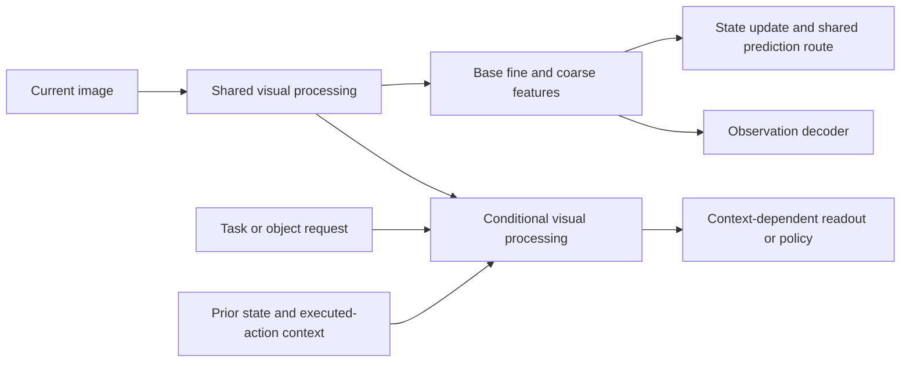

# Conditioning visual encoding on task and prior state

8 September 2026. Design discussion following the
[decoder-conditioning clarification](decoder-inputs-and-conditioning-2026-09-08.md).
The user asks whether encoder conditioning on actions, tasks or internal state is
feasible. No model implementation, training, inference evaluation or frozen
experiment changed in this turn.

**Yes.** Context can influence which evidence is extracted, how ambiguous evidence
is interpreted, and where computation is spent. For PATH-WM, first consider task
and prior-state conditioning with a retained observation-feature reference. Keep
candidate future actions in the predictor or an explicit auxiliary action-specific
branch initially. These are engineering preferences to test, not restrictions on
what a valid world model can represent.

## Existing paths and literature precedents

Our [Encoder](../world_model/paddle/models.py) and
[ExperimentalEncoder](../world_model/curriculum/encoder_variants.py) consume RGB
only. `MemoryUpdater` already uses prior memory as an attention query over image
features, then combines that read with the previous action through its GRU. This
is an existing history-dependent readout after encoding. `Predictor` reads image
features, memory and a candidate action. Conditioning E would therefore move or
add context-dependent processing earlier, rather than introduce the first use of
context into the system.

[RT-1](https://arxiv.org/html/2212.06817v2), Section 5.1, explicitly conditions an
ImageNet-pretrained EfficientNet image tokenizer on a language instruction using
FiLM, before token reduction and action prediction. Its FiLM layers begin as
identity transformations to preserve the initial pretrained function. This is a
direct robot-policy precedent for conditional visual encoding; it does not
establish frozen encoder weights throughout training, a protected parallel
unconditioned path, or improved latent world-model dynamics.

[FiLM](https://arxiv.org/abs/1709.07871) supplies feature-wise affine modulation
from conditioning information. [Visual Prompt Tuning](https://arxiv.org/abs/2203.12119)
learns task-specific prompts in a frozen visual transformer's input space. VPT
supports adapting visual computation with prompts; its fixed learned prompts do
not by themselves demonstrate arbitrary runtime action or recurrent-state
conditioning. [Recurrent Models of Visual Attention](https://arxiv.org/abs/1406.6247)
provides an adaptive high-resolution region-selection precedent, not a guarantee
that an unseen UI or tracking task is solved.

## Different conditioning signals do different jobs

| Context | Potential use | Distinction to preserve |
|---|---|---|
| Task, instruction or requested object | Extract the feature distinctions or objects needed for the requested output | Task emphasis can omit information a later goal needs |
| Prior internal state | Associate observations with tracked objects, guide attention, resolve history-dependent ambiguity | Prior belief remains revisable by new observable evidence |
| Previous executed action, ego-motion or elapsed time | Help interpret the observation after a movement or interaction | This action belongs to the observed history |
| Candidate future action | Extract action-specific contact, reachability or affordance features | It has not caused a change in the current observed scene |
| Sensor, camera geometry, resolution or coordinate convention | Interpret measurements in the correct frame and modality | Metadata must be available at inference with declared units/transforms |

For example, “find the close button” and “read the warning message” can cause the
same screenshot to be processed differently. Prior memory can help associate a
reappearing object with a previous track. A candidate push can request features
around the intended contact point. These are useful design possibilities; their
benefit depends on data and the actual downstream consumer.

Action-indexed encodings are valid in principle, but their predictions and costs
must be compared in compatible coordinates or observable outcomes. Feeding each
candidate action into the whole encoder may require repeated encoding. A shared
stem with a conditional adapter can reuse much of the computation. Neither cost
nor quality superiority is established without profiling the chosen design.

## Proposed first organization

Keep a base route for shared spatial observation features and investigate a
conditional route for a named consumer. The latter can be a late adapter first,
or a branch conditioned before an important processing/compression stage.

This is a proposed functional organization, not an implemented interface or an
assertion that the base state is complete or objective. A bounded adapter study
can freeze the existing base to preserve its reference behavior. Merely naming a
base branch does not protect it if shared weights or preprocessing are changed.
No existing predictor checkpoint should silently receive changed latent semantics.

Concrete mechanisms include channel scale/bias or gates in convolutional blocks,
context/prompt tokens in a transformer, or cross-attention between spatial and
prior-state tokens. Identity initialization can begin a modulation path at the
existing function, but does not preserve that function after arbitrary joint
training. Conditioning every layer is not a prerequisite.

A late adapter can reorganize evidence already in its inputs, including memory.
It cannot reliably recover exact evidence absent from all those inputs. History
or other observations may supply information missing from the current feature
map; statistical filling from priors is a different claim from exact recovery.
If required detail is lost before context can select or preserve it, conditioning
must act earlier or receive additional available evidence. Conditional processing
before a learned bottleneck can help without explicit cropping. Crop selection
is another option when a higher-resolution observation is actually available;
zooming an already reduced image cannot restore missing pixels.

## Timing, targets and retention

Use prior state when defining a single-pass context-conditioned encoder. Update
state after reading the current observation. Requiring already-updated state to
compute that same observation creates an unspecified cycle; an explicitly
unrolled iterative inference design is a valid separate choice.

During planning, no actual future frame or teacher-updated future memory is
available. Candidate branches must evolve from the same available history. A
conditional feature cache must identify its encoder, preprocessing and context,
including relevant history; frame identity alone no longer determines the output.

If the encoder defines prediction targets, a change in task or action context can
change those targets even with fixed weights. Use a retained shared target space
or specify how source and target contexts relate in the conditional model.
Identical context is one option, not a universal requirement. Raw latent distances
across incompatible contexts do not establish better action consequences.

A task-focused path can forget incidental details, and an overly trusted prior
can fail to incorporate a contradictory observation. Measure task switching,
old-output retention and observable correction of stale beliefs. Conditioning
alone does not fix the existing reconstruction retention tradeoff. Future hidden
state remains uncertain where the available evidence cannot distinguish it.

## Smallest useful comparison

Choose one real consumer: localizing different requested UI controls/objects in
varied layouts, or associating an object across an occlusion with verified
history-dependent targets. Compare equally informed late-conditioned readout and
conditional visual processing at a fixed backbone, with controlled capacity,
training exposure and disclosed cost. This separates the value of context from
the value of supplying it earlier.

A constant task label in a single-task dataset is only a learned constant; it
does not test dynamic conditioning. Use meaningful context variation on the same
images or appropriately paired histories. Include no-context and context-only
controls to expose capacity effects and label shortcuts. Wrong-context tests can
be informative, but corrupted inputs alone do not replace a trained comparator.

Select targets, budget, holdouts and pass rules prospectively. This is an option
within the earlier requirements-first process, not another queued experiment or
a claim that conditioning is cheaper/better than changing the backbone.

## Critical review record

No reachable Claude agent was available. The installed CLI reviewed a public-only
brief and a focused correction through the adopted workflow. Exact prompts,
replies and receipts are under
`runs/requirements_first_perception_2026-09-08/collaboration/encoder_conditioning_*`.
No local code, measurements or datasets were shared. Codex separately traced the
current E/U/P interfaces and verified the cited primary sources.

Claude usefully emphasized that recoverability depends on all available inputs
and that context may need to act before compression. Codex challenged its
equation of identity initialization with a frozen/protected base, universal cost
and superiority claims, and the assertion that cropping is the only case where
earlier conditioning matters. Candidate cost and target-context consistency were
already in the supplied brief; their refinements are retained without treating
them as previously absent requirements.

The reconciliation accepts all five corrections and explicitly withdraws the
frozen-base equivalence, universal cost comparison and cropping-only claim. Both
calls succeed with no permission denials. Their receipt fields sum to $0.39043625
API-equivalent cost, not a subscription bill. Peer agreement supports this design
discussion, not a claim that the proposed conditioning paths improve PATH-WM.
