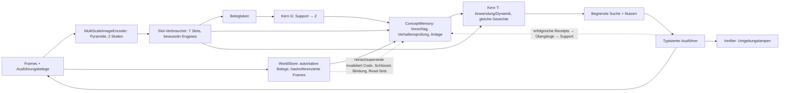

# Integrierte latente Architektur und Umsetzung

Stand 23. September 2026 (konsolidiert). Angenommener Architektur- und
Umsetzungsvertrag; Alex hat die Detailwahl delegiert. Entwurf und Implementierung:
Claude Opus 5.5 (`high`); unabhängige Prüfung, Reproduktion und Läufe: Codex.
Verbindet das [Gesamtziel](integrated-latent-agent-goal.md), den
[Multiskalenvertrag](multiscale-modality-design.md), den [latenten Kern](latent-core.md)
und den [Abstraktionsversuch](shared-abstraction-spec.md). Dessen Spezifikation bleibt
**unverändert**; die hier beschriebene Konfiguration ist ein **eigener Versuch (R1)**,
nicht dessen Arm A.

## 0. Aktueller Status

- **Software implementiert:** R1-Referenzkette und R2-Komposition (§18) mit einer
  Sitzung, einem Speicher und einer Uhr; getrennte Instanzidentität und
  Konzeptzugehörigkeit, ein geteilter Bildencoder, ein Entscheidungs-Forecaster,
  aktuelle Aktionsabhängigkeiten, externe Verifikation und Wiederherstellung.
  Vollständige CPU-Regression: **752 Tests bestanden**, einschließlich der
  8 unabhängigen Grenzfalltests (jetzt dauerhaft im Testverzeichnis). Belege:
  `runs/reviews/integrated_architecture_20260923/unified-repair-green.log` und
  `…/unified-full-regression.log` und `…/unified-full-collection.log`.
  Diskussion mit Alex bleibt separat offen.
- **Wahrnehmung:** erster 15-Minuten-Lauf verfehlte C1 (Lampe 91,6%). Der
  Texturvergleich (§17) erreicht nach Warmstart 99,8% Lampenerkennung und besteht
  den einfachen C1-Screen, verfehlt jedoch die vorab erklärte Übernahmeregel für
  zustandsübergreifende Wiedererkennung. Neustart mit Texturvariation: 98,6% Lampe,
  ebenfalls nicht übernommen. Ein trainierter latenter Schlüsselausleser gewinnt auf
  frischen Validation-Texturen 36,0% Wiedererkennung über Lampenzustände (Kontrolle
  26,3%), verfehlt aber den neuen 80%-Diagnosewert. Das ist teilweise nutzbare
  Information, kein C3-Nachweis. Rohdaten/Berichte:
  `runs/latent_agent_r1/{texture_control,texture_randomized,texture_scratch}_20260923/`
  und `…/appearance_readout_20260923/full/`. Als nächster Schritt wird ein gepaartes
  Identitäts-Lernziel für Slots und Schlüssel vorbereitet; ursprüngliche Gates bleiben.
- **Kernlernen:** voller Loss und reiner Ergebnis-Loss scheiterten in der
  diagnostischen Leiter. Mit vorgegebenem Regelcode lernt T Kategorien; Gewichtung
  seltener Änderungen allein löst die relationalen Regeln nicht. Frischer Kern nach
  8000 Updates: ν Kategorie 1,0, Relation 0,474, Toggle 0,332, Open −0,480,
  Close −1,227; mittlerer relationaler AUROC-Vorteil gegenüber vertauschtem Code
  0,291. Screen weiterhin **verfehlt**, aber deutlich wachsender Regelinformations-
  gehalt. Nächster Schritt: 8000 zusätzliche Updates mit gleichem Optimierungszustand.
  Das ist **Oracle-Diagnostik auf Trainingsregeln**, keine Ableitung aus Belegen und
  keine Pixelkompetenz. Belege: `…/core_ladder_20260923/threshold_free_all/`,
  `…/core_application_probe_20260923/O_scratch/`,
  `runs/reviews/integrated_architecture_20260923/core-scratch-decision.md`.
- **Kein vollständiger gelernter R1/R2-Nachweis.** Pixel-Kerntraining und vollständige
  Agentenleben warten auf die Lernreparaturen. Softwaretests und vorgegebene
  Identitätsschlüssel belegen keine gelernte Gesamtfähigkeit. Natürliche Daten,
  Verdeckung und Modalitäts-/Aufgabenalignment benötigen eigene Nachweise (§11–12,18).
  Alle negativen Läufe, Quellstände, Checkpoints und Berichte bleiben erhalten.
- **Reviewgeschichte:** R1–R18 in `…/codex-review-findings.md`; ursprüngliche
  konsolidierte Planfassung in Git `18fea0f`; aktuelle Briefs/Antworten und rote/grüne
  Reproduktionen unter `runs/reviews/integrated_architecture_20260923/`.

## 1. Zielbild, Referenzintegration und Grenzen

Zielbild: ein kompakter Agent verarbeitet Beobachtungen, gespeicherte Erfahrung,
Aufgaben, Konzeptcodes und hypothetische Aktionsfolgen in kompatiblen latenten
Räumen; Text/Bild/Audio/Video sind Ein-/Ausgabeformate, interne Übergänge dekodieren
und re-enkodieren sie nicht. Gemeinsame Breite belegt keine gemeinsame Semantik.

**R1 „RuleWorld-64“** ist die erste **Referenzintegration**: derselbe eingefrorene
Agent nimmt Pixel wahr und bindet sie, erschließt aus eigenen wahrgenommenen
Übergängen Regeln, legt Konzepte selbst an, findet sie nach Neustart wieder, sagt
vorher, plant zweischrittig, führt aus, lässt unabhängig verifizieren, lernt aus der
eigenen Rückmeldung und leitet nach Quellenkorrektur mit Invalidierung neu ab. Ein
R1-Erfolg belegt kontrollierte, synthetische, vollständig beobachtete, deterministische
Fähigkeit – nicht natürliche Kamera-, Sprach-, Werkzeug- oder domänenübergreifende
Fähigkeit. §10–§11 ordnen R1 in die Gesamtarchitektur ein.



## 2. Umgebung und Aufgabe

**Szene** (64×64 RGB, deterministischer Torch-Renderer, 8-Bit-quantisiert, keine
Verdeckung, feste Kamera): **zwei unabhängig gesteuerte Maschinen** oben und **vier
statische Objekte** unten, mit Positionsjitter; sieben Entitäten inklusive Hintergrund.
Jede Maschine hat eine *Art* (Körpertextur), eine verborgene Regel und eine Lampe
`s_m∈{0,1}`. Objekte `a∈{0..3}^4`: Farbe, Form, Größe, Muster. Nur Lampen ändern sich.

**Arten/Regeln:** 72 prozedurale Texturen (48 Train, 8 Validation, 16 Test); die
280er-Grammatik des Abstraktionsversuchs mit deterministischem Gruppensplit im Code
(`pathwm/data/rule_world.py`, SHA256-Ordnung, Salz `shared-abstraction-v1`, einmal per
fixiertem Hash gegen die genehmigte Liste geprüft; keine Laufzeitabhängigkeit von
`runs/`). Art→Regel wird **pro Welt/Episode neu gezogen**, sodass nach Neustart nur
das Laufzeitgedächtnis die Regel liefert. Testwelten: Testtexturen, Testregelgruppen.

**Aktion:** `press(machine_xy, xy_a, xy_b)`; der Ausführer löst Koordinaten über
seine eigene Entitätsmaske auf; `ActionRecord` verlangt endliche Koordinatenpaare.
Receipts `ok`, `miss`, `same_object`, `budget_exceeded`; nur `ok` ändert genau die
gezielte Maschine (`u=1`): Kategorie/Relation `s'=h(a,b)`, open `s∨m`, close `s∧¬m`,
toggle `s⊕m`. Warten ändert nichts (keine Drift) und ist keine Aktion; die `u=0`-Fälle
des Spec entfallen bewusst. Floors (copy-s, operator-only, majority, konstant; auf `y`
bzw. `Δ=s'⊕s`) werden für diese Verteilung enumeriert.

**Faktorisierte Dynamik (deklarierte Vorannahme):** nicht gezielte Maschinentokens
bleiben unverändert; T sagt nur die gezielte Maschine vorher.

**Demonstrationen:** Vor jedem Press setzt der Demonstrator beide Lampen uniform
(sichtbar); Paare uniform; je Szene 8 Presses pro Maschine. Support, Queries und
Rolloutketten sind symbolisch disjunkt in `(a,b,s)`; ist das unerfüllbar, brechen
beide Sampler mit Fehler ab.

**Evaluationsleben (Gewichte eingefroren):** (1) Erwerb A,B mit je `N∈{8,32,128}`
Übergängen; (2) Ablenkung C,D je 32; (3) Neustart aus Store+Blobs; (4) Nutzung: 64
Vorhersagequeries je Art, 16 Zweimaschinen-Zielaufgaben; (5) Korrektur: (a) ein
korrumpierter Erwerbsübergang von A wird von der Quelle per `supersede` ersetzt,
(b) 24 neue wahre Übergänge von B (falsche Hypothese, gleiche Regel), (c) unbelegter
Testimony-Claim für A; (6) erneute Nutzung.

**Formaler Familienplan:** Die abgefragten Regeln A/B der vier Leben je Supportstufe
folgen `FAMILY_SCHEDULE` = (category, relation), (open, close), (toggle, category),
(relation, toggle) – jede Familie bzw. jeder Operator auf jeder Stufe, identisch über
Seeds, Stufen und Kontrollen, konkrete Testregel zufällig innerhalb der Familie, nie
leistungsabhängig. Ältere Leben mit uniform gezogenen Regeln sind Entwicklungsdaten.

**Ziele und Schichten:** Ziel = Lampenvektor; Budget/Horizont **zwei** Presses. Ein
unabhängiges BFS bestimmt `already` (15 %), `reach1` (35 %), `reach2` (25 %),
`unreachable` (25 %); höchstens 200 Szenenziehungen, danach `StratumUnavailable`
(gezählt). Ein Zweischritterfolg ist ein begrenztes faktorisiertes Planungsresultat.

## 3. Aufgaben- und Nutzenvertrag

`TaskContract.utility()` ist die einzige Nutzenfunktion für Planer und Auswertung:
`stop` mit verifizierten Lampen = Ziel +1, falscher Stopp −1, `abstain` −0,25, jede
nicht abgelehnte Ausführung −0,05; Presses über Budget und veraltete Pläne werden ohne
Zustandsänderung und Kosten abgelehnt und gezählt.

Der Planer kennt nur Wahrnehmung, Gedächtnis und `TaskContract`, nie Simulator oder
Oracle. Er vergleicht `stop` jetzt (`p=Π_m P(Lampe_m=g_m)` aus dem wahrgenommenen
Lampenkopf), `abstain` jetzt und jede Folge aus ≤ verbleibendem Budget (≤24 Aktionen,
≤600 Folgen, exhaustiv) über denselben Erwartungsnutzen, führt den ersten Press der
besten Folge aus, nimmt Maschinen **und** Objekte neu wahr und plant neu. Bereits
erreichte Ziele sind die Option ohne Press; terminal wird einmal bewertet. `p` stammt
vom ungewichteten Outcome-Kopf nach deterministischem Rollout (deklarierte Näherung).
Der Agent behauptet nie Unerreichbarkeit; nur der Evaluator bewertet `abstain` bei
`unreachable`.

## 4. Wahrnehmung, Bindung und Kern

**Quelle:** bestehender `MultiScaleImageEncoder(64, patch 4, levels 2, depth 1)` →
`FeaturePyramid` (16×16 und 8×8, 320 Tokens mit Positionen, Zeiten, Masken);
unmutiert, nicht persistiert; autoritativ sind die Frames.

**Slot-Verbraucher** (`pathwm/models/slots.py`): Slot Attention (7 Slots, Breite 64,
3 Iterationen, gelernte Seeds; Padding trägt keine Masse) liest beide Skalen –
**ausdrücklicher Engpass** 320→7 –, dazu Broadcast-Decoder (RGB+Alpha). Nur im Training
und offengelegt: Maskenzuordnung, Attribute, Lampe und Slottyp, zugeordnet per exakter
Permutationssuche an den Umgebungsmasken.

**Bindung:** Maschine/Rolle = Slot mit maximalem Alpha am Aktionspixel; Agenten-
maschinen = zwei Slots höchster Maschinenwahrscheinlichkeit, nach x geordnet;
Aktionsziel eines Slots = sein stärkster gewonnener Pixel.

| Grenze | Form | Status |
| --- | --- | --- |
| `rgb` | `[B,1,3,64,64]` aus uint8 | autoritativ, SHA256-Blob |
| `pyramid` | 320×64 + Masken/Zeiten | abgeleitet, pro Aufruf |
| `slots`/`alpha`/`type` | `[B,7,64]`/`[B,7,64,64]`/`[B,7,3]` | abgeleiteter, begrenzter Cache |
| Belegtoken `e` | `[≤128,64]` + Maske | `MLP_ev([m_pre,a_pre,b_pre,m_post])` |
| Code `Z` / Schlüssel `k` | `[4,64]` / `[32]` | abgeleitete Store-Komponenten |
| Outcome-Logit / `m̂` | `[B]` / `[B,64]` | Vorhersage mit Read-Set / hypothetisch, nie Beleg |

**Geteilter Kern** (`pathwm/models/latent_core.py`): ein Pre-LN-Block (Cross-, Self-
Attention, FF 64→256→64, vier Köpfe) mit **denselben Gewichten** für G
(`Z = LN(Block^L(Z_seed, [e_null; E_S]))`) und T (`[m_pre, a_pre, b_pre]` liest `Z`),
`L=2`. Köpfe: ungewichtetes Outcome-Logit, residualer nächster Maschinentoken,
Schlüssel. Queries im Batch kommunizieren nicht.

## 5. Training

- **S0 Audit (CPU):** 280 verschiedene Funktionen, unabhängige Skalarprüfung,
  Split-Hash, Floors über alle 131 072 Eingaben, Renderer/Ausführer/BFS, Schichten.
- **S1 Wahrnehmung:** `RGB-MSE + 0,5·(Masken-CE + Attribut-CE + Lampen-BCE + Typ-CE)`
  auf Trainingsarten, Validation auf Validationsarten; danach eingefroren.
- **S2 Kern** (Wahrnehmung eingefroren, `no_grad`): Episoden mit neu gezogener
  Trainingsregel, `N=0` (p=0,05) sonst aus {8,16,32,64,128}, 32 Queries, eine echte
  Zweipress-Kette; jede Szene wird nur in ihren vier Lampenkonfigurationen enkodiert
  (Test: Cache = Live-Enkodierung); Rollout-Objekttokens aus der Anfangswahrnehmung.

  ```
  L = BCE(outcome, s')                                   [ungewichtet]
    + Σ_k=1..2 ‖m̂_k − sg(m_post,k)‖² / var_train         [wahrgenommene Post-Slots]
    + 0,5 · BCE(outcome(rollout_2), s'_2)
    + 0,2 · InfoNCE(Schlüssel; gleiche Trainingsart = positiv, nur Loss)
  ```
  Der gewichtete Spec-Loss wird nicht verwendet; ν wird aus `ŷ=1[p≥0,5]` gegen die
  Floors berechnet. AdamW 3e-4, Clip 1, FP32.
- **S2s Strukturdiagnose:** derselbe Kern auf `SymbolicSlots` mit exakten Masken und
  gelieferter Konzeptzuordnung; Symbol-Embeddings und Schlüsselkopf eingefroren, **ohne**
  Schlüssel-InfoNCE (der Maschinentoken trägt kein Aussehen), kein Abrufanspruch; nur
  zur Fehlerlokalisierung, nie ein Pixelgate.
- **S3 Evaluation:** kein Optimizer, `evaluation_mode`, Parameter-/Buffer-Hash je
  Lebensphase.

## 6. Gedächtnis, Bindung, Rückkopplung und Revision

`ConceptMemory` (`pathwm/world_state/concepts.py`) besitzt genau einen `WorldStore`
mit lebensdeckenden `Limits` (Überlauf atomar abgelehnt), hashgeprüfte Frame-Blobs und
begrenzte abgeleitete Caches (LRU, Verdrängungen gezählt). `ConceptAgent` ist der
Laufzeitbesitzer (Modelle, Gedächtnis, Planer), analog zu `WorldSession`.

| Inhalt | Store-Abbildung |
| --- | --- |
| Übergang | `observation`-Event, `add_evidence("rule_world_camera","transition", content_ref, content_hash, data={action, receipt})`; Szenenblick `modality="image"` |
| Testimony | `observation`, `source="testimony"`, `modality="claim"`; nie Support |
| Instanz | `kind="instance"`; `appearance` (`observed`), `transitions` (`inferred`, `evidence`=erfolgreiche Übergänge, `parents=[appearance]`), `binding` (`inferred`, `parents=[appearance, transitions]`) + `instance_of` |
| Konzept | `kind="concept"`; `key`, `code` (`inferred`, `parents`=unterstützende Bindungen, `evidence`=aktiver Support, `model_version`=Kernhash) |

**Revision:** `retract_evidence` nur in `correction`-Events derselben Quelle;
`supersede` in einem `observation`-Event mit neuem Beleg gleicher Quelle/Modalität,
nie auf bereits widerrufenen Ersatz. Invalidierung erfasst direkte Belegnutzer,
transitive `parents`-Nachfahren, Relationen mit widerrufenen Belegen (auch `same_as`)
und Relationen mit invalidierten Komponenten-Endpunkten. Kein Wiederaufleben;
Neuberechnung erzeugt neue IDs; ein identischer Retry des alten Events reaktiviert
nichts. Gleiche Pixel sind als neue Beobachtung mit eigener Zeit/ID gültig.
Historische Revisionen bleiben rekonstruierbar.

**Abruf und Bindung:** Vorschlag Top-3 nach Schlüsselkosinus; ab m≥4 Übergängen
Verhaltensprüfung (Log-Likelihood unter `T(·,Z_c)` gegen `Z_neu=G(Sitzung)` minus λ):
binden oder neu anlegen (`conflicts_with` bei ähnlichem Aussehen, aber verfehlter
Prüfung). Ohne Übergänge nur Aussehen (≥τ, `verified=false`, kein Support).

**Rückkopplung eigener Handlungen:** Erfolgreiche eigene Presses und Claim-Tests
nehmen denselben Erwerbspfad: Instanzübergänge erweitern, Bindung neu ableiten,
Support/Code lazy neu berechnen. Fehlgeschlagene Receipts bleiben Rohbelege und lehren
nie. Unter m<4 ist keine Verhaltensprüfung möglich; gewählt ist Support bei
Aussehenswert ≥τ_feedback (Vorgabe 0,8, auf Validation zu kalibrieren; abschaltbar
als Kontrolle `feedback_support=False`). Verworfene Alternativen: warten bis m≥4 (lernt
bei zwei Presses praktisch nie) oder Konsistenzprüfung gegen den leeren Code (verwirft
korrigierende Gegenevidenz). Risiko: Kontamination bei falscher Aussehenszuordnung,
messbar über C3 und die Kontrolle.

**Support und Read-Sets:** Support = aktive erfolgreiche Übergänge unterstützender
Instanzen, höchstens die 128 jüngsten; `Z = G(Support)`. Read-Sets pinnen
`(Komponenten-ID, Revision)` und Modellversionen; aktuell heißt außerdem „noch die
neueste Ableitung ihres (Entität, Name)“. Geprüft vor jeder Antwort und vor jedem
Press; veraltete Pläne werden abgelehnt und neu geplant, unbeteiligte Read-Sets bleiben
gültig. Nach einer Belegreparatur bleibt die frühere Bindungsentscheidung mit neuen
Parents erhalten (keine automatische Neuverifikation).

**Modellversionen:** `ConceptMemory.load` lehnt jede Versionsänderung ab. Eine
belegbasierte Migration (aus den gespeicherten Frames neu enkodieren, neu binden, neu
berechnen) ist ein zurückgestellter Vertrag (§11).

## 7. Abnahme (Gates unverändert)

Alle C-Gates messen die **volle Pixelkette**; Diagnosen ersetzen nie ein Gate.

**I – Softwarevollständigkeit** (100 %): Hash-Gleichheit je Lebensphase, kein
Optimizer in S3; Neustart reproduziert Antworten auf 1e-5; vergiftete verborgene Felder
ändern keine Agentenausgabe; Planer ohne Umgebungszugriff; nach Revision keine veralteten
Lesezugriffe, `Z = G(aktiv)` auf 1e-5, gleich der sauberen Referenz, veraltete Pläne
abgelehnt, unbetroffene Konzepte bitgleich; Receipts, Klickauflösung, gemeinsamer
Nutzen, Cache = Live. Eine nicht ausgeführte Laufzeitprüfung gilt als nicht belegt.

**C – kontrollierte Lernfähigkeit** (formal: 3 Trainingsseeds, einseitige t-LCB):

| Gate | Kriterium |
| --- | --- |
| C1 Wahrnehmung | je Attribut ≥0,95; Lampe ≥0,99; Maschinenzeiger ≥0,99; Klick→Slot ≥0,97 |
| C2 Erschließen | bei N=128 ν≥0,7 für Kategorie, Relation und jeden Übergangsoperator; LCB(ν_voll−ν_leer)>0; auf informativen Queries LCB der Verschiebung zur vertauschten Regel >0 (Abdeckung berichtet); ECE(10)≤0,05 als Endlichstichprobenbefund |
| C3 Abruf | wiederkehrend korrekt ≥0,90; neue Art neu angelegt ≥0,90; falsche Verschmelzung ≤0,10 |
| C4 Nutzung (N=128) | LCB(ν_nach Neustart−ν_vor)≥−0,03; verifizierter Erfolg `reach1`+`reach2` ≥0,85, `already` ≥0,90; `abstain` bei `unreachable` ≥0,85; falsche Stopps ≤0,10; LCB(Nutzen−Nutzen_leer)>0 |
| C5 Korrektur | (a) nach `supersede` = saubere Referenz (1e-5); (b) gepaartes Seed-LCB(ν_nach−ν_vor)>0 für B bei N0=8, A bitgleich; (c) Testpress ≥0,95 und Endantwort folgt der Beobachtung ≥0,95 |

C5c misst die deklarierte Testimony-Regel plus exakten episodischen Abruf der eigenen
Beobachtung, keine gelernte Quellenbewertung; die Konzeptebene nach Rückkopplung wird
getrennt berichtet. ν≥0,7 gilt nur für R1; die 0,8-Gates des Abstraktionsversuchs
bleiben dort unverändert.

**Status und formale Zulässigkeit:** Jedes Gate ist `pass`, `fail`, `incomplete`
(fehlende Messung, nicht ausgeführte Prüfung, nicht verfügbare Schicht, Gruppe mit nur
einer Klasse) oder `ineligible`. Formal zulässig sind nur genau drei Evaluationen mit
verschiedenen deklarierten Trainingsseeds und Checkpoints (Wahrnehmung und Kern) und
identischem vollem Protokoll: `test`, volle Modellgröße, N=8/32/128, je 4 Leben, 64
Queries, 16 Ziele, 32/24 Ablenkungs-/Gegenevidenzübergänge, `FAMILY_SCHEDULE`, gleicher
Evaluationsseed, Quellcode und Floors. Doppelte Pfade werden abgelehnt; die Prüfung
übersteht den JSON-Transport des `gates`-Stadiums.

**Nur berichtet:** leeres Gedächtnis, permutierte Supportlabels, Floors, Zufalls- und
Ohne-Konzept-Planer, Loop-Budgets L∈{1,2,4}, N-Kurve, Oracle-Abruf, Strukturdiagnose,
Familienabdeckung. Ein Voll-Evidenz-Kontextarm ist in R1 bewusst nicht implementiert.

## 8. Ressourcen, Stufen und Iteration

FP32; `--max-reserved-gib` (Standard 6) wird nach jedem Update bzw. Leben geprüft,
Überschreitung speichert den Checkpoint und hinterlässt einen Fehlstatus. Berichtet:
reservierter/allokierter und Gerätegesamtspeicher, Parameter, Updates/s, Lebenslaufzeit,
Blob- und Store-Bytes nach dem finalen Speichern, Cachegrößen. Zeit- und
`--stop-after`-Stopps sind bewusste, fortsetzbare Unterbrechungen.

```bash
OMP_NUM_THREADS=2 MKL_NUM_THREADS=2 .venv/bin/python -m experiments.latent_agent --stage check --output runs/<neu>/check
.venv/bin/python -m experiments.latent_agent --stage audit --output runs/<neu>/audit
.venv/bin/python -m experiments.latent_agent --stage perception --max-minutes 15 --device cuda --output runs/<neu>/perception
.venv/bin/python -m experiments.latent_agent --stage core --perception runs/<neu>/perception --max-minutes 15 --device cuda --output runs/<neu>/core
.venv/bin/python -m experiments.latent_agent --stage symbolic --max-minutes 15 --device cuda --output runs/<neu>/symbolic
.venv/bin/python -m experiments.latent_agent --stage evaluate --core runs/<neu>/core --population validation --device cuda --output runs/<neu>/evaluate
.venv/bin/python -m experiments.latent_agent --stage gates --evaluations E1 E2 E3 --output runs/<neu>/gates
```

Jeder Lauf besitzt Rohmetriken, ggf. Checkpoint, `result.json` und `report.html`
(bestehender Renderer; Ergebnis- und Reportstatus getrennt). Entwicklung auf Validation
darf protokolliert repariert werden; die Testpopulation bleibt versiegelt und wird je
eingefrorenem Checkpoint einmal ausgewertet; ein reparierter Folgelauf ist ein neuer
Versuch mit frischen Testwelten und ausgewiesener Zweitexposition der Testregelgruppen.
Formale Iterationszahlen werden aus den gemessenen Entwicklungskosten **vor** formalen
Läufen hier eingetragen; vorläufige Obergrenze 12 GPU-h. Eskalation: C1 nach
dokumentierter Reparatur verfehlt (Rückfall DINOv2 ViT-S/14, lokales Asset, als
eigene Variante), Budget >12 GPU-h, jede Leckage.

**Smoke-Profil (nur Softwareprofilierung, 30 Updates, RTX 3050, volle Modellgröße,
FP32; `runs/latent_agent_r1/smoke_2026-09-23/gpu/`):**

| Stufe | Updates/s | max reserviert | Parameter |
| --- | --- | --- | --- |
| Wahrnehmung (B=32) | 7,9 | 1,74 GiB | 220 k |
| Kern (16 Episoden, N≤128) | 0,94 | 4,37 GiB | 119 k trainierbar |
| Strukturdiagnose (vor Einfrieren der Symbole) | 5,1 | 1,89 GiB | 121 k |
| Ein Leben (N=128, alle Kontrollen) | 22 s | 0,08 GiB | – |

Daraus grob: ≈7000 Wahrnehmungs- bzw. ≈850 Kernupdates je 15 min; der Kern wird von
der pro Update neu gerechneten eingefrorenen Wahrnehmung dominiert.

## 9. Optionaler nächster Schritt: begrenzte Prepare-once-Trainingsbank

Nicht umgesetzt; Entscheidung nach Wahrnehmungs- und erstem Kernergebnis.

- **Inhalt:** `S_bank` Trainingsszenen (nur Trainingstexturen, deklarierter
  Generatorseed) × vier Lampenkonfigurationen; je Frame nur 7 Slottokens und die
  Slotindizes an den sechs Demonstrationskoordinaten, plus Szenenstruktur für
  Episodenbau/Labels. ≈7 KB je Szene (FP32), 20 000 Szenen ≈145 MB CPU-RAM. Keine
  Regeln: Art→Regel bleibt je Episode frisch.
- **Identität:** Manifest (Generatorseed, Szenenzahl, Arten, Split-Hash,
  Wahrnehmungs-`state_hash`, Quell-Hash, Datei-SHA256); der Bankhash geht in die
  `Run`-Datenidentität ein, Resume lehnt eine geänderte Bank ab.
- **Trennung:** Validation, Test und alle Leben enkodieren live; begrenzte
  Szenenvielfalt ist eine deklarierte Trainingsvariable, gemessen an live enkodierter
  Validation.
- **Reproduzierbarkeit:** Bankindizes über `Run.sampler`; Äquivalenzprüfung bei Bau und
  Laufstart an fester Stichprobe (Tokens 1e-5, Slotindizes exakt).
- **Grenze:** `build_bank(...)` neben `encode_episodes`, optionaler Bankpfad,
  `--bank-scenes N` (0 = live, Standard); kein Cache-/Trainer-Framework. Alternative:
  Zeiger aus Slot-Attention statt Decoder-Alpha (andere Semantik, eigener Vergleich).

## 10. Gesamtarchitektur: Besitz und Anschlüsse

Unterschieden werden **implementierte Verbindungsadapter** (Code und Kontrakttest,
keine trainierte gemeinsame Nutzung) und **trainierte Verbindungen** (in R1 nur die
Kette Wahrnehmung→Kern→Planer→Gedächtnis in RuleWorld, noch ohne gelerntes Resultat).

| Fähigkeit | Besitzer heute | Anschluss an R1 | Stand |
| --- | --- | --- | --- |
| Multimodale Quelle | `MultiScale{Image,Audio,Text}Encoder` → `FeaturePyramid` | R1 liest die Bildpyramide; weitere Verbraucher lesen über eigene Projektionen | Bild in R1 trainierbar; Audio/Text/Video nicht an den Kern angeschlossen |
| Instanzbindung im Graph | `WorldSession` + `CandidateEncoder`/`AssociationBinder` | `slot_candidates()` erzeugt `Candidate`-Records aus Slots | Adapter + Kontrakttest; untrainiert |
| Teilbeobachtung | `BeliefAgent` (kategorialer Belief, Dynamik, Sitzungsgedächtnis) | `concept_context()` macht `Z` zu einem `ContextEncoder`-Token für den Thinker | Adapter + Kontrakttest; untrainiert |
| Aufgabensteuerung | `TaskRequest`/`TaskPolicy`/`step_task` | R1 nutzt einen festen Ablauf; `TaskPolicy` später als gelernter Steuerer dagegen | nicht verbunden |
| Ausgaben | native Text/Bild/Audio/Video-Decoder, `RecurrentOutputAdapter` | Leser auf dem Arbeitszustand, keine Rückkodierung in den Denkpfad | nicht verbunden |
| Quellengedächtnis | `WorldStore` (Belege, Revision, Snapshots) | R1: eigener Store je `ConceptMemory`; R2-Scheibe: genau ein Store unter `WorldSession`, `ConceptMemory` als Client (§18) | Store implementiert und getestet; Zusammenführung als Software umgesetzt (§18), ungelernt |
| Verifikation | Umgebungsverifier (R1), Entscheidungsentwurf | deklarierte vs. verifizierte Erfüllung getrennt | R1-Simulator; allgemein offen |

## 11. Review des Gesamtziels

**Konsistent:** Quellen- und Revisionssemantik liegen in einem gemeinsamen
`WorldStore`; beobachtete, inferierte, vorhergesagte und behauptete Inhalte sind
getrennt; Denk- und Planungszweige schreiben keine Beobachtungen; Aktionen sind
typisierte Records mit Receipts und unabhängiger Verifikation; die Multiskalenquelle
bleibt unmutiert und von mehreren Verbrauchern lesbar; Gewichte bleiben zur Laufzeit
eingefroren, Wissen ändert sich über Belege und abgeleitete Zustände.

**Wesentliche offene Architekturfragen** (für R2 zu entscheiden, keine Routinewahl):

1. **Zwei Laufzeitbesitzer** (entschieden in §18: `WorldSession` besitzt Identität und
   Store, `ConceptMemory` Konzepte über dieselbe Sitzung; der folgende Vorschlag ist
   überholt). `ConceptAgent` und `WorldSession` besitzen je eigene
   Bindungspolitik (Verhaltensprüfung gegenüber `AssociationBinder`-Schwellen) und
   Laufzeitzustand. In einem vollständigen Agenten braucht jede Instanz genau einen
   Identitätsbesitzer; sonst entstehen zwei konkurrierende Wahrheiten über dieselbe
   Entität. Vorschlag: gemeinsamer Store, `ConceptMemory` als Konzept-/Instanz-
   Besitzer, `WorldSession` liest dessen Bindungen statt eigene anzulegen – erst mit
   einem R2-Test, der beide Pfade nutzt.
2. **Aktionsraum zum `BeliefAgent`** (Schnittstelle in §18: `ActionEncoder`, Breite 64,
   keine Gewichtsteilung; Training offen). `BeliefDynamics` erwartet einen kontinuierlichen
   Vektor `[B, action_width]`; R1-Aktionen sind typisierte Slot-/Koordinatenrecords.
   Für Teilbeobachtung (T liest Belief-Welttokens) fehlt ein gelerntes Aktions-
   Encoding aus `ActionRecord` sowie ein gemeinsamer Tokenraum (R1 Breite 64 gegen
   Belief-Standard 32). Beides ist Training, kein Adapterdetail.
3. **Instruktion → Ziel.** R1-Ziele sind exakte Lampenvektoren. Die Übersetzung
   natürlicher Aufträge (`TaskRequest`) in prüfbare Zielprädikate ist nicht gebaut; der
   Nachweis für Textaufträge erfordert eigene Daten und Verifier.
4. **Allgemeine Verifikation.** Außerhalb des Simulators gibt es nur domänenspezifische
   Prüfer; unbekannte Zielerfüllung muss sichtbar bleiben.
5. **Modellaktualisierung bei langlebigem Gedächtnis.** Weil autoritative Frames
   gespeichert sind, ist eine belegbasierte Migration prinzipiell möglich; Kosten und
   Bindungsstabilität nach Neukodierung sind ungeprüft.
6. **Wissenschaftlich offen:** ob der geteilte G/T-Kern Regeln aus eigener Wahrnehmung
   erschließt und auf ungesehene Regeln überträgt (C2), ob Rückkopplung mit
   Aussehensbindung mehr nützt als schadet, und ob Teilbeobachtung/Verdeckung das
   Format tragen.

**Externe Eingaben, die wir nicht selbst beschaffen können:** reale Aufnahmen bzw.
eine Freigabe zur Kameranutzung oder ein lizenzierter annotierter Episodensatz für das
Naturdaten-Gate N1 (`data/memory_media_v1/episodes/0LDP7/annotations.json` ist
`pending`); Entwürfe von Annotationen können wir vorbereiten, verbindliche Wahrheit
für eigene Aufnahmen braucht Alex' Bestätigung. Alle übrigen Wahlen (Schwellen,
Budgets, Reparaturen, Bankentscheidung) treffen wir selbst mit Validation und Protokoll.

## 12. Natürliche Daten

COCO64-/Charades-Frames können nur Transport und Ressourcen prüfen, keine Fähigkeit.
N1 wird erst mit annotierten realen Episoden bei eingefrorenem Agenten und vorab
fixierten Adaptern definiert; bis dahin keine Aussage zu natürlichen Daten.

## 13. Dateien

Geändert: `pathwm/world_state/store.py`. Neu: `pathwm/data/rule_world.py`,
`pathwm/models/slots.py`, `pathwm/models/latent_core.py`,
`pathwm/world_state/concepts.py`, `pathwm/evaluation/rule_world.py`,
`experiments/latent_agent.py`; Tests `tests/test_rule_world.py`,
`tests/test_concepts.py`, `tests/test_latent_agent.py` sowie die unabhängigen
`tests/test_latent_revision_review.py`. Wiederverwendet: `models/multiscale.py`,
`models/modalities.py`, `world_state/{records,retrieval,modules}.py`, `io.py`,
`evaluation/report.py`. R2-Softwarescheibe (Worktree, §18): geändert
`models/{slots,belief,belief_state}.py`, `world_state/{store,session,concepts}.py`; neu
`world_state/unified.py`, `experiments/unified_session.py`, `tests/test_unified_session.py`.

## 14. Primärquellen (von Codex am 23. September geprüft)

| Quelle | Übernommenes Prinzip und Grenze |
| --- | --- |
| [V-JEPA 2.1](https://arxiv.org/abs/2603.14482) | dichte, mehrstufige latente Vorhersage; kein lokaler Größen-/Qualitätsnachweis |
| [LeWorldModel](https://arxiv.org/abs/2603.19312) | kompakte latente Dynamik mit Kollapsvermeidung; hier stattdessen eingefrorene Ziele |
| [DINOv3](https://arxiv.org/abs/2508.10104) | Rückfalloption dichter Merkmale |
| [Object Concepts Emerge from Motion](https://arxiv.org/abs/2609.04348) | bewegungsbasierte Instanzsignale; für nicht statische Szenen |
| [DreamerV3](https://www.nature.com/articles/s41586-025-08744-2) | aktionsbedingte latente Folgen für Verhalten |
| [Recurrent depth](https://arxiv.org/abs/2502.05171) | geteilte Wiederholung; Nutzen über Loop-Budgets gemessen |
| [Latent Program Spaces](https://arxiv.org/abs/2411.08706) | aus Support erschlossene Codes; Gültigkeit außerhalb der Familie offen |
| [Titans](https://arxiv.org/abs/2501.00663) | Abgrenzung: Gradientenspeicher ist ein anderer Laufzeitvertrag |

Keine Behauptung, den Forschungsstand zu übertreffen.

## 15. Entscheidungsprotokoll (aktuell gültig)

1. Ungewichteter Outcome-Kopf für Planung und Verhaltensprüfung; eine `utility()`;
   `abstain` = unbekannt; ECE/Brier/NLL nur als Endlichstichprobenbefund.
2. R1 ist ein eigener Versuch (D=64, L=2, geteiltes G/T); der Spec bleibt unverändert.
3. Kontrollen gehen nur über gepaarte Gewinne in Gates ein.
4. Zwei unabhängige Maschinen, Horizont zwei, BFS-Schichten mit endlichem Cap
   (behebt den früheren unerreichbaren Zweischritt-Generator).
5. Store: Quellenkorrektur nur durch dieselbe Quelle, kein Wiederaufleben, gleiche
   Pixel als neue Beobachtung erlaubt, Relationen werden mit invalidiert.
6. Read-Sets pinnen Revision und aktuellen Kopf; Modellwechsel werden abgelehnt.
7. Eigene erfolgreiche Handlungen und Claim-Tests speisen denselben Erwerbspfad;
   fehlgeschlagene Receipts lehren nie; τ_feedback-Wahl mit Kontrolle (§6).
8. Formale Gates: drei unterscheidbare Seeds, volles Protokoll mit Familienplan,
   `incomplete`/`ineligible` bestehen nie; Schwellen unverändert.
9. Strukturdiagnose ohne Schlüsselziel und mit eingefrorenen Symbolen.
10. FP32, ≤6 GiB reserviert mit Laufzeitprüfung, formale Budgets aus Messung.

**Bekannte Grenzen:** ein einziger natürlicher Kopf (schwaches Signal für seltene
Ereignisse möglich); ν≥0,7 ist eine R1-Wahl; Rollouts pflanzen keine Unsicherheit
fort; open und close haben je ein geplantes Leben pro Supportstufe, sodass ihre
Seed-Schranken breit ausfallen; Bindungen werden nach Belegreparatur nicht neu
verifiziert.

## 16. Nächste Lernrunde (kleinster Schritt)

1. Wahrnehmungslauf auswerten: C1-Entwicklungsscreen auf Validation (Attribute,
   Lampe, Maschinen- und Klickzeiger). Verfehlt er deutlich, zuerst Wahrnehmung
   reparieren; der Kern ist ohne verlässliche Zeiger nicht interpretierbar.
2. Gleiche 15-min-Budgets für **Strukturdiagnose** und **Pixelkern** auf dieser
   Wahrnehmung, verglichen über episodisches ν bei N=128 auf Validationsregeln:
   niedrig in beiden → Kern/Ziel reparieren; hoch symbolisch, niedrig in Pixeln →
   Wahrnehmung/Zeiger reparieren; nur wenn der Kern lernt, aber rechenbegrenzt ist,
   die Trainingsbank (§9) umsetzen.
3. Eine Entwicklungsevaluation (Validation, volles Lebensprotokoll mit Familienplan)
   zur Kalibrierung von τ, λ und τ_feedback; danach formale Iterationszahlen und Seeds
   in §8 eintragen, bevor die Testpopulation berührt wird.

## 17. Vergleich zur Wahrnehmungsreparatur (Texturrandomisierung, vorab erklärt)

**Anlass:** Der 15-min-Wahrnehmungslauf `runs/latent_agent_r1/dev_perception_20260923/`
verfehlt C1 nur bei der Lampe (Validation 0,916). Die CPU-Diagnose
(`runs/latent_agent_r1/lamp_diagnosis_v2_20260923/findings.md`) zeigt korrekte Zeiger
und Lampenpixel-Zuordnung, aber texturspezifische Fehler (Validationstextur 53: 0,50),
die sich durch Farbinterventionen am Maschinenkörper verschieben: eine Verwechslung
von Körper- und Lampenfarbe bei nur 48 festen Trainingstexturen. Lineare Proben auf dem
Maschinentoken erreichen ~0,92; das stützt die Deutung, beweist aber nicht, dass kein
nichtlinearer Leser die Information gewinnen könnte.

**Reparatur (nur S1-Trainingsdaten, Architektur unverändert):**
`--texture-randomization P` ersetzt je Maschine mit Wahrscheinlichkeit P die
Körpertextur durch eine prozedurale (`rw.TextureSampler`: Farbpaar, Muster, Periode
wie der Artgenerator; 25 % mit einer Farbe innerhalb ±0,12 je Kanal der gerenderten
Lampe-an- oder -aus-Farbe; Entscheidung einmal je Textur, Wiederholungen verzerren die
Rate nicht). Deklarierte Generatorpartition: Texturen mit Muster und Periode einer
Validation-/Testtextur und beiden Farben innerhalb 0,1 (euklidisch) werden abgelehnt,
festgelegt über Art-IDs, nie über Modellergebnisse; höchstens 64 Ziehungen je Textur,
sonst Fehler. Der Standardrenderer ist bitgleich; Lampe, Paneel, Geometrie, Masken und
Labels hängen nicht von der Textur ab. Die Randomisierung zieht ausschließlich aus
einem eigenen Strom `Generator(seed·1 000 003 + 7 919 + Update)`, sodass beide Arme
identische Basisszenen, Lampen und Labels sehen und Resume exakt bleibt. Validation und
Evaluation rendern unverändert die festen Texturen. `--init-perception RUN` startet
Gewichte eines Elternlaufs mit neuem Optimizer in einem neuen Lauf (Datei- und
Zustandshash des Elternteils in den Einstellungen; kein Resume des Elternlaufs).

**Vergleich (Entwicklung, nur Validation):** zwei Arme à 7,5 Minuten, beide ab
`dev_perception_20260923/last.pt`, Seed 1101, frischer AdamW, gleiche Basis-Szenen:

```bash
.venv/bin/python -m experiments.latent_agent --stage perception --max-minutes 7.5 --device cuda \
  --init-perception runs/latent_agent_r1/dev_perception_20260923 --output runs/latent_agent_r1/texture_control_20260923
.venv/bin/python -m experiments.latent_agent --stage perception --max-minutes 7.5 --device cuda \
  --init-perception runs/latent_agent_r1/dev_perception_20260923 --texture-randomization 1.0 \
  --output runs/latent_agent_r1/texture_randomized_20260923
.venv/bin/python -m experiments.perception_diagnosis --run runs/latent_agent_r1/texture_control_20260923 \
  --output runs/latent_agent_r1/texture_control_20260923/diagnosis
.venv/bin/python -m experiments.perception_diagnosis --run runs/latent_agent_r1/texture_randomized_20260923 \
  --control runs/latent_agent_r1/texture_control_20260923/diagnosis \
  --output runs/latent_agent_r1/texture_randomized_20260923/diagnosis
```

**Vorab erklärte Übernahmeregel** (Validation, gegen den Kontrollarm): Lampe ≥ 0,99 im
256-Szenen-C1-Screen; jede Validationstextur ≥ 0,97; Attribute und Zeiger sinken um
höchstens 0,005; der Aussehensproxy (Leave-one-out-1-NN-Texturidentifikation aus
Maschinentokens) sinkt um höchstens 0,02 **sowohl insgesamt als auch über
Lampenzustände hinweg** (nächster Nachbar mit anderem Lampenzustand). Diese zweite
Bedingung wurde vor dem Lauf beider Arme ergänzt und verschärft die Regel. C1-Schwellen
bleiben unverändert. Scheitert
die Regel, wird zuerst die zugesagte Alternative (randomisiertes Training von Grund auf,
15 min) ausgewertet, bevor die Architektur geändert wird (Rückfall: Slot-Verfeinerung
per erneuter Cross-Attention auf die feine Pyramide). Alle negativen Läufe bleiben
erhalten. Ein formaler C1-Nachweis braucht danach einen frischen Lauf mit dem
übernommenen Rezept; warm gestartete Arme sind Entwicklung.

**Softwareprüfung:** Tests in `tests/test_rule_world.py` und
`tests/test_latent_agent.py` (Standardrenderer bitgleich, nur Körperpixel ändern sich,
angeforderte Farben, deterministischer Sampler mit Ausschluss und Cap, gleiche
Basisszenen in beiden Armen, Warmstart mit Elternhash und frischem Optimizer, exaktes
Pause/Resume des randomisierten Arms, Diagnose-Begleitskript mit Übernahmeregel, die
einen großen Einbruch über Lampenzustände ablehnt). Das Begleitskript speichert alle
Einzelbeispiele (`per_example.npz`, gehasht) mit Checkpoint-, Eltern- und Quellidentität
und hinterlässt bei jedem Fehler einen sichtbaren Status.
Log: `runs/reviews/integrated_architecture_20260923/texture-repair-worktree-tests.log`.
Kein Training, kein GPU-Lauf in diesem Schritt.

## 18. R2-Softwarescheibe: eine vereinheitlichte Sitzung (abgestimmter Vertrag)

Stand 23. September 2026, im isolierten Worktree `codex/unified-latent-session`
abgestimmt. **Kein gelernter R2-Nachweis**, solange R1 C1/C2 verfehlt; alles hier ist
Software mit zufälligen oder vorgegebenen Gewichten/Schlüsseln und so beschriftet.
Grundlage: `runs/reviews/integrated_architecture_20260923/whole-architecture-closure.md`
(D1–D5) mit den folgenden verbindlichen Korrekturen.

**Besitz (angenommen).** Genau ein `WorldStore`, gehalten von `WorldSession`: einziger
Schreiber, eine Uhr, ein Snapshot. `WorldSession` besitzt die zeitliche
Instanzzuordnung (Instanzentitäten, `recognition`, `state`, `same_as`/Split,
`reassign`). `ConceptMemory` besitzt über dieselbe Sitzung Konzeptmitgliedschaft und
Codes (Konzeptentitäten, `appearance`, `attribution`, `transitions`, `binding`, `key`,
`code`, Read-Sets) und hat im Client-Modus keinen eigenen Store: interne Records gehen
über `WorldSession.commit(..., advance_belief=False)` (gleiche Uhrzeit, kein
Belief-Filterschritt für Buchhaltung), Quellbelege nur über `WorldSession.observe`
(`evidence=` typisierte `SourceItem`s). Die Sitzung merkt sich die veröffentlichte
Revision; jede direkte Store-Änderung wird bei der nächsten Operation abgelehnt.

**1. Identitätskorrekturen mit kausalem Test.** Jede Übergangszuordnung ist ein eigener
`attribution`-Record: Übergangsbeleg → Instanz, Elternteil = das `recognition`, das die
Sitzung im Ereignis des Vorher-Bildes für den angezielten Slot (Zeiger aus eigener
Wahrnehmung, nie Szenen-IDs) veröffentlicht hat. Die Sitzung speichert in jedem
`recognition` die tatsächlich genutzten Identitätsabhängigkeiten: alle aktiven
`same_as`-Links der Aliasgruppe, über die der Binder entschied
(`data.identity_links`). Der Store invalidiert beim Zurückziehen eines Links (Split
oder Rückzug seines Belegs) jede Komponente, die ihn nennt, und alle Nachfahren:
`recognition → state/appearance/attribution → transitions → binding → key/code`.
Konservativ: der betroffene Übergang bleibt roher, aktiver Beleg ohne Zuordnung, bis
eine neue Identitätsentscheidung vorliegt; nicht betroffene Konzepte bleiben
bitgleich (gleiche Komponenten-ID). `reassign` verschiebt das `recognition` selbst und
invalidiert seine Nachfahren; die Reparatur ordnet die abhängigen Übergänge der jetzt
geltenden Entität neu zu und **prüft deren Bindung neu** (derselbe Erwerbspfad), statt
die alte Entscheidung fortzuschreiben. Ein Merge invalidiert nichts rückwirkend und
bündelt keine Konzeptbelege; Konzeptrecords binden Original-Entitäten.
**Zuordnung nur aus dem eigenen Quellbeleg:** Jeder Übergangsbeleg trägt Receipt, Aktion
und die Beobachtung, in der die Aktion gewählt wurde (`perceived_in`). Eine Zuordnung
(auch jede Reparatur und Wiederherstellung) liest nur diese Angaben plus die jetzt
geltende Identitätsentscheidung für den Slot am Maschinenpixel der Aktion. Nur
`receipt="ok"` lehrt; ein ersetzter Beleg wird nie über die alte Zuordnung
weitergereicht, sondern sein Ersatz aus dessen eigenem Receipt und Ziel zugeordnet
(ein Fehlschlag bleibt roher Beleg, ein Erfolg an einer anderen Maschine geht an deren
Instanz). Dieselbe Receipt-Regel gilt jetzt auch in der R1-Reparatur. Grenze:
Eine Entität, deren letztes `recognition` invalidiert wurde, ist per Schlüssel nicht
mehr abrufbar (bestehende Retrieval-Semantik); spätere Beobachtungen beginnen
konservativ eine neue Entität.

**2. Ein Entscheidungsprognostiker.** Der geteilte Kern (`LatentCore.apply`, Suche)
liefert die aktionsbedingten Rollouts jeder Entscheidung. `BeliefDynamics` filtert
nur zwischen beobachteten Ereignissen, bedingt auf die *ausgeführte* Aktion
(`ActionEncoder`), wird von der nächsten Beobachtung korrigiert und ist weder Planer
noch autoritativer Zustand verdeckter Objekte. `imagine` und `TransitionPredictor`
bleiben unabhängige Baselines. R2 ist voll beobachtet. Später (R3, eigene Daten):
Verdeckung über eine gelernte Projektion des Sitzungs-`state` auf den Kerntoken mit
Ausrichtungsverlust beim Wiederauftauchen; ein Konsistenzverlust zwischen
Belief-Prior und Kernvorhersage beobachteter Folgen. Widersprechen sich Prior und
Kern, entscheidet der Kern die Planung, die Abweichung wird als Diagnose protokolliert
und die nächste Beobachtung entscheidet; nie wird gemittelt. Gleiche Breite (64) ist
nur ein Formvertrag: keine ungetestete Gewichtsteilung zwischen Belief und Kern.

**3. Aufgaben und Ziele.** `GoalSpec(task_id, predicate, targets=((Entität, Wert),…),
budget, deadline)` ist ein expliziter Record; exakte Prädikate, Kosten und Herkunft
dürfen außerhalb der latenten Inferenz bleiben, gelernte Ziel- und Aktionsinhalte
laufen im kompatiblen Tokenpfad (Kern-Rollen `[m, a, b]`, `ActionEncoder`).
`TaskRequest` ohne `GoalSpec` (Freitext) → `ask` ohne Aktorzugriff; unbekanntes
Prädikat oder unbekannte Entität → `unsupported`; nicht sichtbare, uneindeutige oder
unvollständige Zielreferenzen → `ask`; unbekannte Operationen werden vor der
Kodierung abgelehnt. Keine Aussage über Freitextverständnis.
**Harte Aufgabengrenzen:** `budget` (nichtnegative ganze Zahl) und `deadline`
(endliche, nichtnegative Zeit auf der Sitzungsuhr, Einheit wie `WorldSession.time`;
jede Beobachtung liegt `STEP=1` später) werden beim Bau geprüft, ebenso Zieltupel
(Entitäts-ID, ganze Zahl). Erlaubte weitere Drücke = min(Ziel-Budget,
Vertragsbudget) − bisherige, zusätzlich ⌊(deadline − jetzt)/STEP⌋. Diese Zahl ist
zugleich der Horizont der Suche (`plan(budget=)`) und die Ausführungsgrenze: `execute`
verweigert (`refused`) vor jedem Aktoraufruf, jeder Aktoraufruf zählt. Ein
abgelaufenes Ziel ergibt `expired` ohne Nebenwirkung. Der geteilte `TaskContract`
wird nie verändert; der Planer kann eine strengere Grenze des Aufrufers nicht
überschreiben. Aktionsindizes müssen echte ganze Zahlen im sichtbaren Bereich sein.

**4. Daten.** Öffentliche lizenzierte Datensätze brauchen nicht automatisch Alex'
Zustimmung; wir prüfen Lizenz und Eignung selbst. Gefragt wird nur nach nicht
verfügbaren privaten Aufnahmen bzw. deren verbindlicher Wahrheit oder nach
ausdrücklicher Kamerafreigabe. Es gibt kein Datensatz-Freigabegate. Natürliche und
cross-modale Grenzen bleiben unverändert (§12; keine Text/Audio↔Slot-Bindung ohne
gepaarte Daten und Training).

**Einmal kodieren.** Ein Bild wird je Ereignis genau einmal vom gemeinsamen
`MultiScaleImageEncoder` (dieselbe Instanz in `SlotPerception.encoder` und
`BeliefAgent.encoders["image"]`) kodiert; Slot-Verbraucher (`from_pyramid`) und
Belief (`add_packet(..., features=)`, in `PendingEvent.features` gehalten) lesen
dieselbe Pyramide. **Zeitursprung:** Der Bildkodierer addiert eine absolute
Zeitposition zu den Werten; die R1-Wahrnehmung ist bei t=0 trainiert. CPU-Messung an
`dev_perception_20260923/last.pt` (16 Validationsszenen): Slottokens ändern sich bei
t=1/7/100 relativ um 1,01/1,26/1,37, Lampengenauigkeit fällt von 1,0 auf
0,56/0,81/0,63. Deshalb wird jedes Bild bildlokal (t=0) kodiert und nur die Metadaten
tragen die absolute Aufnahmezeit (`SlotPerception.frame_pyramid`); der Belief sieht
das Alter über seine Positionskodierung. Das Paket selbst bleibt unverändert
fingerprintet; die Sitzung prüft, dass vorgegebene Merkmale zum Paketzeitraum passen.

**Verifikation.** Ein aufruferseitiger Verifier liefert
`VerificationRecord(task_id, goal_hash, status∈{success,failure,unknown}, verifier_id,
observed_at)` als Quellbeleg (`modality="verification"`) im selben
Beobachtungsereignis wie Receipt/Übergang und Nachher-Bild. Vor der Veröffentlichung
geprüft: Typ, Zeit = Ereigniszeit, Quelle ≠ Kamera, Aufgabe und Zielhash des laufenden
Ziels. Ein ungültiger Record oder ein Verifier, der eine Ausnahme wirft, wird nicht
veröffentlicht, das Ereignis (Receipt, Übergang, Bild) aber schon; der Fehler wird
danach gemeldet. Ein Urteil gilt nur, solange es im jüngsten Beobachtungsereignis
steht: jede spätere Quellbeobachtung (eigene Aktion oder eine Welt, die sich selbst
geändert haben kann) macht es `unknown`. Das eigene `stop` ist nur deklariert.

**Aktionsbereitschaft.** Ein Plan pinnt neben den Konzeptköpfen (`ReadSet.components`)
seine Live-Abhängigkeiten (`ReadSet.live`): jüngstes Beobachtungsereignis der Sitzung
(jede Modalität), das Ereignis seiner Ansicht, je Maschine Slot, Instanz und
`recognition` sowie die Objektslots. `execute` drückt nur, wenn alles noch gilt und
jedes gepinnte `recognition` aktiv ist und noch derselben Instanz gehört; reine
Buchhaltung (interne Records ohne Kopfänderung) macht nichts veraltet.

**Atomaritätsgrenze und Wiederherstellung.** Atomar ist genau eine
Sitzungsveröffentlichung: Quellbelege (Bild, Übergänge, Receipt, Verifier),
Identitätsentscheidungen und Belief-Update eines Ereignisses. Blobs werden vorher
inhaltsadressiert geschrieben. Konzeptrecords entstehen danach in eigenen internen
Transaktionen und sind vollständig aus behaltenen Quellen ableitbar. `recover()` (beim
Neustart automatisch) leitet Übergänge ohne je getroffene Zuordnungsentscheidung aus
ihrem eigenen Beleg ab und leitet jede Instanz neu ab, deren Übergänge/Bindung nicht
genau zu ihren aktiven Zuordnungen passen (idempotent). `resume_view` nimmt die
jüngste Beobachtung mit behaltenem Kamerabild (Text-/Verifier-Ereignisse werden
übersprungen) und ergänzt fehlende Mitgliedschaften.

**Modellversionen.** Weiter abgelehnt, jetzt als eine integrierte Identität geprüft
(`UnifiedAgent.check`): Sitzungsmodule (Belief inkl. geteiltem Bildkodierer, Scorer,
Updater, Kontext) plus gesamte Wahrnehmung (inkl. Slot-Decoder und Köpfe), Kern,
Kandidaten- und Aktionskodierer, dazu Eval-Modus. Geprüft vor jeder Beobachtung,
Planung, Vorhersage, Korrektur/Reparatur, jedem Snapshot und unmittelbar vor dem
Aktoraufruf; nie werden neue Gewichte mit alten Caches oder Codes gemischt.
Migrationsvertrag unverändert aus dem Abschlussvorschlag (D5), nicht implementiert.

**Implementierung (klein, kein Framework).** `session.py`: `SourceItem`,
`observe(evidence=, packet_features=)`, `recognition`/`identity_links` in den
Entscheidungen, `commit(advance_belief=)`, Revisionswächter. `store.py`:
Identitätslink-Abhängigkeit. `belief_state.py`/`belief.py`: `PendingEvent.features`,
`add_packet(features=)`. `slots.py`: `from_pyramid`, `frame_pyramid`.
`concepts.py`: `ConceptMemory(session=…)`-Client, `attach`. Neu:
`pathwm/world_state/unified.py` (`UnifiedAgent`, `GoalSpec`, `ActionEncoder`,
`VerificationRecord`, `Dispatch`) und das Rezept `experiments/unified_session.py`
(winziges CPU-Leben mit persistenten Maschinen, Rohdaten und Bericht). R1-Rezept,
Voreinstellungen und Checkpoints bleiben kompatibel; Altpfade bleiben erhalten.

**Ergebnis (Software, CPU, 23. September 2026, nach Codex-Review).** Codex hat mit den
gelieferten Fixtures fünf echte Grenzfehler reproduziert (neue Beobachtung machte eine
vorbereitete Aktion nicht veraltet; `budget=0` und abgelaufene `deadline` drückten
trotzdem; ein als `miss` ersetzter Übergang wurde wieder Konzeptstütze; ein nach der
Planung geänderter Kern wurde nicht abgelehnt) und drei weitere ergänzt (veraltetes
Urteil nach neuer Kamerabeobachtung, Verifier-Ausnahme löschte das Receipt, Absturz
zwischen Zuordnung und Bindung). Rot: `…/unified-repair-red.log` (5/5 scheitern);
grün: `…/unified-repair-green.log` – unabhängige Datei 8/8, Worktree 227 bestanden
(22 eigene Tests in `tests/test_unified_session.py` plus betroffene Alt-Tests). Die anschließende
vollständige Codex-Regression besteht mit 752 Tests, einschließlich der 8 dauerhaften
`tests/test_unified_revision_review.py`-Tests (`…/unified-full-regression.log`,
Sammlungsnachweis `…/unified-full-collection.log`). 16
gezielte Mutationen (je ein Schutz entfernt) werden alle von mindestens einem Test
erkannt (`perceived_in` erst nach dem ergänzten Live-Druck-Test). Eigene Reparatur dabei: eine außerhalb des Agenten invalidierte Mitgliedschaft
wurde bei der nächsten Beobachtung leer neu vorgeschlagen statt neu abgeleitet.
Leben v2 (`…/unified-session-life-cpu-v2/`, R1-Wahrnehmung nur gelesen, sonst
Zufallsgewichte, Pixel-Histogramm-Schlüssel als SOFTWARE-Fixture, 5 Szenen): 47
Identitätsmatches, 1 Konzept, 4 eigene Drücke (alle `ok`), 8 aktive Zuordnungen,
4 geplante Ziele, Ausgänge 1 Erfolg/3 Fehlschlag – der einzige Erfolg ist ein `stop`
ohne Druck (Ziel war schon erfüllt); **kein verifizierter Erfolg nach einem Druck**.
Rohes Zufallsleben mit gelernten (untrainierten) Schlüsseln
(`…/unified-session-life-learned-keys-v2/`): keine identifizierte Maschine, kein Ziel
geplant, kein Druck, nur `ask`. Keines der Leben zeigt Identitäts- oder
Regelkompetenz; `result.json` meldet nur gemessene Zählungen (`exercised`). Das erste
Leben `…/unified-session-life-cpu/` ist durch v2 ersetzt.

**Quellkompatible Migration.** Alle Erweiterungen sind optional mit altem Verhalten als
Standard: `observe(evidence=(), packet_features=None)` (Payload-Fingerprint nur mit
Items erweitert), `commit(advance_belief=True)`, `add_packet(features=None)`,
`PendingEvent.features=()`, `ConceptMemory(session=None)`; `SlotPerception.forward`
rechnet unverändert (`from_pyramid(pyramid(rgb))`), R1-Checkpoints laden. Neu sichtbar:
Sitzungsentscheidungen tragen `recognition`/`identity_links`, Ergebnisse `evidence`;
`recognition` nach einem Merge nennt seine Links in `data`; der Store lehnt dort
Nicht-`same_as`- oder inaktive Links ab. Bestehende Logs ohne diese Daten spielen
unverändert ab. Neu abgelehnt: direkte Store-Schreibzugriffe neben der Sitzung (auch
zur gleichen Uhrzeit). Nach dem Review zusätzlich: `ReadSet.live=()` (R1-Read-Sets
unverändert), `ConceptAgent.plan(budget=None)` (Standard = Vertragsbudget),
`WorldSession.check()`, Übergangsdaten mit `perceived_in` (ältere Belege ohne Feld
gelten als im eigenen Ereignis gewählt), `GoalSpec`/`TypedAction`/`VerificationRecord`
validieren beim Bau. Verhaltensänderung in R1: `ConceptAgent.repair` übernimmt einen
Ersatzbeleg nur mit `receipt="ok"`.

**Offen (keine Scheinkompatibilität).** (a) Eine nach Split invalidierte Entität ist
per Schlüssel nicht mehr abrufbar; eine gezielte Wiederaufnahme per Replay fehlt.
(b) Identitätsabhängigkeit ist konservativ: alle aktiven Links der Aliasgruppe, nicht
nur die kausal nötigen. (c) Zufällige Wahrnehmung findet die echten Maschinen selten;
die Tests nutzen daher gelieferte Übergänge auf die eigene wahrgenommene Anordnung,
das Leben gelieferte Pixel-Schlüssel – beides SOFTWARE. (d) Identitätsscorer,
Aktionskodierer und Belief sind untrainiert; R2-Lernen wartet auf R1 C1/C2. (e) Das
Neustartleben prüft Gleichheit von Plan und Zustand bei derselben letzten Beobachtung,
nicht über eine neue Beobachtung. (f) Mehr als zwei Maschinen, Teilziele und
Verdeckung sind nicht unterstützt (`ask` bzw. R3). (g) Exogene Weltänderungen ohne
neue Beobachtung sind unerkennbar; ein Urteil gilt nur bis zur nächsten Beobachtung.
(h) `execute` ohne `goal` ist die Primitive für bereits autorisierte Aktionen; nur
`run_task` bzw. `execute(goal=…)` erzwingt Budget und Frist. (i) Ereignis-IDs `obs-N`
zählen Beobachtungen; direkte Sitzungsaufrufer müssen andere IDs wählen. (j) Die
Integritätsprüfung hasht alle Gewichte je Einstiegspunkt (klein genug für R2, für
große Modelle durch Versionszähler zu ersetzen).
