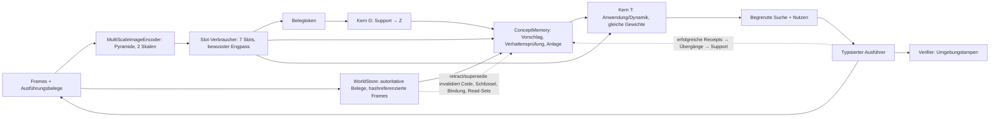

# Integrierte latente Architektur und Umsetzung

Stand 23. September 2026 (konsolidiert). Angenommener Architektur- und
Umsetzungsvertrag; Alex hat die Detailwahl delegiert. Entwurf und Implementierung:
Claude Opus 5.5 (`high`); unabhängige Prüfung, Reproduktion und Läufe: Codex.
Verbindet das [Gesamtziel](integrated-latent-agent-goal.md), den
[Multiskalenvertrag](multiscale-modality-design.md), den [latenten Kern](latent-core.md)
und den [Abstraktionsversuch](shared-abstraction-spec.md). Dessen Spezifikation bleibt
**unverändert**; die hier beschriebene Konfiguration ist ein **eigener Versuch (R1)**,
nicht dessen Arm A.

## 0. Aktueller Status

- **Software implementiert:** R1-Referenzkette und R2-Komposition (§18) mit einer
  Sitzung, einem Speicher und einer Uhr; getrennte Instanzidentität und
  Konzeptzugehörigkeit, ein geteilter Bildencoder, ein Entscheidungs-Forecaster,
  aktuelle Aktionsabhängigkeiten, externe Verifikation und Wiederherstellung.
  Vollständige CPU-Regression: **795 Tests bestanden**, einschließlich des neuen
  kausal geprüften Behauptungspfads. Belege:
  `runs/reviews/integrated_architecture_20260923/unified-testimony-full-suite-retry.log`
  und `…/unified-testimony-full-suite-retry-exit.json` (Exit 0).
  Der erste Versuch brach nativ ab; Original und separater Testnachweis bleiben
  erhalten (`…/unified-testimony-native-crash-note.md`).
  Diskussion mit Alex bleibt separat offen.
- **Wahrnehmung und Identität (§19):** beide Arme sind bei 3000 Updates abgeschlossen.
  J erreicht auf acht Validationsarten 100% Schlüssel-Wiedererkennung über
  Lampenzustände (D: 54,6%); Lampe und Zeiger 100%, schwächstes Attribut 99,51%.
  Der primäre Screen besteht. Frische Szenen (Seed 2101) bestätigen 100% gegenüber
  52,9%; das Attribut fällt dort aber auf 99,32% gegenüber D=100% und verfehlt den
  relativen 0,5-Prozentpunkte-Schutz. Absolutes C1 besteht weiterhin. **J ist ein
  vorläufiger Entwicklungsinput**, keine formal qualifizierte Konfiguration.
  Berichte: `runs/latent_agent_r1/identity_{joint,detached}_20260923/`
  einschließlich `diagnosis/` und `fresh_validation_2101/`.
- **Kernanwendung:** konstantes gemischtes Training bis 16.000 Updates blieb bei einer
  groben Paritäts-Abkürzung hängen. Derselbe Kern lernt die feinere Relation isoliert
  (R44, 8000 Updates, ν=0,993 im Pool aller 44 Trainingsregeln). Danach bestehen
  weitere 8000 gemischte Updates **alle fünf Familien**: ν Kategorie/Relation 1,0,
  Open 0,927, Close 0,863, Toggle 0,949; relationale Retention besteht.
  Die Architektur ist unverändert. Reihenfolge, Relationsexposition und neuer
  Optimierer sind Teil dieser gestuften Strategie; kein isolierter Kausalnachweis.
  Das ist weiterhin **Oracle-Anwendung mit vorgegebenen Trainingsregelcodes**,
  kein Erschließen neuer Regeln. E1a mit festen Startcodes verfehlt Trainings- und
  Validierungsscreen. E1a-R mit Support-Abruf verfehlt beide ebenfalls (§16).
  Gemeinsames G/T-Lernen mit Oracle-Anker erhält T, verfehlt aber nach 8000 Updates
  die Induktion. Auch zwei geteilte latente Verfeinerungsrunden verfehlen den Screen.
  Auch vielfältigere Query-Seeds lösen die Induktion nicht. Isoliertes Relationslernen scheitert ebenfalls;
  ein letzter direkter G/T-Lernversuch ohne Oracle-Codebank läuft. Berichte:
  `…/core_relation_probe_20260923/R44/`, `…/core_curriculum_20260923/C192/`;
  E1a: `…/code_search_20260923/E1a_C192/`; E1a-R:
  `…/code_search_retrieval_20260923/E1aR_C192/`; weitere abgeschlossene Läufe:
  `…/core_query_scale_20260923/E1bS_C192/`; abgeschlossen:
  `…/core_refine_20260923/E1c_C192/` und `…/core_amortize_20260923/E1b_C192/`.
- **Kein vollständiger gelernter R1/R2-Nachweis.** Pixel-Kerntraining und vollständige
  Agentenleben warten auf Induktion und trainierte latente Zustandsfolgen: Der
  Next-State-Kopf wurde in der bisherigen Oracle-Diagnostik nicht trainiert.
  Softwaretests und vorgegebene
  Identitätsschlüssel belegen keine gelernte Gesamtfähigkeit. Natürliche Daten,
  Verdeckung und Modalitäts-/Aufgabenalignment benötigen eigene Nachweise (§11–12,18).
  Negative wissenschaftliche Vergleichsläufe bleiben erhalten. Drei ältere
  CPU-Prüfversuche wurden von Claude vor erneuter Ausführung überschrieben; dies ist
  offengelegt in `…/core-removed-attempts-note.md`. Neuversuche nutzen eigene Verzeichnisse.
- **Reviewgeschichte:** R1–R18 in `…/codex-review-findings.md`; ursprüngliche
  konsolidierte Planfassung in Git `18fea0f`; aktuelle Briefs/Antworten und rote/grüne
  Reproduktionen unter `runs/reviews/integrated_architecture_20260923/`.

## 1. Zielbild, Referenzintegration und Grenzen

Zielbild: ein kompakter Agent verarbeitet Beobachtungen, gespeicherte Erfahrung,
Aufgaben, Konzeptcodes und hypothetische Aktionsfolgen in kompatiblen latenten
Räumen; Text/Bild/Audio/Video sind Ein-/Ausgabeformate, interne Übergänge dekodieren
und re-enkodieren sie nicht. Gemeinsame Breite belegt keine gemeinsame Semantik.

**R1 „RuleWorld-64“** ist die erste **Referenzintegration**: derselbe eingefrorene
Agent nimmt Pixel wahr und bindet sie, erschließt aus eigenen wahrgenommenen
Übergängen Regeln, legt Konzepte selbst an, findet sie nach Neustart wieder, sagt
vorher, plant zweischrittig, führt aus, lässt unabhängig verifizieren, lernt aus der
eigenen Rückmeldung und leitet nach Quellenkorrektur mit Invalidierung neu ab. Ein
R1-Erfolg belegt kontrollierte, synthetische, vollständig beobachtete, deterministische
Fähigkeit – nicht natürliche Kamera-, Sprach-, Werkzeug- oder domänenübergreifende
Fähigkeit. §10–§11 ordnen R1 in die Gesamtarchitektur ein.



## 2. Umgebung und Aufgabe

**Szene** (64×64 RGB, deterministischer Torch-Renderer, 8-Bit-quantisiert, keine
Verdeckung, feste Kamera): **zwei unabhängig gesteuerte Maschinen** oben und **vier
statische Objekte** unten, mit Positionsjitter; sieben Entitäten inklusive Hintergrund.
Jede Maschine hat eine *Art* (Körpertextur), eine verborgene Regel und eine Lampe
`s_m∈{0,1}`. Objekte `a∈{0..3}^4`: Farbe, Form, Größe, Muster. Nur Lampen ändern sich.

**Arten/Regeln:** 72 prozedurale Texturen (48 Train, 8 Validation, 16 Test); die
280er-Grammatik des Abstraktionsversuchs mit deterministischem Gruppensplit im Code
(`pathwm/data/rule_world.py`, SHA256-Ordnung, Salz `shared-abstraction-v1`, einmal per
fixiertem Hash gegen die genehmigte Liste geprüft; keine Laufzeitabhängigkeit von
`runs/`). Art→Regel wird **pro Welt/Episode neu gezogen**, sodass nach Neustart nur
das Laufzeitgedächtnis die Regel liefert. Testwelten: Testtexturen, Testregelgruppen.

**Aktion:** `press(machine_xy, xy_a, xy_b)`; der Ausführer löst Koordinaten über
seine eigene Entitätsmaske auf; `ActionRecord` verlangt endliche Koordinatenpaare.
Receipts `ok`, `miss`, `same_object`, `budget_exceeded`; nur `ok` ändert genau die
gezielte Maschine (`u=1`): Kategorie/Relation `s'=h(a,b)`, open `s∨m`, close `s∧¬m`,
toggle `s⊕m`. Warten ändert nichts (keine Drift) und ist keine Aktion; die `u=0`-Fälle
des Spec entfallen bewusst. Floors (copy-s, operator-only, majority, konstant; auf `y`
bzw. `Δ=s'⊕s`) werden für diese Verteilung enumeriert.

**Faktorisierte Dynamik (deklarierte Vorannahme):** nicht gezielte Maschinentokens
bleiben unverändert; T sagt nur die gezielte Maschine vorher.

**Demonstrationen:** Vor jedem Press setzt der Demonstrator beide Lampen uniform
(sichtbar); Paare uniform; je Szene 8 Presses pro Maschine. Support, Queries und
Rolloutketten sind symbolisch disjunkt in `(a,b,s)`; ist das unerfüllbar, brechen
beide Sampler mit Fehler ab.

**Evaluationsleben (Gewichte eingefroren):** (1) Erwerb A,B mit je `N∈{8,32,128}`
Übergängen; (2) Ablenkung C,D je 32; (3) Neustart aus Store+Blobs; (4) Nutzung: 64
Vorhersagequeries je Art, 16 Zweimaschinen-Zielaufgaben; (5) Korrektur: (a) ein
korrumpierter Erwerbsübergang von A wird von der Quelle per `supersede` ersetzt,
(b) 24 neue wahre Übergänge von B (falsche Hypothese, gleiche Regel), (c) unbelegter
Testimony-Claim für A; (6) erneute Nutzung.

**Formaler Familienplan:** Die abgefragten Regeln A/B der vier Leben je Supportstufe
folgen `FAMILY_SCHEDULE` = (category, relation), (open, close), (toggle, category),
(relation, toggle) – jede Familie bzw. jeder Operator auf jeder Stufe, identisch über
Seeds, Stufen und Kontrollen, konkrete Testregel zufällig innerhalb der Familie, nie
leistungsabhängig. Ältere Leben mit uniform gezogenen Regeln sind Entwicklungsdaten.

**Ziele und Schichten:** Ziel = Lampenvektor; Budget/Horizont **zwei** Presses. Ein
unabhängiges BFS bestimmt `already` (15 %), `reach1` (35 %), `reach2` (25 %),
`unreachable` (25 %); höchstens 200 Szenenziehungen, danach `StratumUnavailable`
(gezählt). Ein Zweischritterfolg ist ein begrenztes faktorisiertes Planungsresultat.

## 3. Aufgaben- und Nutzenvertrag

`TaskContract.utility()` ist die einzige Nutzenfunktion für Planer und Auswertung:
`stop` mit verifizierten Lampen = Ziel +1, falscher Stopp −1, `abstain` −0,25, jede
nicht abgelehnte Ausführung −0,05; Presses über Budget und veraltete Pläne werden ohne
Zustandsänderung und Kosten abgelehnt und gezählt.

Der Planer kennt nur Wahrnehmung, Gedächtnis und `TaskContract`, nie Simulator oder
Oracle. Er vergleicht `stop` jetzt (`p=Π_m P(Lampe_m=g_m)` aus dem wahrgenommenen
Lampenkopf), `abstain` jetzt und jede Folge aus ≤ verbleibendem Budget (≤24 Aktionen,
≤600 Folgen, exhaustiv) über denselben Erwartungsnutzen, führt den ersten Press der
besten Folge aus, nimmt Maschinen **und** Objekte neu wahr und plant neu. Bereits
erreichte Ziele sind die Option ohne Press; terminal wird einmal bewertet. `p` stammt
vom ungewichteten Outcome-Kopf nach deterministischem Rollout (deklarierte Näherung).
Der Agent behauptet nie Unerreichbarkeit; nur der Evaluator bewertet `abstain` bei
`unreachable`.

## 4. Wahrnehmung, Bindung und Kern

**Quelle:** bestehender `MultiScaleImageEncoder(64, patch 4, levels 2, depth 1)` →
`FeaturePyramid` (16×16 und 8×8, 320 Tokens mit Positionen, Zeiten, Masken);
unmutiert, nicht persistiert; autoritativ sind die Frames.

**Slot-Verbraucher** (`pathwm/models/slots.py`): Slot Attention (7 Slots, Breite 64,
3 Iterationen, gelernte Seeds; Padding trägt keine Masse) liest beide Skalen –
**ausdrücklicher Engpass** 320→7 –, dazu Broadcast-Decoder (RGB+Alpha). Nur im Training
und offengelegt: Maskenzuordnung, Attribute, Lampe und Slottyp, zugeordnet per exakter
Permutationssuche an den Umgebungsmasken.

**Bindung:** Maschine/Rolle = Slot mit maximalem Alpha am Aktionspixel; Agenten-
maschinen = zwei Slots höchster Maschinenwahrscheinlichkeit, nach x geordnet;
Aktionsziel eines Slots = sein stärkster gewonnener Pixel.

| Grenze | Form | Status |
| --- | --- | --- |
| `rgb` | `[B,1,3,64,64]` aus uint8 | autoritativ, SHA256-Blob |
| `pyramid` | 320×64 + Masken/Zeiten | abgeleitet, pro Aufruf |
| `slots`/`alpha`/`type` | `[B,7,64]`/`[B,7,64,64]`/`[B,7,3]` | abgeleiteter, begrenzter Cache |
| Belegtoken `e` | `[≤128,64]` + Maske | `MLP_ev([m_pre,a_pre,b_pre,m_post])` |
| Code `Z` / Schlüssel `k` | `[4,64]` / `[32]` | abgeleitete Store-Komponenten |
| Outcome-Logit / `m̂` | `[B]` / `[B,64]` | Vorhersage mit Read-Set / hypothetisch, nie Beleg |

**Geteilter Kern** (`pathwm/models/latent_core.py`): ein Pre-LN-Block (Cross-, Self-
Attention, FF 64→256→64, vier Köpfe) mit **denselben Gewichten** für G
(`Z = LN(Block^L(Z_seed, [e_null; E_S]))`) und T (`[m_pre, a_pre, b_pre]` liest `Z`),
`L=2`. Köpfe: ungewichtetes Outcome-Logit, residualer nächster Maschinentoken,
Schlüssel. Queries im Batch kommunizieren nicht.

## 5. Training

- **S0 Audit (CPU):** 280 verschiedene Funktionen, unabhängige Skalarprüfung,
  Split-Hash, Floors über alle 131 072 Eingaben, Renderer/Ausführer/BFS, Schichten.
- **S1 Wahrnehmung:** `RGB-MSE + 0,5·(Masken-CE + Attribut-CE + Lampen-BCE + Typ-CE)`
  auf Trainingsarten, Validation auf Validationsarten; danach eingefroren.
- **S2 Kern** (Wahrnehmung eingefroren, `no_grad`): Episoden mit neu gezogener
  Trainingsregel, `N=0` (p=0,05) sonst aus {8,16,32,64,128}, 32 Queries, eine echte
  Zweipress-Kette; jede Szene wird nur in ihren vier Lampenkonfigurationen enkodiert
  (Test: Cache = Live-Enkodierung); Rollout-Objekttokens aus der Anfangswahrnehmung.

  ```
  L = BCE(outcome, s')                                   [ungewichtet]
    + Σ_k=1..2 ‖m̂_k − sg(m_post,k)‖² / var_train         [wahrgenommene Post-Slots]
    + 0,5 · BCE(outcome(rollout_2), s'_2)
    + 0,2 · InfoNCE(Schlüssel; gleiche Trainingsart = positiv, nur Loss)
  ```
  Der gewichtete Spec-Loss wird nicht verwendet; ν wird aus `ŷ=1[p≥0,5]` gegen die
  Floors berechnet. AdamW 3e-4, Clip 1, FP32.
- **S2s Strukturdiagnose:** derselbe Kern auf `SymbolicSlots` mit exakten Masken und
  gelieferter Konzeptzuordnung; Symbol-Embeddings und Schlüsselkopf eingefroren, **ohne**
  Schlüssel-InfoNCE (der Maschinentoken trägt kein Aussehen), kein Abrufanspruch; nur
  zur Fehlerlokalisierung, nie ein Pixelgate.
- **S3 Evaluation:** kein Optimizer, `evaluation_mode`, Parameter-/Buffer-Hash je
  Lebensphase.

## 6. Gedächtnis, Bindung, Rückkopplung und Revision

Dieser Abschnitt beschreibt die **R1-Standalone-Laufzeit**, auf der die formalen
R1-Leben unverändert beruhen. R2-Besitz, Zuordnung und erneute Verifikation nach
Korrektur stehen in §18.

`ConceptMemory` (`pathwm/world_state/concepts.py`) besitzt genau einen `WorldStore`
mit lebensdeckenden `Limits` (Überlauf atomar abgelehnt), hashgeprüfte Frame-Blobs und
begrenzte abgeleitete Caches (LRU, Verdrängungen gezählt). `ConceptAgent` ist der
Laufzeitbesitzer (Modelle, Gedächtnis, Planer), analog zu `WorldSession`.

| Inhalt | Store-Abbildung |
| --- | --- |
| Übergang | `observation`-Event, `add_evidence("rule_world_camera","transition", content_ref, content_hash, data={action, receipt})`; Szenenblick `modality="image"` |
| Testimony | `observation`, `source="testimony"`, `modality="claim"`; nie Support |
| Instanz | `kind="instance"`; `appearance` (`observed`), `transitions` (`inferred`, `evidence`=erfolgreiche Übergänge, `parents=[appearance]`), `binding` (`inferred`, `parents=[appearance, transitions]`) + `instance_of` |
| Konzept | `kind="concept"`; `key`, `code` (`inferred`, `parents`=unterstützende Bindungen, `evidence`=aktiver Support, `model_version`=Kernhash) |

**Revision:** `retract_evidence` nur in `correction`-Events derselben Quelle;
`supersede` in einem `observation`-Event mit neuem Beleg gleicher Quelle/Modalität,
nie auf bereits widerrufenen Ersatz. Invalidierung erfasst direkte Belegnutzer,
transitive `parents`-Nachfahren, Relationen mit widerrufenen Belegen (auch `same_as`)
und Relationen mit invalidierten Komponenten-Endpunkten. Kein Wiederaufleben;
Neuberechnung erzeugt neue IDs; ein identischer Retry des alten Events reaktiviert
nichts. Gleiche Pixel sind als neue Beobachtung mit eigener Zeit/ID gültig.
Historische Revisionen bleiben rekonstruierbar.

**Abruf und Bindung:** Vorschlag Top-3 nach Schlüsselkosinus; ab m≥4 Übergängen
Verhaltensprüfung (Log-Likelihood unter `T(·,Z_c)` gegen `Z_neu=G(Sitzung)` minus λ):
binden oder neu anlegen (`conflicts_with` bei ähnlichem Aussehen, aber verfehlter
Prüfung). Ohne Übergänge nur Aussehen (≥τ, `verified=false`, kein Support).

**Rückkopplung eigener Handlungen:** Erfolgreiche eigene Presses und Claim-Tests
nehmen denselben Erwerbspfad: Instanzübergänge erweitern, Bindung neu ableiten,
Support/Code lazy neu berechnen. Fehlgeschlagene Receipts bleiben Rohbelege und lehren
nie. Unter m<4 ist keine Verhaltensprüfung möglich; gewählt ist Support bei
Aussehenswert ≥τ_feedback (Vorgabe 0,8, auf Validation zu kalibrieren; abschaltbar
als Kontrolle `feedback_support=False`). Verworfene Alternativen: warten bis m≥4 (lernt
bei zwei Presses praktisch nie) oder Konsistenzprüfung gegen den leeren Code (verwirft
korrigierende Gegenevidenz). Risiko: Kontamination bei falscher Aussehenszuordnung,
messbar über C3 und die Kontrolle.

**Support und Read-Sets:** Support = aktive erfolgreiche Übergänge unterstützender
Instanzen, höchstens die 128 jüngsten; `Z = G(Support)`. Read-Sets pinnen
`(Komponenten-ID, Revision)` und Modellversionen; aktuell heißt außerdem „noch die
neueste Ableitung ihres (Entität, Name)“. Geprüft vor jeder Antwort und vor jedem
Press; veraltete Pläne werden abgelehnt und neu geplant, unbeteiligte Read-Sets bleiben
gültig. Nach einer Belegreparatur bleibt die frühere Bindungsentscheidung mit neuen
Parents erhalten (keine automatische Neuverifikation).

**Modellversionen:** `ConceptMemory.load` lehnt jede Versionsänderung ab. Eine
belegbasierte Migration (aus den gespeicherten Frames neu enkodieren, neu binden, neu
berechnen) ist ein zurückgestellter Vertrag (§11).

## 7. Abnahme (Gates unverändert)

Alle C-Gates messen die **volle Pixelkette**; Diagnosen ersetzen nie ein Gate.

**I – Softwarevollständigkeit** (100 %): Hash-Gleichheit je Lebensphase, kein
Optimizer in S3; Neustart reproduziert Antworten auf 1e-5; vergiftete verborgene Felder
ändern keine Agentenausgabe; Planer ohne Umgebungszugriff; nach Revision keine veralteten
Lesezugriffe, `Z = G(aktiv)` auf 1e-5, gleich der sauberen Referenz, veraltete Pläne
abgelehnt, unbetroffene Konzepte bitgleich; Receipts, Klickauflösung, gemeinsamer
Nutzen, Cache = Live. Eine nicht ausgeführte Laufzeitprüfung gilt als nicht belegt.

**C – kontrollierte Lernfähigkeit** (formal: 3 Trainingsseeds, einseitige t-LCB):

| Gate | Kriterium |
| --- | --- |
| C1 Wahrnehmung | je Attribut ≥0,95; Lampe ≥0,99; Maschinenzeiger ≥0,99; Klick→Slot ≥0,97 |
| C2 Erschließen | bei N=128 ν≥0,7 für Kategorie, Relation und jeden Übergangsoperator; LCB(ν_voll−ν_leer)>0; auf informativen Queries LCB der Verschiebung zur vertauschten Regel >0 (Abdeckung berichtet); ECE(10)≤0,05 als Endlichstichprobenbefund |
| C3 Abruf | wiederkehrend korrekt ≥0,90; neue Art neu angelegt ≥0,90; falsche Verschmelzung ≤0,10 |
| C4 Nutzung (N=128) | LCB(ν_nach Neustart−ν_vor)≥−0,03; verifizierter Erfolg `reach1`+`reach2` ≥0,85, `already` ≥0,90; `abstain` bei `unreachable` ≥0,85; falsche Stopps ≤0,10; LCB(Nutzen−Nutzen_leer)>0 |
| C5 Korrektur | (a) nach `supersede` = saubere Referenz (1e-5); (b) gepaartes Seed-LCB(ν_nach−ν_vor)>0 für B bei N0=8, A bitgleich; (c) Testpress ≥0,95 und Endantwort folgt der Beobachtung ≥0,95 |

C5c misst die deklarierte Testimony-Regel plus exakten episodischen Abruf der eigenen
Beobachtung, keine gelernte Quellenbewertung; die Konzeptebene nach Rückkopplung wird
getrennt berichtet. ν≥0,7 gilt nur für R1; die 0,8-Gates des Abstraktionsversuchs
bleiben dort unverändert.

**Status und formale Zulässigkeit:** Jedes Gate ist `pass`, `fail`, `incomplete`
(fehlende Messung, nicht ausgeführte Prüfung, nicht verfügbare Schicht, Gruppe mit nur
einer Klasse) oder `ineligible`. Formal zulässig sind nur genau drei Evaluationen mit
verschiedenen deklarierten Trainingsseeds und Checkpoints (Wahrnehmung und Kern) und
identischem vollem Protokoll: `test`, volle Modellgröße, N=8/32/128, je 4 Leben, 64
Queries, 16 Ziele, 32/24 Ablenkungs-/Gegenevidenzübergänge, `FAMILY_SCHEDULE`, gleicher
Evaluationsseed, Quellcode und Floors. Doppelte Pfade werden abgelehnt; die Prüfung
übersteht den JSON-Transport des `gates`-Stadiums.

**Nur berichtet:** leeres Gedächtnis, permutierte Supportlabels, Floors, Zufalls- und
Ohne-Konzept-Planer, Loop-Budgets L∈{1,2,4}, N-Kurve, Oracle-Abruf, Strukturdiagnose,
Familienabdeckung. Ein Voll-Evidenz-Kontextarm ist in R1 bewusst nicht implementiert.

## 8. Ressourcen, Stufen und Iteration

FP32; `--max-reserved-gib` (Standard 6) wird nach jedem Update bzw. Leben geprüft,
Überschreitung speichert den Checkpoint und hinterlässt einen Fehlstatus. Berichtet:
reservierter/allokierter und Gerätegesamtspeicher, Parameter, Updates/s, Lebenslaufzeit,
Blob- und Store-Bytes nach dem finalen Speichern, Cachegrößen. Zeit- und
`--stop-after`-Stopps sind bewusste, fortsetzbare Unterbrechungen.

```bash
OMP_NUM_THREADS=2 MKL_NUM_THREADS=2 .venv/bin/python -m experiments.latent_agent --stage check --output runs/<neu>/check
.venv/bin/python -m experiments.latent_agent --stage audit --output runs/<neu>/audit
.venv/bin/python -m experiments.latent_agent --stage perception --max-minutes 15 --device cuda --output runs/<neu>/perception
.venv/bin/python -m experiments.latent_agent --stage core --perception runs/<neu>/perception --max-minutes 15 --device cuda --output runs/<neu>/core
.venv/bin/python -m experiments.latent_agent --stage symbolic --max-minutes 15 --device cuda --output runs/<neu>/symbolic
.venv/bin/python -m experiments.latent_agent --stage evaluate --core runs/<neu>/core --population validation --device cuda --output runs/<neu>/evaluate
.venv/bin/python -m experiments.latent_agent --stage gates --evaluations E1 E2 E3 --output runs/<neu>/gates
```

Jeder Lauf besitzt Rohmetriken, ggf. Checkpoint, `result.json` und `report.html`
(bestehender Renderer; Ergebnis- und Reportstatus getrennt). Entwicklung auf Validation
darf protokolliert repariert werden; die Testpopulation bleibt versiegelt und wird je
eingefrorenem Checkpoint einmal ausgewertet; ein reparierter Folgelauf ist ein neuer
Versuch mit frischen Testwelten und ausgewiesener Zweitexposition der Testregelgruppen.
Formale Iterationszahlen werden aus den gemessenen Entwicklungskosten **vor** formalen
Läufen hier eingetragen; vorläufige Obergrenze 12 GPU-h. Eskalation: C1 nach
dokumentierter Reparatur verfehlt (Rückfall DINOv2 ViT-S/14, lokales Asset, als
eigene Variante), Budget >12 GPU-h, jede Leckage.

**Smoke-Profil (nur Softwareprofilierung, 30 Updates, RTX 3050, volle Modellgröße,
FP32; `runs/latent_agent_r1/smoke_2026-09-23/gpu/`):**

| Stufe | Updates/s | max reserviert | Parameter |
| --- | --- | --- | --- |
| Wahrnehmung (B=32) | 7,9 | 1,74 GiB | 220 k |
| Kern (16 Episoden, N≤128) | 0,94 | 4,37 GiB | 119 k trainierbar |
| Strukturdiagnose (vor Einfrieren der Symbole) | 5,1 | 1,89 GiB | 121 k |
| Ein Leben (N=128, alle Kontrollen) | 22 s | 0,08 GiB | – |

Daraus grob: ≈7000 Wahrnehmungs- bzw. ≈850 Kernupdates je 15 min; der Kern wird von
der pro Update neu gerechneten eingefrorenen Wahrnehmung dominiert.

## 9. Optionaler nächster Schritt: begrenzte Prepare-once-Trainingsbank

Nicht umgesetzt; Entscheidung nach Wahrnehmungs- und erstem Kernergebnis.

- **Inhalt:** `S_bank` Trainingsszenen (nur Trainingstexturen, deklarierter
  Generatorseed) × vier Lampenkonfigurationen; je Frame nur 7 Slottokens und die
  Slotindizes an den sechs Demonstrationskoordinaten, plus Szenenstruktur für
  Episodenbau/Labels. ≈7 KB je Szene (FP32), 20 000 Szenen ≈145 MB CPU-RAM. Keine
  Regeln: Art→Regel bleibt je Episode frisch.
- **Identität:** Manifest (Generatorseed, Szenenzahl, Arten, Split-Hash,
  Wahrnehmungs-`state_hash`, Quell-Hash, Datei-SHA256); der Bankhash geht in die
  `Run`-Datenidentität ein, Resume lehnt eine geänderte Bank ab.
- **Trennung:** Validation, Test und alle Leben enkodieren live; begrenzte
  Szenenvielfalt ist eine deklarierte Trainingsvariable, gemessen an live enkodierter
  Validation.
- **Reproduzierbarkeit:** Bankindizes über `Run.sampler`; Äquivalenzprüfung bei Bau und
  Laufstart an fester Stichprobe (Tokens 1e-5, Slotindizes exakt).
- **Grenze:** `build_bank(...)` neben `encode_episodes`, optionaler Bankpfad,
  `--bank-scenes N` (0 = live, Standard); kein Cache-/Trainer-Framework. Alternative:
  Zeiger aus Slot-Attention statt Decoder-Alpha (andere Semantik, eigener Vergleich).

## 10. Gesamtarchitektur: Besitz und Anschlüsse

Die R2-Komposition (§18) macht die Anschlüsse ausführbar. **Softwareverbindung und
trainierte gemeinsame Nutzung sind getrennte Nachweise.** Der Bildpfad ist verbunden;
für die komplette latente Agentenfähigkeit fehlen weiterhin Lernbelege.

| Fähigkeit | Besitzer und Verbindung | Nachweis / offener Schritt |
| --- | --- | --- |
| Multiskalige Quelle | gemeinsame `MultiScaleImageEncoder`-Instanz → eine Pyramide pro Frame → Slots und Belief | Software geprüft; Text/Audio/Video besitzen Encoder, aber noch kein gelerntes Alignment zum Kern |
| Instanzidentität | `WorldSession` mit `CandidateEncoder`/`AssociationBinder`; Konzepte lesen diese Identitäten | ein Besitzer; Identitätswechsel invalidieren abhängige Zuordnungen; gelernte Bindung noch offen |
| Konzeptgedächtnis | `ConceptMemory` als Client derselben Sitzung und desselben `WorldStore` | Erwerb, Revision und Wiederherstellung geprüft; nützliche gelernte Konzepte noch nicht nachgewiesen |
| Dynamik und Teilbeobachtung | T ist alleiniger Aktions-Forecaster; Belief filtert ausgeführte Aktionen über `ActionEncoder` | keine konkurrierenden Vorhersagen; Belief/ActionEncoder verdrahtet, aber noch ohne Leser im Planungsweg; gemeinsames Training und Verdeckung offen |
| Aufgabensteuerung | `GoalSpec` → begrenzte Suche → typisierte Ausführung mit Budget, Frist und aktuellen Abhängigkeiten | strukturierte Ziele verbunden; freie Sprache führt vorerst zu ASK; gelernte `TaskPolicy` offen |
| Verifikation | externe `VerificationRecord`-Quelle, getrennt vom eigenen STOP | Quellen-, Ziel- und Zeitvertrag geprüft; konkrete Prüfer bleiben domänenspezifisch |
| Ausgaben | native Decoder / `RecurrentOutputAdapter` als Leser des Arbeitszustands | vorhanden, aber noch nicht mit dem integrierten Kern trainiert |

## 11. Gesamtziel: festgelegte Verträge und verbleibende Lernarbeit

**Festgelegt und als Software umgesetzt:** eine Sitzung besitzt Store, Instanzidentität
und Uhr; Konzeptgedächtnis ist ihr Client. Belege, Inferenz, hypothetische Vorhersage
und deklarierter Erfolg bleiben unterscheidbar. Ein Bild wird einmal vorbereitet.
Der Kern prognostiziert Aktionen, der Belief verarbeitet ausgeführte Ereignisse.
Pläne pinnen aktuelle Quellen und Modellversionen. Gewichte bleiben zur Laufzeit
fest; Wissen ändert sich über Belege, Bindungen und latente Codes. Quellenkorrektur
und Identitätskorrektur entwerten abhängige Ableitungen. §18 beschreibt die atomaren
Grenzen, Wiederherstellung und getesteten Fehlerfälle.

**Verbleibend, in Abhängigkeitsreihenfolge:**

1. Zustandsunabhängige Wiedererkennung und verlässliche Zustandswahrnehmung gemeinsam
   lernen (§17–19); die Softwareadapter allein lösen das nicht.
2. Regelanwendung T, danach Ableitung beziehungsweise Suche von Codes aus Support,
   Übertragung auf ungesehene Regeln und anschließend den Pixelpfad nachweisen (§16).
3. Instanzbindung, Belief und Aktionsencoding mit diesen Repräsentationen trainieren;
   Teilbeobachtung und Verdeckung gesondert prüfen. Gleiche Breite 64 ist kein Alignment.
4. Sprachaufträge in prüfbare Zielprädikate übersetzen und weitere Modalitäten /
   Ausgaben anbinden: dafür gepaarte Aufgaben und unabhängige Prüfer definieren und
   trainieren. Strukturierte Lampenziele begründen keinen Sprachnachweis.
5. Den gesamten eingefrorenen Agenten über neue Aufgaben, Neustart und Korrektur
   prüfen (C1–C5), danach mit passenden natürlichen Episoden (N1).

**Spätere Modellwechsel:** Migration langlebigen Gedächtnisses erfolgt prinzipiell
über erhaltene Belege und erneute Ableitung; Kosten und Bindungsstabilität sind noch
ungeprüft. Aktuell wird ein inkompatibler Gewichtswechsel abgelehnt.

Öffentliche lizenzierte Daten dürfen wir selbst auswählen und prüfen. Nur nicht
zugängliche private Aufnahmen, verbindliche Wahrheit für solche Aufnahmen oder eine
Kameranutzung benötigen Alex' Mitwirkung. Der lokale N1-Annotationsstand ist noch
`pending`; das erzeugt kein pauschales Freigabegate für öffentliche Datensätze.

## 12. Natürliche Daten

COCO64-/Charades-Frames können nur Transport und Ressourcen prüfen, keine Fähigkeit.
N1 wird erst mit annotierten realen Episoden bei eingefrorenem Agenten und vorab
fixierten Adaptern definiert; bis dahin keine Aussage zu natürlichen Daten.

## 13. Dateien

Geändert: `pathwm/world_state/store.py`. Neu: `pathwm/data/rule_world.py`,
`pathwm/models/slots.py`, `pathwm/models/latent_core.py`,
`pathwm/world_state/concepts.py`, `pathwm/evaluation/rule_world.py`,
`experiments/latent_agent.py`; Tests `tests/test_rule_world.py`,
`tests/test_concepts.py`, `tests/test_latent_agent.py` sowie die unabhängigen
`tests/test_latent_revision_review.py`. Wiederverwendet: `models/multiscale.py`,
`models/modalities.py`, `world_state/{records,retrieval,modules}.py`, `io.py`,
`evaluation/report.py`. R2-Softwarescheibe (Worktree, §18): geändert
`models/{slots,belief,belief_state}.py`, `world_state/{store,session,concepts}.py`; neu
`world_state/unified.py`, `experiments/unified_session.py`, `tests/test_unified_session.py`.

## 14. Primärquellen (von Codex am 23. September geprüft)

| Quelle | Übernommenes Prinzip und Grenze |
| --- | --- |
| [V-JEPA 2.1](https://arxiv.org/abs/2603.14482) | dichte, mehrstufige latente Vorhersage; kein lokaler Größen-/Qualitätsnachweis |
| [LeWorldModel](https://arxiv.org/abs/2603.19312) | kompakte latente Dynamik mit Kollapsvermeidung; hier stattdessen eingefrorene Ziele |
| [DINOv3](https://arxiv.org/abs/2508.10104) | Rückfalloption dichter Merkmale |
| [Object Concepts Emerge from Motion](https://arxiv.org/abs/2609.04348) | bewegungsbasierte Instanzsignale; für nicht statische Szenen |
| [DreamerV3](https://www.nature.com/articles/s41586-025-08744-2) | aktionsbedingte latente Folgen für Verhalten |
| [Recurrent depth](https://arxiv.org/abs/2502.05171) | geteilte Wiederholung; Nutzen über Loop-Budgets gemessen |
| [Latent Program Spaces](https://arxiv.org/abs/2411.08706) | aus Support erschlossene Codes; Gültigkeit außerhalb der Familie offen |
| [Titans](https://arxiv.org/abs/2501.00663) | Abgrenzung: Gradientenspeicher ist ein anderer Laufzeitvertrag |

Keine Behauptung, den Forschungsstand zu übertreffen.

## 15. Entscheidungsprotokoll (aktuell gültig)

1. Ungewichteter Outcome-Kopf für Planung und Verhaltensprüfung; eine `utility()`;
   `abstain` = unbekannt; ECE/Brier/NLL nur als Endlichstichprobenbefund.
2. R1 ist ein eigener Versuch (D=64, L=2, geteiltes G/T); der Spec bleibt unverändert.
3. Kontrollen gehen nur über gepaarte Gewinne in Gates ein.
4. Zwei unabhängige Maschinen, Horizont zwei, BFS-Schichten mit endlichem Cap
   (behebt den früheren unerreichbaren Zweischritt-Generator).
5. Store: Quellenkorrektur nur durch dieselbe Quelle, kein Wiederaufleben, gleiche
   Pixel als neue Beobachtung erlaubt, Relationen werden mit invalidiert.
6. Read-Sets pinnen Revision und aktuellen Kopf; Modellwechsel werden abgelehnt.
7. Eigene erfolgreiche Handlungen und Claim-Tests speisen denselben Erwerbspfad;
   fehlgeschlagene Receipts lehren nie; τ_feedback-Wahl mit Kontrolle (§6).
8. Formale Gates: drei unterscheidbare Seeds, volles Protokoll mit Familienplan,
   `incomplete`/`ineligible` bestehen nie; Schwellen unverändert.
9. Strukturdiagnose ohne Schlüsselziel und mit eingefrorenen Symbolen.
10. FP32, ≤6 GiB reserviert mit Laufzeitprüfung, formale Budgets aus Messung.

**Bekannte Grenzen:** ein einziger natürlicher Kopf (schwaches Signal für seltene
Ereignisse möglich); ν≥0,7 ist eine R1-Wahl; Rollouts pflanzen keine Unsicherheit
fort; open und close haben je ein geplantes Leben pro Supportstufe, sodass ihre
Seed-Schranken breit ausfallen; im R1-Standalone-Pfad werden Bindungen nach Belegreparatur nicht neu
verifiziert; R2 leitet sie erneut ab (§18).

## 16. Lernfolge und nächster Nachweis

1. **Wahrnehmung und Identität:** gepaarter J/D-Vergleich abgeschlossen (§19).
   J dient vorläufig als Entwicklungsinput; die relative Attributerhaltung ist auf
   frischen Szenen noch nicht robust. Ursprüngliche Gates werden nicht geändert.
2. **Kernanwendung:** R44-Vortraining und anschließender gemischter Lauf haben den
   Anwendungsscreen bestanden. Beide nutzen vorgegebene Regelcodes, keine Induktion.
   Der erfolgreiche Weg wird nach Abschluss der Lernvalidierung in das bestehende
   lesbare Rezept übernommen; datierte Diagnoseimporte gehören nicht in die Bibliothek.
3. **Neue Regeln bei festen Gewichten:** E1a mit vier festen Starts ist abgeschlossen
   und verfehlt den Screen auf Trainings- und Validierungsregeln. Bei N=128/K=128
   besteht auf Validation nur Kategorie (ν=0,983); Relation 0,191, Toggle 0,119,
   Open −0,546, Close −0,701. Sehr kleiner Support-Loss bedeutet hier keine
   Regelgeneralisation. Alle gespeicherten Arrays sind endlich und hashgeprüft.
   E1a-R prüft als einzigen geänderten Faktor vier per Support-BCE abgerufene Starts
   aus dem eingefrorenen Trainingscodebuch. Auswahl und Lernrate verwenden keine
   Validierungslabels; K=0 ist der reine Abruf. Zusätzliche Bank-/Suchkosten werden
   separat ausgewiesen. Beide Varianten behalten N=8/32/128, K=0/8/32/128 und
   vertauschte/permutierte Kontrollen. Der erste Fehlschlag bleibt bestehen.
   Auch E1a-R verfehlt beide Screens: reiner Abruf auf Trainingsregeln erreicht
   Kategorie/Relation 1,0, Open 0,927, Toggle 0,949, Close jedoch nur 0,680.
   Auf Validation erreicht K=128 Kategorie 0,966, Relation 0,148, Toggle 0,251,
   Open −0,970 und Close −0,784. Gute Startpunkte allein lösen die Aufgabe hier nicht.
   Beide vollständigen Ergebnisse/Berichte und Abbruch-/Resume-Belege sind erhalten.
   Danach wird G/T mit Query-BCE plus Oracle-Anker gemeinsam trainiert, weil beide
   den Block teilen. Bei erfolgreicher fester Codesuche ist dies Amortisierung;
   andernfalls eine ausdrücklich gemeinsame Anpassung von Coderaum und Induktion.
   Ein misslungener Suchlauf beweist keine Unmöglichkeit der Repräsentation.
   E1b läuft mit eingefrorener Wahrnehmung, Codebank, Schlüssel und Next-State-Kopf;
   Induktion und geteilter Block werden trainiert. 2000 Updates erster Entscheidungspunkt,
   maximal 8000; Fortsetzung wird allein am Trainingsscreen entschieden. Jede Prüfung
   verlangt Erhaltung der bekannten Anwendung; ein Verlust beendet den Lauf auch
   bei einer Pause. Hauptendpunkt ist der unveränderte Validierungsscreen am Endzustand.
   Tests prüfen tatsächliche Gradienten, Query-Label-Unabhängigkeit und exakten Resume
   samt aufbewahrter Pausenevidenz. Ein früher Erhaltungsfehlschlag widerlegt nur diese
   Trainingsfolge, nicht die prinzipielle Induktionsfähigkeit.
   E1b ist bei 8000 Updates abgeschlossen: Erhaltung besteht durchgehend, alle
   eingefrorenen Hashes bleiben gleich und 54 Vorhersagedateien sind endlich.
   Induktion verfehlt beide Screens (Validation Kategorie 0,0069, Relation/Toggle 0,
   Open/Close −1,333). Der Kern nutzt grobe Verhaltensarten, keine verlässlich
   erschlossenen konkreten Regeln. Bericht: `…/core_amortize_20260923/E1b_C192/`.
   **Bedingt vorab festgelegtes E1c, abgeschlossen:** Z0=G(S), dann zwei Runden aus
   T-Zwischenzuständen derselben Supportübergänge, beobachtetem Post-Slot und
   erneutem Lesen durch denselben Block mit vorherigem Z als Start. Keine neuen
   Parameter, Regel-IDs oder Query-Labels in der Induktion; gleicher C192-Elternstand,
   Verlust, Stream, Gates und Updatebudget. Mehr Rechenaufwand wird ausgewiesen
   (CPU-Vorwärts/Rückwärtsprobe bei N=128 ca. 7,6×); kein gleicher Rechenvergleich.
   Die Iteration kann weiterhin überanpassen. T-Zwischenzustände sind kein Ersatz
   mit mathematischer Gleichheit zu Supportgradienten. Bei Erfolg muss R=2 als
   Teil der Runtime und Modellversion in das normale Rezept übernommen werden;
   identische Parameterformen machen die alten G- und neuen G/T-Pfade nicht austauschbar.
   E1c verfehlt nach 8000 Updates beide Screens bei durchgehend erhaltener Anwendung;
   Validation Kategorie −0,032, Relation/Toggle 0, Open/Close −1,333. Alle Rohvorhersagen
   sind endlich, eingefrorene Hashes gleich; 0,666 GiB maximal reserviert.
   **Gezielter Initialisierungsvergleich E1b-S:** Ein unabhängiger Trainingsaudit
   findet zwischen vier induzierten Tokens Kosinus 0,9999, effektiven Rang ≈1,1
   und nahezu parallele Gradienten. Die gemeinsame SEED-Typ-Einbettung hat Norm≈8,
   die individuellen Queries nur≈0,16. Das ist ein konkreter Fehlerkandidat, kein
   Unmöglichkeitsbeweis für andere einvektorige Codes. E1b-S startet wieder bei C192
   und skaliert ausschließlich dessen Query-Seeds mit 50, ohne Richtungen, übrige
   Tensoren, RNG oder Datenfolge zu ändern. T-Oracle-Vorhersagen bleiben bitgleich.
   Vorab festgelegter Mechanikcheck besteht: Tokenkosinus 0,805 (<0,9), Rang 3,08
   (>2). Das zeigt die beabsichtigte Änderung, noch keine Induktion. Lernkriterien,
   Budgets und Retention bleiben wie E1b; geometrische Trainingsdiagnostik wählt
   weder Checkpoints noch Gates. Lauf: `…/core_query_scale_20260923/E1bS_C192/`.
   Audit und eigenständiger Bericht: `…/induction_collapse_audit_20260923/`.
   E1b-S ist abgeschlossen (8000 Updates): Tokens bleiben verschieden (Rang 3,34,
   Kosinus 0,487), aber beide Induktionsscreens scheitern; Validation Kategorie 0,011,
   Relation/Toggle 0, Open/Close −1,333. Retention besteht überall. Die Initialisierung
   allein erklärt/löst den Lernfehler somit nicht. **Bedingter nächster Schritt I1:**
   dieselbe Ausgangskonfiguration, G nur auf Relationsregeln, Oracle-Anker weiterhin
   gemischt. Primär ist nun ausschließlich die vorab festgelegte Relation-Induktion;
   kein heimlich abgesenkter Fünffamilien-Screen. Erst bei Erfolg folgt gemischte
   Induktion I2. Ein Fehlschlag isoliert keine eindeutige Ursache. Details und feste
   Stopregeln stehen vor Ausführung in `…/induction_relation_20260923/protocol.md`.
   I1 ist bei 8000 Updates abgeschlossen (Exit 0): Trainings- und Validierungsrelation
   ν=0, zweites Relationsbit AUROC=0,465, alle Retentionsprüfungen bestanden.
   Alle 54 Rohvorhersagedateien sind endlich und die eingefrorenen Hashes unverändert.
   Ergebnis/Bericht: `…/induction_relation_20260923/I1_C192/`.
   **Vor I1-Endergebnis festgelegte Grenze:** Falls I1 den Trainingsrelationsscreen
   bei intakter Retention verfehlt, folgt einmal J44: frischer geteilter Kern,
   skalierte Queries, ausschließlich Relationsbeispiele, direkte Query-BCE über
   G(S)→T ohne Oracle-Codebank oder Anker. Das ersetzt den zuvor erwogenen
   Kontrastivversuch. Mehrere Trainingsbedingungen ändern sich gemeinsam; kein
   isolierter Kausaltest. Maximal 8000 Updates, gleicher Relationsendpunkt und
   Kontrollen. Bei Trainingsfit ohne Transfer wird Kompositionalität neu bewertet;
   bei erneut fehlendem Trainingsfit endet diese Folge von G-Varianten und der
   Evidenz-/Inferenzvertrag wird grundsätzlich geprüft. Keine automatische weitere
   Verlustvariante oder Budgeterhöhung. Entscheidung und Korrekturen des Reviews:
   `runs/reviews/integrated_architecture_20260923/induction-bounded-review-corrections.md`.
   Die Bedingung ist nun erfüllt. J44 ist nach unabhängiger Vertragsprüfung gestartet;
   Quelle und Protokoll eingefroren, Ergebnis offen:
   `…/induction_direct_20260923/J44/`. Neustartgleichheit und Query-Label-Unabhängigkeit
   sind geprüft; Oracle-Codebank ist aus Modell und Vorhersage entfernt. Dies ist
   ein neuer direkter Lernansatz mit gemeinsam geänderten Trainingsbedingungen,
   kein isolierter Vergleich eines einzelnen Faktors.
   Ein rein evaluativer Informationscheck findet bei N=128 in allen acht
   Trainingsrelationsepisoden des Pools 9101 genau eine mit dem Support konsistente
   Relation unter allen 64 Grammatikprädikaten. Der wahre Kandidat ist jeweils
   enthalten; ohne Evidenz bleiben alle 64. Dies prüft Identifizierbarkeit innerhalb
   dieser bekannten Grammatik, nicht die Lernbarkeit durch G oder natürliche
   Konzepte. Kein Grammatiksolver wird Runtime. Rohdaten und reparierter Bericht:
   `…/support_identifiability_20260923/attempt02/`; beide ursprünglichen
   Ausführungs-/Berichtsfehler und identische Rohdaten bleiben erhalten.

   Next-Latent- und Zweischritt-Rollout-Ziele kommen anschließend zurück, zunächst
   nur am Zustandskopf bei festem Kern. Outcome-BCE allein belegt keine Planung.
4. **Pixelintegration:** nach funktionierender Induktion/Anwendung und Zustandsfolge
   einen kleinen optionalen latenten Eingangsadapter im Kern prüfen. Gleiche Breite
   allein macht SymbolicSlots und visuelle Slots nicht kompatibel. G-Evidenz und T
   verwenden denselben Adapter; Identität liest weiterhin rohe visuelle Slots mit
   dem exportierten S1-Schlüssel. Der untrainierte Schlüssel des symbolischen
   Checkpoints darf diesen beim Zusammenbau nicht überschreiben.
   T gibt `m_raw + next(h)` im visuellen Slotraum zurück, damit rekursive Rollouts
   diesen Zustand genau einmal je Schritt adaptieren. Standard `None` erhält den
   symbolischen Pfad bitgleich. Vorgesehen: MLP 64→128→64 mit Residuum/Normierung,
   zunächst latente Zielanpassung an eingefrorene SymbolicSlots, dann Verhaltens-BCE
   mit festem Kern. Attribute/Lampe/Masken liefern ausschließlich Trainingsziele;
   zur Laufzeit bleibt der Weg latent→latent, ohne explizites Dekodieren/Rekodieren.
   Vor Ausführung werden Budget und Pixel-Screens fixiert. Das ist eine geplante
   Brücke, noch keine implementierte oder validierte Fähigkeit. Nur bei belegter
   Rechenbegrenzung die Trainingsbank (§9) aktivieren; Validation und Agentenleben
   bleiben live enkodiert.
5. **Gesamtlauf:** Erwerb, Wiederabruf, Planung, Ausführung, Verifikation, Neustart und
   Korrektur gemeinsam prüfen. Schwellenwahl auf Validation, feste Iterationszahlen
   vor formalen drei Seeds; versiegelter Test bleibt unberührt. Die bisherigen R1-Gates
   messen unverändert den Standalone-Agenten. Ein gelernter **R2**-Nachweis muss
   ausdrücklich durch `UnifiedAgent` laufen und Identität/Zuordnung mitprüfen (§18).
   Weitere Modalitäten und N1 haben eigene Nachweise.

Quellen, genaue Protokolle, Kontrollen und Konfundierungen: die `protocol.md`-Dateien
bei R44, C192 und E1a unter `runs/latent_agent_r1/`; unabhängige Übergabeprüfung:
`runs/reviews/integrated_architecture_20260923/core-curriculum-root-transfer.log`.

## 17. Vergleich zur Wahrnehmungsreparatur (Texturrandomisierung, vorab erklärt)

**Anlass:** Der 15-min-Wahrnehmungslauf `runs/latent_agent_r1/dev_perception_20260923/`
verfehlt C1 nur bei der Lampe (Validation 0,916). Die CPU-Diagnose
(`runs/latent_agent_r1/lamp_diagnosis_v2_20260923/findings.md`) zeigt korrekte Zeiger
und Lampenpixel-Zuordnung, aber texturspezifische Fehler (Validationstextur 53: 0,50),
die sich durch Farbinterventionen am Maschinenkörper verschieben: eine Verwechslung
von Körper- und Lampenfarbe bei nur 48 festen Trainingstexturen. Lineare Proben auf dem
Maschinentoken erreichen ~0,92; das stützt die Deutung, beweist aber nicht, dass kein
nichtlinearer Leser die Information gewinnen könnte.

**Reparatur (nur S1-Trainingsdaten, Architektur unverändert):**
`--texture-randomization P` ersetzt je Maschine mit Wahrscheinlichkeit P die
Körpertextur durch eine prozedurale (`rw.TextureSampler`: Farbpaar, Muster, Periode
wie der Artgenerator; 25 % mit einer Farbe innerhalb ±0,12 je Kanal der gerenderten
Lampe-an- oder -aus-Farbe; Entscheidung einmal je Textur, Wiederholungen verzerren die
Rate nicht). Deklarierte Generatorpartition: Texturen mit Muster und Periode einer
Validation-/Testtextur und beiden Farben innerhalb 0,1 (euklidisch) werden abgelehnt,
festgelegt über Art-IDs, nie über Modellergebnisse; höchstens 64 Ziehungen je Textur,
sonst Fehler. Der Standardrenderer ist bitgleich; Lampe, Paneel, Geometrie, Masken und
Labels hängen nicht von der Textur ab. Die Randomisierung zieht ausschließlich aus
einem eigenen Strom `Generator(seed·1 000 003 + 7 919 + Update)`, sodass beide Arme
identische Basisszenen, Lampen und Labels sehen und Resume exakt bleibt. Validation und
Evaluation rendern unverändert die festen Texturen. `--init-perception RUN` startet
Gewichte eines Elternlaufs mit neuem Optimizer in einem neuen Lauf (Datei- und
Zustandshash des Elternteils in den Einstellungen; kein Resume des Elternlaufs).

**Vergleich (Entwicklung, nur Validation):** zwei Arme à 7,5 Minuten, beide ab
`dev_perception_20260923/last.pt`, Seed 1101, frischer AdamW, gleiche Basis-Szenen:

```bash
.venv/bin/python -m experiments.latent_agent --stage perception --max-minutes 7.5 --device cuda \
  --init-perception runs/latent_agent_r1/dev_perception_20260923 --output runs/latent_agent_r1/texture_control_20260923
.venv/bin/python -m experiments.latent_agent --stage perception --max-minutes 7.5 --device cuda \
  --init-perception runs/latent_agent_r1/dev_perception_20260923 --texture-randomization 1.0 \
  --output runs/latent_agent_r1/texture_randomized_20260923
.venv/bin/python -m experiments.perception_diagnosis --run runs/latent_agent_r1/texture_control_20260923 \
  --output runs/latent_agent_r1/texture_control_20260923/diagnosis
.venv/bin/python -m experiments.perception_diagnosis --run runs/latent_agent_r1/texture_randomized_20260923 \
  --control runs/latent_agent_r1/texture_control_20260923/diagnosis \
  --output runs/latent_agent_r1/texture_randomized_20260923/diagnosis
```

**Vorab erklärte Übernahmeregel** (Validation, gegen den Kontrollarm): Lampe ≥ 0,99 im
256-Szenen-C1-Screen; jede Validationstextur ≥ 0,97; Attribute und Zeiger sinken um
höchstens 0,005; der Aussehensproxy (Leave-one-out-1-NN-Texturidentifikation aus
Maschinentokens) sinkt um höchstens 0,02 **sowohl insgesamt als auch über
Lampenzustände hinweg** (nächster Nachbar mit anderem Lampenzustand). Diese zweite
Bedingung wurde vor dem Lauf beider Arme ergänzt und verschärft die Regel. C1-Schwellen
bleiben unverändert. Scheitert
die Regel, wird zuerst die zugesagte Alternative (randomisiertes Training von Grund auf,
15 min) ausgewertet, bevor die Architektur geändert wird (Rückfall: Slot-Verfeinerung
per erneuter Cross-Attention auf die feine Pyramide). Alle negativen Läufe bleiben
erhalten. Ein formaler C1-Nachweis braucht danach einen frischen Lauf mit dem
übernommenen Rezept; warm gestartete Arme sind Entwicklung.

**Softwareprüfung:** Tests in `tests/test_rule_world.py` und
`tests/test_latent_agent.py` (Standardrenderer bitgleich, nur Körperpixel ändern sich,
angeforderte Farben, deterministischer Sampler mit Ausschluss und Cap, gleiche
Basisszenen in beiden Armen, Warmstart mit Elternhash und frischem Optimizer, exaktes
Pause/Resume des randomisierten Arms, Diagnose-Begleitskript mit Übernahmeregel, die
einen großen Einbruch über Lampenzustände ablehnt). Das Begleitskript speichert alle
Einzelbeispiele (`per_example.npz`, gehasht) mit Checkpoint-, Eltern- und Quellidentität
und hinterlässt bei jedem Fehler einen sichtbaren Status.
Log: `runs/reviews/integrated_architecture_20260923/texture-repair-worktree-tests.log`.
Kein Training, kein GPU-Lauf in diesem Schritt.

## 18. R2-Softwarescheibe: eine vereinheitlichte Sitzung (abgestimmter Vertrag)

Stand 23. September 2026, implementiert und unabhängig im kombinierten Stand geprüft
abgestimmt. **Kein gelernter R2-Nachweis**, solange R1 C1/C2 verfehlt; alles hier ist
Software mit zufälligen oder vorgegebenen Gewichten/Schlüsseln und so beschriftet.
Grundlage: `runs/reviews/integrated_architecture_20260923/whole-architecture-closure.md`
(D1–D5) mit den folgenden verbindlichen Korrekturen.

**Besitz (angenommen).** Genau ein `WorldStore`, gehalten von `WorldSession`: einziger
Schreiber, eine Uhr, ein Snapshot. `WorldSession` besitzt die zeitliche
Instanzzuordnung (Instanzentitäten, `recognition`, `state`, `same_as`/Split,
`reassign`). `ConceptMemory` besitzt über dieselbe Sitzung Konzeptmitgliedschaft und
Codes (Konzeptentitäten, `appearance`, `attribution`, `transitions`, `binding`, `key`,
`code`, Read-Sets) und hat im Client-Modus keinen eigenen Store: interne Records gehen
über `WorldSession.commit(..., advance_belief=False)` (gleiche Uhrzeit, kein
Belief-Filterschritt für Buchhaltung), Quellbelege nur über `WorldSession.observe`
(`evidence=` typisierte `SourceItem`s). Die Sitzung merkt sich die veröffentlichte
Revision; jede direkte Store-Änderung wird bei der nächsten Operation abgelehnt.

**1. Identitätskorrekturen mit kausalem Test.** Jede Übergangszuordnung ist ein eigener
`attribution`-Record: Übergangsbeleg → Instanz, Elternteil = das `recognition`, das die
Sitzung im Ereignis des Vorher-Bildes für den angezielten Slot (Zeiger aus eigener
Wahrnehmung, nie Szenen-IDs) veröffentlicht hat. Die Sitzung speichert in jedem
`recognition` die tatsächlich genutzten Identitätsabhängigkeiten: alle aktiven
`same_as`-Links der Aliasgruppe, über die der Binder entschied
(`data.identity_links`). Der Store invalidiert beim Zurückziehen eines Links (Split
oder Rückzug seines Belegs) jede Komponente, die ihn nennt, und alle Nachfahren:
`recognition → state/appearance/attribution → transitions → binding → key/code`.
Konservativ: der betroffene Übergang bleibt roher, aktiver Beleg ohne Zuordnung, bis
eine neue Identitätsentscheidung vorliegt; nicht betroffene Konzepte bleiben
bitgleich (gleiche Komponenten-ID). `reassign` verschiebt das `recognition` selbst und
invalidiert seine Nachfahren; die Reparatur ordnet die abhängigen Übergänge der jetzt
geltenden Entität neu zu und **prüft deren Bindung neu** (derselbe Erwerbspfad), statt
die alte Entscheidung fortzuschreiben. Ein Merge invalidiert nichts rückwirkend und
bündelt keine Konzeptbelege; Konzeptrecords binden Original-Entitäten.
**Zuordnung nur aus dem eigenen Quellbeleg:** Jeder Übergangsbeleg trägt Receipt, Aktion
und die Beobachtung, in der die Aktion gewählt wurde (`perceived_in`). Eine Zuordnung
(auch jede Reparatur und Wiederherstellung) liest nur diese Angaben plus die jetzt
geltende Identitätsentscheidung für den Slot am Maschinenpixel der Aktion. Nur
`receipt="ok"` lehrt; ein ersetzter Beleg wird nie über die alte Zuordnung
weitergereicht, sondern sein Ersatz aus dessen eigenem Receipt und Ziel zugeordnet
(ein Fehlschlag bleibt roher Beleg, ein Erfolg an einer anderen Maschine geht an deren
Instanz). Dieselbe Receipt-Regel gilt jetzt auch in der R1-Reparatur. Grenze:
Eine Entität, deren letztes `recognition` invalidiert wurde, ist per Schlüssel nicht
mehr abrufbar (bestehende Retrieval-Semantik); spätere Beobachtungen beginnen
konservativ eine neue Entität.

**2. Ein Entscheidungsprognostiker.** Der geteilte Kern (`LatentCore.apply`, Suche)
liefert die aktionsbedingten Rollouts jeder Entscheidung. `BeliefDynamics` filtert
nur zwischen beobachteten Ereignissen, bedingt auf die *ausgeführte* Aktion
(`ActionEncoder`), wird von der nächsten Beobachtung korrigiert und ist weder Planer
noch autoritativer Zustand verdeckter Objekte. `imagine` und `TransitionPredictor`
bleiben unabhängige Baselines. R2 ist voll beobachtet. Später (R3, eigene Daten):
Verdeckung über eine gelernte Projektion des Sitzungs-`state` auf den Kerntoken mit
Ausrichtungsverlust beim Wiederauftauchen; ein Konsistenzverlust zwischen
Belief-Prior und Kernvorhersage beobachteter Folgen. Widersprechen sich Prior und
Kern, entscheidet der Kern die Planung, die Abweichung wird als Diagnose protokolliert
und die nächste Beobachtung entscheidet; nie wird gemittelt. Gleiche Breite (64) ist
nur ein Formvertrag: keine ungetestete Gewichtsteilung zwischen Belief und Kern.

**3. Aufgaben und Ziele.** `GoalSpec(task_id, predicate, targets=((Entität, Wert),…),
budget, deadline)` ist ein expliziter Record; exakte Prädikate, Kosten und Herkunft
dürfen außerhalb der latenten Inferenz bleiben, gelernte Ziel- und Aktionsinhalte
laufen im kompatiblen Tokenpfad (Kern-Rollen `[m, a, b]`, `ActionEncoder`).
`TaskRequest` ohne `GoalSpec` (Freitext) → `ask` ohne Aktorzugriff; unbekanntes
Prädikat oder unbekannte Entität → `unsupported`; nicht sichtbare, uneindeutige oder
unvollständige Zielreferenzen → `ask`; unbekannte Operationen werden vor der
Kodierung abgelehnt. Keine Aussage über Freitextverständnis.
**Harte Aufgabengrenzen:** `budget` (nichtnegative ganze Zahl) und `deadline`
(endliche, nichtnegative Zeit auf der Sitzungsuhr, Einheit wie `WorldSession.time`;
jede Beobachtung liegt `STEP=1` später) werden beim Bau geprüft, ebenso Zieltupel
(Entitäts-ID, ganze Zahl). Erlaubte weitere Drücke = min(Ziel-Budget,
Vertragsbudget) − bisherige, zusätzlich ⌊(deadline − jetzt)/STEP⌋. Diese Zahl ist
zugleich der Horizont der Suche (`plan(budget=)`) und die Ausführungsgrenze: `execute`
verweigert (`refused`) vor jedem Aktoraufruf, jeder Aktoraufruf zählt. Ein
abgelaufenes Ziel ergibt `expired` ohne Nebenwirkung. Der geteilte `TaskContract`
wird nie verändert; der Planer kann eine strengere Grenze des Aufrufers nicht
überschreiben. Aktionsindizes müssen echte ganze Zahlen im sichtbaren Bereich sein.

**4. Daten.** Öffentliche lizenzierte Datensätze brauchen nicht automatisch Alex'
Zustimmung; wir prüfen Lizenz und Eignung selbst. Gefragt wird nur nach nicht
verfügbaren privaten Aufnahmen bzw. deren verbindlicher Wahrheit oder nach
ausdrücklicher Kamerafreigabe. Es gibt kein Datensatz-Freigabegate. Natürliche und
cross-modale Grenzen bleiben unverändert (§12; keine Text/Audio↔Slot-Bindung ohne
gepaarte Daten und Training).

**Einmal kodieren.** Ein Bild wird je Ereignis genau einmal vom gemeinsamen
`MultiScaleImageEncoder` (dieselbe Instanz in `SlotPerception.encoder` und
`BeliefAgent.encoders["image"]`) kodiert; Slot-Verbraucher (`from_pyramid`) und
Belief (`add_packet(..., features=)`, in `PendingEvent.features` gehalten) lesen
dieselbe Pyramide. **Zeitursprung:** Der Bildkodierer addiert eine absolute
Zeitposition zu den Werten; die R1-Wahrnehmung ist bei t=0 trainiert. CPU-Messung an
`dev_perception_20260923/last.pt` (16 Validationsszenen): Slottokens ändern sich bei
t=1/7/100 relativ um 1,01/1,26/1,37, Lampengenauigkeit fällt von 1,0 auf
0,56/0,81/0,63. Deshalb wird jedes Bild bildlokal (t=0) kodiert und nur die Metadaten
tragen die absolute Aufnahmezeit (`SlotPerception.frame_pyramid`); der Belief sieht
das Alter über seine Positionskodierung. Das Paket selbst bleibt unverändert
fingerprintet; die Sitzung prüft, dass vorgegebene Merkmale zum Paketzeitraum passen.

**Verifikation.** Ein aufruferseitiger Verifier liefert
`VerificationRecord(task_id, goal_hash, status∈{success,failure,unknown}, verifier_id,
observed_at)` als Quellbeleg (`modality="verification"`) im selben
Beobachtungsereignis wie Receipt/Übergang und Nachher-Bild. Vor der Veröffentlichung
geprüft: Typ, Zeit = Ereigniszeit, Quelle ≠ Kamera, Aufgabe und Zielhash des laufenden
Ziels. Ein ungültiger Record oder ein Verifier, der eine Ausnahme wirft, wird nicht
veröffentlicht, das Ereignis (Receipt, Übergang, Bild) aber schon; der Fehler wird
danach gemeldet. Ein Urteil gilt nur, solange es im jüngsten Beobachtungsereignis
steht: jede spätere Quellbeobachtung (eigene Aktion oder eine Welt, die sich selbst
geändert haben kann) macht es `unknown`. Das eigene `stop` ist nur deklariert.

**Aktionsbereitschaft.** Ein Plan pinnt neben den Konzeptköpfen (`ReadSet.components`)
seine Live-Abhängigkeiten (`ReadSet.live`): jüngstes Beobachtungsereignis der Sitzung
(jede Modalität), das Ereignis seiner Ansicht, je Maschine Slot, Instanz und
`recognition` sowie die Objektslots. `execute` drückt nur, wenn alles noch gilt und
jedes gepinnte `recognition` aktiv ist und noch derselben Instanz gehört; reine
Buchhaltung (interne Records ohne Kopfänderung) macht nichts veraltet.

**Atomaritätsgrenze und Wiederherstellung.** Atomar ist genau eine
Sitzungsveröffentlichung: Quellbelege (Bild, Übergänge, Receipt, Verifier),
Identitätsentscheidungen und Belief-Update eines Ereignisses. Blobs werden vorher
inhaltsadressiert geschrieben. Konzeptrecords entstehen danach in eigenen internen
Transaktionen und sind vollständig aus behaltenen Quellen ableitbar. `recover()` (beim
Neustart automatisch) leitet Übergänge ohne je getroffene Zuordnungsentscheidung aus
ihrem eigenen Beleg ab und leitet jede Instanz neu ab, deren Übergänge/Bindung nicht
genau zu ihren aktiven Zuordnungen passen (idempotent). `resume_view` nimmt die
jüngste Beobachtung mit behaltenem Kamerabild (Text-/Verifier-Ereignisse werden
übersprungen) und ergänzt fehlende Mitgliedschaften.

**Modellversionen.** Weiter abgelehnt, jetzt als eine integrierte Identität geprüft
(`UnifiedAgent.check`): Sitzungsmodule (Belief inkl. geteiltem Bildkodierer, Scorer,
Updater, Kontext) plus gesamte Wahrnehmung (inkl. Slot-Decoder und Köpfe), Kern,
Kandidaten- und Aktionskodierer, dazu Eval-Modus. Geprüft vor jeder Beobachtung,
Planung, Vorhersage, Korrektur/Reparatur, jedem Snapshot und unmittelbar vor dem
Aktoraufruf; nie werden neue Gewichte mit alten Caches oder Codes gemischt.
Migrationsvertrag unverändert aus dem Abschlussvorschlag (D5), nicht implementiert.

**Implementierung (klein, kein Framework).** `session.py`: `SourceItem`,
`observe(evidence=, packet_features=)`, `recognition`/`identity_links` in den
Entscheidungen, `commit(advance_belief=)`, Revisionswächter. `store.py`:
Identitätslink-Abhängigkeit. `belief_state.py`/`belief.py`: `PendingEvent.features`,
`add_packet(features=)`. `slots.py`: `from_pyramid`, `frame_pyramid`.
`concepts.py`: `ConceptMemory(session=…)`-Client, `attach`. Neu:
`pathwm/world_state/unified.py` (`UnifiedAgent`, `GoalSpec`, `ActionEncoder`,
`VerificationRecord`, `Dispatch`) und das Rezept `experiments/unified_session.py`
(winziges CPU-Leben mit persistenten Maschinen, Rohdaten und Bericht). R1-Rezept,
Voreinstellungen und Checkpoints bleiben kompatibel; Altpfade bleiben erhalten.

**Ergebnis (Software, CPU, 23. September 2026, nach Codex-Review).** Codex hat mit den
gelieferten Fixtures fünf echte Grenzfehler reproduziert (neue Beobachtung machte eine
vorbereitete Aktion nicht veraltet; `budget=0` und abgelaufene `deadline` drückten
trotzdem; ein als `miss` ersetzter Übergang wurde wieder Konzeptstütze; ein nach der
Planung geänderter Kern wurde nicht abgelehnt) und drei weitere ergänzt (veraltetes
Urteil nach neuer Kamerabeobachtung, Verifier-Ausnahme löschte das Receipt, Absturz
zwischen Zuordnung und Bindung). Rot: `…/unified-repair-red.log` (5/5 scheitern);
grün: `…/unified-repair-green.log` – unabhängige Datei 8/8, Worktree 227 bestanden
(22 eigene Tests in `tests/test_unified_session.py` plus betroffene Alt-Tests). Die anschließende
vollständige Codex-Regression besteht mit 752 Tests, einschließlich der 8 dauerhaften
`tests/test_unified_revision_review.py`-Tests (`…/unified-full-regression.log`,
Sammlungsnachweis `…/unified-full-collection.log`). 16
gezielte Mutationen (je ein Schutz entfernt) werden alle von mindestens einem Test
erkannt (`perceived_in` erst nach dem ergänzten Live-Druck-Test). Eigene Reparatur dabei: eine außerhalb des Agenten invalidierte Mitgliedschaft
wurde bei der nächsten Beobachtung leer neu vorgeschlagen statt neu abgeleitet.
Leben v2 (`…/unified-session-life-cpu-v2/`, R1-Wahrnehmung nur gelesen, sonst
Zufallsgewichte, Pixel-Histogramm-Schlüssel als SOFTWARE-Fixture, 5 Szenen): 47
Identitätsmatches, 1 Konzept, 4 eigene Drücke (alle `ok`), 8 aktive Zuordnungen,
4 geplante Ziele, Ausgänge 1 Erfolg/3 Fehlschlag – der einzige Erfolg ist ein `stop`
ohne Druck (Ziel war schon erfüllt); **kein verifizierter Erfolg nach einem Druck**.
Rohes Zufallsleben mit gelernten (untrainierten) Schlüsseln
(`…/unified-session-life-learned-keys-v2/`): keine identifizierte Maschine, kein Ziel
geplant, kein Druck, nur `ask`. Keines der Leben zeigt Identitäts- oder
Regelkompetenz; `result.json` meldet nur gemessene Zählungen (`exercised`). Das erste
Leben `…/unified-session-life-cpu/` ist durch v2 ersetzt.

**Weiteres Review und Reparaturen.** R2 sperrt geerbte R1-Schreibpfade vor jeder
Wirkung und verarbeitet Retraktion/Ersetzung mit eigenen Identitäts- und
Receipt-Abhängigkeiten. Erhaltene Stützen bleiben beim erneuten Prüfen des bisherigen
Konzepts verfügbar. Ein S1-Identitätscheckpoint liefert über `--identity-run`
denselben trainierten Schlüssel an Kern und Instanzzuordnung. Nach Korrektur,
Recovery oder Identitätsänderung werden aktuelle Ansichten vor Dispatch, Vorhersage
und Planung neu aus den gültigen Köpfen abgeleitet, ohne neue Kameraereignisse zu
erfinden. Zwei unabhängige Rot-Repros sind als sieben dauerhafte Tests abgesichert;
die vollständige Abschlussregression besteht mit 780 Tests (Exit 0).

Ein CPU-Leben mit dem tatsächlichen J-Schlüssel (`…/unified-identity-life-cpu/`)
speichert und startet identisch neu: 37 Matches, 43 ungelöste Zuordnungen, 14
attributierte Übergänge und 6 eigene ausgeführte Drücke. Alle vier geplanten Ziele
scheitern; Kern und Belief sind hier zufällig initialisiert. Dies prüft Integration,
nicht gelernte Zielerreichung. Die Berichtstexte nennen jetzt die tatsächlich geladenen Module; die Korrektur
bewahrt Rohdaten und Originalbericht und ist in `amendment.json` dokumentiert. Die zeitliche Auflösung einzeln wiederkehrender gleich aussehender Instanzen bleibt offen.

**Behauptung und eigener Test (implementiert, Softwareumfang).** `Claim` benennt
Quelle, aktuelle typisierte Aktion und behaupteten Lampenausgang. `receive_testimony`
veröffentlicht einen getrennten Beleg durch dieselbe Sitzung; die Behauptung wird
niemals Übergang, Support oder Konzeptcode. `test_claim` prüft unter Ziel, Budget,
Frist und aktuellen Abhängigkeiten genau diese Aktion. Nur ein eigener erfolgreicher,
der richtigen Instanz zugeordneter Übergang aus derselben Kameraansicht erzeugt
`consistent` oder `contradicted`, anhand der selbst wahrgenommenen Lampe.
Aktionsreferenzen und Ansichtsereignis werden vor Store-/Aktuatorwirkung und erneut
bei Wiederherstellung geprüft. Ein bloßes Claim-Tag genügt nicht. Rücknahme der
Behauptung entfernt das Urteil, erhält aber den unabhängigen eigenen Test; Rücknahme
oder Identitätskorrektur des Tests invalidiert das Urteil. Recovery leitet ein
ausstehendes Urteil ohne erneuten Druck ab. Zwei unabhängige Gegenbeispiele fanden
zunächst falsch akzeptierte Aktions-/Ansichtsreferenzen; beide sind repariert und
als dauerhafte Tests gesichert. Die gemeinsame vollständige Suite besteht mit
795 Tests (Exit 0). API und Grenzen: `…/unified-testimony-api.md`; Repros:
`…/unified-testimony-root-provenance-{red,green}.log`.
Keine natürliche Sprache, Quellenzuverlässigkeit oder gelernte C5-Qualifikation.

**Quellkompatible Migration.** Alle Erweiterungen sind optional mit altem Verhalten als
Standard: `observe(evidence=(), packet_features=None)` (Payload-Fingerprint nur mit
Items erweitert), `commit(advance_belief=True)`, `add_packet(features=None)`,
`PendingEvent.features=()`, `ConceptMemory(session=None)`; `SlotPerception.forward`
rechnet unverändert (`from_pyramid(pyramid(rgb))`), R1-Checkpoints laden. Neu sichtbar:
Sitzungsentscheidungen tragen `recognition`/`identity_links`, Ergebnisse `evidence`;
`recognition` nach einem Merge nennt seine Links in `data`; der Store lehnt dort
Nicht-`same_as`- oder inaktive Links ab. Bestehende Logs ohne diese Daten spielen
unverändert ab. Neu abgelehnt: direkte Store-Schreibzugriffe neben der Sitzung (auch
zur gleichen Uhrzeit). Nach dem Review zusätzlich: `ReadSet.live=()` (R1-Read-Sets
unverändert), `ConceptAgent.plan(budget=None)` (Standard = Vertragsbudget),
`WorldSession.check()`, Übergangsdaten mit `perceived_in` (ältere Belege ohne Feld
gelten als im eigenen Ereignis gewählt), `GoalSpec`/`TypedAction`/`VerificationRecord`
validieren beim Bau. Verhaltensänderung in R1: `ConceptAgent.repair` übernimmt einen
Ersatzbeleg nur mit `receipt="ok"`.

**Offen (keine Scheinkompatibilität).** (a) Eine nach Split invalidierte Entität ist
per Schlüssel nicht mehr abrufbar; eine gezielte Wiederaufnahme per Replay fehlt.
(b) Identitätsabhängigkeit ist konservativ: alle aktiven Links der Aliasgruppe, nicht
nur die kausal nötigen. (c) Zufällige Wahrnehmung findet die echten Maschinen selten;
die Tests nutzen daher gelieferte Übergänge auf die eigene wahrgenommene Anordnung,
das Leben gelieferte Pixel-Schlüssel – beides SOFTWARE. (d) Identitätsscorer,
Aktionskodierer und Belief sind untrainiert; R2-Lernen wartet auf R1 C1/C2. (e) Das
Neustartleben prüft Gleichheit von Plan und Zustand bei derselben letzten Beobachtung,
nicht über eine neue Beobachtung. (f) Mehr als zwei Maschinen, Teilziele und
Verdeckung sind nicht unterstützt (`ask` bzw. R3). (g) Exogene Weltänderungen ohne
neue Beobachtung sind unerkennbar; ein Urteil gilt nur bis zur nächsten Beobachtung.
(h) `execute` ohne `goal` ist die Primitive für bereits autorisierte Aktionen; nur
`run_task` bzw. `execute(goal=…)` erzwingt Budget und Frist. (i) Ereignis-IDs `obs-N`
zählen Beobachtungen; direkte Sitzungsaufrufer müssen andere IDs wählen. (j) Die
Integritätsprüfung hasht alle Gewichte je Einstiegspunkt (klein genug für R2, für
große Modelle durch Versionszähler zu ersetzen).

**Gelernter R2-Nachweis (noch nicht ausgeführt).** Die Softwareleben oben ersetzen
keine Fähigkeitsprüfung. Vor einem solchen Lauf wird der vorhandene Lebens-Evaluator
um eine explizite Runtime-Wahl erweitert; R1-Populationen und -Gates bleiben unverändert.
R2 benötigt zusätzlich persistente Instanzen, gleich aussehende Zwillingsmaschinen
und unterschiedliche Arten mit derselben Regel. Dadurch werden zeitliche Identität,
Aussehen und Konzeptzugehörigkeit tatsächlich getrennt geprüft. Unklare Identität
bleibt unbekannt; gleicher Schlüssel darf Zwillinge nicht still vereinigen.

Für dieses R2-Protokoll werden vor dem ersten gelernten Lauf Split/Seeds, Ereignis-
kontinuität, Schwellen und Budgets vollständig fixiert. Gemessen werden Identitäts-
präzision/-abdeckung und korrekte Übergangszuordnung je Teilpopulation, zusätzlich
C2–C5 durch denselben `UnifiedAgent` einschließlich Budget, Frist, Read-Sets,
Neustart und Verifikation. Pixel-Fixture und vertauschte Schlüssel bleiben benannte
Kontrollen. Ein fehlender Behauptungs-/Testimony-Pfad darf nicht als bestanden oder
als still übersprungenes C5 erscheinen. Der Binder ist noch zu kalibrieren; ein
bestandener §19-Schlüsseltest allein belegt keine zeitliche Instanzbindung.
Belief und Aktionsencoding haben gegenwärtig keinen Leser im R2-Planungsweg; erst
ein trainierter Leser und ein Verdeckungs-/Kontextvergleich begründen ihren Nutzen.

## 19. Latente Identitäts-/Zustandstrennung in S1 (gepaarte Ansichten, vorab erklärt)

**Anlass.** Die Texturrandomisierung besteht Lampe/C1-Screen, verfehlt aber die
vorab erklärte Übernahmeregel (§17, bleibt `FAIL`). Die Rohkosinus-Proxys liegen in
allen drei Armen nahe Zufall (lampenübergreifend 0,116–0,179 bei Zufall 0,125):
Rohkosinus wird vom Lampenzustand dominiert. Die Readout-Probe
(`runs/latent_agent_r1/appearance_readout_20260923/full/`: eingefrorene Slots,
Schlüsselkopf auf Trainingsarten) erreicht auf Validationsarten lampenübergreifend
nur 0,263 (Kontrolle), 0,360 (randomisiert) und 0,397 (scratch), auf Trainingsarten
0,05–0,08 (Zufall 0,021). Identität ist nur teilweise auslesbar. Das belegt keine
Abwesenheit der Information, aber ein nachgeschalteter Leser allein genügt nicht.

**Mechanismus (optional, Standard unverändert).** `--identity joint|detached` fügt
S1 einen gepaarten Ansichtsverlust hinzu, mit derselben Architektur wie
`LatentCore.key_head` (`latent_core.key_head(width, key_width)`: 64→64 GELU→32,
L2-normiert) und derselben InfoNCE wie S2 (τ = 0,1, Gewicht `--identity-weight`,
Vorgabe 0,2). Kein neuer Encoder, keine Körper-/Lampenausschnitte, keine
zusätzliche Hierarchie.

- **Ansicht A** ist der unveränderte Batch (`runner.sampler` und Texturstrom wie
  bisher, also bitgleich zum Standardbatch).
- **Ansicht B** (`rw.paired_view`, eigener Strom
  `Generator(seed·1 000 003 + 104 729 + Update)`) wird so gebaut:
  - neue, unabhängige Szenenlayouts und Objekte;
  - die 2B Maschinentexturen von A werden **exakt** per zufälliger Permutation auf
    die 2B Maschinenplätze von B verteilt;
  - die Lampe jeder Maschine ist gegenüber ihrem A-Gegenstück invertiert.

  Dadurch sind Seite und Partnermaschine keine Abkürzung. Keine B-Szene enthält beide
  Maschinen derselben A-Szene (deterministische Neuziehung, höchstens 64 Versuche).
  Positiv ist dieselbe tatsächlich gezogene Textur, nie das Art-Label. Negative mit
  exakt gleicher Textur (möglich bei Randomisierung < 1) werden maskiert.
- Beide Ansichten laufen in **einem** Wahrnehmungsaufruf mit dem Basisloss
  `perception_loss(A∪B)`. Maschinentokens sind `pointer(alpha, machine_xy)` wie zur
  Laufzeit. Paarungsindizes, Texturen und Lampen sind reines Loss-/Generatorwissen.
  Die Vorwärtsrechnung sieht nur Pixel.
- `joint`: Identitätsgradient erreicht Wahrnehmung und Schlüssel. `detached`: der
  Schlüssel liest `sg(Slot)`, die Wahrnehmung erhält keinen Identitätsgradienten.
- **Export:** Checkpoint-Komponente `key`, dazu `result.json → key_export`
  (Architektur, Breiten, Zustandshash). S2 übernimmt sie nur mit explizitem
  `--init-key`. Ohne Flag bleiben S2-Einstellungen, Initialisierung und alte Resumes
  unverändert; die Wahrnehmungsrun muss den Identitätsmodus deklarieren, sonst Fehler.

**Kritik am vorgeschlagenen Gewicht-0-Arm.** Mit Gewicht 0 bliebe der Schlüssel
untrainiert, und trainierter und untrainierter Leser wären nicht vergleichbar.
Kontrollarm ist deshalb **D = `detached`** mit Gewicht 0,2:
- gleiche Paare, gleiches Budget, gleicher Optimizer und gleiche Schlüsselinitialisierung;
- der Schlüssel folgt online den sich entwickelnden Slots;
- einziger kausaler Unterschied ist, ob der Identitätsgradient die Wahrnehmung
  erreicht (einschließlich seines Anteils an der gemeinsamen Gradientennorm vor dem
  Clipping; deklariert).

Das ersetzt sowohl den Gewicht-0-Arm als auch einen gesonderten Shuffle-Arm: Kriterium 4
misst den Gewinn gegen einen Leser, der auf denselben Paaren trainiert ist. Frühere
Arme werden nicht neu gerechnet; ihre Probe-Werte sind nur Referenz.

**Gepaarter Vergleich (Entwicklung, ein Seed; vorab erklärt, inzwischen ausgeführt).**
- Beide Arme starten von `runs/latent_agent_r1/texture_randomized_20260923/last.pt`
  (`--init-perception`, frischer AdamW) mit `--texture-randomization 1.0`, Seed 1101.
- Identische Basis-, Textur- und Paarungsströme sowie identische Schlüsselinitialisierung.
- Je 3000 Updates, höchstens 15 min pro Sitzung, ≤ 6 GiB reserviert.
- Eine Zeitkappe pausiert sichtbar (`paused`). Fortgesetzt wird mit `--resume`, bis
  beide Arme `completed` bei genau 3000 Updates sind. Vorher gibt es keinen Vergleich.

```bash
P=runs/latent_agent_r1/texture_randomized_20260923
for arm in joint detached; do
  .venv/bin/python -m experiments.latent_agent --stage perception --device cuda --updates 3000 \
    --max-minutes 15 --init-perception $P --texture-randomization 1.0 --identity $arm \
    --output runs/latent_agent_r1/identity_${arm}_20260923
done
# nur bei paused, bis completed:
.venv/bin/python -m experiments.latent_agent --stage perception --resume runs/latent_agent_r1/identity_<arm>_20260923
.venv/bin/python -m experiments.perception_diagnosis --run runs/latent_agent_r1/identity_detached_20260923 \
  --output runs/latent_agent_r1/identity_detached_20260923/diagnosis
.venv/bin/python -m experiments.perception_diagnosis --run runs/latent_agent_r1/identity_joint_20260923 \
  --control runs/latent_agent_r1/identity_detached_20260923/diagnosis \
  --output runs/latent_agent_r1/identity_joint_20260923/diagnosis
```

Die Diagnose wertet dieselben festen Validationszellen wie §17 aus (Strom seed+29,
8 Validationsarten, 1024 Tokens, Zufall lampenübergreifend 0,125). Sie berichtet
Rohslot- **und** Schlüssel-1-NN (gesamt und lampenübergreifend).

**Identitätsscreen J gegen D (alle erforderlich; Resultat-Gate, wenn beide Schlüssel haben):**

1. Wahrnehmungsschutz für J: Lampe ≥ 0,99; jede Validationstextur ≥ 0,97; jedes
   Attribut ≥ 0,95 und ≥ D − 0,005; Maschinenzeiger ≥ 0,99, Objektzeiger ≥ 0,97,
   beide ≥ D − 0,005.
2. J-Schlüssel lampenübergreifend ≥ 0,80.
3. J-Schlüssel gesamt ≥ D-Schlüssel gesamt − 0,02.
4. J-Schlüssel lampenübergreifend − D-Schlüssel lampenübergreifend ≥ 0,10.

Die Rohkosinus-Übernahmeregel aus §17 wird für J gegen D weiter berechnet und berichtet
(Rohslot-Proxys), ist aber nicht Teil dieses Screens. Die Entscheidung aus §17 bleibt
unverändert. **Nur berichtet:**
- eine Post-hoc-Probe mit eingefrorenen Slots auf beiden Checkpoints: Kopie von
  `appearance_readout_20260923/probe.py` mit ersetzten Armen, eigener neuer Lauf, Kriterien unverändert;
- Referenzwerte der früheren Probe.

**Auslegung (jetzt festgelegt).**
- Screen bestanden: gelernte Identität im Wahrnehmungstraining macht Identität
  lampeninvariant auslesbar, ohne C1-Verlust (Entwicklung, ein Seed). Formal folgen
  drei Seeds und frische Läufe. S2-Entwicklung darf vorab mit dem ausdrücklich
  vorläufigen Checkpoint beginnen; das ist keine formale Qualifikation.
- 4 verfehlt: Identitätsgradient in die Wahrnehmung bringt gegenüber dem gleich
  trainierten Leser nichts Wesentliches. Nächste Option wäre die Slot-Verfeinerung
  (§17-Rückfall), keine weitere Lossgewichtung ohne neuen Vorschlag.
- 1 verfehlt bei erfülltem 2–4: Zielkonflikt Identität gegen Zustand. Kein
  Gewichtssuchlauf ohne vorab erklärten Vergleich.
- Kein C3-, Natürlichbild- oder autonomer-Entdeckungsanspruch; Paarung und Labels sind
  offengelegte Trainingsinformation. Zur Laufzeit gelten eingefrorene Gewichte und nur Pixel.

**Softwareprüfung (Worktree `codex/perception-identity`, nur CPU, kein Training über
Smoke-Größe).** Tests vor der Implementierung rot (`runs/reviews/perception_identity_20260923/red-tests.log`),
danach grün:
- **Paarung** (`tests/test_rule_world.py`): exakte Textur je Platz, Lampe invertiert,
  Permutation und Seitentausch, keine B-Szene mit beiden Maschinen einer A-Szene;
  Körperausschnitte pixelgleich außer der Lampe; keine neuen oder Held-out-Texturen.
- **Rezept, Verlust und Export** (`tests/test_latent_agent.py`):
  - Ansicht A bitgleich zum Standardbatch; die Key-Head-Fabrik entspricht dem
    S2-Schlüsselkopf;
  - Identitätsgradient erreicht Encoder und Slots nur bei `joint`, bei `detached`
    nur den Schlüssel;
  - Maske für exakt gleiche Texturen; Metadaten und `key_export`-Hash;
  - exaktes Pause/Resume; `--init-key` nur explizit;
  - Identitätsscreen in der Diagnose, die Rohregel bleibt berichtet.

Standard-S1/S2 ohne neue Flags ist gegenüber 18fea0f bitgleich (Modelltensoren, Zeilen,
Einstellungen, Initialhash; `…/legacy-equivalence.log`). **Smoke-Befund**
(`runs/latent_agent_r1/identity_smoke_20260923/`, volle Größe, 2 CPU-Updates vom
echten Elternteil, Pause/Resume):
- Update 1 ist in beiden Armen identisch (InfoNCE 11,20 > ln 64, weil der zufällige
  Schlüssel gleichlampige Negative bevorzugt).
- Der Basisloss steigt nach einem Update in D stärker als in J (0,277 gegen 0,133). Das
  ist der Übergang eines frischen AdamW, nicht der Identitätsterm.
- Der anfangs 60-fache Skalenanteil des Identitätsterms bleibt ein beobachtetes Risiko
  für C1 und wird über die C1-Schutzbedingungen geprüft. Keine Aufwärmphase ohne
  neuen, vorab erklärten Vergleich.

**Ergebnis des gepaarten Vergleichs.** Je 3000 Updates abgeschlossen, gleiche
Initialgewichte/Quellen/Elterncheckpoint/erste Metrikzeile unabhängig geprüft.
Primärscreen: J Schlüssel gesamt/lampenübergreifend 1,000/1,000 gegen D
0,686/0,546; rohe Slots lampenübergreifend 0,949 gegen 0,131. Lampe und Zeiger
beide 1,000; J Attribute [1, 0,995117, 1, 1], D jeweils 1. Alle primären Kriterien
bestanden, maximal 3,418 GiB reserviert je Arm. Keine Laufzeitvergleiche wegen
teilweise paralleler Ausführung mit der kleinen Kerndiagnostik.

Sekundäre, vor ihrer Ausführung erklärte Prüfung auf frischen Szenen (Seed 2101):
Schlüssel lampenübergreifend J 1,000 gegen D 0,529; Lampe beide 0,998047, Zeiger 1,000.
Attribut 1 liegt bei J 0,993164 gegenüber D 1,000: relativer Erhaltungsschutz
**verfehlt**, alle übrigen Kriterien erfüllt. Der Schlüsselgewinn repliziert, die
volle Schutzregel nicht. J wird nur für die weitere Entwicklung verwendet; diesen
Befund bei Integration/Formalqualifikation weiterführen und nicht durch den primären
Erfolg ersetzen. Beide Diagnoseberichte und Roharrays liegen beim jeweiligen Lauf.
Ein Seed, synthetische vollständig beobachtete Szenen, acht Validationsarten; kein
C3-, Zwillingsidentitäts-, Naturdaten- oder Gesamtagentennachweis.
Entscheidung: `runs/reviews/integrated_architecture_20260923/identity-adoption-decision.md`.
