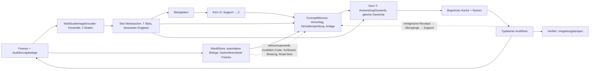

# Integrierte latente Architektur und Umsetzung

Stand 23. September 2026 (konsolidiert). Angenommener Architektur- und
Umsetzungsvertrag; Alex hat die Detailwahl delegiert. Entwurf und Implementierung:
Claude Opus 5.5 (`high`); unabhängige Prüfung, Reproduktion und Läufe: Codex.
Verbindet das [Gesamtziel](integrated-latent-agent-goal.md), den
[Multiskalenvertrag](multiscale-modality-design.md), den [latenten Kern](latent-core.md)
und den [Abstraktionsversuch](shared-abstraction-spec.md). Dessen Spezifikation bleibt
**unverändert**; die hier beschriebene Konfiguration ist ein **eigener Versuch (R1)**,
nicht dessen Arm A.

## 0. Aktueller Status

- **Implementiert:** die vollständige R1-Referenzkette (Dateien §13). **712 CPU-Tests
  bestanden**, zusätzlich die 10 unabhängigen Reviewtests in ihrer abschließenden,
  verstärkten Fassung. Logs und Quellhashes:
  `runs/reviews/integrated_architecture_20260923/codex-validation.json`.
  Regelmäßige Checkpoints an Validierungsschritten sind ergänzt; der Resume-Test
  bleibt bitgleich (`…/periodic-checkpoint-tests.log`).
- **Erster Lernlauf:** 15 Minuten Wahrnehmung, 9324 Updates auf unveränderlicher
  Quellkopie (`runs/latent_agent_r1/source_dev_20260923/` → `…/dev_perception_20260923/`).
  Frische Validation: Attribute 100/99,41/99,71/99,90%, Maschinenzeiger 100%,
  Objektzeiger 99,90%, **Lampe 91,60% – C1 verfehlt**. 1,746 GiB reserviert;
  Checkpoint, Rohmetriken und strukturell geprüfter Bericht erhalten. CPU-Diagnose
  und 15-min-Strukturdiagnose laufen; Pixel-Kerntraining wartet auf die C1-Reparatur.
- **Kein vollständiger gelernter R1-Nachweis.** Smoke- und Checkläufe prüfen nur
  Software. Kein Gesamtgate ist als Fähigkeit bestanden,
  keine Aussage zu natürlichen Daten, und R1 ist nicht das vollständige Zielmodell.
- **Historische Belege** (nicht Teil des aktuellen Vertrags): Reviewbefunde R1–R18
  `runs/reviews/integrated_architecture_20260923/codex-review-findings.md`;
  unkonsolidierte Fassung dieses Plans `…/plan-before-consolidation.md`; Briefs und
  Antworten `…/{architecture,reconciliation,implementation,repair,final-protocol}-*`;
  Testlogs `…/r1-*.log`; Softwareläufe `runs/latent_agent_r1/{smoke,repair_check,protocol_check_cpu}_2026-09-23/`.

## 1. Zielbild, Referenzintegration und Grenzen

Zielbild: ein kompakter Agent verarbeitet Beobachtungen, gespeicherte Erfahrung,
Aufgaben, Konzeptcodes und hypothetische Aktionsfolgen in kompatiblen latenten
Räumen; Text/Bild/Audio/Video sind Ein-/Ausgabeformate, interne Übergänge dekodieren
und re-enkodieren sie nicht. Gemeinsame Breite belegt keine gemeinsame Semantik.

**R1 „RuleWorld-64“** ist die erste **Referenzintegration**: derselbe eingefrorene
Agent nimmt Pixel wahr und bindet sie, erschließt aus eigenen wahrgenommenen
Übergängen Regeln, legt Konzepte selbst an, findet sie nach Neustart wieder, sagt
vorher, plant zweischrittig, führt aus, lässt unabhängig verifizieren, lernt aus der
eigenen Rückmeldung und leitet nach Quellenkorrektur mit Invalidierung neu ab. Ein
R1-Erfolg belegt kontrollierte, synthetische, vollständig beobachtete, deterministische
Fähigkeit – nicht natürliche Kamera-, Sprach-, Werkzeug- oder domänenübergreifende
Fähigkeit. §10–§11 ordnen R1 in die Gesamtarchitektur ein.



## 2. Umgebung und Aufgabe

**Szene** (64×64 RGB, deterministischer Torch-Renderer, 8-Bit-quantisiert, keine
Verdeckung, feste Kamera): **zwei unabhängig gesteuerte Maschinen** oben und **vier
statische Objekte** unten, mit Positionsjitter; sieben Entitäten inklusive Hintergrund.
Jede Maschine hat eine *Art* (Körpertextur), eine verborgene Regel und eine Lampe
`s_m∈{0,1}`. Objekte `a∈{0..3}^4`: Farbe, Form, Größe, Muster. Nur Lampen ändern sich.

**Arten/Regeln:** 72 prozedurale Texturen (48 Train, 8 Validation, 16 Test); die
280er-Grammatik des Abstraktionsversuchs mit deterministischem Gruppensplit im Code
(`pathwm/data/rule_world.py`, SHA256-Ordnung, Salz `shared-abstraction-v1`, einmal per
fixiertem Hash gegen die genehmigte Liste geprüft; keine Laufzeitabhängigkeit von
`runs/`). Art→Regel wird **pro Welt/Episode neu gezogen**, sodass nach Neustart nur
das Laufzeitgedächtnis die Regel liefert. Testwelten: Testtexturen, Testregelgruppen.

**Aktion:** `press(machine_xy, xy_a, xy_b)`; der Ausführer löst Koordinaten über
seine eigene Entitätsmaske auf; `ActionRecord` verlangt endliche Koordinatenpaare.
Receipts `ok`, `miss`, `same_object`, `budget_exceeded`; nur `ok` ändert genau die
gezielte Maschine (`u=1`): Kategorie/Relation `s'=h(a,b)`, open `s∨m`, close `s∧¬m`,
toggle `s⊕m`. Warten ändert nichts (keine Drift) und ist keine Aktion; die `u=0`-Fälle
des Spec entfallen bewusst. Floors (copy-s, operator-only, majority, konstant; auf `y`
bzw. `Δ=s'⊕s`) werden für diese Verteilung enumeriert.

**Faktorisierte Dynamik (deklarierte Vorannahme):** nicht gezielte Maschinentokens
bleiben unverändert; T sagt nur die gezielte Maschine vorher.

**Demonstrationen:** Vor jedem Press setzt der Demonstrator beide Lampen uniform
(sichtbar); Paare uniform; je Szene 8 Presses pro Maschine. Support, Queries und
Rolloutketten sind symbolisch disjunkt in `(a,b,s)`; ist das unerfüllbar, brechen
beide Sampler mit Fehler ab.

**Evaluationsleben (Gewichte eingefroren):** (1) Erwerb A,B mit je `N∈{8,32,128}`
Übergängen; (2) Ablenkung C,D je 32; (3) Neustart aus Store+Blobs; (4) Nutzung: 64
Vorhersagequeries je Art, 16 Zweimaschinen-Zielaufgaben; (5) Korrektur: (a) ein
korrumpierter Erwerbsübergang von A wird von der Quelle per `supersede` ersetzt,
(b) 24 neue wahre Übergänge von B (falsche Hypothese, gleiche Regel), (c) unbelegter
Testimony-Claim für A; (6) erneute Nutzung.

**Formaler Familienplan:** Die abgefragten Regeln A/B der vier Leben je Supportstufe
folgen `FAMILY_SCHEDULE` = (category, relation), (open, close), (toggle, category),
(relation, toggle) – jede Familie bzw. jeder Operator auf jeder Stufe, identisch über
Seeds, Stufen und Kontrollen, konkrete Testregel zufällig innerhalb der Familie, nie
leistungsabhängig. Ältere Leben mit uniform gezogenen Regeln sind Entwicklungsdaten.

**Ziele und Schichten:** Ziel = Lampenvektor; Budget/Horizont **zwei** Presses. Ein
unabhängiges BFS bestimmt `already` (15 %), `reach1` (35 %), `reach2` (25 %),
`unreachable` (25 %); höchstens 200 Szenenziehungen, danach `StratumUnavailable`
(gezählt). Ein Zweischritterfolg ist ein begrenztes faktorisiertes Planungsresultat.

## 3. Aufgaben- und Nutzenvertrag

`TaskContract.utility()` ist die einzige Nutzenfunktion für Planer und Auswertung:
`stop` mit verifizierten Lampen = Ziel +1, falscher Stopp −1, `abstain` −0,25, jede
nicht abgelehnte Ausführung −0,05; Presses über Budget und veraltete Pläne werden ohne
Zustandsänderung und Kosten abgelehnt und gezählt.

Der Planer kennt nur Wahrnehmung, Gedächtnis und `TaskContract`, nie Simulator oder
Oracle. Er vergleicht `stop` jetzt (`p=Π_m P(Lampe_m=g_m)` aus dem wahrgenommenen
Lampenkopf), `abstain` jetzt und jede Folge aus ≤ verbleibendem Budget (≤24 Aktionen,
≤600 Folgen, exhaustiv) über denselben Erwartungsnutzen, führt den ersten Press der
besten Folge aus, nimmt Maschinen **und** Objekte neu wahr und plant neu. Bereits
erreichte Ziele sind die Option ohne Press; terminal wird einmal bewertet. `p` stammt
vom ungewichteten Outcome-Kopf nach deterministischem Rollout (deklarierte Näherung).
Der Agent behauptet nie Unerreichbarkeit; nur der Evaluator bewertet `abstain` bei
`unreachable`.

## 4. Wahrnehmung, Bindung und Kern

**Quelle:** bestehender `MultiScaleImageEncoder(64, patch 4, levels 2, depth 1)` →
`FeaturePyramid` (16×16 und 8×8, 320 Tokens mit Positionen, Zeiten, Masken);
unmutiert, nicht persistiert; autoritativ sind die Frames.

**Slot-Verbraucher** (`pathwm/models/slots.py`): Slot Attention (7 Slots, Breite 64,
3 Iterationen, gelernte Seeds; Padding trägt keine Masse) liest beide Skalen –
**ausdrücklicher Engpass** 320→7 –, dazu Broadcast-Decoder (RGB+Alpha). Nur im Training
und offengelegt: Maskenzuordnung, Attribute, Lampe und Slottyp, zugeordnet per exakter
Permutationssuche an den Umgebungsmasken.

**Bindung:** Maschine/Rolle = Slot mit maximalem Alpha am Aktionspixel; Agenten-
maschinen = zwei Slots höchster Maschinenwahrscheinlichkeit, nach x geordnet;
Aktionsziel eines Slots = sein stärkster gewonnener Pixel.

| Grenze | Form | Status |
| --- | --- | --- |
| `rgb` | `[B,1,3,64,64]` aus uint8 | autoritativ, SHA256-Blob |
| `pyramid` | 320×64 + Masken/Zeiten | abgeleitet, pro Aufruf |
| `slots`/`alpha`/`type` | `[B,7,64]`/`[B,7,64,64]`/`[B,7,3]` | abgeleiteter, begrenzter Cache |
| Belegtoken `e` | `[≤128,64]` + Maske | `MLP_ev([m_pre,a_pre,b_pre,m_post])` |
| Code `Z` / Schlüssel `k` | `[4,64]` / `[32]` | abgeleitete Store-Komponenten |
| Outcome-Logit / `m̂` | `[B]` / `[B,64]` | Vorhersage mit Read-Set / hypothetisch, nie Beleg |

**Geteilter Kern** (`pathwm/models/latent_core.py`): ein Pre-LN-Block (Cross-, Self-
Attention, FF 64→256→64, vier Köpfe) mit **denselben Gewichten** für G
(`Z = LN(Block^L(Z_seed, [e_null; E_S]))`) und T (`[m_pre, a_pre, b_pre]` liest `Z`),
`L=2`. Köpfe: ungewichtetes Outcome-Logit, residualer nächster Maschinentoken,
Schlüssel. Queries im Batch kommunizieren nicht.

## 5. Training

- **S0 Audit (CPU):** 280 verschiedene Funktionen, unabhängige Skalarprüfung,
  Split-Hash, Floors über alle 131 072 Eingaben, Renderer/Ausführer/BFS, Schichten.
- **S1 Wahrnehmung:** `RGB-MSE + 0,5·(Masken-CE + Attribut-CE + Lampen-BCE + Typ-CE)`
  auf Trainingsarten, Validation auf Validationsarten; danach eingefroren.
- **S2 Kern** (Wahrnehmung eingefroren, `no_grad`): Episoden mit neu gezogener
  Trainingsregel, `N=0` (p=0,05) sonst aus {8,16,32,64,128}, 32 Queries, eine echte
  Zweipress-Kette; jede Szene wird nur in ihren vier Lampenkonfigurationen enkodiert
  (Test: Cache = Live-Enkodierung); Rollout-Objekttokens aus der Anfangswahrnehmung.

  ```
  L = BCE(outcome, s')                                   [ungewichtet]
    + Σ_k=1..2 ‖m̂_k − sg(m_post,k)‖² / var_train         [wahrgenommene Post-Slots]
    + 0,5 · BCE(outcome(rollout_2), s'_2)
    + 0,2 · InfoNCE(Schlüssel; gleiche Trainingsart = positiv, nur Loss)
  ```
  Der gewichtete Spec-Loss wird nicht verwendet; ν wird aus `ŷ=1[p≥0,5]` gegen die
  Floors berechnet. AdamW 3e-4, Clip 1, FP32.
- **S2s Strukturdiagnose:** derselbe Kern auf `SymbolicSlots` mit exakten Masken und
  gelieferter Konzeptzuordnung; Symbol-Embeddings und Schlüsselkopf eingefroren, **ohne**
  Schlüssel-InfoNCE (der Maschinentoken trägt kein Aussehen), kein Abrufanspruch; nur
  zur Fehlerlokalisierung, nie ein Pixelgate.
- **S3 Evaluation:** kein Optimizer, `evaluation_mode`, Parameter-/Buffer-Hash je
  Lebensphase.

## 6. Gedächtnis, Bindung, Rückkopplung und Revision

`ConceptMemory` (`pathwm/world_state/concepts.py`) besitzt genau einen `WorldStore`
mit lebensdeckenden `Limits` (Überlauf atomar abgelehnt), hashgeprüfte Frame-Blobs und
begrenzte abgeleitete Caches (LRU, Verdrängungen gezählt). `ConceptAgent` ist der
Laufzeitbesitzer (Modelle, Gedächtnis, Planer), analog zu `WorldSession`.

| Inhalt | Store-Abbildung |
| --- | --- |
| Übergang | `observation`-Event, `add_evidence("rule_world_camera","transition", content_ref, content_hash, data={action, receipt})`; Szenenblick `modality="image"` |
| Testimony | `observation`, `source="testimony"`, `modality="claim"`; nie Support |
| Instanz | `kind="instance"`; `appearance` (`observed`), `transitions` (`inferred`, `evidence`=erfolgreiche Übergänge, `parents=[appearance]`), `binding` (`inferred`, `parents=[appearance, transitions]`) + `instance_of` |
| Konzept | `kind="concept"`; `key`, `code` (`inferred`, `parents`=unterstützende Bindungen, `evidence`=aktiver Support, `model_version`=Kernhash) |

**Revision:** `retract_evidence` nur in `correction`-Events derselben Quelle;
`supersede` in einem `observation`-Event mit neuem Beleg gleicher Quelle/Modalität,
nie auf bereits widerrufenen Ersatz. Invalidierung erfasst direkte Belegnutzer,
transitive `parents`-Nachfahren, Relationen mit widerrufenen Belegen (auch `same_as`)
und Relationen mit invalidierten Komponenten-Endpunkten. Kein Wiederaufleben;
Neuberechnung erzeugt neue IDs; ein identischer Retry des alten Events reaktiviert
nichts. Gleiche Pixel sind als neue Beobachtung mit eigener Zeit/ID gültig.
Historische Revisionen bleiben rekonstruierbar.

**Abruf und Bindung:** Vorschlag Top-3 nach Schlüsselkosinus; ab m≥4 Übergängen
Verhaltensprüfung (Log-Likelihood unter `T(·,Z_c)` gegen `Z_neu=G(Sitzung)` minus λ):
binden oder neu anlegen (`conflicts_with` bei ähnlichem Aussehen, aber verfehlter
Prüfung). Ohne Übergänge nur Aussehen (≥τ, `verified=false`, kein Support).

**Rückkopplung eigener Handlungen:** Erfolgreiche eigene Presses und Claim-Tests
nehmen denselben Erwerbspfad: Instanzübergänge erweitern, Bindung neu ableiten,
Support/Code lazy neu berechnen. Fehlgeschlagene Receipts bleiben Rohbelege und lehren
nie. Unter m<4 ist keine Verhaltensprüfung möglich; gewählt ist Support bei
Aussehenswert ≥τ_feedback (Vorgabe 0,8, auf Validation zu kalibrieren; abschaltbar
als Kontrolle `feedback_support=False`). Verworfene Alternativen: warten bis m≥4 (lernt
bei zwei Presses praktisch nie) oder Konsistenzprüfung gegen den leeren Code (verwirft
korrigierende Gegenevidenz). Risiko: Kontamination bei falscher Aussehenszuordnung,
messbar über C3 und die Kontrolle.

**Support und Read-Sets:** Support = aktive erfolgreiche Übergänge unterstützender
Instanzen, höchstens die 128 jüngsten; `Z = G(Support)`. Read-Sets pinnen
`(Komponenten-ID, Revision)` und Modellversionen; aktuell heißt außerdem „noch die
neueste Ableitung ihres (Entität, Name)“. Geprüft vor jeder Antwort und vor jedem
Press; veraltete Pläne werden abgelehnt und neu geplant, unbeteiligte Read-Sets bleiben
gültig. Nach einer Belegreparatur bleibt die frühere Bindungsentscheidung mit neuen
Parents erhalten (keine automatische Neuverifikation).

**Modellversionen:** `ConceptMemory.load` lehnt jede Versionsänderung ab. Eine
belegbasierte Migration (aus den gespeicherten Frames neu enkodieren, neu binden, neu
berechnen) ist ein zurückgestellter Vertrag (§11).

## 7. Abnahme (Gates unverändert)

Alle C-Gates messen die **volle Pixelkette**; Diagnosen ersetzen nie ein Gate.

**I – Softwarevollständigkeit** (100 %): Hash-Gleichheit je Lebensphase, kein
Optimizer in S3; Neustart reproduziert Antworten auf 1e-5; vergiftete verborgene Felder
ändern keine Agentenausgabe; Planer ohne Umgebungszugriff; nach Revision keine veralteten
Lesezugriffe, `Z = G(aktiv)` auf 1e-5, gleich der sauberen Referenz, veraltete Pläne
abgelehnt, unbetroffene Konzepte bitgleich; Receipts, Klickauflösung, gemeinsamer
Nutzen, Cache = Live. Eine nicht ausgeführte Laufzeitprüfung gilt als nicht belegt.

**C – kontrollierte Lernfähigkeit** (formal: 3 Trainingsseeds, einseitige t-LCB):

| Gate | Kriterium |
| --- | --- |
| C1 Wahrnehmung | je Attribut ≥0,95; Lampe ≥0,99; Maschinenzeiger ≥0,99; Klick→Slot ≥0,97 |
| C2 Erschließen | bei N=128 ν≥0,7 für Kategorie, Relation und jeden Übergangsoperator; LCB(ν_voll−ν_leer)>0; auf informativen Queries LCB der Verschiebung zur vertauschten Regel >0 (Abdeckung berichtet); ECE(10)≤0,05 als Endlichstichprobenbefund |
| C3 Abruf | wiederkehrend korrekt ≥0,90; neue Art neu angelegt ≥0,90; falsche Verschmelzung ≤0,10 |
| C4 Nutzung (N=128) | LCB(ν_nach Neustart−ν_vor)≥−0,03; verifizierter Erfolg `reach1`+`reach2` ≥0,85, `already` ≥0,90; `abstain` bei `unreachable` ≥0,85; falsche Stopps ≤0,10; LCB(Nutzen−Nutzen_leer)>0 |
| C5 Korrektur | (a) nach `supersede` = saubere Referenz (1e-5); (b) gepaartes Seed-LCB(ν_nach−ν_vor)>0 für B bei N0=8, A bitgleich; (c) Testpress ≥0,95 und Endantwort folgt der Beobachtung ≥0,95 |

C5c misst die deklarierte Testimony-Regel plus exakten episodischen Abruf der eigenen
Beobachtung, keine gelernte Quellenbewertung; die Konzeptebene nach Rückkopplung wird
getrennt berichtet. ν≥0,7 gilt nur für R1; die 0,8-Gates des Abstraktionsversuchs
bleiben dort unverändert.

**Status und formale Zulässigkeit:** Jedes Gate ist `pass`, `fail`, `incomplete`
(fehlende Messung, nicht ausgeführte Prüfung, nicht verfügbare Schicht, Gruppe mit nur
einer Klasse) oder `ineligible`. Formal zulässig sind nur genau drei Evaluationen mit
verschiedenen deklarierten Trainingsseeds und Checkpoints (Wahrnehmung und Kern) und
identischem vollem Protokoll: `test`, volle Modellgröße, N=8/32/128, je 4 Leben, 64
Queries, 16 Ziele, 32/24 Ablenkungs-/Gegenevidenzübergänge, `FAMILY_SCHEDULE`, gleicher
Evaluationsseed, Quellcode und Floors. Doppelte Pfade werden abgelehnt; die Prüfung
übersteht den JSON-Transport des `gates`-Stadiums.

**Nur berichtet:** leeres Gedächtnis, permutierte Supportlabels, Floors, Zufalls- und
Ohne-Konzept-Planer, Loop-Budgets L∈{1,2,4}, N-Kurve, Oracle-Abruf, Strukturdiagnose,
Familienabdeckung. Ein Voll-Evidenz-Kontextarm ist in R1 bewusst nicht implementiert.

## 8. Ressourcen, Stufen und Iteration

FP32; `--max-reserved-gib` (Standard 6) wird nach jedem Update bzw. Leben geprüft,
Überschreitung speichert den Checkpoint und hinterlässt einen Fehlstatus. Berichtet:
reservierter/allokierter und Gerätegesamtspeicher, Parameter, Updates/s, Lebenslaufzeit,
Blob- und Store-Bytes nach dem finalen Speichern, Cachegrößen. Zeit- und
`--stop-after`-Stopps sind bewusste, fortsetzbare Unterbrechungen.

```bash
OMP_NUM_THREADS=2 MKL_NUM_THREADS=2 .venv/bin/python -m experiments.latent_agent --stage check --output runs/<neu>/check
.venv/bin/python -m experiments.latent_agent --stage audit --output runs/<neu>/audit
.venv/bin/python -m experiments.latent_agent --stage perception --max-minutes 15 --device cuda --output runs/<neu>/perception
.venv/bin/python -m experiments.latent_agent --stage core --perception runs/<neu>/perception --max-minutes 15 --device cuda --output runs/<neu>/core
.venv/bin/python -m experiments.latent_agent --stage symbolic --max-minutes 15 --device cuda --output runs/<neu>/symbolic
.venv/bin/python -m experiments.latent_agent --stage evaluate --core runs/<neu>/core --population validation --device cuda --output runs/<neu>/evaluate
.venv/bin/python -m experiments.latent_agent --stage gates --evaluations E1 E2 E3 --output runs/<neu>/gates
```

Jeder Lauf besitzt Rohmetriken, ggf. Checkpoint, `result.json` und `report.html`
(bestehender Renderer; Ergebnis- und Reportstatus getrennt). Entwicklung auf Validation
darf protokolliert repariert werden; die Testpopulation bleibt versiegelt und wird je
eingefrorenem Checkpoint einmal ausgewertet; ein reparierter Folgelauf ist ein neuer
Versuch mit frischen Testwelten und ausgewiesener Zweitexposition der Testregelgruppen.
Formale Iterationszahlen werden aus den gemessenen Entwicklungskosten **vor** formalen
Läufen hier eingetragen; vorläufige Obergrenze 12 GPU-h. Eskalation: C1 nach
dokumentierter Reparatur verfehlt (Rückfall DINOv2 ViT-S/14, lokales Asset, als
eigene Variante), Budget >12 GPU-h, jede Leckage.

**Smoke-Profil (nur Softwareprofilierung, 30 Updates, RTX 3050, volle Modellgröße,
FP32; `runs/latent_agent_r1/smoke_2026-09-23/gpu/`):**

| Stufe | Updates/s | max reserviert | Parameter |
| --- | --- | --- | --- |
| Wahrnehmung (B=32) | 7,9 | 1,74 GiB | 220 k |
| Kern (16 Episoden, N≤128) | 0,94 | 4,37 GiB | 119 k trainierbar |
| Strukturdiagnose (vor Einfrieren der Symbole) | 5,1 | 1,89 GiB | 121 k |
| Ein Leben (N=128, alle Kontrollen) | 22 s | 0,08 GiB | – |

Daraus grob: ≈7000 Wahrnehmungs- bzw. ≈850 Kernupdates je 15 min; der Kern wird von
der pro Update neu gerechneten eingefrorenen Wahrnehmung dominiert.

## 9. Optionaler nächster Schritt: begrenzte Prepare-once-Trainingsbank

Nicht umgesetzt; Entscheidung nach Wahrnehmungs- und erstem Kernergebnis.

- **Inhalt:** `S_bank` Trainingsszenen (nur Trainingstexturen, deklarierter
  Generatorseed) × vier Lampenkonfigurationen; je Frame nur 7 Slottokens und die
  Slotindizes an den sechs Demonstrationskoordinaten, plus Szenenstruktur für
  Episodenbau/Labels. ≈7 KB je Szene (FP32), 20 000 Szenen ≈145 MB CPU-RAM. Keine
  Regeln: Art→Regel bleibt je Episode frisch.
- **Identität:** Manifest (Generatorseed, Szenenzahl, Arten, Split-Hash,
  Wahrnehmungs-`state_hash`, Quell-Hash, Datei-SHA256); der Bankhash geht in die
  `Run`-Datenidentität ein, Resume lehnt eine geänderte Bank ab.
- **Trennung:** Validation, Test und alle Leben enkodieren live; begrenzte
  Szenenvielfalt ist eine deklarierte Trainingsvariable, gemessen an live enkodierter
  Validation.
- **Reproduzierbarkeit:** Bankindizes über `Run.sampler`; Äquivalenzprüfung bei Bau und
  Laufstart an fester Stichprobe (Tokens 1e-5, Slotindizes exakt).
- **Grenze:** `build_bank(...)` neben `encode_episodes`, optionaler Bankpfad,
  `--bank-scenes N` (0 = live, Standard); kein Cache-/Trainer-Framework. Alternative:
  Zeiger aus Slot-Attention statt Decoder-Alpha (andere Semantik, eigener Vergleich).

## 10. Gesamtarchitektur: Besitz und Anschlüsse

Unterschieden werden **implementierte Verbindungsadapter** (Code und Kontrakttest,
keine trainierte gemeinsame Nutzung) und **trainierte Verbindungen** (in R1 nur die
Kette Wahrnehmung→Kern→Planer→Gedächtnis in RuleWorld, noch ohne gelerntes Resultat).

| Fähigkeit | Besitzer heute | Anschluss an R1 | Stand |
| --- | --- | --- | --- |
| Multimodale Quelle | `MultiScale{Image,Audio,Text}Encoder` → `FeaturePyramid` | R1 liest die Bildpyramide; weitere Verbraucher lesen über eigene Projektionen | Bild in R1 trainierbar; Audio/Text/Video nicht an den Kern angeschlossen |
| Instanzbindung im Graph | `WorldSession` + `CandidateEncoder`/`AssociationBinder` | `slot_candidates()` erzeugt `Candidate`-Records aus Slots | Adapter + Kontrakttest; untrainiert |
| Teilbeobachtung | `BeliefAgent` (kategorialer Belief, Dynamik, Sitzungsgedächtnis) | `concept_context()` macht `Z` zu einem `ContextEncoder`-Token für den Thinker | Adapter + Kontrakttest; untrainiert |
| Aufgabensteuerung | `TaskRequest`/`TaskPolicy`/`step_task` | R1 nutzt einen festen Ablauf; `TaskPolicy` später als gelernter Steuerer dagegen | nicht verbunden |
| Ausgaben | native Text/Bild/Audio/Video-Decoder, `RecurrentOutputAdapter` | Leser auf dem Arbeitszustand, keine Rückkodierung in den Denkpfad | nicht verbunden |
| Quellengedächtnis | `WorldStore` (Belege, Revision, Snapshots) | dieselbe Implementierung mit Retraktion/Supersede unter `ConceptMemory` und `WorldSession`; noch keine gemeinsame Store-Instanz in einem Agenten | Store implementiert und getestet; Zusammenführung offen (§11.1) |
| Verifikation | Umgebungsverifier (R1), Entscheidungsentwurf | deklarierte vs. verifizierte Erfüllung getrennt | R1-Simulator; allgemein offen |

## 11. Review des Gesamtziels

**Konsistent:** Quellen- und Revisionssemantik liegen in einem gemeinsamen
`WorldStore`; beobachtete, inferierte, vorhergesagte und behauptete Inhalte sind
getrennt; Denk- und Planungszweige schreiben keine Beobachtungen; Aktionen sind
typisierte Records mit Receipts und unabhängiger Verifikation; die Multiskalenquelle
bleibt unmutiert und von mehreren Verbrauchern lesbar; Gewichte bleiben zur Laufzeit
eingefroren, Wissen ändert sich über Belege und abgeleitete Zustände.

**Wesentliche offene Architekturfragen** (für R2 zu entscheiden, keine Routinewahl):

1. **Zwei Laufzeitbesitzer.** `ConceptAgent` und `WorldSession` besitzen je eigene
   Bindungspolitik (Verhaltensprüfung gegenüber `AssociationBinder`-Schwellen) und
   Laufzeitzustand. In einem vollständigen Agenten braucht jede Instanz genau einen
   Identitätsbesitzer; sonst entstehen zwei konkurrierende Wahrheiten über dieselbe
   Entität. Vorschlag: gemeinsamer Store, `ConceptMemory` als Konzept-/Instanz-
   Besitzer, `WorldSession` liest dessen Bindungen statt eigene anzulegen – erst mit
   einem R2-Test, der beide Pfade nutzt.
2. **Aktionsraum zum `BeliefAgent`.** `BeliefDynamics` erwartet einen kontinuierlichen
   Vektor `[B, action_width]`; R1-Aktionen sind typisierte Slot-/Koordinatenrecords.
   Für Teilbeobachtung (T liest Belief-Welttokens) fehlt ein gelerntes Aktions-
   Encoding aus `ActionRecord` sowie ein gemeinsamer Tokenraum (R1 Breite 64 gegen
   Belief-Standard 32). Beides ist Training, kein Adapterdetail.
3. **Instruktion → Ziel.** R1-Ziele sind exakte Lampenvektoren. Die Übersetzung
   natürlicher Aufträge (`TaskRequest`) in prüfbare Zielprädikate ist nicht gebaut; der
   Nachweis für Textaufträge erfordert eigene Daten und Verifier.
4. **Allgemeine Verifikation.** Außerhalb des Simulators gibt es nur domänenspezifische
   Prüfer; unbekannte Zielerfüllung muss sichtbar bleiben.
5. **Modellaktualisierung bei langlebigem Gedächtnis.** Weil autoritative Frames
   gespeichert sind, ist eine belegbasierte Migration prinzipiell möglich; Kosten und
   Bindungsstabilität nach Neukodierung sind ungeprüft.
6. **Wissenschaftlich offen:** ob der geteilte G/T-Kern Regeln aus eigener Wahrnehmung
   erschließt und auf ungesehene Regeln überträgt (C2), ob Rückkopplung mit
   Aussehensbindung mehr nützt als schadet, und ob Teilbeobachtung/Verdeckung das
   Format tragen.

**Externe Eingaben, die wir nicht selbst beschaffen können:** reale Aufnahmen bzw.
eine Freigabe zur Kameranutzung oder ein lizenzierter annotierter Episodensatz für das
Naturdaten-Gate N1 (`data/memory_media_v1/episodes/0LDP7/annotations.json` ist
`pending`); Entwürfe von Annotationen können wir vorbereiten, verbindliche Wahrheit
für eigene Aufnahmen braucht Alex' Bestätigung. Alle übrigen Wahlen (Schwellen,
Budgets, Reparaturen, Bankentscheidung) treffen wir selbst mit Validation und Protokoll.

## 12. Natürliche Daten

COCO64-/Charades-Frames können nur Transport und Ressourcen prüfen, keine Fähigkeit.
N1 wird erst mit annotierten realen Episoden bei eingefrorenem Agenten und vorab
fixierten Adaptern definiert; bis dahin keine Aussage zu natürlichen Daten.

## 13. Dateien

Geändert: `pathwm/world_state/store.py`. Neu: `pathwm/data/rule_world.py`,
`pathwm/models/slots.py`, `pathwm/models/latent_core.py`,
`pathwm/world_state/concepts.py`, `pathwm/evaluation/rule_world.py`,
`experiments/latent_agent.py`; Tests `tests/test_rule_world.py`,
`tests/test_concepts.py`, `tests/test_latent_agent.py` sowie die unabhängigen
`tests/test_latent_revision_review.py`. Wiederverwendet: `models/multiscale.py`,
`models/modalities.py`, `world_state/{records,retrieval,modules}.py`, `io.py`,
`evaluation/report.py`.

## 14. Primärquellen (von Codex am 23. September geprüft)

| Quelle | Übernommenes Prinzip und Grenze |
| --- | --- |
| [V-JEPA 2.1](https://arxiv.org/abs/2603.14482) | dichte, mehrstufige latente Vorhersage; kein lokaler Größen-/Qualitätsnachweis |
| [LeWorldModel](https://arxiv.org/abs/2603.19312) | kompakte latente Dynamik mit Kollapsvermeidung; hier stattdessen eingefrorene Ziele |
| [DINOv3](https://arxiv.org/abs/2508.10104) | Rückfalloption dichter Merkmale |
| [Object Concepts Emerge from Motion](https://arxiv.org/abs/2609.04348) | bewegungsbasierte Instanzsignale; für nicht statische Szenen |
| [DreamerV3](https://www.nature.com/articles/s41586-025-08744-2) | aktionsbedingte latente Folgen für Verhalten |
| [Recurrent depth](https://arxiv.org/abs/2502.05171) | geteilte Wiederholung; Nutzen über Loop-Budgets gemessen |
| [Latent Program Spaces](https://arxiv.org/abs/2411.08706) | aus Support erschlossene Codes; Gültigkeit außerhalb der Familie offen |
| [Titans](https://arxiv.org/abs/2501.00663) | Abgrenzung: Gradientenspeicher ist ein anderer Laufzeitvertrag |

Keine Behauptung, den Forschungsstand zu übertreffen.

## 15. Entscheidungsprotokoll (aktuell gültig)

1. Ungewichteter Outcome-Kopf für Planung und Verhaltensprüfung; eine `utility()`;
   `abstain` = unbekannt; ECE/Brier/NLL nur als Endlichstichprobenbefund.
2. R1 ist ein eigener Versuch (D=64, L=2, geteiltes G/T); der Spec bleibt unverändert.
3. Kontrollen gehen nur über gepaarte Gewinne in Gates ein.
4. Zwei unabhängige Maschinen, Horizont zwei, BFS-Schichten mit endlichem Cap
   (behebt den früheren unerreichbaren Zweischritt-Generator).
5. Store: Quellenkorrektur nur durch dieselbe Quelle, kein Wiederaufleben, gleiche
   Pixel als neue Beobachtung erlaubt, Relationen werden mit invalidiert.
6. Read-Sets pinnen Revision und aktuellen Kopf; Modellwechsel werden abgelehnt.
7. Eigene erfolgreiche Handlungen und Claim-Tests speisen denselben Erwerbspfad;
   fehlgeschlagene Receipts lehren nie; τ_feedback-Wahl mit Kontrolle (§6).
8. Formale Gates: drei unterscheidbare Seeds, volles Protokoll mit Familienplan,
   `incomplete`/`ineligible` bestehen nie; Schwellen unverändert.
9. Strukturdiagnose ohne Schlüsselziel und mit eingefrorenen Symbolen.
10. FP32, ≤6 GiB reserviert mit Laufzeitprüfung, formale Budgets aus Messung.

**Bekannte Grenzen:** ein einziger natürlicher Kopf (schwaches Signal für seltene
Ereignisse möglich); ν≥0,7 ist eine R1-Wahl; Rollouts pflanzen keine Unsicherheit
fort; open und close haben je ein geplantes Leben pro Supportstufe, sodass ihre
Seed-Schranken breit ausfallen; Bindungen werden nach Belegreparatur nicht neu
verifiziert.

## 16. Nächste Lernrunde (kleinster Schritt)

1. Wahrnehmungslauf auswerten: C1-Entwicklungsscreen auf Validation (Attribute,
   Lampe, Maschinen- und Klickzeiger). Verfehlt er deutlich, zuerst Wahrnehmung
   reparieren; der Kern ist ohne verlässliche Zeiger nicht interpretierbar.
2. Gleiche 15-min-Budgets für **Strukturdiagnose** und **Pixelkern** auf dieser
   Wahrnehmung, verglichen über episodisches ν bei N=128 auf Validationsregeln:
   niedrig in beiden → Kern/Ziel reparieren; hoch symbolisch, niedrig in Pixeln →
   Wahrnehmung/Zeiger reparieren; nur wenn der Kern lernt, aber rechenbegrenzt ist,
   die Trainingsbank (§9) umsetzen.
3. Eine Entwicklungsevaluation (Validation, volles Lebensprotokoll mit Familienplan)
   zur Kalibrierung von τ, λ und τ_feedback; danach formale Iterationszahlen und Seeds
   in §8 eintragen, bevor die Testpopulation berührt wird.
