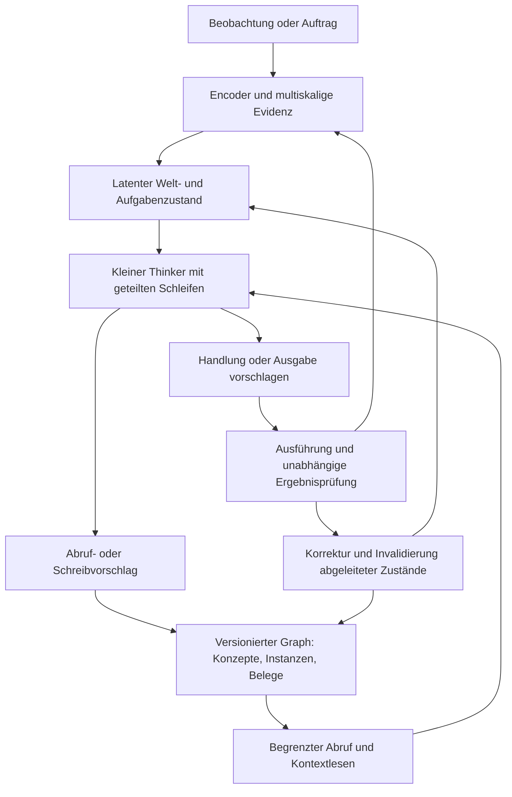

# Integrierter latenter Agent: Ziel und prüfbarer Nachweis

22. September 2026. Alex präzisiert das Forschungsziel. Diese Zielvorgabe verbindet
die bisherigen Teilentwürfe; die unten vorgeschlagene Demonstration ist noch kein
ausgewählter Datensatz, gestarteter Trainingslauf oder bestandener Fähigkeitsnachweis.

## Vom Nutzer festgelegtes Ziel

Ein Agent soll Wahrnehmung, Denken, Handeln und Gedächtnis über kompatible latente
Repräsentationen verbinden. Native Verständigung zwischen Modulen ist bevorzugt;
gelernte Übersetzer sind zulässig. Interne Arbeit soll keine unnötigen Umwege über
ausgeschriebenen Text, gerenderte Bilder oder andere ausgegebene Modalitäten brauchen.
Ein kompakter Kern soll durch Architektur und wiederholte Verarbeitung mit geteilten
Gewichten effektiv tiefer rechnen können. Konzepte und Instanzen sollen sinnvoll
gelernt, gespeichert, abgerufen und mit neuem Wissen verbunden werden. Der Agent
soll seinen Knowledge Graph selbst erweitern und Fehler sowie davon abhängige
Schlussfolgerungen korrigieren können. Gelernte Grundoperationen und interne Abläufe
sollen in verschiedenen Domänen verwendbar sein. Neues Wissen und Korrekturen sollen
zur Laufzeit ohne erneutes explizites Nachtrainieren der Modellgewichte möglich sein.

Alex nennt latente Diffusion als mögliche Vereinfachung schwieriger latenter Pfade.
Das ist eine Mechanismushypothese; der Gesamtnachweis hängt nicht von ihrer Bestätigung
ab. Auch die konkrete Tokenrollen-Tabelle ist ein Entwurf, nicht das eigentliche Ziel.

Die [abstrakte Forschungsdiskussion zum Konzeptlernen](latent-concept-learning-review.md)
prüft auf Alex' Wunsch den aktuellen Stand mit Claude Opus 5.5 bei maximalem Aufwand.
Sie trennt latente Beispiele, erschlossene Konzept-/Programmcodes und deren Suche;
ein vollständiger modaler Decoder ist keine allgemeine Vorbedingung. Funktionale
Voraussetzungen und zeitliche Trainingsreihenfolge werden getrennt. Die konkrete
Methode und der erste Lernpfad bleiben ungewählt.

## Zu prüfende Aussage und ihr Umfang

Nach einem initialen Training kann derselbe eingefrorene Agent aus neuen Erfahrungen
Instanzen, Eigenschaften und ausgewählte neue Konzepte im Gedächtnis bilden, sie für
spätere Aufgaben nutzen und widersprochene Zuordnungen revidieren. Die hierfür nötigen
Wahrnehmungsmerkmale, Lern-/Arbeitsoperationen und Ausführungsschnittstellen müssen
vorhanden sein. Neue Fakten, Kategorien oder gespeicherte Regeln erweitern den
verfügbaren Wissensbestand, ohne die neuronalen Gewichte zu ändern.

Dieser Nachweis umfasst laufendes Lernen durch Zustand, Beispiele, Graph und Abruf.
Ein trainierter Kern kann über erhaltenen Merkmalen auch neue Abstraktionen oder
gespeicherte prozedurale Kombinationen bilden. Er verspricht weder beliebige neue
Wahrnehmungsfähigkeit noch beliebige neue Algorithmen aus unzureichender Evidenz.
Ein neuer Graph-Knoten allein zeigt noch kein
gelerntes Konzept: der Agent muss dessen neue Instanzen erkennen, Gegenbeispiele
unterscheiden und das Konzept in einer weiteren Aufgabe sinnvoll benutzen.

## Gemeinsamer Ablauf

Die Darstellung beschreibt Verantwortungen. Exakte Quellreferenzen, Versionen,
Zeitpunkte und Aktionsargumente begleiten latente Inhalte. Der kleine Transaktions-
und Ausführungscode wahrt diese Verträge; Auswahl, Bindung, Abstraktion und nützliche
Verwendung müssen vom Agenten gelernt werden. Ein Bewertungsoracle darf keine
richtigen Identitäten oder fertigen Konzepte heimlich in dessen Graph schreiben.

Native Kompatibilität heißt funktionierende gemeinsame Lern- und Leseschnittstellen,
nicht nur gleiche Tensorbreite oder erzwungene identische Codes für alle Modalitäten.
Gemeinsame aufgabenrelevante Merkmale können neben modalitätsspezifischen Details
und mehreren Skalen bestehen. Native Leser und kleine Übersetzer dürfen getrennt
verglichen werden; Adapter allein sind kein Scheitern des Integrationsziels.

## Mechanismen und offene Vergleiche

- **Tiefe durch Schleifen:** `z[k+1] = F_theta(z[k], Ziel, Evidenz, Kontext)` nutzt
  dieselben Gewichte mehrfach. Das ist echte zusätzliche Rechentiefe bei geteilten
  Parametern, keine kostenlose Rechenleistung. Schrittzahl, Laufzeit, Aktivierungen
  und Informationsgewinn getrennt betrachten. Mit festen Schleifenzahlen beginnen;
  neue Aufgabenlängen und mehr Schritte als im Training eigens testen.
- **Latente Diffusion:** Ein bedingter Denoiser könnte Kandidaten für einen Plan oder
  einen Zielzustand gemeinsam verfeinern. Er braucht passende Trainingsbeispiele und
  eine Darstellung, in der die Rausch-/Rekonstruktionsaufgabe sinnvoll ist. Er entfernt
  keine logischen oder kausalen Voraussetzungen. Plausible latente Endpunkte können
  unerreichbar sein; Übergänge und tatsächliche Zielerreichung separat prüfen.
- **Begriffe und Einzelfälle:** Instanzen behalten eigene Identität und Historie;
  Konzepte beschreiben wiederverwendbare Gemeinsamkeiten, Beziehungen oder Regeln.
  Membership/Prototypen/Definitionen sind lernbare Hypothesen mit Belegen, keine
  unveränderlichen Vektorcluster. Gegenbeispiele müssen Differenzierung erlauben.
- **Wissenskorrektur:** Alte Behauptungen und ihre Quellen bleiben historisch lesbar.
  Aktuelle Zuordnungen werden revidiert; abhängige Zusammenfassungen, Vorhersagen,
  Abrufcaches und Denkzustände werden invalidiert oder neu berechnet. Der Graph allein
  ist nicht korrigiert, wenn eine falsche Annahme im rekurrenten Zustand weiterwirkt.
- **Wissenszuwachs:** Das initiale Training lehrt Aufnahme, Vergleich, Abstraktion,
  Abruf, Prüfen und Korrigieren über vielfältige Episoden. Die Prüfphase führt neue
  Inhalte über dieselben Operationen zu; initiales Training und spätere Aufnahme
  neuen Wissens werden ausdrücklich getrennt.

Verwandte öffentliche Mechanismen: [Universal Transformers](https://arxiv.org/abs/1807.03819)
untersuchen wiederholte Verarbeitung mit geteilten Gewichten.
[Diffuser](https://diffusion-planning.github.io/) erzeugt Pläne durch iteratives
Entrauschen; das ist kein allgemeiner Nachweis latenter logischer Schlussfolgerung.
[Latent Diffusion](https://arxiv.org/abs/2112.10752) reduziert im Bildbereich den
Generierungsaufwand gegenüber Pixeldiffusion, belegt aber keinen kürzeren Denkpfad.

## Vorschlag für eine vollständige Demonstration

1. **Grundfähigkeiten vorbereiten.** Einen begrenzten Wahrnehmungs-/Aktionsraum und
   überprüfbare Aufgaben wählen. Aufgaben- und Gedächtnisoperationen mit Encoder,
   Thinker und Lesern initial trainieren. Genutzte externe Vortrainingsdaten und
   Adapterfähigkeiten deklarieren. Bestehende kleine Teiltests sind Ausgangspunkte.
2. **Gewichte einfrieren.** Alle lernbaren Parameter und verhaltensrelevanten Puffer
   des neuronalen Modells während der Demonstration unverändert halten. Vorher/nachher Hashes und den
   fehlenden Optimizerpfad prüfen. Zustände, Beispiele, abgeleitete Prototypen und
   Graph-Datensätze dürfen sich ändern und werden protokolliert.
3. **Neues Konzept und neue Instanzen zuführen.** Erst jetzt supportierende und
   abgrenzende Beispiele zeigen. Begriffsname/Code nicht aus einer festen Antwort-
   tabelle verraten; neue Kombinationen verwenden. Agent schlägt Instanzbindung,
   Konzeptbildung und Belegverknüpfung selbst vor. Von außen nur zulässige Eingaben
   und Ausführungsverträge bereitstellen, keine fertigen Graph-Lösungen.
4. **Nach Ablenkung und Neustart anwenden.** Neue Instanzen klassifizieren und eine
   andere Aufgabe lösen, die das neue Konzept erfordert. Arbeitskontext und alle
   nicht als dauerhaft deklarierten rekurrenten Zustände beim Neustart zurücksetzen;
   die Lernsequenz darf nicht in einem verborgenen Kontextpuffer weiterleben.
   Dauerhafte Daten explizit wiederherstellen; Abruf und Quellenabhängigkeit prüfen.
5. **Eine konkrete Annahme widerlegen.** Gegenbeleg zu einer Eigenschaft, Zuordnung
   oder Regel liefern. Prüfen, dass der Agent betroffene Schlussfolgerungen revidiert,
   unabhängiges Wissen bewahrt und frühere Antworten zeitlich richtig einordnet.
   Unbegründete falsche Korrekturen als Gegenkontrolle zuführen; Neuheit/Recency allein
   ist kein Grund, stärkere Evidenz zu verwerfen.
6. **Mehrere Domänen zeigen.** Zunächst verschiedene Domänen mit derselben Kern-
   architektur und offengelegter Vorbereitung testen. Transfer in eine beim Training
   zurückgehaltene Domäne ist ein zusätzlicher, stärkerer Test. Reines Umbenennen
   derselben Aufgabe reicht dafür nicht. Neue Regeln/Kompositionen und anderes
   Wahrnehmungs-/Handlungsverhalten verlangen explizite Kontrollen. Adapter, Regeln
   und Aufgabenprotokolle vor Zugriff auf die Transferdomäne festlegen und deren
   vorherige Domänenkenntnis offenlegen; neue Gedächtnisabläufe mitprüfen.

Eine mögliche erste Aufgabenpaarung ist eine visuelle Objekt-/Interaktionswelt und
ein dokument- oder werkzeugbezogener Arbeitsablauf. Konkrete Domänen, Neuheitsgrad,
Datensätze, Mindestqualität, Seeds und Laufbudgets bleiben vor einem Experiment
festzulegen. Die Nutzerintention wählt den Nachweis, nicht diese Beispielaufgaben.

## Kontrollen und Erfolgskriterien

Die Gesamtaussage verlangt gemeinsam: richtige Wahrnehmungsbindung, sinnvolle neue
Konzeptverwendung, kausal hilfreichen Abruf, tatsächliche Aufgabenlösung, korrekte
Revision ohne fremde Wissensverluste und unveränderte Modellgewichte. Getrennte
Modulerfolge dürfen ein scheiterndes Gesamtergebnis nicht verdecken.

Vorgeschlagene Kontrollen: einzelne Graph-/Gedächtniseinträge entfernen, verfälschen
oder gezielt vertauschen und die spezifisch erwartete Antwortänderung prüfen;
flache Beispiele und ein langer Kontextpuffer gegen Konzeptstruktur bei gleicher
Evidenz-/Ressourcenmenge; vorgegebener
korrekter Abruf/Wahrnehmung nur als gekennzeichnete Diagnose; veraltete gegen
korrigierte Erinnerung; mehrere feste Loop-Budgets. Lösungswissen in IDs, Split-
Artefakten, Basismodellwissen und handgeschriebenen Konzeptregeln kontrollieren.
Bei einer schwachen Wahrnehmung zusätzlich den bedingten, nicht den gesamten
Agentennachweis ausweisen. Diffusion später gegen den einfachen iterativen Pfad
mit gleichen Daten und vergleichbarer Qualität/realer Rechenarbeit vergleichen.
Eine unabhängig bekannte Abhängigkeitsstruktur erlaubt die Messung notwendiger und
unnötiger Invalidierungen. Konzepttests brauchen neue Kompositionen, für die kein
abgespeichertes Beispiel schon die vollständige Antwort enthält. Unabhängige Tests
dürfen dieselbe formale Aufgabensemantik nutzen; weder Trainings- noch Testoracles
dürfen korrekte Antworten als Entscheidungseingabe zum Agenten zurückspielen.

Integrationserfolg, Konzeptgebrauch, Revision, Domänentransfer und Effizienz getrennt
berichten. Die integrierte Machbarkeit erfordert nicht automatisch Überlegenheit
gegen jede Baseline. Diese Vergleiche zeigen, ob Graphstruktur und gelernte Auswahl
über einen einfacheren Speicher hinaus etwas beitragen. Eine Diffusionsvariante
kann einen anderen brauchbaren Qualitäts-/Kostenpunkt bieten; auch daraus folgt
keine allgemeine Überlegenheit.

Prüfen und speichern: Rohantworten/Aktionen, Belege und Graphrevisionen, Lern-/Abruf-
entscheidungen, Fehler vor/nach Korrektur, erhaltene frühere Aufgaben, Parameter-/
Pufferidentität, Laufzeit und Spitzen-VRAM. Schwellen vor Testausführung festlegen;
dieser Entwurf setzt keine nachträglichen Erfolgsgates. Kein Experiment gestartet.

## Wiederverwendung und tatsächliche Kosten

Unveränderte multiskalige Quellen und zugehörige Projektionen einmal vorbereiten.
Graph/Belege und repräsentationsversionierte Konzepte dauerhaft in RAM/SSD halten;
aktive Leser, begrenzter Kontext und Caches belegen GPU-Speicher. Zugriffsauswahl
und erhaltene Information getrennt messen. Gedankenschleifen lesen stabilen Kontext,
bis neue Evidenz oder Revisionen eine Aktualisierung verlangen. Ein Agent darf
komprimieren, muss dabei Informationsverlust und Rekonstruktionskosten ausweisen.

Der vorgeschlagene 6-GiB-Prozessrahmen auf der 8-GiB-GPU ist keine nachgewiesene
Passung. Parameter, Aktivierungen, Gedächtnisverkehr, Decoder, Verifier, Loop- und
Denoising-Schritte sowie das initiale Training gehören in die Gesamtrechnung.
Feste kleine Arbeitsbudgets gehen adaptivem Compute und neuer Diffusion voraus.
Die Umsetzung bleibt kleine Python-Bibliothek plus lesbare Experimentrezepte.

## Heute vorhandene Teile und offene Lücke

Vorhanden sind Belief-/Thinker-Schnittstellen, multimodale Ein-/Ausgabewege und
getestete Mechanik für persistente, versionierte Zustände und Korrekturen. Die
[World-State-Grundlage](world-state-foundation-plan.md) zeigt Lernen auf einer
kleinen Aufgabe mit gelieferten Kandidaten. Sie beweist keine selbstständige
Konzeptbildung aus natürlichen Daten und keinen domänenübergreifenden Agenten.
Der [Rollenentwurf](latent-core.md#welche-latenten-rollen-brauchen-wir-gezielt)
und [Multiskalenvertrag](multiscale-modality-design.md) bleiben Bausteine dieses
Integrationsziels. Bisherige negative Fähigkeitsbefunde bleiben gültig.

## Unabhängige Kritik

Abstrakte öffentliche Forschungsfrage an tatsächliches Claude gemäß vereinbartem
[Review-Verfahren](claude-collaboration-workflow.md). Brief, Antwort und Receipt
liegen unter `runs/reviews/latent_agent_demonstration_v1/`. Keine privaten Quelldaten,
Messungen oder Repository-Inhalte wurden übermittelt. Zwei isolierte Runden sind
abgeschlossen; beide Ausführungen waren erfolgreich. Keine Review-Zustimmung ist
ein Lernnachweis.

Übernommen: vollständiger Reset nichtdauerhafter Zustände, gezielte Speicher-
interventionen, falsche Korrekturen, Konzept-/Kompositionsprüfungen, unveränderte
Adapter vor Transfer, bekannte Abhängigkeiten einschließlich unbetroffener Zweige
und flacher Speicher/langer Kontext als Vergleiche. Der Hauptnachweis benutzt die
eigene Wahrnehmung und Auswahl des Agenten; Oracles dienen nur der Fehlerlokalisierung.

Claude nimmt nach Rückfrage zu pauschale Einschränkungen ausdrücklich zurück:
eingefrorene Gewichte schließen neue Abstraktionen oder prozedurale Kombinationen
über verfügbaren Merkmalen nicht aus; Machbarkeit verlangt keine Überlegenheit
gegen jede Baseline; geteilte Gewichte belegen zunächst Parameterwiederverwendung,
keine Effizienz bei gleicher Qualität. Ebenso sind gemeinsame Aufgabensemantik
bei unabhängig geprüfter Auswertung und sinnvolle alternative Qualitäts-/Kosten-
punkte legitim. Prüfdefinitionen und Rechenkosten bleiben vorab festzulegen.
