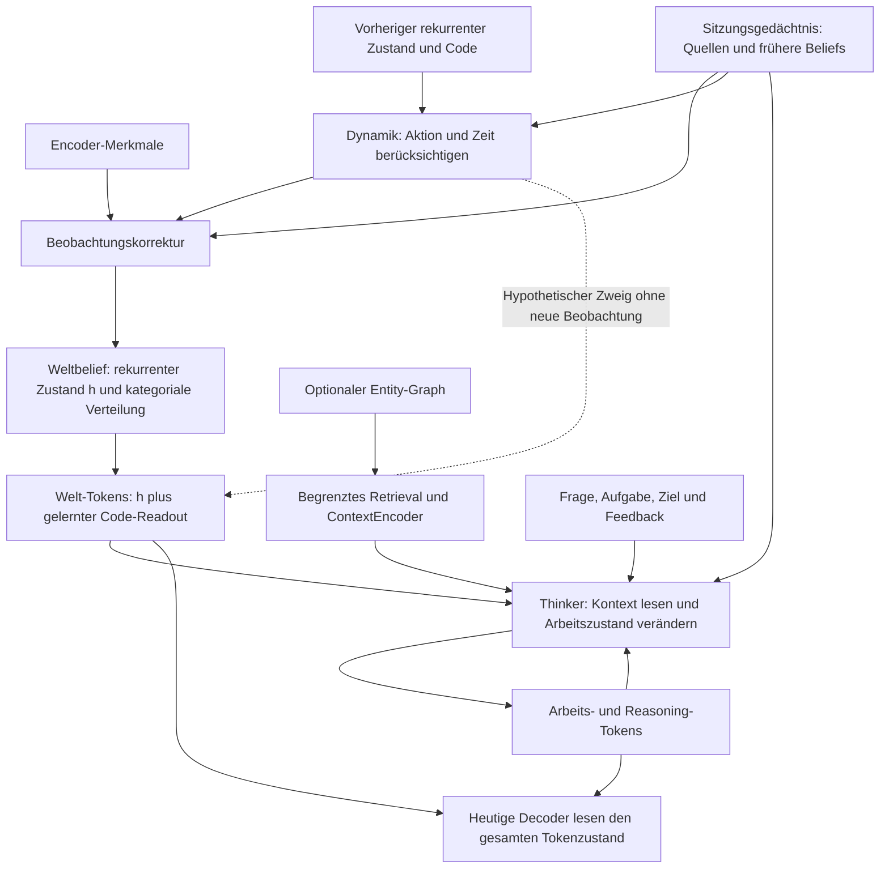
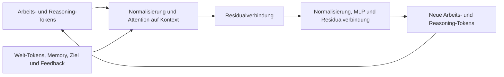
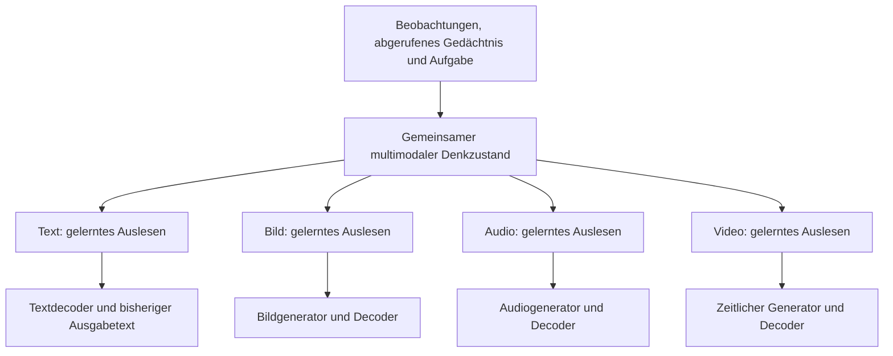
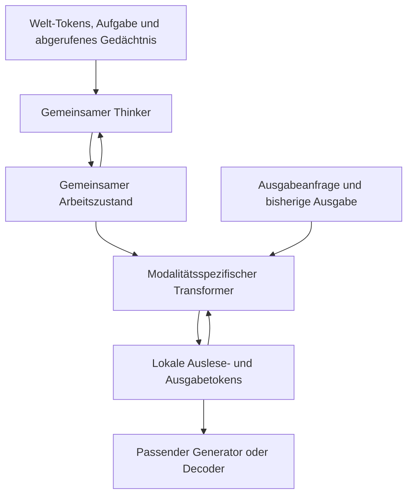

# Der latente Kern und die multimodale Ausgabe

Stand: 15. September 2026, Modellcode `8937b15`. Diese Darstellung beschreibt den
kategorischen `BeliefAgent`, ergänzt um die optionale persistente WorldSession.
Der frühere Gaussian-Agent und die separaten Bild-VAEs sind andere Konfigurationen.
Der Kern ist unverändert; optionale Auslese-Erweiterungen wurden inzwischen im
[Modalitätsvergleich](modality-readout-plan.md) implementiert und getestet. Die
kontrollierten Gesamtaufgaben scheitern weiterhin; keine allgemeine Fähigkeit ist validiert.

## Was heute im Kern liegt

Die Grafik lässt den Ereignis-/Transaktionspfad zum Schreiben beider Speicher weg;
ein Denkdurchlauf schreibt keine neuen Beobachtungen. Das Sitzungsgedächtnis und
der optionale Entity-Graph sind unterschiedliche Speicher mit getrennten APIs.

Der Standardaufbau bei Breite 32 enthält:

| Zustand | Form pro Beispiel | Tatsächliche Rolle |
|---|---|---|
| Rekurrentes `h` | 16 × 32 | Durch die Dynamik fortgeschriebener Kontext. |
| Kategoriales Belief | 8 Gruppen × 8 Logits | Verteilung und ausgewählter Code; keine fest benannten Objekte oder Wörter. |
| Welt-Tokens | 16 × 32 | `h + readout(code)`, abgeleitet statt ein weiterer unabhängiger Weltzustand. |
| Arbeitsbereich | 4 × 32 | Durch internes Denken veränderbare Tokens. |
| Reasoning-Bereich | 4 × 32 | Weitere veränderbare Tokens; der Name garantiert keine erlernte Denkfähigkeit. |

Der kleine Modalitätentest verwendet andere Größen: Breite 16, vier Welt-Tokens und
vier kategoriale Gruppen mit je vier Codes. Größen sind austauschbare Konfiguration,
keine experimentell bestimmte Mindestkapazität. Tokenzahlen sind keine Parameterzahlen.

Die Beobachtungskorrektur aktualisiert die kategoriale Verteilung aus Features,
Prior und Gedächtnis. `h` wird beim dynamischen Fortschreiben berechnet; der
Korrekturblock gibt keine neue `h`-Matrix zurück. Daraus entsteht ein aktualisierter
Welt-Readout. `think()` verändert anschließend nur Arbeits-/Reasoning-Tokens:
`h`, kategoriales Belief, Ereigniszeit und gespeicherte Quellen bleiben unverändert.
Belief-Korrekturen aufgrund interner Schlussfolgerungen brauchen einen ausdrücklich
getrennten Inferenz-/Commit-Pfad; Gedanken werden nicht automatisch Beobachtungen.

## Ein Denkdurchlauf

Die Schleife existiert bereits: Bei `steps=k` wird derselbe Thinker mit geteilten
Gewichten wiederholt aufgerufen. Das Gedächtnis wird pro Durchlauf gelesen.
Die Schrittzahl ist vorgegeben; es gibt keinen Nachweis, dass mehr Durchläufe
automatisch besseres Denken bewirken. Der optionale TaskPolicy/Dispatcher kann
bereits `think`, `recall`, `imagine`, `emit`, `act` und Abschluss vorschlagen.
Er ist kein validierter allgemeiner Prüfer, ob eine Antwort wahr und vollständig ist.

`imagine()` benutzt dieselbe gelernte Dynamik auf einem getrennten hypothetischen
Zustand. Ein solcher Zweig wird nicht von selbst Teil der Denk- oder Antwortplanung;
ein Aufrufer muss Simulationen auswählen und ihre Ergebnisse sinnvoll einspeisen.

## Gemeinsamer Denkraum, modalitätsspezifisches Auslesen

Alex präzisiert: Denken soll im gemeinsamen multimodalen latenten Raum bleiben.
Jeder Decoder soll daraus lernen, was seine Ausgabe benötigt. Falls sein eigener
Auslesepfad nicht reicht, ist ein vorgeschalteter, austauschbarer Adapter eine
Option. Das passt zur bereits [angenommenen Ausgabeschnittstelle](multimodal.md).
Ein universeller sprachlicher Antwortplan ist dafür keine Voraussetzung.

Die Kästen zeigen die beabsichtigte Arbeitsteilung; Auslesen, Generator und Decoder
dürfen Teile desselben Moduls sein. Sie verlangen keine dreifache Verarbeitung.
Die vorhandenen nativen Decoder haben bereits gelerntes Auslesen:

- **Text:** kausale Attention auf den bisherigen Text erzeugt Abfragen an die
  gemeinsamen Zustandstokens. Der Decoder liest während der Ausgabe wiederholt.
- **Bild:** gelernte räumliche Abfragen lesen den Zustand vor der RGB-Projektion.
- **Audio:** vier gelernte Abfragen lesen den Zustand vor der Wellenform-Projektion.
- **Video:** derzeit Bilddecodierung einer zeitlich geordneten Zustandsfolge;
  ein allgemeiner zeitlicher Videogenerator ist damit noch nicht gegeben.

Ein optionaler Adapter kann diese vorhandene Cross-Attention um zusätzliche
Verarbeitung, strukturierte Abfragetokens oder die Projektion in den Latentraum
eines austauschbaren Codecs ergänzen. Anfrage, bisherige Ausgabe und ausgewählter
Kontext können das Auslesen steuern. Die separate Bildstrecke besitzt mit
`ConditionalFeatureGenerator` bereits ein Beispiel für kontextgesteuerte Erzeugung
von Codec-Merkmalen; das ist keine automatisch auf alle Modalitäten übertragene
Fähigkeit. [BLIP-2](https://arxiv.org/abs/2301.12597) zeigt einen verwandten gelernten
Querying-Transformer zwischen Bildencoder und Sprachmodell. Dieses andere Setup
belegt nicht, dass unser kleiner gemeinsamer Zustand für Gespräche ausreicht.

**Auslesen und Erzeugen bleiben verschiedene Aufgaben.** Der Adapter kann
vorhandene Information zugänglich machen und passend anordnen. Inhalt, der im
Zustand und abrufbaren Gedächtnis fehlt, muss erst durch Wahrnehmung, Retrieval oder
begründete Inferenz gewonnen werden. Nicht festgelegte Bild-/Klangdetails können
aus erlernten Generierungsmodellen ergänzt werden; das ist keine Wiederherstellung
verlorener Beobachtungsdetails. Gemeinsame Tensorbreite garantiert weder gemeinsame
Bedeutung noch sprachliche Ausdrucksfähigkeit.

Der Kern soll Inhalte und Beziehungen verarbeiten; die Ausgabezweige lernen ihre
jeweilige Darstellung, etwa Satzaufbau, räumliche Anordnung oder zeitliche Struktur.
Diese Arbeitsteilung muss trainiert und geprüft werden. Aufgabenverluste können
durch Adapter und Decoder in den Kern zurücklaufen; eingefrorene Komponenten sind
eine ausdrücklich zu dokumentierende Trainingsvariante. Belegreferenzen, Quelle,
Zeit, Gültigkeit und Unsicherheit bleiben erhalten. Attention allein beweist keine
Belegtreue. Simultane Ausgaben brauchen außerdem Konsistenz- und Synchronitätstests.

**Nächster vorgeschlagener Vergleich:** den bestehenden Decoder-Auslesepfad gegen
einen zusätzlichen kleinen Adapter testen, mit denselben Aufgaben und dokumentiertem
Gesamtbudget. Erst den gemeinsamen Zustand einfrieren, um den Ausleseeffekt zu
isolieren; danach gegebenenfalls gemeinsam trainieren. Neue Zustandskombinationen,
Fragen und wechselnde Eingabemodalitäten prüfen, einschließlich leerem und
vertauschtem Kontext. Fakten, Vollständigkeit und Ausgabegüte getrennt messen,
ebenso Gesamtparameter, Laufzeit und Speicher. Ein misslungener Probe-Readout beweist
nicht, dass Information verschwunden ist. Ein erfolgreicher stärkerer Readout bei
identischem Zustand zeigt dagegen zugängliche Information.

Der frühere Vorschlag, nur Arbeits-/Reasoning-Tokens als Antwortplan zu lesen,
bleibt eine mögliche Diagnose für die Arbeitsteilung. Er ist weder angenommenes
Pflichtdesign noch der vorrangige Erweiterungsvorschlag. Die anschließenden getrennten
und gemeinsamen Tests sind im Modalitätsprotokoll dokumentiert; keine Variante wurde
als verbesserter Standard übernommen.

## Option: geschachtelte Transformer-Schleifen

Alex schlägt auch geschachtelte Loop-Transformer für diese Verarbeitung vor.
Das kann dieselbe Arbeitsteilung mit wiederholtem statt einmaligem Auslesen
umsetzen: Die äußere Schleife verändert den gemeinsamen Arbeitszustand, eine innere
Schleife verfeinert den lokalen Auslesezustand einer Modalität. Beide bleiben latent.

Pro innerem Schritt liest ein Block den gemeinsamen Kontext per Cross-Attention
und verarbeitet seine lokalen Tokens per Self-Attention/MLP. Die lokalen Tokens
können beispielsweise Textinhalte, Bildpositionen oder Zeitabschnitte vorbereiten;
ihre Bedeutung muss über die Aufgaben gelernt werden. Ein ausgabespezifischer
Block kann seine Gewichte über die Wiederholungen teilen. Das erzwingt keine
Gewichtsteilung zwischen Modalitäten oder zwischen innerer und äußerer Schleife.
[Universal Transformers](https://arxiv.org/abs/1807.03819) liefern einen verwandten
Ansatz für wiederholte Transformer-Verarbeitung; die vorgeschlagene geschachtelte
PATH-WM-Anordnung ist damit nicht validiert.

Für einen ersten Vergleich bleiben die Wiederholungszahlen fest und klein:
vorhandener einmaliger Readout als Referenz, dann zwei oder vier Schritte desselben
Blocks. Die äußere Schleife existiert bereits; innere Adapter-Schleifen sind jetzt
optional implementiert und mit1/2/4 Durchläufen getestet. Mehr Wiederholungen derselben Gewichte erhöhen die
Rechenarbeit, nicht deren Parameterzahl; beim Training kann der Aktivierungsspeicher
wachsen. Ein zusätzliches Modul bringt natürlich eigene Parameter mit.

Text hat außerdem bereits eine autoregressive Ausgabeschleife. Wenn jeder nächste
Token mehrere innere Schritte und diese jedes Mal mehrere äußere Schritte auslösen,
können sich die Kosten multiplizieren. Deshalb zunächst festen gemeinsamen Kontext
während eines inneren Durchlaufs lesen. Erneutes gemeinsames Denken oder Retrieval
bleibt eine getrennte, budgetierte Operation. Keine dynamische Stoppregel hinzufügen,
bevor feste Budgets einen Nutzen zeigen. Wiederholtes Lesen ersetzt fehlende Evidenz
nicht und schreibt weder World State noch Quellenhistorie automatisch um.

Gemessen werden soll, ob wiederholtes Auslesen bei kontrolliertem Gesamtbudget mehr
korrekten Inhalt und bessere Ausgabe liefert. Gegen zusätzliche gewöhnliche Layer
und den bestehenden einfachen Readout vergleichen; Parameterersparnis allein ist
kein Fähigkeitsnachweis. Diese Ergänzung definiert eine erlaubte Architekturvariante.
Der Zweistartwert-Vergleich erreicht keine zuverlässige multimodale Gesamtleistung.
Er testet zwei äußere Denkschritte mit nachgelagertem innerem Auslesen, keine
adaptive Rückkopplung zwischen den Schleifen. Details und negative Ergebnisse
stehen im [Bericht](../runs/modality_readout_v1/formal/report.html).

## Quellstellen

- [Belief-Dynamik, Korrektur und Readout](../pathwm/models/belief.py)
- [Thinker, Denkloop, Task-Dispatcher und heutige Decoder-Anbindung](../pathwm/models/agent.py)
- [Native Textausgabe und Attention](../pathwm/models/modalities.py)
- [Optionaler Graph-Kontext in WorldSession.think](../pathwm/world_state/session.py)
- [Gemessene Modalitätsfähigkeiten und Grenzen](modality-foundation-plan.md)
- [Detaillierte Zeichnungen im Atlas](architecture-atlas.html#14-latent-core)
