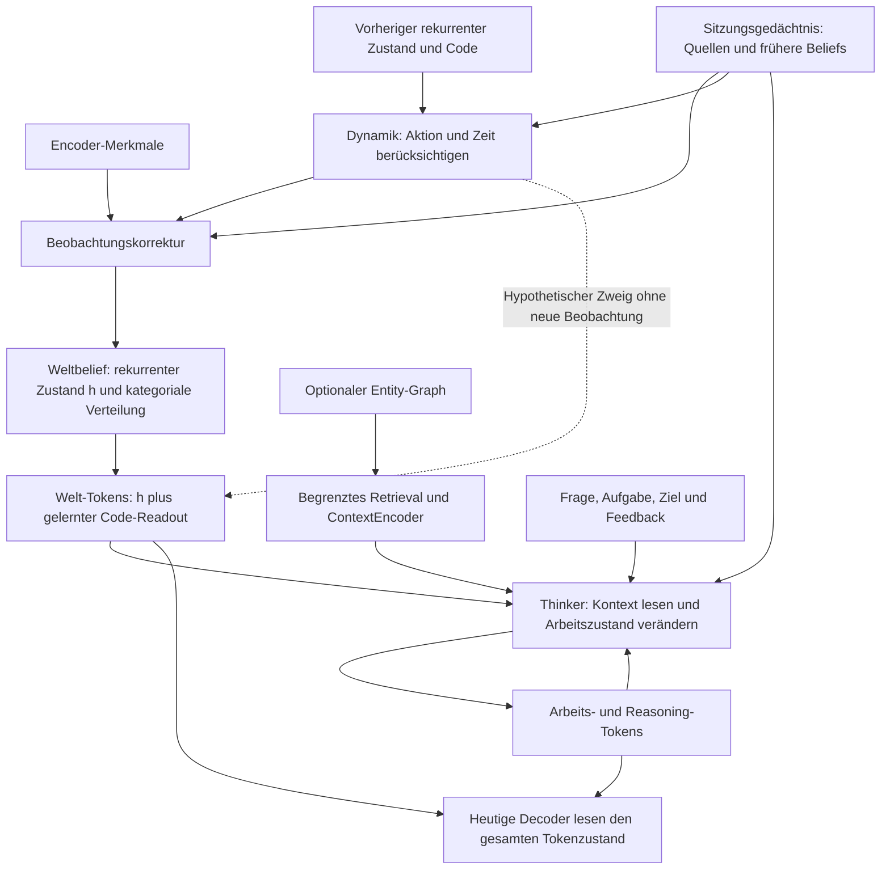
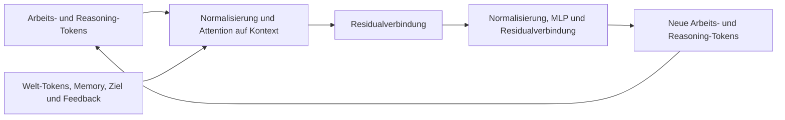
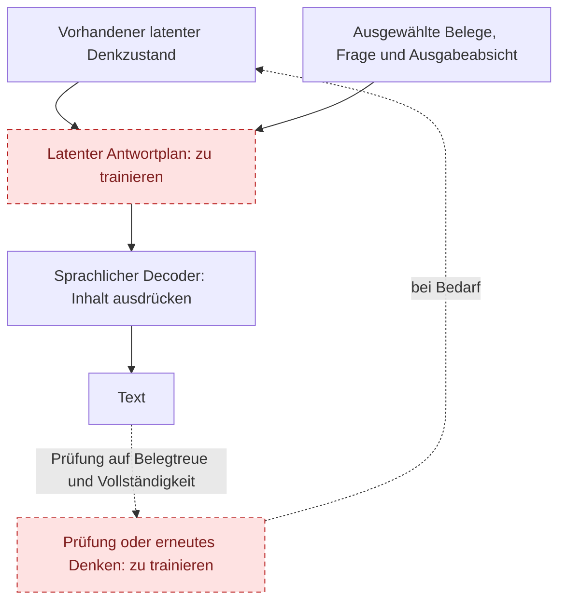

# Der latente Kern und die sprachliche Ausgabe

Stand: 15. September 2026, Modellcode `8937b15`. Diese Darstellung beschreibt den
kategorischen `BeliefAgent`, ergänzt um die optionale persistente WorldSession.
Der frühere Gaussian-Agent und die separaten Bild-VAEs sind andere Konfigurationen.
Neue Antwortplan-Komponenten unten sind Vorschläge, keine implementierte Fähigkeit.

## Was heute im Kern liegt

Die Grafik lässt den Ereignis-/Transaktionspfad zum Schreiben beider Speicher weg;
ein Denkdurchlauf schreibt keine neuen Beobachtungen. Das Sitzungsgedächtnis und
der optionale Entity-Graph sind unterschiedliche Speicher mit getrennten APIs.

Der Standardaufbau bei Breite 32 enthält:

| Zustand | Form pro Beispiel | Tatsächliche Rolle |
|---|---|---|
| Rekurrentes `h` | 16 × 32 | Durch die Dynamik fortgeschriebener Kontext. |
| Kategoriales Belief | 8 Gruppen × 8 Logits | Verteilung und ausgewählter Code; keine fest benannten Objekte oder Wörter. |
| Welt-Tokens | 16 × 32 | `h + readout(code)`, abgeleitet statt ein weiterer unabhängiger Weltzustand. |
| Arbeitsbereich | 4 × 32 | Durch internes Denken veränderbare Tokens. |
| Reasoning-Bereich | 4 × 32 | Weitere veränderbare Tokens; der Name garantiert keine erlernte Denkfähigkeit. |

Der kleine Modalitätentest verwendet andere Größen: Breite 16, vier Welt-Tokens und
vier kategoriale Gruppen mit je vier Codes. Größen sind austauschbare Konfiguration,
keine experimentell bestimmte Mindestkapazität. Tokenzahlen sind keine Parameterzahlen.

Die Beobachtungskorrektur aktualisiert die kategoriale Verteilung aus Features,
Prior und Gedächtnis. `h` wird beim dynamischen Fortschreiben berechnet; der
Korrekturblock gibt keine neue `h`-Matrix zurück. Daraus entsteht ein aktualisierter
Welt-Readout. `think()` verändert anschließend nur Arbeits-/Reasoning-Tokens:
`h`, kategoriales Belief, Ereigniszeit und gespeicherte Quellen bleiben unverändert.
Belief-Korrekturen aufgrund interner Schlussfolgerungen brauchen einen ausdrücklich
getrennten Inferenz-/Commit-Pfad; Gedanken werden nicht automatisch Beobachtungen.

## Ein Denkdurchlauf

Die Schleife existiert bereits: Bei `steps=k` wird derselbe Thinker mit geteilten
Gewichten wiederholt aufgerufen. Das Gedächtnis wird pro Durchlauf gelesen.
Die Schrittzahl ist vorgegeben; es gibt keinen Nachweis, dass mehr Durchläufe
automatisch besseres Denken bewirken. Der optionale TaskPolicy/Dispatcher kann
bereits `think`, `recall`, `imagine`, `emit`, `act` und Abschluss vorschlagen.
Er ist kein validierter allgemeiner Prüfer, ob eine Antwort wahr und vollständig ist.

`imagine()` benutzt dieselbe gelernte Dynamik auf einem getrennten hypothetischen
Zustand. Ein solcher Zweig wird nicht von selbst Teil der Denk- oder Antwortplanung;
ein Aufrufer muss Simulationen auswählen und ihre Ergebnisse sinnvoll einspeisen.

## Kleinste sinnvolle Erweiterung zur Diskussion

Rot/gestrichelt bezeichnet hier noch zu besprechende Erweiterungen. Vorhandene
Schnittstellen sind keine Validierung allgemeiner Sprach- oder Denkfähigkeit.

**Zuerst die Aufgabe definieren, dann zusätzliche Layer entscheiden.** Die jetzigen
Arbeits-/Reasoning-Tokens können zunächst als Antwortplan dienen. Trainieren wir
einen Decoder nur auf diesem Ausschnitt, können wir prüfen, ob der Kern den
Antwortinhalt tatsächlich bereitstellt. Ein kleines separates Modul mit eigenen
Plan-Tokens wäre erst der nächste Vergleich, wenn explizite Trennung oder Kapazität
hilft. Eine weitere große Transformer-Einheit ist dadurch nicht bereits begründet.

Der Plan soll relevante Inhalte, ihre Beziehungen, Unsicherheit und die beabsichtigte
Aussage tragen. Diese Funktionen brauchen keine fest benannten Koordinaten im
Vektor. Belegreferenzen und Herkunft bleiben zusätzlich explizit erhalten; eine
Attention-Karte allein beweist keine Belegtreue. Der Decoder darf weiterhin Wortwahl,
Grammatik und seinen bisherigen Ausgabetext verarbeiten. Ein kleinerer Decoder ist
eine zu prüfende Folge dieser Arbeitsteilung, kein garantiertes Ergebnis.

Erster vorgeschlagener Vergleich: gleiche Daten und Trainingsbudgets, aktueller
Gesamtzustand als Decoder-Kontext gegen nur Arbeits-/Reasoning-Tokens und optional
einen eigenen Antwortplan. Neue Zustandskombinationen und mehrteilige Fragen dürfen
nicht bloß wiederholt im Training vorkommen. Getrennt messen: korrekte Fakten,
vollständige Antwort, sprachliche Qualität, Reaktion auf falschen/geleerten Plan und
Gesamtparameter, Laufzeit sowie Speicher. Die bisherigen vier Wörter beantworten
diese Fragen nicht. Kein neuer Trainingslauf oder Größenentscheid ist hier erfolgt.

## Quellstellen

- [Belief-Dynamik, Korrektur und Readout](../pathwm/models/belief.py)
- [Thinker, Denkloop, Task-Dispatcher und heutige Decoder-Anbindung](../pathwm/models/agent.py)
- [Native Textausgabe und Attention](../pathwm/models/modalities.py)
- [Optionaler Graph-Kontext in WorldSession.think](../pathwm/world_state/session.py)
- [Gemessene Modalitätsfähigkeiten und Grenzen](modality-foundation-plan.md)
- [Detaillierte Zeichnungen im Atlas](architecture-atlas.html#14-latent-core)
