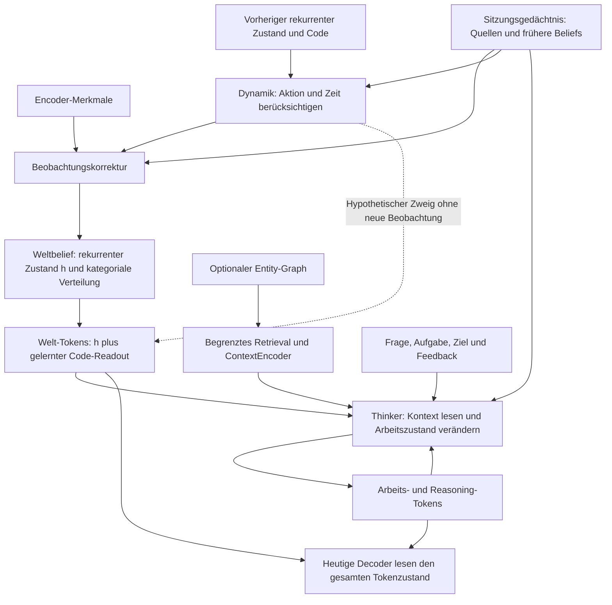
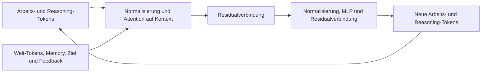
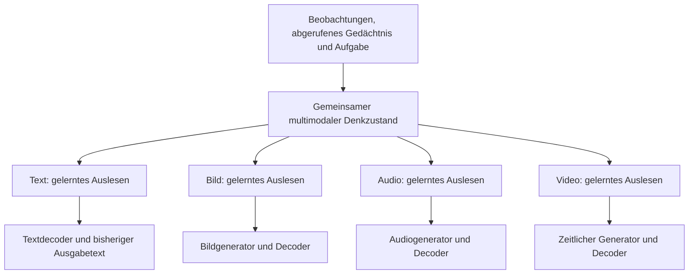
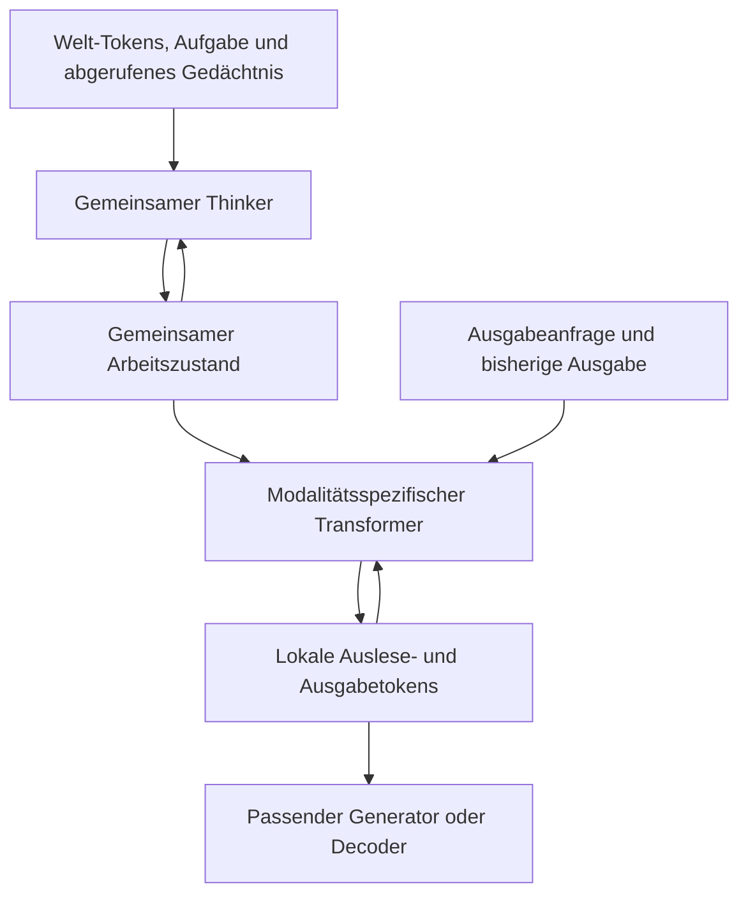

# Der latente Kern und die multimodale Ausgabe

Das [integrierte Forschungsziel vom 22. September](integrated-latent-agent-goal.md)
verbindet die folgenden Bausteine: native latente Zusammenarbeit, geteilte Loops,
Konzept-/Instanzgedächtnis, autonome Wissensaufnahme und Korrektur ohne erneutes
Gewichtstraining während der Demonstration. Mechanismen und Einzelergebnisse bleiben
von diesem noch offenen Gesamtnachweis getrennt.

Stand: 15. September 2026, Modellcode `8937b15`. Diese Darstellung beschreibt den
kategorischen `BeliefAgent`, ergänzt um die optionale persistente WorldSession.
Der frühere Gaussian-Agent und die separaten Bild-VAEs sind andere Konfigurationen.
Der Kern ist unverändert; optionale Auslese-Erweiterungen wurden inzwischen im
[Modalitätsvergleich](modality-readout-plan.md) implementiert und getestet. Die
kontrollierten Gesamtaufgaben scheitern weiterhin; keine allgemeine Fähigkeit ist validiert.

## Was heute im Kern liegt

```mermaid
flowchart TD
    E[Encoder-Merkmale] --> C[Beobachtungskorrektur]
    H[Vorheriger rekurrenter Zustand und Code] --> D[Dynamik: Aktion und Zeit berücksichtigen]
    D --> C
    C --> B[Weltbelief: rekurrenter Zustand h und kategoriale Verteilung]
    B --> W[Welt-Tokens: h plus gelernter Code-Readout]
    D -. Hypothetischer Zweig ohne neue Beobachtung .-> W
    M[Sitzungsgedächtnis: Quellen und frühere Beliefs] --> C
    M --> D
    M --> T[Thinker: Kontext lesen und Arbeitszustand verändern]
    G[Optionaler Entity-Graph] --> R[Begrenztes Retrieval und ContextEncoder]
    R --> T
    Q[Frage, Aufgabe, Ziel und Feedback] --> T
    W --> T
    A[Arbeits- und Reasoning-Tokens] --> T
    T --> A
    W --> O[Heutige Decoder lesen den gesamten Tokenzustand]
    A --> O
```

Die Grafik lässt den Ereignis-/Transaktionspfad zum Schreiben beider Speicher weg;
ein Denkdurchlauf schreibt keine neuen Beobachtungen. Das Sitzungsgedächtnis und
der optionale Entity-Graph sind unterschiedliche Speicher mit getrennten APIs.

Der Standardaufbau bei Breite 32 enthält:

| Zustand | Form pro Beispiel | Tatsächliche Rolle |
|---|---|---|
| Rekurrentes `h` | 16 × 32 | Durch die Dynamik fortgeschriebener Kontext. |
| Kategoriales Belief | 8 Gruppen × 8 Logits | Verteilung und ausgewählter Code; keine fest benannten Objekte oder Wörter. |
| Welt-Tokens | 16 × 32 | `h + readout(code)`, abgeleitet statt ein weiterer unabhängiger Weltzustand. |
| Arbeitsbereich | 4 × 32 | Durch internes Denken veränderbare Tokens. |
| Reasoning-Bereich | 4 × 32 | Weitere veränderbare Tokens; der Name garantiert keine erlernte Denkfähigkeit. |

Der kleine Modalitätentest verwendet andere Größen: Breite 16, vier Welt-Tokens und
vier kategoriale Gruppen mit je vier Codes. Größen sind austauschbare Konfiguration,
keine experimentell bestimmte Mindestkapazität. Tokenzahlen sind keine Parameterzahlen.

Die Beobachtungskorrektur aktualisiert die kategoriale Verteilung aus Features,
Prior und Gedächtnis. `h` wird beim dynamischen Fortschreiben berechnet; der
Korrekturblock gibt keine neue `h`-Matrix zurück. Daraus entsteht ein aktualisierter
Welt-Readout. `think()` verändert anschließend nur Arbeits-/Reasoning-Tokens:
`h`, kategoriales Belief, Ereigniszeit und gespeicherte Quellen bleiben unverändert.
Belief-Korrekturen aufgrund interner Schlussfolgerungen brauchen einen ausdrücklich
getrennten Inferenz-/Commit-Pfad; Gedanken werden nicht automatisch Beobachtungen.

## Ein Denkdurchlauf

```mermaid
flowchart LR
    A[Arbeits- und Reasoning-Tokens] --> T[Normalisierung und Attention auf Kontext]
    C[Welt-Tokens, Memory, Ziel und Feedback] --> T
    T --> R[Residualverbindung]
    R --> F[Normalisierung, MLP und Residualverbindung]
    F --> N[Neue Arbeits- und Reasoning-Tokens]
    N --> A
```

Die Schleife existiert bereits: Bei `steps=k` wird derselbe Thinker mit geteilten
Gewichten wiederholt aufgerufen. Das Gedächtnis wird pro Durchlauf gelesen.
Die Schrittzahl ist vorgegeben; es gibt keinen Nachweis, dass mehr Durchläufe
automatisch besseres Denken bewirken. Der optionale TaskPolicy/Dispatcher kann
bereits `think`, `recall`, `imagine`, `emit`, `act` und Abschluss vorschlagen.
Er ist kein validierter allgemeiner Prüfer, ob eine Antwort wahr und vollständig ist.

`imagine()` benutzt dieselbe gelernte Dynamik auf einem getrennten hypothetischen
Zustand. Ein solcher Zweig wird nicht von selbst Teil der Denk- oder Antwortplanung;
ein Aufrufer muss Simulationen auswählen und ihre Ergebnisse sinnvoll einspeisen.

## Gemeinsamer Denkraum, modalitätsspezifisches Auslesen

Präzisierung vom 22. September: Alex korrigiert die auf Sprachausgabe verengte
Diskussion. Gemeint ist das gesamte multimodale Modell: interne Verarbeitung und
Denken transformieren latente Repräsentationen; Encoder und Decoder lernen dazu
passende Ein- und Ausgänge. Unnötiges Ausgeben und erneutes Einlesen einer Modalität
gehört nicht zum beabsichtigten internen Denkpfad. Dies bekräftigt die bestehende
Richtung, ohne einen neuen Codec oder eine feste Trainingsrezeptur auszuwählen.
Gemeinsame Tensorformen garantieren keine gemeinsame Bedeutung. Lernziele müssen
Inhaltserhalt, aufgabenrelevante Transformation und korrekte Ausgaben prüfen;
Rekonstruktion allein weist kein Schlussfolgern nach. Gemeinsames oder stufenweises
Training bleibt mit expliziten Gradienten-/Freeze-Regeln zu vergleichen.

Audio illustriert dabei zeitliche Abhängigkeiten, erzwingt aber keine vollständig
serielle Berechnung. Autoregressive Tokenvorhersage benötigt vorher erzeugte
Tokens; geeignete akustische Decoder können verfügbare Tokenblöcke gemeinsam
verarbeiten. Andere Generatoren erzeugen Blöcke mit einer anderen Faktorisierung.
Zeitliche Ausgabeordnung, zulässiger Zukunftszugriff und tatsächliche GPU-Ausführung
sind getrennte Eigenschaften. Training und Auswertung müssen zu den gewählten
Masken, Blockgrößen und Zustandsgrenzen passen. Siehe [Sprachentwurf](agent-voice-design.md).
Multiskalenzugriff, Quellenprovenienz und begrenzte wiederverwendbare Kontexte bleiben
erhalten; nötig sind Kontrollen mit fehlendem/vertauschtem Kontext sowie getrennte
Inhalts-, Ausgabe- und Laufzeitmessungen. Kein neuer Fähigkeitsnachweis.

Alex ergänzt als Hypothese, dass ein kleiner Denkern durch latente Aktionstokens
viel leisten könnte. Vorgeschlagene Arbeitsteilung: Kontext lesen, eine latente
Handlung samt erforderlichen Argumenten vorschlagen, ihre erwartete Zustandsänderung
modellieren und mögliche Folgen vergleichen. Die vorhandene Dynamik ist dafür ein
Baustein, kein Nachweis allgemeiner latenter Planung. Reale Ausführung braucht die
Abbildung auf eine konkrete Aktion mit exakten Argumenten und beobachtetem Ergebnis;
siehe [Aktionssemantik](action-semantics-design.md). Kompakte Aktionseinbettungen
ersetzen diese Ausführungsverträge nicht.

Ein kleiner Kern könnte so modulare Wahrnehmung/Ausgabe und gespeichertes Wissen
nutzen, ohne jeden internen Schritt sprachlich auszuformulieren. Ob er genügend
Information und Verarbeitungskapazität behält, bleibt eine Lernfrage. Nächster
kleiner Vergleich wäre ein festes Aufgabenfeld mit gemessenen Aktion-Folge-Paaren,
neuen Handlungskombinationen und unabhängig geprüftem Zielerfolg; gleiche Gesamt-
budgets, externe Module und Speicherzugriffe mitzählen. Kleine latente Dimensionen
allein belegen weder weniger Modellparameter noch gute Planung. Kein neuer Lauf.

Alex präzisiert: Denken soll im gemeinsamen multimodalen latenten Raum bleiben.
Jeder Decoder soll daraus lernen, was seine Ausgabe benötigt. Falls sein eigener
Auslesepfad nicht reicht, ist ein vorgeschalteter, austauschbarer Adapter eine
Option. Das passt zur bereits [angenommenen Ausgabeschnittstelle](multimodal.md).
Ein universeller sprachlicher Antwortplan ist dafür keine Voraussetzung.

```mermaid
flowchart TD
    E[Beobachtungen, abgerufenes Gedächtnis und Aufgabe] --> W[Gemeinsamer multimodaler Denkzustand]
    W --> T[Text: gelerntes Auslesen]
    W --> I[Bild: gelerntes Auslesen]
    W --> A[Audio: gelerntes Auslesen]
    W --> V[Video: gelerntes Auslesen]
    T --> TD[Textdecoder und bisheriger Ausgabetext]
    I --> ID[Bildgenerator und Decoder]
    A --> AD[Audiogenerator und Decoder]
    V --> VD[Zeitlicher Generator und Decoder]
```

Die Kästen zeigen die beabsichtigte Arbeitsteilung; Auslesen, Generator und Decoder
dürfen Teile desselben Moduls sein. Sie verlangen keine dreifache Verarbeitung.
Die vorhandenen nativen Decoder haben bereits gelerntes Auslesen:

- **Text:** kausale Attention auf den bisherigen Text erzeugt Abfragen an die
  gemeinsamen Zustandstokens. Der Decoder liest während der Ausgabe wiederholt.
- **Bild:** gelernte räumliche Abfragen lesen den Zustand vor der RGB-Projektion.
- **Audio:** vier gelernte Abfragen lesen den Zustand vor der Wellenform-Projektion.
- **Video:** derzeit Bilddecodierung einer zeitlich geordneten Zustandsfolge;
  ein allgemeiner zeitlicher Videogenerator ist damit noch nicht gegeben.

Ein optionaler Adapter kann diese vorhandene Cross-Attention um zusätzliche
Verarbeitung, strukturierte Abfragetokens oder die Projektion in den Latentraum
eines austauschbaren Codecs ergänzen. Anfrage, bisherige Ausgabe und ausgewählter
Kontext können das Auslesen steuern. Die separate Bildstrecke besitzt mit
`ConditionalFeatureGenerator` bereits ein Beispiel für kontextgesteuerte Erzeugung
von Codec-Merkmalen; das ist keine automatisch auf alle Modalitäten übertragene
Fähigkeit. [BLIP-2](https://arxiv.org/abs/2301.12597) zeigt einen verwandten gelernten
Querying-Transformer zwischen Bildencoder und Sprachmodell. Dieses andere Setup
belegt nicht, dass unser kleiner gemeinsamer Zustand für Gespräche ausreicht.

**Auslesen und Erzeugen bleiben verschiedene Aufgaben.** Der Adapter kann
vorhandene Information zugänglich machen und passend anordnen. Inhalt, der im
Zustand und abrufbaren Gedächtnis fehlt, muss erst durch Wahrnehmung, Retrieval oder
begründete Inferenz gewonnen werden. Nicht festgelegte Bild-/Klangdetails können
aus erlernten Generierungsmodellen ergänzt werden; das ist keine Wiederherstellung
verlorener Beobachtungsdetails. Gemeinsame Tensorbreite garantiert weder gemeinsame
Bedeutung noch sprachliche Ausdrucksfähigkeit.

Der Kern soll Inhalte und Beziehungen verarbeiten; die Ausgabezweige lernen ihre
jeweilige Darstellung, etwa Satzaufbau, räumliche Anordnung oder zeitliche Struktur.
Diese Arbeitsteilung muss trainiert und geprüft werden. Aufgabenverluste können
durch Adapter und Decoder in den Kern zurücklaufen; eingefrorene Komponenten sind
eine ausdrücklich zu dokumentierende Trainingsvariante. Belegreferenzen, Quelle,
Zeit, Gültigkeit und Unsicherheit bleiben erhalten. Attention allein beweist keine
Belegtreue. Simultane Ausgaben brauchen außerdem Konsistenz- und Synchronitätstests.

**Nächster vorgeschlagener Vergleich:** den bestehenden Decoder-Auslesepfad gegen
einen zusätzlichen kleinen Adapter testen, mit denselben Aufgaben und dokumentiertem
Gesamtbudget. Erst den gemeinsamen Zustand einfrieren, um den Ausleseeffekt zu
isolieren; danach gegebenenfalls gemeinsam trainieren. Neue Zustandskombinationen,
Fragen und wechselnde Eingabemodalitäten prüfen, einschließlich leerem und
vertauschtem Kontext. Fakten, Vollständigkeit und Ausgabegüte getrennt messen,
ebenso Gesamtparameter, Laufzeit und Speicher. Ein misslungener Probe-Readout beweist
nicht, dass Information verschwunden ist. Ein erfolgreicher stärkerer Readout bei
identischem Zustand zeigt dagegen zugängliche Information.

Der frühere Vorschlag, nur Arbeits-/Reasoning-Tokens als Antwortplan zu lesen,
bleibt eine mögliche Diagnose für die Arbeitsteilung. Er ist weder angenommenes
Pflichtdesign noch der vorrangige Erweiterungsvorschlag. Die anschließenden getrennten
und gemeinsamen Tests sind im Modalitätsprotokoll dokumentiert; keine Variante wurde
als verbesserter Standard übernommen.

## Option: geschachtelte Transformer-Schleifen

Alex schlägt auch geschachtelte Loop-Transformer für diese Verarbeitung vor.
Das kann dieselbe Arbeitsteilung mit wiederholtem statt einmaligem Auslesen
umsetzen: Die äußere Schleife verändert den gemeinsamen Arbeitszustand, eine innere
Schleife verfeinert den lokalen Auslesezustand einer Modalität. Beide bleiben latent.

```mermaid
flowchart TD
    C[Welt-Tokens, Aufgabe und abgerufenes Gedächtnis] --> T[Gemeinsamer Thinker]
    T --> W[Gemeinsamer Arbeitszustand]
    W --> T
    W --> R[Modalitätsspezifischer Transformer]
    Q[Ausgabeanfrage und bisherige Ausgabe] --> R
    R --> U[Lokale Auslese- und Ausgabetokens]
    U --> R
    U --> D[Passender Generator oder Decoder]
```

Pro innerem Schritt liest ein Block den gemeinsamen Kontext per Cross-Attention
und verarbeitet seine lokalen Tokens per Self-Attention/MLP. Die lokalen Tokens
können beispielsweise Textinhalte, Bildpositionen oder Zeitabschnitte vorbereiten;
ihre Bedeutung muss über die Aufgaben gelernt werden. Ein ausgabespezifischer
Block kann seine Gewichte über die Wiederholungen teilen. Das erzwingt keine
Gewichtsteilung zwischen Modalitäten oder zwischen innerer und äußerer Schleife.
[Universal Transformers](https://arxiv.org/abs/1807.03819) liefern einen verwandten
Ansatz für wiederholte Transformer-Verarbeitung; die vorgeschlagene geschachtelte
PATH-WM-Anordnung ist damit nicht validiert.

Für einen ersten Vergleich bleiben die Wiederholungszahlen fest und klein:
vorhandener einmaliger Readout als Referenz, dann zwei oder vier Schritte desselben
Blocks. Die äußere Schleife existiert bereits; innere Adapter-Schleifen sind jetzt
optional implementiert und mit1/2/4 Durchläufen getestet. Mehr Wiederholungen derselben Gewichte erhöhen die
Rechenarbeit, nicht deren Parameterzahl; beim Training kann der Aktivierungsspeicher
wachsen. Ein zusätzliches Modul bringt natürlich eigene Parameter mit.

Text hat außerdem bereits eine autoregressive Ausgabeschleife. Wenn jeder nächste
Token mehrere innere Schritte und diese jedes Mal mehrere äußere Schritte auslösen,
können sich die Kosten multiplizieren. Deshalb zunächst festen gemeinsamen Kontext
während eines inneren Durchlaufs lesen. Erneutes gemeinsames Denken oder Retrieval
bleibt eine getrennte, budgetierte Operation. Keine dynamische Stoppregel hinzufügen,
bevor feste Budgets einen Nutzen zeigen. Wiederholtes Lesen ersetzt fehlende Evidenz
nicht und schreibt weder World State noch Quellenhistorie automatisch um.

Gemessen werden soll, ob wiederholtes Auslesen bei kontrolliertem Gesamtbudget mehr
korrekten Inhalt und bessere Ausgabe liefert. Gegen zusätzliche gewöhnliche Layer
und den bestehenden einfachen Readout vergleichen; Parameterersparnis allein ist
kein Fähigkeitsnachweis. Diese Ergänzung definiert eine erlaubte Architekturvariante.
Der Zweistartwert-Vergleich erreicht keine zuverlässige multimodale Gesamtleistung.
Er testet zwei äußere Denkschritte mit nachgelagertem innerem Auslesen, keine
adaptive Rückkopplung zwischen den Schleifen. Details und negative Ergebnisse
stehen im [Bericht](../runs/modality_readout_v1/formal/report.html).

## Welche latenten Rollen brauchen wir gezielt?

Diskussionsvorschlag vom 22. September, keine Implementierungsfreigabe. Alex fragt,
ob wir für alle Verwendungsbereiche latente Tokens architektonisch vorsehen und
passend trainieren müssen, und welche wir konkret brauchen. Ein Token bezeichnet
hier einen Vektor an einer Stelle einer Folge/eines Gitters oder einen diskreten
Code mit zugehörigem Embedding. Dynamische Tokenwerte entstehen aus Eingaben und
Zustandsupdates. Trainiert werden ihre Erzeuger, Verarbeiter und Leser sowie ggf.
Codebücher/Startabfragen; wir trainieren nicht jede neu auftauchende Tasse separat.

Die Architektur bestimmt Zugriffe, Kapazität, Zeit-/Raumbezug und Aufgaben der
Schnittstellen. Lernziele und Daten bestimmen, welche Information darin nutzbar
wird. Ein Name wie reasoning oder action garantiert keine entsprechende Bedeutung.
Gleiche Vektorbreite macht unabhängig trainierte Räume nicht kompatibel. Auch
handfest geprüfte Rollen bedeuten nicht, dass ein einzelnes Token exakt einem
interpretierbaren Begriff entspricht. Vortrainierte Teile können mit passenden
Adaptern wiederverwendet werden; nicht jede Rolle braucht ein eigenes Netzwerk,
Codebuch oder ausschließlich manuell beschriftete Trainingsdaten.

Die folgende Abdeckung beschreibt funktionale Rollen, keine neue Modulhierarchie.
Mehrere Zeilen können dieselben Zustände mit unterschiedlichen Lesern verwenden.

| Bereich | Repräsentation und Erzeuger → Leser | Lernsignal / kleinster relevanter Test | Besitz und Lebensdauer |
|---|---|---|---|
| Wahrnehmung | Bild-, Video-, Audio-, Text-/Sensormerkmale aus Encodern → Zustandskorrektur und Fachleser; gemeinsam zugängliche Skalen vor Kompression | Rekonstruktion fehlender/erhaltener Details, zeitliche und modalitätsübergreifende Aufgaben; verschiedene Ansichten und fehlende Eingaben | Quellpacket bleibt referenzierbar; Featurecache gilt für Quelle und Encoderversion |
| Weltzustand | Aktueller Belief mit Objekten/Eigenschaften/Relationen, soweit gelernt → Denken, Dynamik und Aufgabenleser | Wiedererkennen und zeitliches Binden, Eigenschafts-/Relationsfragen, Zustand nach Beobachtungen korrigieren; Objekt-/Rollentausch prüfen | Sitzungszustand; genaue Entitätsreferenzen und Beobachtungen separat |
| Auftrag und Ziel | Instruktion/Auftragsdaten → Task-Tokens → Kontextwahl, Denken, Handlung und Ausgabe | Gleiche Welt, andere Frage/Zielvorgabe, entsprechend andere korrekte Entscheidung; Ziel darf nicht zum beobachteten Fakt werden | Auftragsrevision; exakte Anforderungen bleiben außerhalb des Embeddings verfügbar |
| Arbeitszustand | Kontext + Aufgabe + bisherige Arbeit → Thinker → Zwischenresultate, Hypothesen und Vorschläge | Aufgaben mit nötigen abhängigen Schritten; Schrittzahl/Ablation, neuer Kontext und neue Kombinationen gegen unabhängige Antworten prüfen | Pro Aufgabe/Denklauf; getrennt von bestätigtem Weltzustand |
| Gedächtnis und Abruf | Denkzustand → Suchanfrage/Kandidatenbewertung; ausgewählte Quellen → ContextEncoder → gelesener Kontext | Relevante alte Evidenz trotz Ablenkungen auswählen, zeitliche Grenzen und Quellkorrekturen beachten; falsch/fehlend abgerufenen Kontext testen | Langlebige Belege/Datensätze plus begrenzter, versionierter Lesecache; keine Pflicht zu einem zweiten Wissenscodebuch |
| Aktionen und Fähigkeiten | Policy/Vorschlag → latente Aktion mit notwendigen Argumenten → Dynamik bzw. konkreter Ausführungspfad | Aktion-Folge-Paare, Demonstrationen und echte Ergebnisprüfung; gleiche Situation mit unterschiedlichen Aktionen | Hypothetischer Plan oder ausgewählte Ausführung; genaue IDs, Argumente, Einheiten und Ergebnisprotokolle behalten |
| Vorhersage und Plan | Zustand + Aktion + Zeit → Dynamik → mögliche Folgezustände; Bewertung liest diese | Ein- und mehrschrittige Vorhersagen, neue Aktionsfolgen, beobachtete Zielerreichung; Fehler über Rollouts messen | Separater hypothetischer Zweig; kann dasselbe Zustandsformat nutzen, keine eigene Tokenart erforderlich |
| Ereignisse und Verlauf | Zeitlich geordnete Zustände/Evidenz → zeitlicher Leser → Änderungen und Ereigniszusammenfassungen | Vorher/nachher, Rollen, Auslassungen und vertauschte Reihenfolge unterscheiden; Evidenzbezug erhalten | Historische Ereignisse mit Quelle/Zeit; Zusammenfassung ersetzt nicht alle Belege |
| Ausgabe | Zustand + Auftrag → modalspezifischer Leser/Generator → Text-, Bild-, Video- oder Audiocodec | Ausgabequalität und inhaltliche Treue getrennt; fehlender/vertauschter Zustand, neue Inhalte und konsistente Mehrfachausgabe | Pro Ausgabe; Codecversion und zeitliche/räumliche Anordnung explizit |
| Steuerung und Bewertung | Denk-/Aufgabenzustand → kleine Köpfe für think/recall/emit/act/stop, Erfolg, Kosten, Unsicherheit | Gültige nächste Operation, realer Zielerfolg, Fehler-/Kostenkalibrierung; gleicher Aufgabenbereich bei verschiedenen Budgets | Kurzlebige Vorschläge/Scores; harte Budget- und Gültigkeitsregeln durch normalen Code |

Fachdetails sind zunächst Inhalte/Leser vorhandener Rollen: Körper, Hände und
Gesicht sind geometrische Zustände; Blick oder Mimik ändern sich über die Zeit;
ein Stimmprofil ist wiederverwendbare Ausgabekonditionierung. Räumliche Koordinaten,
Objekt-/Zeitbezug und Skalen müssen erhalten bleiben. Ein spezieller Tokenbereich
ist erst begründet, wenn er eine konkrete Aufgabe besser löst oder Daten getrennte
Lebensdauern benötigen. Neue Themen wie Kochen oder Mathematik verlangen nicht
automatisch neue Tokenfamilien; sie verlangen geeignete Erfahrung und Prüfaufgaben.

Exakte Referenzen, Zeitstempel, Quellen, Versionen und Aktionsargumente dürfen
neben latenten Werten stehen. Unsicherheit oder Restbudget können direkte Zahlen
oder Verteilungen sein. Sie ausschließlich als neu benannte Tokens zu verstecken
würde weder Genauigkeit noch Interpretierbarkeit garantieren. Harte Abruf-/Aktions-
auswahl und diskrete Quantisierung brauchen passende Lernverfahren; ein gemeinsames
Diagramm schafft keinen automatischen Gradientenpfad.
Exakte Metadaten wie Pose, Kamera oder Zeit können zusätzlich als gelernte
numerische Eingabe des Kerns dienen, nicht nur als Verwaltungsreferenz (vgl. Atlas
in der [World-Labs-Sichtung](worldlabs-review.md)). Gemessene und erschlossene
Werte bleiben unterscheidbar. Vorschlag, ungeprüft; kein neues Tokenlayout.

**Vorgeschlagener Einstieg:** Ein vorhandener Pfad verbindet Wahrnehmung/Belief,
Task-Tokens, Arbeitszustand, begrenzten Gedächtniskontext, Aktion/Folgezustand und
einen Ausgabeleser. Relationen/Ereignisse zunächst im vorhandenen Zustandsformat
lesen; eigene Slots nur mit geprüftem Nutzen. Der aktuelle BeliefAgent besitzt
world/working/reasoning-Gruppen, dazu Task- und abgerufene Kontexttokens. Das belegt
die Schnittstellen, nicht die Bedeutung aller Zeilen oder allgemeine Kompetenz.

Pro gelernter Verbindung festlegen: Quelle und zulässige Information, Tensorform
mit Raum/Zeit/Masken, Leser und erforderliche Wirkung, Lernsignal/Gradientenroute,
Besitzer/Lebensdauer sowie Qualitäts- und Ressourcenprüfung. Der einfachste Test
prüft zunächst mit guten Zielrepräsentationen den Leser, dann den erlernten Erzeuger
und schließlich die gesamte Aufgabe. Gemeinsames Training kann Aufgabenverluste
an vorgelagerte Encoder weitergeben, sofern sie nicht eingefroren sind und die
Verbindung differenzierbar ist. Rekonstruktion allein garantiert keine Semantik;
Ziellabels für Training dürfen keine Zukunftsinformation in Inferenzeingaben leaken.

Als kleines verknüpftes Beispiel eignet sich eine kontrollierte Szene mit zwei
Objekten, einer anderslautenden Zielvorgabe, Ablenkung, einer Auswahl-/Bewegungsaktion
und beobachtetem Ergebnis. Prüfen: richtige Referenz, erinnerter Zustand, passende
Aktion, vorhergesagte Folge und richtige Antwort. Neue Objekt-/Zielkombinationen,
fehlende/vertauschte Quellen und misslungene Aktionen verhindern bloßes Nachspielen.
Datensatz, Schwellen und Laufbudget bleiben vor einer Durchführung festzulegen.

Die Rollen nutzen prepare-once-Merkmale und pro Leser gültige Projektionen;
alle Skalen bleiben zugänglich, gelesen wird eine begrenzte Auswahl. Cache-Reuse
setzt gleiche Quelle/Gewichte voraus; Online-Zustandsupdate ist kein Gewichtslernen.
Mehr Rollen bedeuten nicht automatisch mehr dauerhafte GPU-Tokens, können aber
Aktivierungen und Attention-Kosten erhöhen. Retention, Zugriff, Parameter, Training-
speicher, Gesamtrechenarbeit und erste nutzbare Ausgabe getrennt budgetieren.
Keine Tokenzahl, Modellgröße oder 8-GB-Passung wird hier festgelegt.

Quellen für verwandte Mechanismen: [Perceiver IO](https://arxiv.org/abs/2107.14795)
zeigt Verarbeitung in einem latenten Bereich mit flexiblen Ein-/Ausgabelesern;
[DreamerV3](https://danijar.com/project/dreamerv3/) lernt ein Weltmodell und Verhalten
über vorgestellte Verläufe. Das sind Referenzen für Teilprinzipien, keine Belege
für den gesamten vorgeschlagenen PATH-WM-Entwurf oder einen bestimmten kleinen Kern.

## Quellstellen

- [Belief-Dynamik, Korrektur und Readout](../pathwm/models/belief.py)
- [Thinker, Denkloop, Task-Dispatcher und heutige Decoder-Anbindung](../pathwm/models/agent.py)
- [Native Textausgabe und Attention](../pathwm/models/modalities.py)
- [Optionaler Graph-Kontext in WorldSession.think](../pathwm/world_state/session.py)
- [Gemessene Modalitätsfähigkeiten und Grenzen](modality-foundation-plan.md)
- [Detaillierte Zeichnungen im Atlas](architecture-atlas.html#14-latent-core)

The follow-up [stage diagnosis and repair study](modality-readout-plan.md#follow-up-result-15-september) now separates encoder features, posterior probabilities, sampled codes and pre/post-Thinker states. Training-only raw-logit supervision improves known-position accuracy, but direction and new combinations remain weak. Temperature annealing and probability supervision do not yield a reliable repair. These options do not supply extra inference inputs or turn shared thinking into text. The default architecture remains unchanged.
