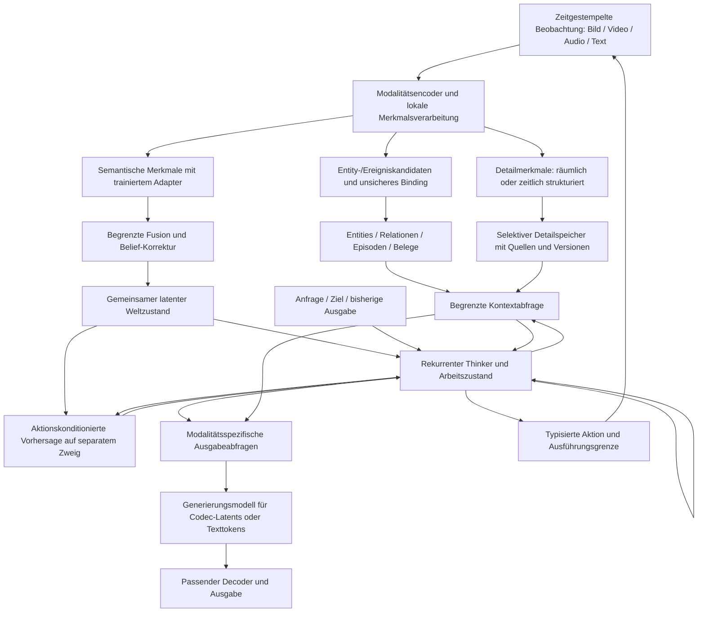

# Referenzentwurf: ein gemeinsamer multimodaler Kern auf 8 GB

Stand: 16. September 2026. **Recherche und Vorschlag, keine neue implementierte
Architektur und kein Fähigkeitsnachweis.** Gegen den aktuellen Code `64ad8f3`
abgeglichen, in zwei Runden mit Claude Sonnet kritisch diskutiert.

## Entscheidung

Wir behalten den gemeinsamen latenten Denkraum, austauschbare Modalitätsmodule,
den expliziten World State und die Trennung von Beobachtung, Erinnerung und
Vorhersage. Ein Sprachmodell wird nicht zum zwingenden Denkraum des Agenten.

Die wichtigste vorgeschlagene Änderung ist eine überprüfbare Verbindung zwischen
**lokalen, detailreichen Merkmalen**, **kompakten semantischen Merkmalen** und dem
**gemeinsamen Belief-/Arbeitszustand**. Ein Decoder muss passende Information
abfragen können. Ein Bild-/Audiocodec allein hat jedoch noch keinen Generator
für beliebige Inhalte. Ein Textdecoder braucht erlernte Sprachkompetenz, selbst
wenn der Kern die Antwortinhalte bestimmt.

Kleine Encoder/Decoder bleiben ein Forschungsziel. Weder die Literatur noch unsere
Messungen bestimmen bisher ein sinnvolles festes Größenverhältnis zum Kern.
Große Teile der generativen Arbeit in einen „Adapter“ umzubenennen spart keine
Parameter, Daten oder Rechenzeit. Gezählt wird immer der gesamte aktive Pfad.

## Umfang und Herkunft der Recherche

Aus dem [AI-Search-Kanal](https://www.youtube.com/@theAIsearch/videos) wurden am
16. September **420 vom Videos-Endpunkt gelieferte Einträge** erfasst. Davon wurden
**30 thematisch ausgewählte Beschreibungen** direkt über YouTube-Metadaten gelesen;
Kanal-ID bei jeder Beschreibung geprüft. Keine Videos heruntergeladen, keine
vollständige Transkriptauswertung und kein Anspruch auf eine vollständige
Literaturübersicht. Titel sind Suchhinweise; technische Aussagen stammen aus
verlinkten Originalarbeiten, Autoren-Repositories und Modellkarten.

Die [Auswahlliste](multimodal-channel-selection.md) dokumentiert alle 30 Videos.
Raw-Metadaten, Auswahl, Abrufbelege und Claude-Receipts liegen unter
`runs/reviews/architecture_reference_v1/`. Ergänzende Arbeiten sind ausdrücklich
als solche gekennzeichnet; ihnen wird keine unbelegte Kanalzugehörigkeit zugeschrieben.

## Was aus den Videobeschreibungen konkret nützlich ist

| Fund im Kanal | Wie die Technik funktioniert | Konsequenz für PATH-WM |
| --- | --- | --- |
| [Janus-Pro, 02.02.2025, ab 20:17](https://www.youtube.com/watch?v=cUjt4pZKJgc&t=1217s) → [Janus](https://arxiv.org/abs/2410.13848) | Unterschiedliche visuelle Repräsentationen für Verstehen und Erzeugen treffen auf einen gemeinsamen Transformer. Die Zielkonflikte zwischen Semantik und Rekonstruktionsdetails werden explizit behandelt. | **Übernehmen als Versuch:** verschiedene Ausleseköpfe/Verlustziele auf gemeinsamem Backbone. Zwei vollständige Encoder sind keine Pflicht; geteilte gegen getrennte Köpfe vergleichen. Janus selbst beweist die günstigere Variante nicht. |
| [Titans, 23.01.2025](https://www.youtube.com/watch?v=aVFL1BuDAss) → [Originalarbeit](https://arxiv.org/abs/2501.00663) | Ein neuronaler assoziativer Speicher lernt Schlüssel-Wert-Zuordnungen zur Laufzeit; überraschende Fehler beeinflussen Updates, Vergessen und Momentum. Lokale Attention verarbeitet den unmittelbaren Kontext. | **Späterer Zusatzversuch.** Das ersetzt keine adressierbaren Entities, rücknehmbaren Korrekturen oder Belegketten. „Persistent memory“ bezeichnet in Titans zusätzlich gelernte aufgabenbezogene Parameter, nicht unsere Datenbank. |
| [Attention Residuals, 01.04.2026](https://www.youtube.com/watch?v=2IfAVV7ewO0) → [Originalarbeit](https://arxiv.org/abs/2603.15031) | Statt alle früheren Schichtbeiträge gleich zu addieren, gewichtet Attention Beiträge entlang der Netztiefe; eine Blockvariante begrenzt den Aufwand. | **Zurückstellen.** Trotz Videotitel keine Lösung für episodisches Langzeitgedächtnis oder selbständiges lebenslanges Lernen. Erst bei nachgewiesenem Problem der tiefen Verarbeitung relevant. |
| [SimpleMem, 11.01.2026, ab 5:54](https://www.youtube.com/watch?v=qOr5-FrkElk&t=354s) → [Paper](https://arxiv.org/abs/2601.02553) | Erfahrungen werden zu kompakten strukturierten Erinnerungen verdichtet, indexiert, zusammengeführt und abhängig von der Anfrage abgerufen. | **Prinzip behalten:** selektives Schreiben und Retrieval. Das Verfahren setzt Sprachmodellfähigkeiten voraus; „semantic lossless“ ist keine mathematische Garantie, dass jede spätere Frage beantwortbar bleibt. Unsere Originalbelege und Revisionen behalten. |
| [Hybrid Memory, 05.04.2026, ab 16:35](https://www.youtube.com/watch?v=o5rGuknRw2A&t=995s) → [HyDRA](https://kj-chen666.github.io/Hybrid-Memory-in-Video-World-Models/) | Kompakte bewegungssensitive Speichertokens; räumlich-zeitliche Relevanz wählt Top-k-Kontext zur Wiederkehr zuvor unsichtbarer Subjekte. | **Nützliche Videoreferenz:** Aussehen, Bewegung und Hintergrund unterschiedlich behandeln. Test auf Verdeckung/Wiederkehr. Die Arbeit nutzt gerenderte Sequenzen; kein Nachweis eines allgemeinen nicht-räumlichen Wissensgraphen. |
| [FramePack, 24.04.2025](https://www.youtube.com/watch?v=3eoUoPtLMPI) → [Autoren-Code](https://github.com/lllyasviel/FramePack) | Historische Frames werden mit unterschiedlich dichter zeitlicher Repräsentation in ein begrenztes Kontextbudget gepackt. Speicherverwaltung ermöglicht Inferenz großer Videomodelle auf wenig VRAM. | **Budgetprinzip übernehmen**, nicht die gesamte Pipeline. Offiziell genannte 6 GB für einen 13B-Generator sind kein Volltrainings- oder Echtzeitnachweis auf unserer GPU. Historienkompression auf vergessene Ereignisse prüfen. |
| [LTX-2, 08.01.2026](https://www.youtube.com/watch?v=I_b2QN-B1W0), [LTX-2.5, 18.08.2026](https://www.youtube.com/watch?v=ig3PUfSow5Y) → [Autoren-Code](https://github.com/Lightricks/LTX-2) | Getrennte Komponenten für Audio-/Videocodierung und gemeinsame konditionierte Erzeugung; Distillation reduziert Sampling-Schritte. Komponenten, Quantisierung und Offload werden separat angeboten. | **Referenz für synchronisierte Ausgabe und Modulgrenzen.** Kein Beleg, dass unser kleines Weltmodell durch bloßen Decoderwechsel solche Videos erzeugen kann; kein sofortiger Trainingskandidat für 8 GB. |
| [DreamLite, 05.04.2026, ab 18:05](https://www.youtube.com/watch?v=o5rGuknRw2A&t=1085s) → [Projekt/Paper](https://carlofkl.github.io/dreamlite/) | Kompakter U-Net-Generator, räumliche Konditionierung im Latentraum, schrittweises Training von Generierung über Editieren zu beiden Aufgaben; anschließend wenige Generierungsschritte durch Distillation. | **Passende Referenz für einen kleinen Generierungszweig.** 0,39B bezeichnet den Generator; Konditionierer und VAE kommen hinzu. Die geprüfte Projektseite listet Gewichte noch als angekündigt. Nicht als sofort verfügbaren Baustein einplanen. |
| [Z-Image, 02.12.2025](https://www.youtube.com/watch?v=iNM5z8cCH8w) → [Autorenbeschreibung](https://tongyi-mai.github.io/Z-Image-blog/) | Diffusionsmodell mit gemeinsamem Tokenstrom für Konditionierung und Bildlatents; beschleunigte Generation durch Distillation. | **Qualitätsreferenz, kein kleiner Codec.** Effiziente Inferenz hebt Vortraining, Generatorgröße und Konditionierungskosten nicht auf. |
| [Qwen3-TTS, 24.01.2026](https://www.youtube.com/watch?v=eC8mZceIy5k) → [Autoren-Code](https://github.com/QwenLM/Qwen3-TTS) | Textkonditionierte Vorhersage von Audiocodes, anschließend Audiodecoder. Veröffentlichte 0,6B/1,7B-Varianten mit separatem 12-Hz-Tokenizer. | **Vergleichsbaustein für verständliche deutsche Sprachausgabe.** TTS-Verstehen und allgemeines Audioverständnis sind getrennte Aufgaben. Eine direkte latente Konditionierung wäre zusätzlich zu trainieren. |
| [Audio8, 23.08.2026, ab 9:43](https://www.youtube.com/watch?v=rQ4yX5qNYdY&t=583s) → [Modellkarte](https://huggingface.co/Edge0/Audio8-TTS-Preview-0.1b) | Langsamer autoregressiver Zweig für semantische Tokens, schneller Zweig für akustische Codebücher. | **Interessanter kleiner Vergleich**, zunächst Sprachabdeckung prüfen. Die Karte nennt trotz „0.1b“ etwa 170M Generator- plus 120M Decoderparameter. Ein nützliches Gegenbeispiel gegen Größenangaben ohne Systemgrenze. |
| [PersonaPlex, 25.01.2026, ab 6:50](https://www.youtube.com/watch?v=BYPlfLQm0CQ&t=410s) → [NVIDIA](https://research.nvidia.com/labs/adlr/personaplex/) | Auf Moshi aufbauendes Sprachdialogsystem mit gleichzeitigem Hören/Sprechen sowie Rollen-/Stimmkonditionierung. | **Referenz für Interaktionsprotokoll:** getrennte Ein-/Ausgabeströme, Unterbrechungen und Zeiten. Nicht den großen Dialogkern als Voraussetzung unseres latenten Denkraums übernehmen. |

Andere gelesene Beschreibungen betreffen etwa VibeVoice, IndexTTS, Qwen Image,
Stable Video Infinity, spekulatives Decodieren und Liquid-/Spiking-Netze.
Sie bleiben Suchhinweise/Alternativen; die Auswahl begründet keinen zusätzlichen
Modulbau. Insbesondere ersetzen neue Generierungsdemos keine Verständnistests.

## Ergänzende Originalarbeiten für die fehlenden Verbindungen

| Referenz | Mechanismus und Bezug | Grenze |
| --- | --- | --- |
| [Perceiver IO](https://arxiv.org/abs/2107.14795) | Eine begrenzte Menge latenter Abfragen liest viele Eingangstokens per Cross-Attention; Verarbeitung im latenten Feld; Ausgabeabfragen lesen relevante Resultate. Nahe an unserem geplanten gemeinsamen Arbeitsraum. | Der Engpass kann relevante Details verlieren. Tokenbudget und Detail-Retrieval müssen gemessen werden. |
| [BLIP-2](https://arxiv.org/abs/2301.12597) | Ein trainierter Querying-Transformer verbindet vortrainierte eingefrorene Bild- und Sprachmodelle. | Kleine trainierbare Brücke bedeutet nicht kleines oder billig von Grund auf trainiertes Gesamtsystem. |
| [ImageBind](https://arxiv.org/abs/2305.05665) | Kontrastives Lernen richtet Modalitäten über gepaarte Beobachtungen an einem gemeinsamen Bezug aus; nicht jedes Modalitätspaar braucht direkte Trainingspaare. | Ein Retrieval-Embedding ist kein verlustfreier Code für Rekonstruktion, Identität oder alle Relationen. Paardaten und ein starker Anker bleiben nötig. |
| [DC-AE](https://arxiv.org/abs/2410.10733) | Residuale Autoencodierung auf Basis von Space-to-Channel und getrennte Hochauflösungsanpassung ermöglichen starke räumliche Kompression. | Unterstützt unsere explizite Trennung von Umordnung und Verarbeitung als plausible Idee, beweist aber keine Überlegenheit unserer konkreten VAE-Konfiguration. |
| [SANA](https://github.com/NVlabs/Sana) | Komprimierter Bildlatentraum plus effizienter Diffusionstransformer; kleinere Tokenzahl reduziert Generierungskosten. | Veröffentlichte 8-GB-Inferenz verwendet u.a. Quantisierung/Offload. Hohe Kompression kann kleine Schrift/Geometrie kosten und ist gegen tatsächliche Aufgaben zu prüfen. |
| [V-JEPA 2](https://arxiv.org/abs/2506.09985) | Vorhersage fehlender visueller Merkmale; separat aktionskonditioniertes Training für latente Planung. | Über eine Million Stunden Video im Vortraining; begrenzte Robotikaufgaben. Weder kleiner Datenbedarf noch beliebige Bildgenerierung folgen daraus. |
| [Mimi/Moshi](https://github.com/kyutai-labs/moshi) | Streamingcodec mit akustischen und destillierten semantischen Informationen; zeitliche und Codebuch-Verarbeitung sowie parallele Sprachströme. | Moshi besitzt zusätzlich einen großen Sprach-/Zeitkern. Mimi allein führt keine Gespräche; Sprache ist nicht die ganze Audiomodalität. |
| [Coconut](https://arxiv.org/abs/2412.06769) | Rückführung von Hidden States statt ausgeschriebenen Denktokens. | Sprachvortraining und spezifisches Reasoningtraining; kein Nachweis allgemeinen multimodalen Denkens aus kleinem Training. |
| [TRM](https://arxiv.org/abs/2510.04871), [Code](https://github.com/SamsungSAILMontreal/TinyRecursiveModels) | Wiederholt latente Zwischenzustände und Antwortvorschläge mit kleinem gemeinsamem Netz verfeinern. | Positive Evidenz auf begrenzten Puzzleaufgaben. Wenige Originalbeispiele bedeuten wegen Augmentation/Wiederholungen nicht wenige Updates; keine allgemeine Gesprächs- oder Wahrnehmungsfähigkeit. |
| [Huginn/recurrent depth](https://arxiv.org/abs/2502.05171) | Geteilten Block wiederholt im latenten Raum ausführen; Rechenbudget zur Inferenz erhöhen. | Der publizierte 3,5B-Versuch benötigt umfangreiches Sprachtraining. Mehr Schleifen sparen Parameter, nicht automatisch Rechenzeit oder Trainingsaktivierungen. |
| [DreamerV3](https://arxiv.org/abs/2301.04104) | Aus Beobachtungen latente Dynamik lernen; Verhalten mit imaginierten Übergängen verbessern. | Aufgaben- und Aktionsdefinition sowie Rückmeldung bleiben notwendig. Keine Garantie für universelle semantische Planung. |
| [Graphiti](https://github.com/getzep/graphiti) | Episoden, Entities, zeitlich gültige Fakten und hybrides Retrieval mit Provenance. | Referenz für Datenverträge, kein Grund, unseren kleinen funktionierenden Store durch eine Graphdatenbank/LLM-Pipeline zu ersetzen. |

## Zielverdrahtung

Die Grafik zeigt den **Vorschlag**. Sie behauptet keine bereits trainierte
Gesamtfunktion und erhält deshalb keine grüne Validierungsfarbe.

`E → D` und `E → S` können gemeinsame Gewichte und verschiedene Köpfe verwenden.
Die Struktur schreibt keinen zweiten großen Encoder vor. `U → C → Z` sind Rollen:
Ein Modul darf mehrere erfüllen. Für Text können Decoder und Generator ein
einziger kausaler Transformer sein. Für Bilder ist das Generieren eines plausiblen
Codec-Latents eine andere Aufgabe als dessen Umwandlung in RGB.

Der Detailspeicher ist ein optionaler Payload im vorhandenen Speicher mit Budget,
kein zweiter unbegrenzter Datenbankentwurf. Der Kern muss nicht jedes Pixel dauerhaft
tragen. Eine Erinnerung oder ein erzeugtes Bild wird beim Wiedereinlesen nicht zur
frischen Kamerabeobachtung. Wenn kein Bild beobachtet wurde, gibt es keine beobachteten
Details abzurufen: Der Generator nutzt Kernkonditionierung und erlernte Verteilungen.

## Änderungen pro Modul

| Bereich / vorhandener Code | Behalten | Konkret ergänzen oder austauschen |
| --- | --- | --- |
| Bild: `spatial_vae_v2.py`, `features.py`, `multiscale.py` | R/P/M/C, räumliche Latents, variable Auflösung, Stufenprobes. | Einen semantischen Abgriff vor zu starker Kompression und einen trainierten räumlichen Adapter zum Agenten vergleichen. Aktuell ist der separate räumliche VAE nicht automatisch der native Encoder des BeliefAgent. Keine Aussage „verlustfrei bis C“: Nichtlineare Verarbeitung kann ebenfalls Information unzugänglich machen. |
| Video: `video_vae.py` | Tatsächliche Wiederverwendung desselben Bildcodecs; kausale Verarbeitung und separate temporale Merkmale. | Zeitlich fortsetzbaren Zustand über Aufrufe, Bewegungs-/Korrespondenzmerkmale vor sehr grober Kompression und Übergabe an den Kern. Erst Kontextnutzen messen; keine pauschale Vergrößerung aller Faltungskerne. Gegebenenfalls früherer Multiscale-Abgriff statt größerem Endkopf. |
| Audio: `modalities.py`, `multiscale.py` | Zeitstempel, Masken, Modalitätsgrenzen. Der native Ton-Test bleibt Kontrolle. | Trainierten Audiocodec plus semantischen Abgriff testen; Sprache, Geräusch, Sprecher und zeitliche Struktur getrennt auswerten. Ausgang: latenter Konditionierer → Audiocode-Generator → Codecdecoder. Transkription darf zusätzliche Information sein, aber kein zwingender Ersatz für Audio. |
| Text: `modalities.py`, `readout.py` | Direkte Cross-Attention auf den gemeinsamen Zustand; vorhandener Bytepfad als Baseline. | Leistungsfähigere kompositionale Ein-/Ausgabe trainieren. Kleinen eigenen Decoder gegen eingefrorenen vortrainierten Sprachbaustein mit Adapter vergleichen. Optionaler Subword-Tokenizer ist ein Effizienzvergleich, keine Voraussetzung für Verstehen. Kleine englische Referenz wie [SmolLM2-360M](https://huggingface.co/HuggingFaceTB/SmolLM2-360M-Instruct) beweist noch keine guten deutschen Gespräche. |
| Fusion/Belief: `belief.py`, `belief_state.py` | Prior, Beobachtungskorrektur, stochastische Zustände und Ereignisgrenzen. | Retention nach Projektion, Fusion und Sampling separat messen. Optionale kontinuierliche Referenz neben kategorischer Baseline vergleichen, wenn quantisierte Zustände aufgabenrelevante Unterschiede verlieren. Nicht vorsorglich alles ersetzen. |
| Denken: vorhandener Thinker, `readout.py` | Gemeinsame latente Schleifen; lokale Ausgabeadapter. | Aufgabenbezogene Supervision für Zwischenzustände/Übergänge; feste 0/1/2/4-Schritt-Vergleiche und Kontrollrechnung. Zunächst keine adaptive Stoppregel und keine Pflicht, Gedanken in Text auszugeben. |
| Memory/Graph: `world_state/` | Entity-IDs, Komponenten, Relationen, Ereignisse, Korrekturen, Versionen, unsicheres Binding und begrenztes Retrieval. | Wahrnehmungsbasierte Kandidaten und trainiertes Binding/Querying schrittweise anschließen. Zuerst vorgegebene Regionen/Mentions als Oracle, dann gelernte Vorschläge. Der jetzige Store entdeckt Objekte nicht automatisch. Titans optional später; Graphiti-Prinzipien ohne neuen Backendzwang. |
| Bild-/Videoausgabe: `conditional_image.py`, Decoder | Kontextgesteuerte Erzeugung und getrennte Ausgabeschnittstelle. | Codecpassende Konditionierung; bei Mehrdeutigkeit ein trainierter stochastischer Generator. Ein deterministischer Rekonstruktionsdecoder allein erzeugt keine allgemeine Bildverteilung. Zunächst kontrollierte Szenen; später eingefrorener kompakter Generator/Adapter statt Training eines großen Modells von null. |
| Interaktion: `tasks.py`, Session/Dispatcher | `think`, `recall`, `imagine`, `emit`, `act`, Ziele und Rückmeldungen. | Echte Kamera-/Mikrofon-/Textpakete mit Synchronisierung, Chunkzustand, Reset und Backpressure; Unterbrechung/Abbruch laufender Ausgaben; Tools liefern Resultate als neue Evidenz. Geplante, begonnene und bestätigte Aktionen unterscheiden. |

Es gibt bislang keinen belastbaren Nachweis, dass unsere Gesamtarchitektur besser
als diese Referenzen ist. **Behalten** bedeutet hier: passend zur Anforderung,
bereits anschlussfähig oder mechanisch geprüft. Ein **besseres Modell** wird erst
nach gleichem Daten-/Rechenbudget, Generalisierung und Regressionstests übernommen.

## Latente Adapter und unabhängige Skalierung

Die vorhandenen `Observation`, `TokenBatch`, `FeaturePyramid` und World-State-Verträge
werden erweitert, nicht durch ein universelles neues Framework ersetzt.

Ein Adapter braucht mehr als `Linear(d_in, d_core)`:

- lokale Merkmale mit Maske, räumlicher Position/Zeitintervall und Verfügbarkeit;
- Modalität, Repräsentations-/Codecversion und Herkunft;
- Abbildung in Kernmerkmale sowie auf Wunsch Referenzen auf Detailpayloads;
- Ausgabeanfrage mit Form, Dauer, Samplingrate, Zielcodec und erlaubten Quellen;
- gegebenenfalls Streamingzustand mit klarer Reset-/Detach-Semantik.

Eine neue Modalität wird zunächst gegen einen eingefrorenen Kern an gepaarten
Beobachtungen ausgerichtet; danach taskbezogen geprüft. Kontrastive Paarung allein
reicht für Identität/Geometrie nicht: zeitliche Zuordnung, lokale Grounding-Aufgaben,
Prediction und tatsächliche Ausgabelosses kommen nach Bedarf hinzu. Bei unzureichendem
Anschluss Kern/Adapter gemeinsam mit alten Modalitäten nachtrainieren und Vergessen
messen. Keine Zusage, dass beliebige neue Semantik bei völlig eingefrorenem Kern passt.

Breite/Tiefe der Encoder, Codec-Kompression, Anzahl Eingangstokens, Kernbreite,
Arbeits-/Memory-Tokens, Schleifendurchläufe und Generatorgröße sind getrennte
Skalierungsachsen. Nach Codec- oder Encoderwechsel sind gespeicherte Latents nicht
automatisch kompatibel: Version pinnen, aus Originalbelegen neu encodieren oder einen
explizit validierten Migrationsadapter verwenden. Parameterteilung in Schleifen
spart Gewichte; lange Sequenzen und viele Schleifen kosten weiterhin Aktivierungen.

## GPU: Arbeitsbudget statt Fit-Versprechen

Lokal gemessen: **NVIDIA GeForce RTX 3050, 8192 MiB**, zum Prüfzeitpunkt 6812 MiB frei.
Vorgeschlagenes Ziel: höchstens **6 GiB Prozessbedarf** im repräsentativen Dauerlauf,
Rest für Anzeige, Laufzeit und Schwankungen. Das ist ein Abnahmekriterium, noch kein
gemessener Fit der neuen Architektur.

Für FP32-Parameter, FP32-Gradienten und zwei FP32-AdamW-Momente beträgt allein der
persistente Trainingszustand etwa `16 × trainierbare Parameter` Bytes:

| Trainierbare Parameter | FP32-AdamW-Zustand ohne Aktivierungen | FP16-Inferenzgewichte allein |
| --- | ---: | ---: |
| 50M | 0,75 GiB | 0,09 GiB |
| 100M | 1,49 GiB | 0,19 GiB |
| 200M | 2,98 GiB | 0,37 GiB |
| 1B | 14,90 GiB | 1,86 GiB |

Als **Startkonfiguration zum Profilieren**: 50–100M trainierbare Parameter insgesamt,
128–256 Pixel, 4–8 Frames, 32–128 Kerntokens, Batch 1–2 mit Gradient Accumulation.
Keine Aussage, dass diese Größe für alle Modalitäten genügt. Ein konzeptionelles
6-GiB-Limit ließe bei 100M etwa 1,5 GiB für AdamW-Zustand, bis 3 GiB für Aktivierungen,
1 GiB für aktive eingefrorene Komponenten und 0,5 GiB für Workspaces/Caches.
Das ist eine **Budgetaufteilung**, keine Verbrauchsmessung; überschreitet ein Teil
seinen Anteil, muss das konkrete Modell kleiner oder anders trainiert werden.

Vor dem ersten Fit: vollständige Updates einschließlich Backward, initialisierter
Optimizer-Momente, Decodergradienten und anschließendem längeren Streamingtest
profilieren. `max_memory_allocated`, `max_memory_reserved`, Prozess-VRAM, RAM,
Schrittzeit, Ausgabelatenz und Echtzeitfaktor getrennt protokollieren. Auch ein
eingefrorener Decoder benötigt Aktivierungen, wenn durch ihn ein Adapter trainiert
wird. Feature-Caching spart nur bei eingefrorenem Encoder und fest versionierten
Augmentierungen zuverlässig dessen wiederholte Berechnung.

Codec, Adapter/Kern und Ausgabemodell werden zunächst abschnittsweise trainiert.
Große Vergleichsmodelle/Teachers nur einzeln ausführen, gegebenenfalls Merkmale
vorberechnen. Offload kann Inferenz ermöglichen, aber interaktive Latenz verschlechtern.
Gesamtkosten des Vortrainings bleiben als übernommene externe Leistung ausgewiesen.
Kein Versprechen, ein allgemein kompetentes multimodales Modell von Grund auf mit
wenig Daten auf dieser GPU zu trainieren. Lokales Modulentwickeln und Anpassen ist
der realistische erste Weg; simultane allgemeine Echtzeitgeneration bleibt offen.

## Reihenfolge und überprüfbare Entscheidungen

Die bestehende [Testlandkarte](modality-understanding-test-map.md),
[Capability-Suite](modality-suites-plan.md) und normale Experimentrezepte bleiben
die Infrastruktur. Keine neue Registry/Trainer-/Reportpipeline.

1. **Informationsweg schließen.** Gleiche eingefrorene Features über direkten
   Leser, Projektion, Fusion, Belief und Workspace prüfen; strukturierte Oracle-
   Eingabe als positive Kontrolle. Kleiner optionaler Adapter als einzige Änderung.
   Das setzt an den bereits gefundenen nativen Core-Schwächen an.
2. **Ein echter zeitlicher Anwendungsfall.** Kurze aufgezeichnete Hand-Objekt-Clips:
   Objekt verschieben, verdecken, wiederfinden; komplementäres Geräusch/kurze Anfrage.
   Aufgabe z.B. welches Objekt wurde wohin bewegt und welcher Zustand folgt?
   Kontrollierte Simulation liefert kausale Referenzen; reale Clips prüfen Transfer.
   Quellvideo, Aufnahme-/Personengruppe und Szenen trennen, keine benachbarten Frames
   auf Train/Test verteilen. Fehlende Annotationen zuerst explizit erzeugen/prüfen.
3. **Memory anschließen.** Vorheriges Ereignis außerhalb des unmittelbaren Fensters
   erzwingt Erinnerung; Oracle-Binding/Retrieval gegen gelernte Varianten. Danach
   mehr Ablenkungen, Verdeckung, gleich aussehende Instanzen und Korrekturen.
4. **Jede Ausgabe separat, dann gemeinsam.** Kernfakten in Text, Audio, Bild und
   kurzem Video ausdrücken. Factual correctness, Sprach-/Signalqualität und
   gegenseitige Konsistenz separat messen. Ein schöner Output darf einen falschen
   Zustand nicht verdecken. Generierung aus Zustand ohne gleichmodalige Eingabe
   ist ein eigener Testfall.
5. **Interaktion und Skalierung.** Kamera/Mikrofon streamen, unterbrechen, Rückfrage
   stellen, Toolresultat verarbeiten; anschließend größere Modelle oder eine neue
   Modalität bei unveränderten Regressionsaufgaben vergleichen.

Vor jedem Lauf werden Datenmanifest, Initialisierung, drei Seeds, Update-/Zeitbudget,
Aufgabenschwellen und akzeptierte Regressionen festgeschrieben. Die Zahlen werden
nicht erst nach Sichtung der Testresultate gewählt. Dies ist noch **kein vollständiges
präregistriertes Trainingsprotokoll**: reale Clips, Labels und Geräteleistung müssen
zuerst auditiert werden. Deshalb startet diese Rechercherunde keinen Fit.

Die Kernkontrollen bleiben über die Stufen hinweg dieselben:

| Frage | Entscheidender Vergleich | Konsequenz bei Scheitern |
| --- | --- | --- |
| Sind Informationen im Encoder erreichbar? | Oracle → direkter Reader → eingefrorene Features; gleiche getrennte Testgruppen | Encoder/Zielverlust/Daten reparieren, bevor der Kern wächst. |
| Erhält der gemeinsame Kern sie? | Direkte Features gegen Projektion/Fusion/Belief/Workspace; möglichst gleiche Leser und Seeds | Engpass bzw. Ausrichtung isolieren; fehlgeschlagene Probe allein beweist keine irreversible Löschung. |
| Nutzt der Kern Zeit und Zusammenhänge? | Einzelbild, korrektes/vertauschtes/fehlendes History; gleiche finale Beobachtung mit verschiedenem Verlauf | Aufgaben-/Dynamiktraining ändern, keine bloße Pixel-MSE-Optimierung. |
| Hilft iteratives Denken? | 0/1/2/4 Schritte bei gleicher Tokenzahl; zusätzlich Kontrollmodell mit vergleichbarem FLOP-Budget | Schleifen nicht als Fortschritt zählen. Mehr Schritte verändern Compute, also beide Vergleichsarten getrennt ausweisen. |
| Liest die Ausgabe den Zustand? | Identische Anfrage mit gezielt getauschtem Zustand; Null-/Shuffle-Kontext; direkter, Oracle- und Core-Readout | Konditionierung und Aufgabenbindung reparieren. Ein eingefrorener Sprachdecoder kann weiterhin selbst rechnen. |
| Ist Gedächtnis korrekt? | Kein, Oracle-, echtes und falsches Retrieval; Korrektur und Replay | Binding, Suche und Lesen getrennt reparieren; keine „Speicher vorhanden = erinnert sich“-Wertung. |
| Funktionieren neue Modalitäten/Größen? | Adapterwechsel mit gepaarter Prüfung, zwei Auflösungen/Zeitraten, Altaufgaben-Replay | Neue Version/Adapter trainieren; semantische Kompatibilität nicht aus Formen ableiten. |

„Echtes Verstehen“ wird über solche Generalisierung, zeitliche/kausale Vorhersage,
Grounding, Erinnerung, Korrektur und erfolgreiche Interaktion operationalisiert.
Keine einzelne Accuracy und kein interner Vektor beweisen universelles Verstehen.

## Claude-Abgleich und offene Unterschiede

Zwei tatsächliche isolierte Claude-Sonnet-Aufrufe; ausschließlich öffentliche,
hypothetische Methodik. Keine privaten Dateien, Datensätze oder Ergebnisse exportiert.
Exakte Briefs/Antworten/Hashes liegen im genannten Review-Verzeichnis.

Claude unterstützte die modulare Richtung, kritisierte vor allem den Engpass und
unbewiesene Reasoningfähigkeiten. Nach Quellenprüfung hat Claude sechs Präzisierungen
akzeptiert: Engpässe sind ein messbares Risiko statt pauschalem Unmöglichkeitsbeweis;
Decoder-Einfrieren lokalisiert Denken nicht; Titans ersetzt keinen Beleggraphen;
TRM/Huginn liefern begrenzte positive Evidenz; Umordnung garantiert nicht die
Invertierbarkeit des ganzen Encoders; vorhandene Speichermekanik bleibt erhalten.

Sein berechtigter verbleibender Einwand: das 6-GiB-Ziel ist ohne vollständiges
Trainingstep-Profil nur ein Budget. Deshalb steht der Hardwaretest vor jedem Fit.
Seine Schlussformulierung, ein erfolgloser einzelner Core-Vergleich mache den Kern
generell überflüssig, übernehmen wir **nicht**. Sie widerlegt höchstens den Nutzen
der geprüften Konfiguration auf der definierten Aufgabe. Aktionsklassifikation
allein kann zudem zu wenig Reasoning verlangen; die erste integrierte Aufgabe
braucht kontrolliert unterschiedliche Historien und überprüfbare Zustandsänderungen.

**Nächster konkreter Arbeitsschritt:** das vorhandene Diagnose-Rezept um den
gemeinsamen, quellengetrennten Feature→Core-Vergleich vorbereiten und einen realen
kurzen Video-/Audiofall samt Labels und Speicherprofil auditieren. Erst auf dieser
Basis entscheiden wir über einen neuen Adapter oder einen größeren Kern.
