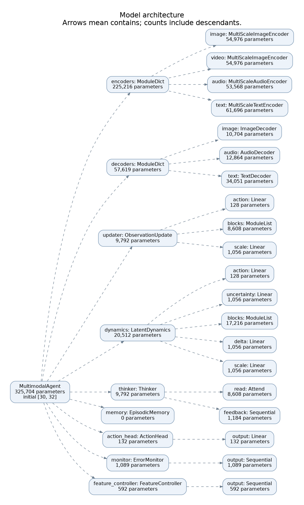
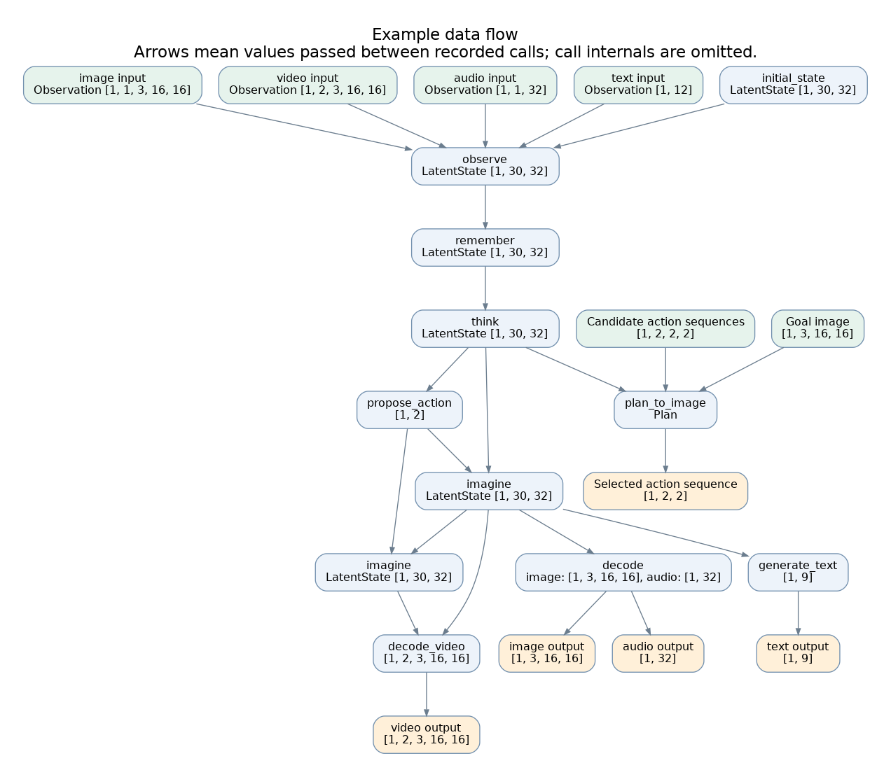

# Gaussian reference and shared multimodal interfaces

The CLI now defaults to the [categorical belief model](belief-model.md). This page
describes the retained Gaussian reference and shared adapters/task interfaces.
Python `build_model()` keeps its Gaussian default for compatibility; the CLI uses
`--state-model gaussian` to select it. The diagram exporter remains the Gaussian reference.

Start in [`experiments/multimodal.py`](../experiments/multimodal.py). `build_model`
constructs one `MultimodalAgent`; `objective` says exactly what it learns. The
359,188-parameter default is freshly initialized. The implementation is functional;
these development weights do not have general language, audio or physics abilities.

Instructions now have a task-token interpreter and learned operation/output heads.
[Output controls, requester/producer attribution and generated feedback](tasks.md)
describe the concrete interfaces, enforcement rules and synthetic training path.

## Adopted output design

Alex adopted this boundary for all modality outputs on12 September2026:

`request + agent state + relevant memory → learned conditioning → modality generator → output`.

Each modality's generator and matching decoder/codec form a replaceable subsystem.
The shared interface carries relevant context, validity and output requirements;
each adapter learns how that context guides its particular generator. Agent states
need not use the same latent coordinates as image/audio/video codecs. A replacement
may require adapter retraining and codec-version migration. Matching tensor shapes
does not establish semantic compatibility. Separate pretraining and staged adapter
training are allowed; useful conditioning must be evaluated early.

| Modality | Intended output production |
| --- | --- |
| Text | Generate a token sequence; generator and decoder may be the same autoregressive network. |
| Image | Generate a spatial image representation, then decode pixels. |
| Audio/speech | Generate a timed waveform or codec sequence, then decode samples where a codec is used. |
| Video | Generate a temporally coherent visual sequence, then decode frames or video-codec latents. |

Audio codecs such as [EnCodec](https://arxiv.org/abs/2210.13438) and temporal image-
generator extensions such as [Video LDM](https://arxiv.org/abs/2304.08818) illustrate
different internal implementations; neither is selected or installed here. There
is no requirement to add an extra codec layer to every modality.

Combined outputs must agree on shared content and timing. For example, spoken words
should agree with generated text, and audiovisual events should align in time.
The interface must support that coordination; shared conditioning alone is not a
guarantee of agreement. Generated outputs retain the existing provenance rules.

This is an adopted design, not newly implemented general generation. The concrete
[image-output slice](image-output-plan.md) currently validates a source-detail
transport control and a four-request state-only fit. The other modalities retain
their documented development adapters. Backend choices, exact conditioning schema,
modality objectives, synchronization tests and measured resource budgets remain open.

## State and components

The default state has 30 tokens of width 32. Parameters and learned initial tokens
belong to the model; every episode's `LatentState` and `MemoryBank` belong to the caller.

| Group | Tokens | Intended role |
| --- | ---: | --- |
| sensory | 16 | Local detail for perception and generation |
| entities | 4 | Persistent entity hypotheses |
| context | 2 | Global information |
| working | 4 | Recurrent working memory |
| reasoning | 4 | Temporary internal computation |

These are named slices, not supervised object identities or guaranteed semantic
features. Observation cross-attention updates all groups. Thinking updates only
working/reasoning. All attention uses four heads, residual connections and an MLP;
the default dynamics has two blocks, the observation updater one.

State fields are `tokens [B,30,32]`, matching `log_scale`, `time [B]`,
`observed_time [B]`, `imagined`, `thinking_steps`, `observation_count`, memory and
`generated_ancestry`. Reflected states cannot be written to observational memory.
Clocks remain float64 independently of activation dtype. `to_dict` / `from_dict`
round-trip using `torch.save` / `torch.load(weights_only=True)`; `state.to(device)`
moves a live state separately from model parameters.

## Modality contracts

`Observation(values, times, valid)` identifies when each complete item becomes
available. Times and optional boolean validity are `[B,T]`; use chunk-end times for
audio and a common time coordinate across modalities. Use float64 input times for
large absolute timestamps. Masked values, including NaNs, are removed before
projection. Each sample needs at least one valid observation across its modalities.

| Modality | Input values | Encoder | Output |
| --- | --- | --- | --- |
| Image | `[B,T,3,H,W]`, RGB floats | 4x4 patch stem, three processed spatial scales | `[B,3,S,S]`, patch queries and RGB sigmoid |
| Video | `[B,T,3,H,W]` | Patch stem, three processed spatial/temporal scales | `[B,H,3,S,S]`, decode an ordered latent trajectory |
| Audio | `[B,T,A]`, waveform chunks | 4-sample patch stem, three processed sequence scales | `[B,A]`, attention read and waveform tanh |
| Text | `[B,L]`, int64 byte IDs | Byte stem, three processed token/span scales | Causal byte logits or autoregressive generation |
| New sensor | `[B,T,F]` | `VectorEncoder(F,D)` or a supplied adapter | A supplied ordinary decoder module |

Text uses PAD=0, BOS=1, EOS=2 and UTF-8 bytes shifted by 3, for 259 IDs.
`bytes_batch` encodes strings; `bytes_text` decodes IDs. The decoder uses causal
self-attention over right-padded prefixes, followed by attention over the state.
Training shifts target prefixes; inference starts at BOS without future target text.
No pretrained language model, audio codec or external tokenizer is hidden here.

The tiny defaults are 16x16 images and 32-sample waveform chunks. This is not a
high-quality speech/music generator. GIF timing is illustrative; WAV clips are
concatenated at 8 kHz. Raw state times and per-state outputs remain available.
Arbitrary stream resampling and perceptual audiovisual synchronization are not
established by this version.

## Multiscale inputs and feature control

The four default input encoders return `FeaturePyramid(scales, condition_time)`.
Each `FeatureScale` carries processed `values [B,N,D]`, `valid [B,N]`, availability
`times [B,N]`, sensor `content_times [B,N]`, content support-end ordinals `ends [B,N]`
and a grid shape. `pyramid.as_tokens()` concatenates all finished scales for the
observation updater. No scale is discarded, and no unprocessed stem reaches it.

| Input example | Fine scale | Middle scale | Coarse scale |
| --- | --- | --- | --- |
| One 16x16 image | 4x4 grid: 16 tokens | 2x2: 4 | 1x1: 1 |
| Two 16x16 video frames | 2x4x4: 32 tokens | 1x2x2: 4 | 1x1x1: 1 |
| One 32-sample audio chunk | 8 patches | 4 spans | 2 spans |
| Twelve text tokens | 12 tokens | 6 spans | 3 spans |

Each scale adds a learned scale identity, then completes a pre-normalized
transformer block with attention and MLP residuals. The next scale takes a masked
mean of those **finished** features. Its pooled queries optionally cross-attend to
the same finished finer features inside the pooling footprint, then complete their
own scale processor before publication. Pooling rounds odd sizes up and ignores
invalid members. Video merges 2x2 spatial cells and pairs of frames; image merges
space only. Audio/text merge adjacent pairs. A singleton remains a singleton and
still receives its own processing. Dense self-attention means these are resolution
scales, not guarantees of strictly local receptive fields or learned semantic units.

Each attention and MLP residual branch receives feature-wise scale/shift:
`LN(x) * (1 + 0.1*tanh(W_scale @ code)) + 0.1*tanh(W_shift @ code)`.
The maps have no bias and start with small nonzero weights. Thus zero code remains
exactly unmodulated after optimizer updates, while nonzero codes have live gradients
immediately. The residual identity path remains intact. This is a small application
of [FiLM conditioning](https://arxiv.org/abs/1709.07871); hierarchical visual
transformer features are also studied in [MViT](https://arxiv.org/abs/2104.11227).
This implementation is independently written and does not reproduce either paper's
architecture or establish its published results.

The default `FeatureController` produces a shared 16-dimensional code from the
**pre-observation** working/reasoning tokens. It is learned with the existing
prediction objective. Thinking can change these tokens and therefore the next code.
An explicit user code replaces the controller output for that call:

```python
code = model.propose_feature_code(state)       # agent choice, [B,16]
code = torch.zeros_like(code)                 # user chooses neutral conditioning
trace = {}
pyramids = model.encode(state, inputs, time=0., feature_code=code, trace=trace)
fine_image = pyramids["image"].scales[0]
state = model.observe(state, inputs, time=0., feature_code=code, trace=trace)
```

`encode` is a read-only inspection operation; calling `observe` afterwards encodes
again. Omit `feature_code` for automatic agent control. Codes must be finite tensors
with matching batch, width, device and dtype. Code coordinates have no established
human meanings without calibration. They influence features; they are not guaranteed
semantic controls. No hidden code persists between calls.

Valid future observations are rejected **before any encoder runs**. Input times
must be nondecreasing. Temporal attention enforces both availability and content
order: text/audio ordinals are sequential, while every patch in a video frame shares
its frame ordinal. Cross-scale pooling carries maximum support times/ordinals; all
attention enforces causal masks and all-invalid outputs stay finite and zero.
Code availability is the prior state time for automatic control and the caller's
cutoff for a user override. Feature availability is floored by it. Original sensor
times remain in `content_times` and in the stem's continuous time encoding, so this
floor does not erase motion/audio timing.

Prefix equivalence is a **fixed-code, fixed-code-time** property for completed
pooling groups, with cuts at frame boundaries. Ordinals refer to content within
one modality's supplied window, not global positions across modalities/calls or
all ancestors of a context-conditioned feature. No cross-modal ordinal comparison
occurs inside an encoder. Arbitrary user code provenance is trusted, not inferred.
Changing a code may change every feature; cached-prefix reuse across codes is not
supported. Pyramids are recomputed on each observation, with no recurrent hidden
encoder cache or coarse-to-fine feedback pass.

Trace keys include `encode.feature_code`, `encode.condition_source`,
`encode.condition_time`, `encode.image.scale.0.values`, `.times`, `.content_times`,
`.valid`, `.ends`, `.grid`, `.attention.0`, and `encode.image.merge.0.attention`.
The same structure applies to the other modalities/scales. Observation attention
columns are labeled by `observe.input_scales`. Runs save these tensors in
`inspection.pt` and include every processed input scale in the existing PCA report.

Replace `encoder.pyramid.stages[i]`, `encoder.pyramid.merges[i]` or the entire
encoder directly. `build_model(cross_scale=False)` disables cross-scale attention
while retaining pooling and every scale's processor. `levels` and `code_width` are
explicit constructor choices in the recipe. New modalities can construct
`FeatureScale` and reuse `FeatureHierarchy`; simple `TokenBatch` encoders remain
compatible and do not receive conditioning. Their interface is unchanged.

These are tiny dense attention/membership implementations. Larger inputs need
windowed or sparse replacements. Existing single-scale checkpoints are preserved
and are not compatible with the new parameter layout; use their historical source
snapshot, or start a fresh run. Neither quality gains nor meaningful code semantics
are claimed by the software checks.

## Operations

```python
import torch
from experiments.multimodal import build_model
from pathwm.models.modalities import Observation

model = build_model().eval()
state = model.initial_state(1, time=0.)
inputs = {"image": Observation(torch.rand(1, 1, 3, 16, 16), torch.zeros(1, 1))}
trace = {}
with torch.no_grad():
    state = model.observe(state, inputs, time=0., trace=trace)
    state = model.remember(state, source="my-episode/frame-0")
    state = model.think(state, steps=2, trace=trace)
    action = model.propose_action(state)
    future = model.imagine(state, action, dt=1., trace=trace)
    image = model.decode(future, modalities=["image"])["image"]
    text = model.generate_text(future, max_tokens=32)
```

- **Observe:** rejects backward state times and valid inputs beyond the cutoff.
  Equal-time updates allow separately arriving modalities. Older context can appear
  in an observation batch; the recipe deliberately uses overlapping two-frame
  video context. A streaming caller should avoid unintended duplicate evidence.
- **Remember:** requires an acquired observation, rejects imagined writes, records
  provenance and snapshots detached tensors without changing the previous state.
  Default FIFO capacity is 16. Cosine retrieval selects up to two full snapshots
  independently for each batch member. This is a bounded episodic store, not a
  durable searchable database. No gradients pass through stored memories/top-k.
- **Think:** attends to state, retrieved memory, optional `[B,G,D]` goal tokens and
  three diagnostics: estimated image error, latent scale, and computation count.
  Optional `[B,3]` feedback replaces the defaults. Diagnostics and the error head's
  state input are detached. Only working/reasoning tokens change; neither clock
  advances. More iterations are supported but not assumed to improve performance.
- **Imagine:** predicts a residual latent mean and diagonal Gaussian scale under
  an action and positive time interval. Missing action has a separate presence bit
  from zero action. Default inference uses the mean; `sample=True` samples it.
  Branch time advances while `observed_time` stays fixed. No observations enter
  this operation. Conditional latent spread is not calibrated epistemic confidence.
- **Plan:** `pathwm.evaluation.agent.plan` scores explicit `[B,C,H,A]` candidates
  against `cost(next_state)->[B]`, action bounds, discount and optional uncertainty
  penalty. It returns the best sequence and first action per batch member. The
  caller's state, model modes and RNG are preserved. Candidate/horizon/sample counts
  bound computation. Scoring is serial and meant for small experiments; the
  application executes actions and supplies subsequent observations.

`model(state, observations, time=...)` abbreviates observe followed by think.
Memory writes and environment actions stay explicit. Provenance guards prevent
accidental mixing through the APIs; serialized state is trusted input, not a
security boundary against callers deliberately forging metadata.

To load only the deployed model from a recipe checkpoint, construct its matching
width/output sizes and call `load_component(model, checkpoint_path, "agent")` from
`pathwm.io`. To inspect a saved episode without inference:

```python
from pathwm.models.agent_state import LatentState
saved = torch.load("runs/multimodal_v1/synthetic/inspection.pt", weights_only=True)
state = LatentState.from_dict(saved["state"])
attention = saved["trace"]["observe.attention"]
```

## Training and bounded improvement

The recipe fits current reconstruction and multi-step image/audio/text generation,
latent Gaussian likelihood against an EMA teacher, action likelihood, prediction
error, and a small activation-variance floor. Raw output losses anchor the evolving
latent target. Future latent targets are detached. Modality dropout keeps image
input and randomly drops the others. Each batch starts a fresh window.

The EMA is a training-only copy of this same architecture. Checkpoints include
both copies, replay priorities, proposal counts, optimizer and RNG. The action head
models a Gaussian before tanh. The two normalized coordinates have application-owned
meaning. Synthetic controls are randomized, so imitation cannot recover an unseen
action draw. The short runs do not demonstrate a useful policy.

`SyntheticEpisodes` generates a controlled moving ball, reflecting walls, impact
tones and left/right/hit descriptions with disjoint split seeds. These are artificial
fixtures. `RealEpisodes` reads verified existing PushT windows, resizes RGB and maps
normalized XY actions to [-1,1]. Audio/text are absent. Both paths use one transition
as a time unit; physical timestamps are not inferred for the real data.

Validation records image-copy and silent-audio baselines, latent spread/effective
rank across examples, latent error versus predicted variance, and self-error MSE.
These expose failure without proving the absence of collapse. EMA comparisons,
calibration, physical generalization and closed-loop control need separate experiments.

Replay mixes 25% uniform sampling with observed image-error priorities. Every four
main updates, the recipe proposes one extra optimizer update. It requires validation
image MSE improvement of at least 1e-5, no image regression, audio MSE increase at most
.001 and text CE increase at most .01. Missing modalities have no invented metrics.
Thresholds are declared before execution. Acceptance retains the candidate; rejection
or exceptions restore model/teacher, buffers, replay, optimizer, gradients and RNG,
including the explicit sampler. Main, attempted and accepted extra updates are
recorded separately. The admission set is validation, not an unbiased final test set.

The proposal creates fresh episode states and does not mutate live deployment memory.
The gate cannot undo callback filesystem/external effects; this recipe only mutates
its checkpointed training state. No architecture editing or autonomous code execution
is performed by this learning loop.

## Inspection, replacement and scaling

The offline report shows outputs, feature PCA, attention, activation magnitudes,
group-zeroing sensitivity, memory provenance and plan scores. `inspection.pt` stores
full tensors and branch states; `inspection.json` is readable metadata.
`model.intervene(state, role, value)` changes a copy for causal probes. Attention
traces are opt-in and copied to CPU; keep them off during routine training.

Encoders return `TokenBatch(values,times,valid)` at a shared width. Decoders consume
`[B,N,D]` and optional trace; text also consumes its prefix. Updater, thinker,
dynamics, memory, action head and monitor are directly supplied modules. Edit their
constructors in `build_model`; changing a width/layout generally needs retraining
or explicit weight conversion. Checkpoints are never silently resized.

Input cross-attention scales with input length times latent count; latent attention
grows quadratically with token count. Current memory is bounded and planning serial.
Larger codecs, hierarchical state, indexed memory and batched planning can replace
these parts after a useful small design has been demonstrated.

## Diagrams

```bash
python experiments/multimodal.py --diagram
# Optional destination and deeper module expansion:
python experiments/multimodal.py --diagram /tmp/pathwm-diagrams --diagram-depth 3
```

The [architecture diagram](diagrams/architecture.svg) comes from the instantiated
model's module hierarchy. Dashed arrows mean **contains**. Each node shows its
class and recursive parameter count, so parent/child counts overlap. Depth 2 shows
modality adapters and the main components' immediate children; larger depths expose
attention and linear layers. Video output uses the image decoder across states.



The [data-flow diagram](diagrams/data_flow.svg) comes from one real CPU execution:
timed image/video/audio/text observations update the state, memory is written,
thinking refines the state, actions condition imagined futures, and decoders produce
outputs. Planning also receives the current state, candidate actions and a goal.
Solid arrows mean **values passed between the recorded calls**. Labels include
actual tensor shapes; `LatentState [1,30,32]` means batch 1, 30 tokens, width 32.



This is a coarse call graph for the example in `export_diagrams`, not a tensor-level
trace of every possible path. Call internals, closures, training/learning-update
paths and optional branches are omitted. To inspect another sequence, edit those
ordinary Python calls and regenerate. Components are discovered from `build_model`;
flow edges are recorded from input/output object provenance, not drawn by hand.
Any transformation outside recorded calls must itself be recorded or registered
as a new input to appear in the graph. In-place mutation is not version-tracked.
The recorder retains references until released and is intended for small examples.

Each export writes `.mmd` (Mermaid), `.dot` (Graphviz) and `diagrams.json` with
source hashes, source locations, model sizes, input identity, seed and runtime
version. With Graphviz's `dot` installed, it also writes `.svg` and `.png` and records
the renderer version. Rendering needs the same Graphviz/fonts for identical bytes.
Without Graphviz, the source diagrams still work. The output directory is regenerated
in place. These are fresh development weights; exporting does not train a model.

The same command also writes [image](diagrams/image_scales.svg),
[video](diagrams/video_scales.svg), [audio](diagrams/audio_scales.svg), and
[text](diagrams/text_scales.svg) scale-flow diagrams. Temporary hooks record the
actual scale-processor and merge calls; they are removed when export finishes.
These views start at positioned stem features and show both the coarse-stage path
and the separately published processed scales. The shared control code feeds every
processor and cross-scale merge. They regenerate when these parts are replaced.
