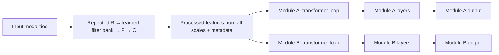

# Multiscale modality encoders and generic loop-transformer consumers

Design direction clarified by Alex, 18 September 2026; source baseline `50bfc3d`.
This specifies a shared interface, not an implemented model or validated result.
It takes priority over treating input design as a choice among visual residual
adapters. The [adapter/PCA discussion](visual-adapter-design.md) remains relevant
to optional implementations and later comparisons.

## 1. User direction and explicit interpretations

For each input modality, repeat a few scales of:

**information-preserving operations → learnable filter bank → post-processing → compression**.

Expose a multiscale feature representation to other modules. Each consumer runs
a transformer loop over that information, then its own layers to produce a useful
output. Consumers are intentionally generic: this is not limited to a named task
set, decoders, or VAEs. Alex explicitly corrected the term to **filter bank**, then
specified **learnable feature extractors: the filters must be learnable**. The bank
contains trainable filters and produces feature maps/coefficients. It is not a
persistent slot memory, and a fixed handcrafted filter bank is not the requested
implementation.

The earlier preference for joint training and equal application priority remains
compatible: all selected consumers train the shared upstream features, while their
own loop/readout/output weights specialize. The exact tasks, widths, number of
scales, loss definitions and training budget remain unselected.

Engineering proposals, distinct from the user's explicit requirements:

- Export each processed scale **before** its compression into the next scale.
- Treat the output as a structured collection of grids/tokens with metadata;
  flattening is allowed, but a single pooled vector is not required.
- Share each consumer's transformer weights across its loop iterations; keep
  different consumers' weights separate initially. Fix a finite iteration count.
- Use modality-appropriate input transforms/weights under a common interface;
  identical architecture patterns do not require identical weights across modalities.

## 2. One scale and the shared output

For modality `m` and scale `s`:

```text
x[m,s]
  │
  ▼
R[m,s]  reversible preparation / grouping
  │ u[m,s]
  ▼
B[m,s]  learnable filter bank and its feature-map outputs
  │
  ▼
P[m,s]  post-processing / feature mixing
  │ f[m,s]
  ├──────────────────► retain in multiscale representation
  ▼
C[m,s]  explicit compression for further propagation
  │
  ▼
x[m,s+1] → repeat at the next scale
```

`R` can be identity at the first scale or a reversible grouping that changes grid
shape without dropping values. `B` applies trainable spatial, temporal or other
modality-appropriate filters and retains the responses as channels/maps. A simple
candidate is a learned convolution bank without an implicit reducing stride;
kernel support, channel mixing and filter count remain explicit choices. These
filters are trained parameters, not a fixed wavelet/DCT bank or stored templates.
They need not be dynamically generated separately for every input; dynamic filters
would be another design choice. `P` then learns to mix/refine the responses before
`C`. No hand-coded semantic channels or fixed frequency partition is prescribed.

For a convolutional example, `B_s(u) = concat(K_(s,1)*u, ..., K_(s,q)*u)`;
the `K` tensors are optimized during training and their responses depend on the
input. The bank can be represented by one ordinary multi-output convolution where
kernel shapes agree; separate branch objects are not required. Filters are shared
across positions and across consumers of this encoded input. Distinct scales and
modalities may have distinct banks; sharing their weights is a separate choice.

Learnability and invertibility are compatible, but an arbitrary learned convolution
bank is not automatically injective. A constrained learned analysis/synthesis bank
can be reconstructible; all bands, sampling, padding and boundaries belong to that
contract. The requested learned filters do not by themselves select an invertible
parameterization or assert that `P` preserves information.

`C` is the named information-budget choice for the next scale, such as a channel
projection or token reduction. It is not necessary to run a final `C` with no
consumer: the last processed scale may be emitted directly, or a separately
declared compact terminal code can be produced if some module needs it.

The proposed shared representation is
`F = {(f[m,s], metadata[m,s]) for each available modality and scale}`.
Fine evidence remains accessible even if the path feeding coarser scales drops
it. Exporting only post-compression outputs is a smaller alternative interface;
it should be evaluated as a different information budget, not called equivalent.

Retaining all pre-compression tensors costs activation memory/bandwidth. In
particular, if the finest exported tensor retains the complete rearranged input,
the aggregate output is not a smaller lossy code of that input. Compression of
the *propagation path* and compression of the *complete exported interface* are
different. Source data that was never captured cannot be recovered by either.

## 3. What information preservation means

Rearrangement preserves values when geometry, padding and ordering are retained.
[PixelUnshuffle](https://docs.pytorch.org/docs/stable/generated/torch.nn.PixelUnshuffle.html)
is one image example. A same-shaped convolution, transformer, residual block or
normalization is not automatically injective. Adding a residual can erase its
input; `x + (-x)` is a simple counterexample. A filter bank that replaces the
input can also lose information despite expanding its channel count.

If strict preservation **through B and P up to C** is required, two explicit
options are available:

1. Use a complete reconstructible **learnable** filter bank and suitable invertible
   post-processing, and verify the inverse
   under the actual numerical precision, padding and masking rules.
2. Carry `u` unchanged beside derived features. For example,
   `f = concat(u, P(u, B(u)))`. Selecting the retained `u` and applying `R^-1`
   recovers the stage input. Mixing or normalizing away that protected path would
   remove this guarantee; an ordinary summed residual is not the same contract.

The second is a simple construction to discuss, not an adopted extra raw-input
branch. It may be costly. Without either construction, B/P preservation is a
measured learning goal, while only R has the structural guarantee. Preservation
of the available stage input does not undo information lost by an earlier `C`.
Constraints supporting invertibility must remain valid as the filters learn;
small reconstruction error on examples alone does not establish that guarantee.

The boundary begins at the actual source representation: resampling, magnitude-
only spectra, destructive tokenization, quantization or a reducing input projection
may already discard information. A continuous dimension-reducing map cannot be
injective on a generic open ambient input set; restricted/discrete domains and
lossless coding are different cases. Tensor count is not encoded bitrate.

| Modality | Candidate reversible preparation | Required distinctions |
| --- | --- | --- |
| Images | Spatial-to-channel grouping with inverse and recorded geometry | No hidden crop/resize; learned feature extraction is a separate stage |
| Audio | Ordered sample grouping, or a verified invertible filter bank retaining all coefficients | Retain phase/order where needed; declare sample rate, window support and padding |
| Video | Framewise spatial grouping, optionally temporal grouping with full members retained | Temporal grouping has a latest availability time; motion features need relationships across frames |
| Text / discrete events | Ordered grouping of retained tokens/bytes/events | Preserve lengths, masks and source IDs/order; embedding injectivity and source tokenization are separate questions |

These are structural candidates, not a claim that each modality should use the
same filters or has been implemented. A spatial scale, a temporal scale and a
sequence grouping are distinct and belong in metadata.

## 4. Generic consumer: transformer loop, then its own layers



For consumer `j`, a possible interface is
`h_j^(k+1) = T_j(h_j^k, F, request_j)` followed by `y_j = H_j(h_j^K)`.
`request_j` and private persistent state are optional inputs only where that
consumer has a concrete need. The output might be another representation, a
prediction, a readout or any other declared type; it need not be pixels or text.

Declare `h_j^0`: a private copy/projection of source tokens for the full-token
variant, or learned/request-conditioned queries for the bounded-query variant.
Iteration-index embeddings are optional and not selected by this specification;
weight reuse alone does not imply them. The state changes on each iteration even
when the block's weights remain the same.

The loop can transform a private copy/view of the full token set using self-
attention. Alternatively, private query/state tokens can repeatedly cross-attend
to `F`, then mix with each other. Re-reading the source retains access across
iterations; projecting it once into a small state creates an earlier bottleneck.
The bounded-query variant is a compute/capacity proposal, not part of the user's
requirement or a guarantee of losslessness. Query counts and output queries must
suit the consumer; a dense output need not be forced through a few global tokens.

The source feature representation is shared and is not mutated in place by a
consumer. Each consumer owns its working state. One loop reuses its own weights;
different modules are not thereby required to share weights. Sharing repeated
weights saves parameter copies, not iteration compute. Additional iterations do
not guarantee convergence or better answers. [Universal Transformers](https://arxiv.org/abs/1807.03819)
is a recurrence precedent; [Perceiver](https://arxiv.org/abs/2103.03206) is a
precedent for iterative input reads through a smaller attention state. Neither
establishes the quality of this proposed hierarchy or arbitrary consumers.

With `N` source tokens and `M` private query tokens, dense full-token attention
score work scales as `N²` per iteration; query-to-source attention scales as `MN`
plus private self-attention `M²`. These omit projections, MLPs, token width and
other work. Count iterations and active consumers, source-feature retention and
per-consumer projections/caches. Windowed/sparse alternatives require an explicit
information-access policy; they are not automatically equivalent to full access.
Measure each scale's actual token count and native width; fine scales do not
necessarily dominate bytes under every filter/grouping choice. Multiple scales
derived from one source are correlated views, not independent new observations.
Before execution, declare maximum source tokens/bytes, private query/state size
and loop iterations for each workload. Resource rejection or tiling must be
explicit; a silent truncation changes the information presented to the consumer.

## 5. Tensor, time and training contracts

Retain per-scale values, native channel width and grid/group structure, source
position/order, modality and scale identities, valid/padding masks, temporal
support and availability, and source/derived provenance. Some modalities lack a
time or spatial coordinate; represent that explicitly rather than inventing one.
An ordinary tuple/dataclass can carry these fields; no registry/framework is needed.

Reshaping and concatenating with a known layout can retain all values. Projecting
different native widths to one transformer width can reduce information and must
be documented. Native-width K/V projections or chunked grouping are alternatives;
neither a common width nor shared positional encodings imply common semantics.

For streaming/prediction, a token is available only after all source support used
to construct it is available. A coarse token computed from a later frame cannot
be admitted at an earlier time merely because its position is coarse. Cross-modal
clocks and masks must be explicit. Future observations must not enter a predicted
state through these features. This interface does not silently bypass the existing
agent's belief/dynamics boundary; observed and predicted feature sources differ.

Joint training keeps differentiable scale exports and backpropagates through all
declared loop iterations into the shared modality encoders. All selected consumer
objectives receive equal declared priority using explicit exposure and loss-unit
normalization. Head/loop capacity and loss-gradient influence remain measured
quantities, not guaranteed equal outcomes. Targets are not encoder inputs unless
the objective explicitly permits them. Keep the source representation shared
across consumers of the same input; different inputs need their own encoding.

This joint-autograd contract applies to selected differentiable training paths.
A consumer with non-differentiable outputs, external state or another training
method must declare its own learning/credit-assignment boundary; a generic read
interface does not require that every possible consumer backpropagate. Record
per-consumer loss aggregation and shared-encoder gradient diagnostics.

For absent modalities, the proposed default is no valid tokens; padded batch
slots have `valid=false`, not fabricated zero observations. A learned absence
token is an optional alternate representation. Empty consumer context needs an
explicit no-evidence behavior. Track time support and availability per token:
chunk arrival or conditioning may make availability later than content end.
Check availability against the consumer's current query time and allowed source
scope on every read; do not cache an unconditional allowed/visible flag.
Preservation references the declared input tensor/IDs before the first `R`;
capture/preprocessing losses and any stem precede or alter that reference explicitly.

## 6. Existing components and implementation boundary

| Existing component | Relevant part | Gap to this proposal |
| --- | --- | --- |
| [Spatial VAE v2](../pathwm/models/spatial_vae_v2.py) | Separate rearrangement, local processing, optional mixing and compression | Image codec only; no explicit bank as specified here, no strict B/P invertibility; inspection snapshots are detached rather than trainable multiscale exports |
| [FeatureHierarchy](../pathwm/models/multiscale.py) | Processed scales, grids, validity/time support, optional fusion and all-scale output | Merges use lossy masked averaging plus optional attention; input stems/processing do not implement the proposed preservation contract |
| [Feature utilities](../pathwm/models/features.py) | Named grids, explicit projections and tensor/token conversion | Does not by itself carry every multimodal/time/provenance field or guarantee injective projections |
| [RecurrentOutputAdapter](../pathwm/models/readout.py) | Repeated private attention and reads of fixed source context | Existing optional output reader, not a generic implementation or validation of arbitrary consumers and this new input hierarchy |

Preserve the existing implementations/results. The next implementation slice would
select one real input modality, a concrete filter-bank/post-processing/compression choice,
and one or two useful consumers. Check inverse guarantees where claimed, native
geometry/masks/time support, differentiable taps, source immutability, loop weight
reuse, gradients to the shared encoder and save/resume. Declare quality/resource
gates separately. No training budget or executable architecture has been selected.

Residual feature/weight changes can live inside a filter bank, post-processor or consumer
if justified later; a separate residual branch per application is not required
to define this input interface. PCA of specialist weights is likewise an optional
initialization/compression investigation. This input hierarchy is not inherently
a VAE: posterior/sampling/KL and reconstruction become explicit optional choices.

## 7. Review record and open decisions

Actual Claude reviewed generic public methodology and a correction round, with
tools disabled and no private repository/data/measurements exported. Receipts:
`runs/reviews/multiscale-modality-contract-20260918/`. The initial brief allowed
fixed or learned filters; Alex subsequently specified learnable filters, which
this document requires. The preservation reasoning covers that case explicitly.

Adopted refinements: per-token availability/masks and missing-modality behavior,
explicit consumer initialization/iteration policy, structural versus measured
preservation, and separate gradient policies for non-differentiable consumers.
The reviewer withdrew objections to the already-qualified dimension/source-input
claims and blanket fine-scale dominance/schema requirements. It prefers small
query states; this document keeps both full-token and bounded-query loops open
because output information needs and resource budgets differ. A small private
state is not imposed on every unspecified module.

Still to select: modality-specific learned filter shapes/counts, whether B/P must
be strictly reconstructible, pre- versus post-compression exports, scale widths,
consumer read mode/initial state/iterations, concrete tasks and quality/resource
gates. No code, training, fixed-filter adoption or capability validation follows
from this discussion or reviewer agreement.
