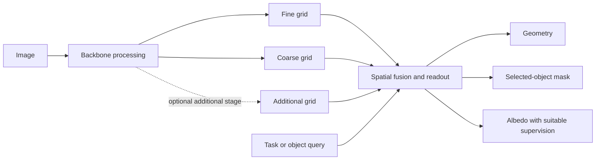

# Multiscale processing, routing and task queries

8 September 2026. Design clarification for the [perception proposal](perception-proposal-2026-09-08.md). Code inspection and literature review only; no model changes, training or inference.

**Preserve useful spatial levels and give downstream readouts explicit access to them. Choose a small number of fusion locations, then test whether more exchange helps.** Processing depth, number of resolutions, cross-scale routing and task conditioning are distinct choices. Connectivity makes information accessible in principle; training and evaluation establish whether the consumer can use it.

## What the current code does

The [deeper experimental encoder](../world_model/curriculum/encoder_variants.py) has two output grids: fine 16×16×64 and coarse 8×8×64 for RGB64 input. Each branch applies two residual spatial blocks, each containing two 3×3 convolutions, then adds position/scale embeddings. With exchange enabled, one four-head cross-attention update runs in each direction, followed by residual per-token MLPs. There is no repeated within-scale transformer stack.

Both branches start from the shared 16×16 stem. Coarse processing does **not** take the fine branch's extra residual blocks as its input. It receives those processed fine features at the subsequent attention exchange. Both attention directions read the incoming maps simultaneously. A sequential pyramid that downsamples the already-refined fine map is therefore a separate topology experiment.

The [current decoder](../world_model/paddle/models.py) already takes both exported levels, upsamples coarse to the fine grid, concatenates and applies convolutions/upsampling. U attends over the concatenated fine/coarse tokens; P reads both levels plus memory and candidate action. E itself remains RGB-only. Exposing both grids to D/U/P is already implemented; exposing every earlier stem activation is not.

Scale names describe grid spacing. Fine features can include global context after exchange, and coarse channels can encode geometry within a grid cell. Geometry should therefore not be routed exclusively to the finest scale, nor semantics exclusively to the coarsest. Processing depth and training objectives determine what is accessible from either.

## Where to preserve and combine features

For a future sequential pyramid, compute a processed level, save it, then downsample it for the next stage. A later fusion module can bring coarse context back to the finer grids. This is a candidate design, not a silent replacement of the current parallel branches.

| Location | Proposed responsibility | What is optional |
|---|---|---|
| Within a scale | Transform the spatial features with residual convolutions, transformer blocks or a declared combination | Equal depth at every resolution; a large transformer stack |
| Encoder stage boundary | Retain that stage's processed spatial map before later compression; record its identity and coordinates | Feeding all prior maps directly into every later block |
| Fusion module, often called a neck | Align/project levels and combine local detail with wider context while preserving spatial output | FPN top-down/lateral processing, repeated bidirectional exchange or cross-attention |
| Output readout | Consume declared levels directly or through a validated fused representation; receive output/object context when needed | One shared decoder for every output; attending to all scales at every layer |
| Temporal state and prediction | Maintain history and produce the state required by future consumers under candidate actions | Predicting every internal backbone activation or applying the same task query to the physical state |

The proposed P1 readouts already use per-level projections, aligned resampling and concatenation. Keep these as the simple initial control. An FPN-style neck adds top-down/lateral processing; it is not another name for the same implementation. HRNet-style repeated exchange throughout parallel branches changes the backbone. Compare these separately if the first readouts expose a limitation.

Here “all available scales” means the declared feature maps retained for the consumer, with explicit per-level width, grid coordinates, valid region, preprocessing, observation time and pre/post-fusion identity. It does not mean every hidden tensor ever computed. A decoder may read all levels across its processing sequence, or consume a fused map that has already combined them. Lossy fusion still needs downstream retention checks.

Additional cross-attention inside a coarse stage is feasible: coarse tokens form queries, earlier spatial levels supply projected keys/values. Dense attention costs grow with query count × total key count; repeatedly mixing all tokens can become quadratic in the combined token count. Per-level attention, scheduled scale access, local windows or sparse sampling are alternatives. Pooling every fine map down to the coarsest grid also discards the direct high-resolution route. Merely wiring more paths does not guarantee stronger learning or preserve a feature after shared weights change.

A native constant-resolution ViT already has depth. Intermediate transformer layers at the same patch grid are different depth taps, not additional native spatial scales. Pooled/resized maps are declared derived levels; they supply a different aggregation, not new observed pixels. A good single-grid encoder remains a valid alternative to a learned pyramid.

## What the task query should do

Start by letting a task-specific head, or a context-aware fusion/readout, use the same retained spatial evidence. Separate output heads can select geometry versus masks without a learned task token. A selected object within an output family needs an actual query: an available point, box, instruction or maintained track identity with declared semantics. An arbitrary training annotation ID is not a usable unseen-object instruction.

The query can also act after image decoding: predict a set of candidate instance masks, then select with a query-aware module. The complete system must respond to the request; a learned task signal inside the image backbone or mask decoder is not universally necessary. Compare equally informed complete systems. Switching from separate heads to a shared FiLM head changes both sharing and conditioning, so it cannot isolate context placement by itself.

One query implementation uses task/object tokens as attention queries and projected spatial features as keys/values, including position, scale and valid-region information. For a dense mask or albedo output, keep a spatial pixel-feature path alongside those query tokens; a single pooled vector is not the only decoder input. Query modulation can also operate on the spatial maps through FiLM. These are alternatives to compare, not mandatory modules to combine.

| Request | Useful routes | Evidence and evaluation required |
|---|---|---|
| Geometry for PushT planning | Spatial detail for reference points/boundaries plus wider shape/contact context; query pusher/body if requested | Existing physical labels and readiness checks, followed by actual action prediction/control. Goal changes should not be mistaken for changes in observed pose |
| Mask of a requested object | Object query plus spatial features at multiple resolutions and a fine pixel path | Per-instance targets, valid query semantics, boundary/IoU and object-selection errors. COCO union foreground alone cannot teach instance selection |
| Albedo | Spatial/material evidence plus context for separating illumination and reflectance; dense output with preserved boundaries | A defined reflectance convention and suitable supervision/constraints. RGB reconstruction and masks alone do not provide albedo truth |

Move conditioning earlier when there is evidence that useful distinctions are lost before the readout, or when context can guide an explicitly available high-resolution crop/computation. Compare against an equally informed late readout, retain a fixed reference for the bounded test, and recheck other outputs if shared weights change. A constant “geometry” label on only geometry examples cannot demonstrate dynamic task conditioning. Use the same scene with varied valid queries and hold out scene/query combinations.

For planning, keep the shared observation/temporal-state route usable across goals. Task-conditioned geometry or affordance reads can be derived from it. A candidate future action belongs in a predictor or explicitly action-indexed branch; it has not changed the current scene. This is a practical starting organization, not a claim that every valid world model must be task-independent.

Future readouts may consume only declared predicted features or causally retained past information. Exposing an observation grid does not automatically require predicting that grid, but a future consumer needs an explicit way to generate each input it uses. Retained past appearance needs alignment and stale-copy checks for moving objects. Actual future-frame features cannot be passed around the predictor as a skip.

A future input level can be generated by another readout from predicted state; P need not emit every map directly. Evaluate decoders on the imagined-state inputs used at deployment. Transfer from a decoder fitted on encoded observations is a valid baseline; a measured distribution mismatch can motivate fitting on predicted or mixed states. Do not silently substitute teacher-encoded future maps in that evaluation.

## Albedo extends the dataset requirement

Albedo is reflectance under a stated material/color convention. Single-image intrinsic decomposition is underconstrained: in a simplified linear diffuse model, observed intensity is the product of reflectance and shading. A dark patch can reflect dark material, dim illumination or both. A task token cannot resolve missing evidence by itself. [Learning Intrinsic Image Decomposition from Watching the World](https://arxiv.org/abs/1804.00582) uses observations of the same scene under changing illumination to constrain learning; this does not make arbitrary video uniquely identify absolute reflectance.

The prepared COCO/Paddle/PushT outputs audited so far do not establish an albedo target. If albedo becomes a required experiment, first define a small controlled rendering cohort with known materials, varied lighting and held-out material/lighting combinations, explicit linear/sRGB handling and fixed exposure/calibration or a declared scale-invariant score. This is proposed collection, not a new job. Real-data transfer would need its own evidence. [Intrinsic Images in the Wild](https://www.cs.cornell.edu/~sbell/pdf/siggraph2014-intrinsic.pdf) supplies human judgments of relative reflectance at pixel pairs; it is not dense absolute-albedo ground truth.

Preserve colour errors when colour is required downstream: independent per-channel rescaling can hide incorrect material chromaticity. Calibrated synthetic truth permits absolute colour/reflectance error; a single global intensity-scale ambiguity can instead motivate an explicitly declared scalar-invariant metric. White balance, exposure and material assumptions belong in the target contract.

The previous conclusion that no download is necessary still applies to the proposed geometry/RGB/foreground and memory screen. It does not establish readiness for this newly named albedo consumer. Full image reconstruction alone also admits trivial reflectance/shading factorizations; such an auxiliary loss needs additional assumptions or supervision.

## Literature and the next discriminating test

[FPN](https://arxiv.org/html/1612.03144v2) retains outputs of selected residual stages and combines lateral features with an upsampled top-down path. [HRNet](https://arxiv.org/abs/1908.07919) maintains parallel resolutions and repeatedly exchanges information. Both support multiscale processing designs, with different costs and training behavior.

[Mask2Former](https://arxiv.org/html/2112.01527v3), Section 3.2.2 and Table 4(d), gives a particularly relevant counterexample to feeding every scale into every layer: its transformer decoder cycles through three resolutions, one per layer. Its pixel decoder also processes multiscale features. The reported comparison does not show a consistent performance advantage for naive all-scale concatenation and uses more compute. That supports considering selective routing; it does not prove our application needs Mask2Former or that one-scale-per-layer is always best.

Keep P1's declared initial decoder as the reference. If scale access becomes the next question, freeze one encoder and fit fresh, equally informed readouts from fine only, coarse only and both levels with fixed resampling rules and comparable head capacity. Because the current encoder already exchanges scales, these are tests of access to its exported maps, not isolated fine-versus-coarse information sources. Match image/query draws, optimizer budget and selection rules; report parameter count, latency, physical errors and small-object boundaries. Test-time removal or attention entropy alone does not replace trained controls.

Then compare simple fusion with one richer fusion alternative, keeping context identical; test earlier versus late conditioning separately. Extra scale count or sequential backbone routing requires training a new compatible encoder under its own bounded protocol. No extra run is added to P0/P1 automatically.

## Claude review

The public conceptual brief and review receipts are retained under `runs/multiscale_routing_2026-09-08/collaboration/`. The code trace and dataset interpretation above are independently verified locally; no private source, local results or media were supplied in that brief.

An initial request timed out without returning a review; the preserved retry and correction exchange completed. Claude supported simple scale-preserving access and a conditional richer fusion comparison. The follow-up explicitly withdrew a blanket requirement to condition the image decoder, a ban on causally retained appearance, and a universal requirement to train future readouts on predicted states. It also qualified fine-scale cost/depth claims and the use of Mask2Former as evidence for encoder conditioning, and accepted the sharing/conditioning confound and colour-metric correction. Test-time level removal may introduce distribution shift, so even interpreting it as reliance needs care. This review refines the proposed controls; it does not establish an architecture improvement or add experiments to the queue. CLI cost fields are API-equivalent estimates, not subscription charges.
