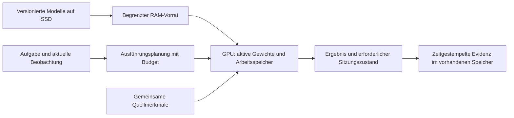

# Bedarfsgesteuerte Neural Engine für Inferenz

22. September 2026, Diskussionsvorschlag nach der GPU-Budgetklärung.
Alex stellt sich eine zentrale Neural Engine vor, die bereits trainierte Modelle
bei Bedarf nutzt, vergleichbar mit einem Buffer beim Rendern. Er grenzt dies
ausdrücklich auf Inferenz ein; das Training ist noch offen. Die undeutlich
transkribierten „GP-Punkte“ werden nicht als festgelegtes Speicherformat oder
bestätigte Graphknoten interpretiert. Die bedarfsgesteuerte Ausführung lässt sich
unabhängig davon beschreiben. Keine Implementierung beauftragt oder validiert.

## Vorgeschlagene Ausführung

Ein kleines häufig benötigtes Grundmodell kann resident bleiben. Zusätzliche
Leser bzw. kompatible trainierte Module werden aus RAM vorgeladen oder bei Bedarf
geladen, ausgeführt und bei Speicherdruck wieder entfernt. Häufig wiederverwendete
Module über mehrere Frames behalten; ständiges Laden pro Frame würde gerade die
Geschwindigkeitspriorität gefährden. Ein handnahes Objekt könnte beispielsweise
die Handanalyse auslösen, deren Ergebnis danach als Beobachtung verfügbar bleibt.
Welche Leser nötig sind, ist eine fachliche Auswahl; ihre Speicherplatzierung und
Aufrufreihenfolge sind Aufgaben der Laufzeitverwaltung. Zunächst explizite Regeln,
später eine gemessene Policy als Vergleich. Die vorhandene Kontext-TaskPolicy
implementiert damit nicht automatisch Modell- oder GPU-Residenzsteuerung.

Die GPU enthält unterschiedliche Dinge mit unterschiedlichen Lebensdauern:

- Trainierte Gewichte, identifiziert durch Modell-/Checkpointversion und Präzision.
- Gemeinsame Quellmerkmale, nur bei identischer Quelle, Vorverarbeitung,
  Encoder-/Konditionierungsversion wiederverwendbar.
- Temporäre Aktivierungen und Workspaces eines Aufrufs.
- Erforderliche fortlaufende Sitzungszustände, die vor Entladen erhalten werden
  müssen; Modell-Cache-Eviction darf keine Person oder zeitliche Evidenz löschen.

Der Knowledge-Graph kann auf Modelle und Resultate verweisen. Gewichte müssen
nicht je Entität kopiert oder als Graphdaten bei jedem Aufruf neu gelesen werden.
Die akzeptierten geteilten Multiskalenmerkmale mit privaten Verbrauchern bleiben
kompatibel: nur kompatible Schnittstellen erlauben Feature-Wiederverwendung.
Externe Spezialisten mit eigenen Eingängen/Backbones teilen diese nicht automatisch.
Einzelne Filter eines dichten Netzes sind ohne deklarierte Abhängigkeiten keine
beliebig austauschbaren ausführbaren Einheiten. Zuerst komplette kleine Module
oder definierte Blöcke betrachten; trainiertes Routing/Sparsity ist eine weitere
Modellentscheidung und nicht durch Puffern allein gegeben.

## Speicher, Latenz und überprüfbarer Umfang

Die gesamte Bibliothek darf größer sein als VRAM. Gleichzeitig aktive Gewichte,
Aktivierungen, aktuelle Features/Zustände, Kopierpuffer und CUDA-Workspaces müssen
in das vorgeschlagene 6-GiB-Prozessbudget passen. Vorladen kann kurzzeitig beide
Module resident halten; diesen Peak mitzählen. Ein einzelner zu großer Aufruf
braucht ein kleineres Modell oder eine explizite Block-/Offload-Aufteilung.
Ein Buffer erhöht weder Rechenleistung noch Transferbandbreite.

[Accelerate Big Model Inference](https://huggingface.co/docs/accelerate/usage_guides/big_modeling)
zeigt bestehenden CPU-/GPU-/Disk-Offload. Das belegt den Mechanismus, keinen
automatischen dynamischen Spezialistenplaner oder Echtzeitbetrieb von PATH-WM.
[PyTorch CUDA-Semantik](https://docs.pytorch.org/docs/2.14/notes/cuda.html#memory-management)
trennt lebende Tensoren und ungenutzten Allocator-Cache: `empty_cache()` entfernt
keine noch referenzierten Modellgewichte. Bei asynchronen Kopien/Aufrufen müssen
Abhängigkeiten und Lebensdauer bis zum Abschluss gesichert sein. Parallelität
und Prefetch sind zu messen; zunächst einfache sequentielle Planung vergleichen.

Prinzipien: gemeinsame Vorbereitung wiederverwenden; Evidenz, Modellwissen und
verwerfbare Caches getrennt besitzen; bedingte Detailarbeit; Speicherverkehr und
End-to-End-Latenz statt nur Modell-FPS messen. Keine neue allgemeine Registry oder
Frameworkhierarchie nötig: ein begrenzter expliziter Aufrufplan in der vorhandenen
Recipe-/Bibliotheksstruktur reicht als erster Vergleich.

Kleinster späterer Test: zwei fest gewählte trainierte Leser mit realer
Aufruffolge; wiederholte Treffer und wechselnde Anforderungen. Gleichbleibende
Modelle/Eingänge/Präzision vergleichen, einmal mit ständigem Neuladen und einmal
mit begrenztem Verbleib im GPU-Speicher; All-resident nur falls es passt.
Separat Peak-VRAM, CPU-RAM, Transferbytes, Kalt-/Warmlatenz und p50/p95 messen;
Output-/Zustandsübereinstimmung bei unveränderter Numerik mit vorab gesetzter
Toleranz prüfen. Quellenzugriff und Zeitkausalität erhalten. Prefetch erst als
eigenen Faktor ergänzen. Modellwahl, konkrete Gates und Trainingsverfahren offen.

Training würde zusätzlich Gradienten, Optimizer, Aktivierungen und konsistente
Gewichtsversionen benötigen. Die Inferenzidee legt weder getrenntes Spezialisten-
training noch gemeinsames End-to-End-Training fest; die bisherige gemeinsame
Lernrichtung wird durch diese Speicher-/Ausführungsdiskussion nicht ersetzt.
