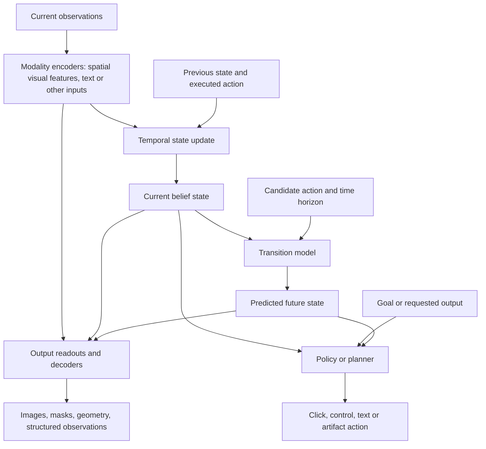

# Requirements-first perception with asymmetric encoders and decoders

8 September 2026. Status: design recommendation, not an adopted replacement or
frozen experiment protocol. This answers the user's question about a different
encoder/decoder family and working backward from downstream requirements. No
training, inference evaluation, model change or dashboard rebuild ran for this
review. It extends the [general visual-state proposal](versatile-perception-architecture-2026-09-08.md)
and the [completed visualization audit](encoder-visual-audit-2026-09-08.md).

**Recommendation:** define a small set of downstream capabilities and a measured
resource budget first. Allow the encoder and output decoders to use different
architectures. Keep the deeper convolutional system as the practical reference;
a feasible pretrained spatial ViT with independently fitted decoders/readouts is
the first alternative worth investigating. A small hybrid is a conditional
candidate, rather than an automatic combination of every promising component.
Neither architecture family nor a fixed token count should be the universal
contract.

This changes the framing of the earlier proposed two-block within-scale
transformer ablation. That remains a useful local causal experiment, but it is
too narrow to choose a general perception system. The completed depth/exchange
study and the DINO diagnostics remain evidence; they should not be repeated as
though they never happened. Further training requires a concrete bounded slice.

## Start with what would change a downstream decision

Requirements-first should mean a few discriminating tasks, not a specification
for all intelligence. Use physical manipulation and a small software interaction
as contrasting design targets. They expose different limits; driving and broad
language generation are not additional experiments in this proposal.

| Required capability | Consequence for the interface/design | Evidence that would actually test it |
|---|---|---|
| Geometry, boundaries and fine contact | Spatially indexed features at adequate resolution; readouts with explicit coordinates and object reference points | Position/orientation where defined, instance boundaries and visible extent on unseen configurations; contact-sensitive decisions |
| Exact visual or symbolic state | Preserve small marks and text where required; use adequate observed resolution, crops or available text/structured observations | Checked versus unchecked controls, exact strings and selected items on held-out layouts; correct interaction outcomes |
| Persistence, motion and partial observation | An explicit temporal state, action/time inputs, episode resets and independent planning branches | Histories with the same final image but different velocities or hidden facts; recovery after occlusion or returning to an earlier screen |
| Consequences of candidate actions | An action-conditioned transition model, with appropriate horizon and outputs | Multi-step physical/outcome errors and alternative-action ranking against observed or simulator-verified branches, followed by closed-loop success |
| Adding outputs without destructive adaptation | Accessible spatial features and replaceable output modules; explicit ownership of shared weights | Train a previously unused output from frozen features; report sample/compute cost and required encoder adaptation, then recheck prior outputs if shared weights change |
| Ambiguity and usable runtime | Match uncertainty outputs to the decision, and measure the complete observation/planning path | Proper scores or interval coverage for declared quantities and decision-error calibration; latency/memory at the required input resolution and planning budget |

These are design requirements and proposed measurements, not passed gates. Before
running, select only the rows needed for the bounded downstream tasks and set
their thresholds using application tolerances. A hard failure on an essential
property cannot be compensated by winning more unrelated rows. Among systems
that meet essential requirements, compare tradeoffs in cost and quality rather
than averaging incompatible scores into an arbitrary winner.

Two useful counterexamples make the distinction concrete. If checked and
unchecked pixels map to the same state, a decoder cannot reliably recover which
one was observed; it can only infer from correlations. If two identical current
frames arise from different velocities, a stateless image encoder cannot decide
which history occurred. The first problem can involve resolution, representation
or its training; the second needs temporal evidence. Adding transformer layers
does not by itself supply either missing input.

Position, orientation and extent can be readouts, not mandatory named coordinates
of a universal latent. Visible extent can be derived from an instance mask when
that is the required quantity; hidden shape and metric 3D size need additional
evidence. A finite compressed representation cannot guarantee preservation of
every property an unknown future application may require.

## Assign separate jobs, then choose architectures

This is a functional design, not a new implemented graph. Output modules must
declare whether they read current visual features, the temporal state or a
compatible predicted state. Their input shapes and meanings need not all be
identical. Planning through predicted images is also legitimate; the figure does
not prohibit it. A pixel decoder is optional for a planner operating directly on
features, but necessary when a downstream consumer actually requires pixels.

The encoder preserves observed evidence. The temporal state combines evidence
across time, including uncertainty about hidden quantities. The predictor models
what actions change. Output decoders render or measure particular properties.
An action generator chooses or produces an action; generating text or an artifact
does not itself predict the external consequence of executing that action.
Internal search or recurrent computation may help a controller, but is distinct
from adding spatial levels to an image encoder.

There is no requirement to mirror encoder and decoder depth, stages, attention
type or channel width. They must have compatible interfaces and be trained for
their actual inputs. Architectural independence also does not mean statistical
independence: a decoder cannot invert information that is absent, and a decoder
trained only on encoded observations may fail on imperfect predicted states.

For this project, preserve the old 320-by-64 checkpoint interface for existing
runs. A genuinely different candidate should be allowed native spatial feature
shapes and width in its own comparison. Record grid coordinates, valid regions,
preprocessing and normalization. Any compression/projection is an explicit
intervention, not an invisible compatibility step. This proposes no generic
registry or immediate rewrite of U/P. New compatible U/P training belongs to a
later gated slice; old predictor weights cannot silently consume a new latent.

## What the literature directly supports

| Primary source | Verified architectural fact | Limit on the inference |
|---|---|---|
| [DINO-WM](https://arxiv.org/html/2411.04983v2), Section 3.1.3 | Frozen DINOv2 spatial patch features can be decoded by a separately trained stack of transposed convolutions. This decoder is optional for feature-space prediction/planning and is used for visualization. | Direct ViT-encoder/convolutional-decoder world-model precedent; not a demonstration that any ViT preserves every detail or that the decoder improves planning. |
| [DPT](https://arxiv.org/abs/2103.13413) | Reassembles transformer tokens into multiresolution image-like features and combines them with a convolutional decoder. | Dense depth/segmentation evidence, not an action-conditioned world-model experiment. |
| [SegFormer](https://arxiv.org/abs/2105.15203) | Hierarchical transformer encoder with a lightweight MLP decoder aggregating multiple feature levels. | A strong family-asymmetric segmentation example; its decoder is not automatically an RGB generator or a controller. |
| [MAE](https://arxiv.org/abs/2111.06377) | Uses an encoder on visible patches and a lightweight reconstruction decoder. | Supports asymmetric compute and training roles within the transformer family; not by itself evidence for different architecture families. |
| [Representation Autoencoders](https://arxiv.org/html/2510.11690v1), Sections 3–4 and Appendix C | Fits ViT decoders to pretrained representation encoders and studies diffusion generation in those representations. | Reconstruction/generation evidence. Its diffusion width/noise adaptations are not universal laws for readouts, adapters or dynamics; a nonlinear decoder's success does not establish linear accessibility or exact metric geometry. |
| [Perceiver IO](https://arxiv.org/abs/2107.14795) | Output queries support differently sized and structured outputs from a latent array. | A modular output-interface precedent; new output semantics still need a learning signal. It is not by itself a cross-family encoder/decoder demonstration. |

These examples support allowing different architectures, not selecting a winner
before testing. More capable reconstruction can use learned priors to fill gaps;
visual plausibility alone does not prove that small decision-relevant details
were retained. Conversely, semantic pretraining does not prove that color,
orientation or local geometry are necessarily absent from all patch features.
Probe the needed property with adequate readouts before prescribing a second
appearance path.

## Practical shortlist and choice rule

| Candidate | Why it is worth considering | Main unresolved issue |
|---|---|---|
| Existing deeper convolutional encoder and convolutional RGB decoder | A working, measured reference with useful spatial bias and known costs | Existing pose/readiness failures; generality beyond the measured domains |
| Feasible pretrained spatial ViT plus a fresh convolutional RGB decoder and selected spatial readouts | Uses existing broad visual pretraining; direct asymmetric world-model precedent | Exact details, native feature/readout conditioning, domain fit and system cost |
| Small convolution/transformer hybrid plus output-specific decoders | Local processing and downsampling with content-dependent spatial interaction; plausible for a modest from-scratch training budget | Must resolve a measured failure or cost problem, not merely add both components |
| CNN or ViT with a query-based transformer decoder | Useful if object/coordinate queries and multiple actual output types justify shared decoding | Extra decoder capacity and training needs; not necessary for a first RGB-plus-mask implementation |

The number of scales is a spatial sampling decision. Transformer depth is a
computation decision. Temporal hierarchy is a third decision. A four-scale model
is not automatically better than a two-scale one, and a larger single-resolution
ViT does not automatically retain finer observed detail. Choose source resolution
and granularity from the smallest relevant distinction, then profile candidate
processing at that resolution. Enlarging a previously reduced image cannot
restore discarded pixels.

Keep deterministic convolutional reconstruction as the initial RGB-decoder
reference. More expressive transformer or generative decoders are options when
the required output warrants them; plausible stochastic images and calibrated
uncertainty are different objectives. Treat masks, geometry, text and actions as
outputs with their own suitable readouts, rather than requiring all of them to
be produced by one pixel autoencoder. Add a shared query decoder only after two
real outputs justify the abstraction.

Task conditioning can select an output or goal. It cannot substitute for an
action-conditioned transition model. Detail skips are conditional remedies:
future rendering may use predicted features or causally observed past evidence,
never a target future image. A path that simply copies current objects can look
good on static backgrounds while predicting the wrong motion.

## Bounded next proposal

1. Specify a small requirements/evaluation contract for manipulation and one
   software interaction, with explicit input availability and resolution. Reuse
   the existing PushT/COCO evidence. A software episode benchmark and its labels
   still need preparation; static COCO cannot supply action outcomes or memory
   supervision. Do not treat this design table as an already funded six-axis
   experiment.
2. Map completed tests to that contract. The prior frozen DINO comparator was
   stronger on the common foreground-mask diagnostic and weaker on other tests.
   Its adapted legacy layout and the separate scaled native linear-head probe
   constrain what we can infer, but do not settle native ViT decoding with an
   adequate fresh readout. Repeating the same legacy-adapter arm is not the next
   experiment. Also preserve the evidence that a frozen encoder's COCO decoder
   refit recovered reconstruction while damaging PushT reconstruction.
3. Fill the most consequential missing comparison: the current practical system
   versus one feasible pretrained spatial ViT package with fresh deterministic
   decoding and selected readouts, preserving native features. Use common
   observation/evaluation populations and controlled readout families where
   possible. Document adapter/readout capacity, normalization, conditioning,
   data exposure and measured end-to-end cost. Architecture-specific heads mean
   this is a practical system comparison, not an isolated encoder causal claim.
4. Profile a tiny development sample before freezing any formal budget, thresholds
   or seeds. A proposed formal comparison would use three paired seeds and
   grouped holdouts. Existing inspected test results are descriptive evidence;
   new confirmatory claims need a prospectively declared evaluation population.
   A matched from-scratch architecture test is a separate question from selecting
   a useful pretrained package.
5. Add one small hybrid only if the measurements identify a missing capability or
   resource problem that it plausibly resolves. Downstream temporal/predictor
   comparisons require compatible new modules and the existing readiness rules.
   A different pose-free planner needs its own declared protocol; this document
   does not lower or bypass the current gates.

No training-duration estimate or winner is established by this review. The
decision supported now is the design method and the shortlist, not that one
unmeasured package is superior.

## Critical Claude consultation

The user-adopted [collaboration workflow](claude-collaboration-workflow.md) was
used. No reachable Claude agents were available, so the installed Claude CLI
reviewed a public-concept-only brief with WebSearch/WebFetch, safe mode and an
empty MCP configuration. It received no repository source, private results or
datasets. Local code/result interpretation in this note is Codex's synthesis,
not a claim that Claude independently audited those artifacts.

The first review and a challenge/reconciliation exchange completed successfully.
Exact prompts, replies and receipts are in
`runs/requirements_first_perception_2026-09-08/collaboration/`. The resumed session
is `61dcb7f7-3550-4982-be7d-848919c6039f`. Receipt fields sum to $0.71478575
API-equivalent cost, not a subscription bill.

Claude explicitly withdrew its initial claim that cross-family evidence was
thin, its transfer of RAE's diffusion width requirement to arbitrary readouts,
and its prohibition on action selection through decoded images. It corrected
the attribution of action consequences to the transition model, qualified the
invariance argument and separated uncertainty diversity from calibration. It
accepted a bounded practical comparison instead of a full encoder-by-decoder-
training sweep. Both reviews favor requirements first with a strict scope limit;
agreement does not validate the proposed architecture.

Remaining corrections in this synthesis: the reconciliation's phrase “linearly
accessible” is not established by RAE's nonlinear decoders. Its suggestion to
choose whichever system wins the most requirement rows is rejected: essential
failures must remain failures. “Fixed output heads” cannot mean identical tensors
across different feature widths; control the readout family/capacity and document
the differences. A changed-action prediction is not a verified counterfactual
without a corresponding outcome. Large video encoders are not presumed locally
feasible simply because they belong to a cited model family.
