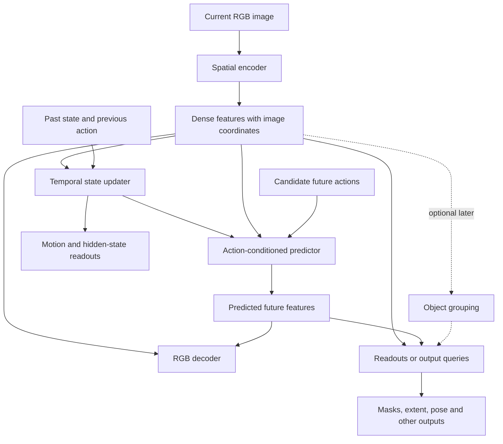

# General visual state with extensible readouts — architectural reassessment

8 September 2026. Status: literature-backed design proposal, not an implemented
replacement or a frozen experiment protocol. The user requested reassessment
after the completed frozen-encoder pose comparison. No training was launched for
this review. This extends the [earlier literature review](world-model-literature-2026-09-08.md).

**Recommendation:** learn a spatial visual representation and a causal temporal
state that support several outputs. Position and orientation remain useful
readouts and possible auxiliary targets; they should not define the entire state.
Start by testing a frozen pretrained spatial encoder against our existing encoder
with RGB and mask/extent readouts. Add object grouping and shared query decoding
only after that comparison establishes a concrete need.

Here “extent” means size, boundaries or shape. Visible image extent, complete
occluded shape and metric 3D size are different targets. A flexible interface
allows these outputs to be added, but cannot guarantee that a finite learned
representation retained every property an unknown future application will need.

Explicit pose labels are optional for a different learning route: visual
pretraining can learn from images, and dynamics can learn by predicting encoded
future observations from action sequences. Pose can then be used only as a
diagnostic or trained when an application needs it. This does not make metric
geometry automatically accurate; task losses remain an option when they address
a measured failure.

## What our results do and do not establish

The current E already produces dense visual features: a 16×16×64 fine map and an
8×8×64 coarse map. The six pose numbers are an output of H, not the representation
passed to the world model. The main opportunities are better representation
learning, spatial readouts, retention objectives and explicit interfaces, rather
than replacing a nonexistent six-number encoder bottleneck.

The [decoder recovery study](decoder-recovery-results-2026-09-08.md) reduced COCO
test MSE from 0.272195 to 0.006105 with the adapted encoder frozen; the original
warmup result was 0.006072. The same refit worsened PushT reconstruction by 8.72×.
This supports substantial recoverability and shows a decoder-training tradeoff.
It does not prove complete information preservation or a need for larger E.

The [pose study](pusht-pose-accessibility-results-2026-09-08.md) improved angle
MAE from 27.31° to 12.98° with the spatial head, while object x/y MAE worsened to
25.67/28.08 source-world units. All candidates failed the existing readiness gate.
This is evidence that readout design matters and that orientation alone is an
incomplete geometry benchmark. It does not establish a superior general encoder,
or identify the reason for the remaining position error.

PushT's labels describe simulator `block.position` and `block.angle`. That position
is a body reference, not a silhouette centroid or bounding-box center. The spatial
head's orientation point is a constructed local-axis landmark, not a labeled
visible corner. A new mask-derived centroid must not silently replace this label.
The new output needs an explicit coordinate and reference-point contract.

## Primary literature and its practical limits

| Source | Relevant result | Implication for this project |
|---|---|---|
| [DINO-WM](https://arxiv.org/abs/2411.04983) | Predicts frozen DINOv2 spatial patch features from action trajectories and plans toward image-goal features. | Explicit pose and pixel reconstruction need not be prerequisites for every planning architecture. Our existing pose-based planner still needs its declared checks. |
| [V-JEPA 2](https://arxiv.org/abs/2506.09985) | Combines large-scale predictive visual pretraining with action-conditioned robot post-training. | Learn temporal predictability as well as appearance. Its pretraining scale is far beyond a local small-model experiment. |
| [Representation Autoencoders](https://arxiv.org/abs/2510.11690) | Combines pretrained representation encoders with trained image decoders for image generation. | A general visual encoder and separately fitted RGB decoder are a credible starting point. Image generation results do not establish causal dynamics or precise geometry. |
| [DINOSAUR](https://arxiv.org/abs/2209.14860) and [Slot Attention](https://arxiv.org/abs/2006.15055) | Learn object grouping; DINOSAUR reconstructs self-supervised features and evaluates on natural images including COCO. | Object embeddings can organize masks, shape and relationships without allocating one latent coordinate to every named attribute. Object discovery, count and identity are not automatically correct. |
| [Perceiver IO](https://arxiv.org/abs/2107.14795) | Uses output queries to produce outputs with different sizes and meanings from a shared latent representation. | A concrete precedent for extensible decoding. New output meanings still require training signals; a query is not a zero-shot source of arbitrary properties. |
| [Masked World Models](https://arxiv.org/abs/2206.14244) | Separates visual representation and dynamics learning; reward-related supervision improves task relevance in its experiments. | General representation learning can coexist with selected task losses. Removing all auxiliary supervision is not justified. |
| [JEPA-WM design study, v4](https://arxiv.org/html/2512.24497v4) | Compares encoders, context, rollout objectives and planning in several environments. DINOv3's advantage over DINOv2 is concentrated in more photorealistic settings; increasing rollout training length is not uniformly beneficial. | Benchmark candidate representations on our data. Neither the newest encoder nor the longest rollout objective is an automatic improvement. Prediction proxies and planning success must both be measured. |

These are compatible ingredients, not evidence that their untested combination
will solve our problem. The table uses primary papers; the design-study remarks
come from Section 5.2 and Appendix G. Its proposed explanation that fine object
boundaries help dynamics is an interpretation, not a demonstrated mechanism in
PATH-WM.

## Proposed organization

**Spatial base.** Keep a grid of features with known image coordinates, and retain
fine spatial information where available. Begin with our existing E and one
frozen DINOv2-S/14 candidate. DINOv3-S/16 is a later candidate if its weights are
available and the first comparison warrants it. The official
[DINOv2 repository](https://github.com/facebookresearch/dinov2) provides small
patch-feature models; the [DINOv3 repository](https://github.com/facebookresearch/dinov3)
lists small models and its weight-access procedure. No weights were downloaded
or runtime/VRAM claims established in this review.

The first backbone comparison must start from the same observed images. Resizing
our 64×64 images to a backbone's input resolution does not restore lost detail.
Higher source resolution is a separate experiment. A pretrained-versus-local
comparison tests a practical system choice, not the causal effect of architecture
independent of pretraining data and compute.

**Output layer.** Start with separate lightweight RGB and geometric readouts,
using explicit output contracts. A mask describes where an object's visible
pixels are; bounds, visible area and a visual centroid can then be computed from
that mask. For a known rigid T shape, fitting its translation and rotation to a
mask/keypoints is a useful alternative to independently regressing coordinates.
Keep that shape-specific estimator as a diagnostic or application module. For
arbitrary objects, orientation can be ambiguous, symmetry-dependent or undefined;
a single angle is not an appropriate universal target.

When multiple actual outputs justify sharing, use a query decoder that reads the
spatial features. Queries specify an output type and, where relevant, an image
location or object. It can answer “RGB here,” “mask for this object,” or “pose for
this object,” with small output projections appropriate to each value type. Do
not promise an untrained query such as “mass” will work merely because the query
interface accepts it.

**Object structure.** Object slots are a possible intermediate grouping of the
grid, not a mandatory early bottleneck. Preserve the grid route for backgrounds,
small details, surfaces and failed grouping. Sequential slots also need tested
identity association, occlusion handling and object appearance/disappearance.
[SAVi](https://arxiv.org/abs/2111.12594) is a relevant temporal precedent, but its
reported realistic synthetic settings and conditioning cues do not establish
universal unsupervised tracking.

**Memory and prediction.** Retain one explicit temporal state owned by the caller,
with episode resets and independent planning branches. It summarizes observation
history and actions, including velocity and evidence about hidden objects. A
single still image generally cannot distinguish identical appearances with
different velocities or physical parameters. Start with E and RGB D stateless;
the existing U/P separation already provides the right place to test temporal
changes. Add uncertainty or multiple future hypotheses when ambiguous outcomes
are represented in the data and a deterministic model fails there.

**Conditioning.** The user's task-conditioning idea fits the requested output:
RGB, mask, pose, depth, or an object query. Predicting a future image first requires
an action-conditioned future state; the RGB decoder can then use that state's
features. A reconstruct/predict tag alone neither supplies dynamics nor preserves
both COCO and PushT, since both domains already ask for reconstruction. Goals
usually affect action selection; a different requested output should not by
itself change the physical transition for the same state and action.

**Detail and skips.** If a semantic backbone loses necessary photometric detail,
test a fine appearance branch or decoder skip path. For imagined futures it may
use only predicted features or causally observed past appearance. Copying an
unmoved current object through a skip can lower background-dominated image error
while giving the wrong future. Evaluate motion and foregrounds, not image MSE
alone. Transformer [register tokens](https://arxiv.org/abs/2309.16588) address
within-frame computation artifacts; they do not supply temporal memory or a
retention objective. Neither addition is the first intervention recommended here.

## Training curriculum

1. **Establish transferable perception.** Freeze the candidate visual bases and
   fit RGB and mask readouts. Use the same generic/task mixture and held-out groups
   for comparable candidates. First measure what each representation exposes
   without changing E. Keep physical labels as targets, never privileged visual
   encoder inputs.
2. **Make adding an output a real test.** Fit an additional shape/extent readout
   from the frozen representation and check the original outputs again. For
   visible bounds derived from masks, no separate bound regressor is necessary.
   If the feature representation cannot support the new property under adequate
   readout training, try a small adapter or controlled E adaptation with mixed
   data and explicit preservation losses. Freezing E alone does not protect an
   RGB decoder that is itself being updated.
3. **Learn action-conditioned dynamics.** Fit P and U on action sequences using
   future features as targets. Static COCO images supply visual training but no
   action-conditioned transition examples. Compare a short rollout objective
   before extending horizons. Include validated physical/mask losses where they
   improve decisions, retaining feature prediction. Keep loss scales and which
   modules receive each gradient explicit.
4. **Evaluate use under intervention.** Test predicted motion, collisions,
   occlusion recovery, alternative action ranking and closed-loop control. Image
   reconstruction and pose accessibility are useful diagnostics, not substitutes
   for this stage. A pose-free goal-feature planner requires its own declared
   protocol and success criterion; it cannot silently bypass the existing gate.

For pose-relevant transforms, preserve spatial equivariance: transformed inputs
must have consistently transformed masks/coordinates. Do not demand rotation
invariance from a feature path expected to report orientation. Likewise, distinct
colors cannot be deliberately removed from the only feature path if faithful RGB
reconstruction or a later color-sensitive task must remain possible.

## Data we can use now

Read-only inspection found **82,783 images, 604,907 instance annotations and 80
categories** in
`/home/alex/Documents/datasets/annotations_trainval2014/annotations/instances_train2014.json`.
All 82,783 filenames in `data/curriculum/coco_v1/manifest.json` match image records
there. The annotation fields include segmentation, bounding box, area and crowd
status. This verifies metadata availability, not prepared mask correctness.

Use only the existing train split's annotations for training. Preserve the
74,501/4,136/4,146 train/validation/test image split. Apply the exact recorded
resize/crop to polygon or RLE masks, define crowd/visibility handling, and derive
visible bounds after transformation. Audit sampled overlays before training.
Do not infer per-instance extent from a class mask that merges touching objects.
An instance decoder needs an explicit matching/count protocol; choose any query
count from training-set coverage before inspecting held-out results.

PushT can supply known-body geometry for a separate mask-to-pose reference after
checking rendering and body-frame alignment. For broader temporal generality,
eventually add varied shapes/scales, occlusions and action outcomes with fresh
configuration-disjoint cases. Current static annotations do not supply hidden
shape, metric 3D extent, friction, mass or motion supervision.

## Concrete implementation slices

The first implementation should be an isolated perception comparison. Do not
rewrite all E/U/P/D interfaces or introduce a registry before it works.

| Slice | Affected code or new component | Reviewable result |
|---|---|---|
| Preserve and adapt interfaces | Existing `world_model/paddle/models.py` and `types.py`; a small separate perception adapter module | Legacy checkpoints remain loadable. Candidate feature records carry level shape/channel metadata, coordinates, valid region and preprocessing identity, rather than assuming every encoder has 320 tokens of width 64. |
| Add a second real encoder | Frozen DINOv2 feature adapter beside the existing E adapter | Same-view feature extraction, frozen-parameter verification, measured latency/VRAM and cache keyed by weights and preprocessing. Native feature layouts remain explicit. |
| Add geometric supervision | COCO annotation-to-prepared-image adapter and one mask decoder | Audited transformed masks and visible extents; correct instance matching and crowd handling. This adapter is not implemented by this document. |
| Compare useful outputs | RGB and mask decoders, existing pose probes where applicable | Comparable learning curves and held-out output metrics, including foreground reconstruction and old-domain retention. Record per-backbone input projections, head parameter counts, data exposure and compute. A projection or head bottleneck remains an alternative explanation for poor scores. |
| Extend only after the first result | Shared query decoding, object grouping, then U/P adapters as separate interventions | Each addition has a concrete missing capability and a matched control. Dynamics and planning run only under a separately declared protocol. |

Use plain PyTorch modules and explicit configuration. Record source/weight hashes,
feature schema, image transform, output units/reference frames, loss ownership,
split identity, seeds, training presentations, precision and compute. Decoders
trained on encoded observations also need evaluation on predicted features before
we claim future rendering works.

Essential implementation tests should catch image/mask/point transform mismatch,
incorrect variable-grid reshaping, feature-cache reuse across incompatible E,
unintended gradients into frozen components, state leakage across episodes or
planning branches, and future information entering the predictor. Add a readout
and verify the preserved E/D route returns the same output on fixed inputs. These
are prospective tests, not checks claimed as run in this design review.

Follow the standing four-step workflow: plan/interfaces, essential failing tests
and commit; then a small complete measured slice with a verified dashboard and
commit. Profile a tiny development sample first, then freeze seeds, budgets,
selection rules and thresholds before a formal comparison. One development seed
does not establish superiority. Report compute alongside matched data exposure;
raw latent MSE is not comparable across different feature representations.

**Proposed immediate decision:** compare current frozen E and a small frozen
pretrained E on reconstruction plus masks/extent, retaining pose as a diagnostic.
This directly tests the desired ability to support additional outputs. The
existing T-only results cannot justify declaring either a new universal
architecture or a need to remove explicit geometry altogether.
