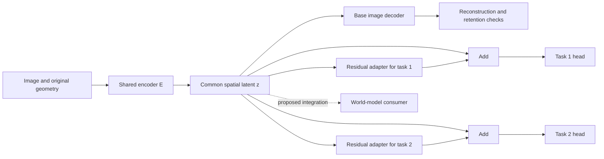

# Shared visual encoder with per-application residual adapters

Design proposal · 17 September 2026 · source baseline `473b597`.

This document captures Alex's proposal to learn small application-specific
corrections around a shared encoder, comparing a frozen encoder with an encoder
that can adapt. It defines a candidate architecture and an experiment sequence.
It does not report an implemented adapter, a selected checkpoint, or trained
quality. Continue with the [session handoff](visual-adapter-handoff.md).

## 1. Objective and requirements

Build a compact visual representation that supports faithful reconstruction and
useful world-model tasks without deploying a complete encoder per application.
Parameter count should scale: as small as useful, with width/depth increases
available when justified by measured quality. Preserve spatial information for
large, rectangular and odd-sized images. Keep teacher-free and pretrained-teacher
training as separate options.

The user proposed the residual specialization and frozen/unfrozen comparison.
Final-latent placement, bottleneck block, experiment phases and evaluation controls
below are engineering proposals for that comparison, not adopted results.

The wider [codec review](visual-codec-review.md) remains the source for VAE
improvements and application requirements. This design isolates adaptation;
changing the codec architecture, latent bandwidth, teacher, data mixture and
adapter simultaneously would prevent useful attribution.

## 2. Current repository boundary

| Component | Existing interface and relevance |
| --- | --- |
| [SpatialVAE](../pathwm/models/spatial_vae.py) | `encode(x)` returns `Posterior(mu, logvar, original_size, padded_size)`; `decode(z, output_size)` consumes a spatial latent and geometry. Mean and sampled reconstructions are distinct. |
| [HierarchicalVAE](../pathwm/models/spatial_vae_v2.py) | Opt-in v2 implementation of rearrangement, processing, mixing and compression. Default C specimen: 122,979 encoder+decoder parameters, four latent channels, stride four, per-position channel normalization. Preserve as a small reference, not a quality winner. |
| [Spatial recipe](../experiments/spatial_vae.py) | Existing recipe supports v1 and v2 construction. There is no separate `experiments/spatial_vae_v2.py`. Reuse its data, checkpoint and reporting conventions. |
| [VideoVAE](../pathwm/models/video_vae.py) | Optional image-codec reuse with causal temporal refinement. Temporal adapters solve a different question and stay out of the first comparison. |
| [Categorical agent recipe](../experiments/multimodal.py) | Its visual path is not already replaced by this optional codec. Connecting the proposed common latent to agent dynamics/memory remains separate work. |

The [parameter audit](visual-codec-parameter-audit.json) establishes untrained
counts and small shape contracts only. Existing [v2 results](spatial-vae-v2-plan.md)
and [video results](shared-video-vae-plan.md) leave fidelity/generalization gaps.
Do not assume the current four-channel latent retains every detail a new task
needs. Select and hash the actual starting checkpoint before an experiment.
V2 diagnostic snapshots are detached; they are not a differentiable feature API
for intermediate adapters.

## 3. Candidate architecture

For task `t`, `z_t = z + A_t(z)` and `y_t = H_t(z_t, output_geometry)`.
The head handles output channels, resolution and likelihood appropriate to its
task. The adapter changes features while preserving the latent tensor's shape.
The base RGB decoder reads the **unadapted** common latent for retention checks.
An RGB-specific adapter/head, if evaluated later, is a separate branch; it must
not hide degradation of the common representation.

First candidate: bias-free `1x1(C→r) → SiLU → 1x1(r→C)`, where `r` is a declared
adapter width. It adds `2*C*r` parameters per task, excluding the task head.
Initialize only the last projection to zero so the branch initially makes no
correction. The first projection uses ordinary initialization. A zero final
projection means its upstream layers can initially have zero gradient; check
learning across multiple updates, not by requiring every gradient on step one.

This candidate mixes channels locally. A depthwise spatial convolution inside the
adapter can add neighborhood context, but is a separate ablation. Small `C` may
make even the initial bottleneck restrictive; adapter width and encoder latent
bandwidth are different variables. No universal rank or fixed parameter cap is
selected here. A null result with this pointwise function class does not show
that the input features lack the information a richer readout could recover.

### Placement and compute

| Placement | Benefit | Limitation |
| --- | --- | --- |
| After the final latent; first comparison | One encoder pass serves multiple heads; common representation stays explicit | Cannot uniquely recover detail absent from the latent; limited spatial context in a pointwise adapter |
| At selected intermediate stages; later comparison | Can change processing before later compression | Later activations become task-specific; shared weights no longer imply one shared forward pass |
| Side readouts from intermediate features | Can retain higher-resolution evidence | More inputs, memory and bandwidth; a different information budget that must be counted |

Variable image shape is not constant compute or proven generalization to larger
resolutions. The adapter can be fully convolutional while its encoder/head remains
the limiting factor. Tiling needs halo, padding and normalization checks; large
image support and full/tile equivalence require measurement.

### Latent and gradient contract

The initial diagnostic uses `z = posterior.mu`. It does not transform `logvar`,
replace the posterior distribution, or claim that the adapted latent retains the
same Gaussian KL. During this mean-only diagnostic, freeze the variance head and
base RGB decoder. Trainable encoder groups are the shared feature extractor and
mean projection; their movement can still change variance outputs through shared
features, so sampled-codec behavior has no preservation guarantee.

For a later stochastic experiment, declare which posterior parameters train,
where sampling occurs, random-number coupling, and exact reconstruction/KL
reductions. Evaluate means and repeated samples separately. A nonlinear adapter
after sampling does not make its output a diagonal Gaussian automatically.

In the frozen case, encoder parameters, buffers and stochastic mode are fixed;
only adapters and heads train. The latent can be computed without an encoder
gradient graph for final-only adapters. In the trainable case, task gradients
flow through both the identity and residual paths into the common encoder.
For interleaved adapters, frozen base weights can still need autograd through their
operations to reach an earlier adapter; do not wrap that whole path in `no_grad`.

The shared latent is intended to remain independent of the requested output task.
The task selects its branch. That interface alone does not prevent latent drift:
encoder updates must be checked against existing consumers before deployment.

## 4. Evidence and limits

[Taskonomy](https://arxiv.org/abs/1804.08328) used a common encoder architecture
across visual tasks and studied transfer. Its
[RSA follow-up](https://arxiv.org/abs/1904.11740) found early commonality and deeper
task-family structure. These motivate measuring sharing rather than assuming all
tasks need identical final features.

[Residual adapters](https://arxiv.org/abs/1705.08045) and
[series/parallel adapters](https://arxiv.org/abs/1803.10082) provide direct precedent
for small specialized parameter sets around shared visual networks. Their
multi-domain classification evidence does not establish dense prediction,
reconstruction or world-model performance here. The later paper also motivates
considering shallow adaptation when final-only corrections are insufficient.
[Official implementation](https://github.com/srebuffi/residual_adapters).

[CKA](https://proceedings.mlr.press/v97/kornblith19a.html) and RSA can compare
representations despite channel reordering. Their scores are not percentages of
shared information, and [functional tests expose metric limitations](https://proceedings.neurips.cc/paper/2021/hash/0c0bf917c7942b5a08df71f9da626f97-Abstract.html).
Residual size, similarity and unfreezing gains cannot alone identify missing
information or the optimal sharing boundary.

## 5. Controlled experiment sequence

### Phase 0 — source and task readiness

Choose a starting codec/checkpoint whose reconstruction and basic task signal can
be measured. Preserve the existing small v2 reference; if a stronger baseline
must be trained, do that as a separately recorded stage. All paired arms for a
given seed begin with exactly the same encoder weights. Distinguish a fixed
starting checkpoint plus adaptation seeds from independently pretrained encoders.

Choose two labeled tasks with complementary demands, plus RGB retention.
Geometry and segmentation are candidates if aligned supervision is available.
If only synthetic labels are available, label the experiment a mechanics or
controlled-task result. Do not invent depth/semantic ground truth from raw photos.
Split by source image, video or scene **before** extracting crops/frames.

### Phase A — per-task adaptation capacity

For each task, use an independent experimental copy of the same source encoder:

| Arm | Encoder feature/mean path | Adapter | Trained output module |
| --- | --- | --- | --- |
| F0 | Frozen | Absent | Task head |
| F1 | Frozen | Present | Adapter + same task head |
| U0 | Trainable | Absent | Same task head |
| U1 | Trainable | Present | Adapter + same task head |

Hold head architecture and paired initialization fixed, including unused adapter
RNG effects. Keep the task data, augmentation schedule and supervised exposures
matched. Heads always train; otherwise the adapter comparison becomes a head
training comparison. F1−F0 measures added adaptation on fixed features; U1−U0
measures its value with encoder adaptation; U−F measures the value of the permitted
encoder update regime. These are conditional comparisons, not unique causal
diagnoses of why information was inaccessible.

Before claiming that residual placement itself is beneficial, add a frozen-encoder
control with a parameter-matched expanded nonresidual task head. The four primary
arms alone do not distinguish placement from extra downstream capacity. Formal
Phase A conclusions require at least three paired adaptation seeds, with head
initialization, data order and augmentation streams explicitly paired; fewer seeds
are a development check only. Predeclare the primary contrasts and treatment of
multiple tasks/metrics rather than selecting whichever result looks best.

Use `L_task + lambda_rgb * L_rgb(D0(mu), image)` for the initial mean-only study,
with a fixed, documented retention coefficient and frozen decoder `D0`. It is
constant with respect to the trainable parameters in F arms and influences the
encoder in U arms. Thus U results measure adaptation **under the declared anchor**;
they are not unconstrained fine-tuning upper bounds. If the anchor is suspected
to limit adaptation, vary it only in a separate registered comparison.

With fixed evaluation inputs/mode, common-codec retention in F arms is invariant
by construction. Verify that contract and report it as the baseline, not as a
learned retention improvement. Keep task and retention scores separate. A fixed
anchor gives one conditional operating point, not a measured Pareto frontier.

These U arms produce separate task-specific encoders. They are specialization
references, not a claim that one shared deployed encoder can achieve all scores.
Freeze any additional existing consumer/readout used for retention evaluation;
retraining it would conceal interface drift.

### Phase B — one shared deployed encoder

Compare frozen shared encoder + adapters, jointly trained shared encoder + heads,
and jointly trained shared encoder + adapters + heads. This is the actual sharing
test. Predeclare task sampling, loss reductions/weights and treatment of missing
labels. Every task must be evaluated after joint training. Do not update a single
encoder sequentially for different tasks and present its intermediate scores as
simultaneous competence.

Retain RGB/common-consumer checks. Add a parameter-matched enlarged-head control
before attributing a benefit specifically to residual placement rather than extra
task capacity (reuse the Phase A confirmation control where applicable). Results
are conditional on the declared task-weighting policy; test sensitivity before
making policy-independent claims. Distillation, gradient surgery and learned task weights remain
later interventions, not hidden differences in this comparison.

### Phase C — only the extensions supported by earlier results

Shortlist adapter widths or intermediate placements, then confirm with at least
three paired adaptation seeds and an untouched source split. Multiple source
pretraining seeds are needed before claiming insensitivity to initialization.
Test two codec sizes only after the small comparison works. Keep these changes
separate from teacher alignment and mean-versus-sampled VAE tuning.

Teacher-free means no pretrained teacher provides features or losses; ordinary
supervised task labels remain allowed. Teacher-assisted initial encoders form a
separate track with their training cost recorded. If a teacher labels evaluation
data, those scores measure agreement with that teacher, not independent truth.

Only later add temporal tasks, predicted latent inputs, or actual world-model
integration. Predicting a future output must not read the real future image,
latent, skip features or normalization statistics. Latents from the world model
may differ from encoded observations and require their own evaluation.

## 6. Applications and observable outputs

| Application | Required evidence | Useful debug output |
| --- | --- | --- |
| RGB reconstruction / retention | Paired source pixels; color/detail errors and PSNR | Original, base reconstruction, error maps and fixed detail crops |
| Segmentation / boundaries | Aligned masks; IoU and boundary metrics | Mask overlays, confidence, boundary errors |
| Depth / surface normals | Valid geometry labels or a declared geometry-supervision setup | Depth, normals, reprojection residuals and confidence |
| Small objects / text / exact attributes | Independent annotations; object/text/color metrics | Tiny-object crops, missed glyphs, region-level errors |
| Flow / tracking / change, later | Paired frames, correspondence/identity labels | Flow arrows, occlusion masks, ID switches and event timelines |
| Future prediction / control, later | Temporal splits; actions/interventions where required | Rollout strips, uncertainty, object trajectories and action-effect errors |
| Grounding / WorldState, later | Region/text links and entity/relation evidence | Linked regions, retrieval results, graph provenance and stale-state errors |

Decoder output quality, state accessibility and useful control are separate
endpoints. A graph or depth display requires a trained readout/association system;
it is not automatically a new VAE capability. See the wider review for restoration,
inpainting, novel-view and cross-modal extensions.

Diagnostics should include adapter-off evaluations, task/anchor gradient norms,
feature-drift maps, residual norms, and optionally layerwise CKA/RSA against
same-task/different-seed baselines. Use corresponding held-out inputs/spatial
positions; global pooling can hide lost geometry. Adapter magnitude is a debug
quantity, not a percentage of task-specific knowledge. Near-identity adapters
can have high similarity to the base by construction; that does not certify utility.

## 7. Run contract and acceptance

The first implementation session must fill these fields before formal fitting:

| Field | Current status |
| --- | --- |
| Source checkpoint, configuration and hash | Unselected; inspect saved v2 sources and baseline quality |
| Tasks, data rights/provenance, manifests and source-disjoint splits | Unselected; audit actual aligned labels first |
| Adapter width, task heads and parameter-matched control | Proposed mechanism above; concrete widths/heads unselected |
| Seeds, source-checkpoint coupling and task sampling | Matched design required; exact list/policy pending |
| Optimizer groups, learning rates, schedules, anchor coefficient | Pending; document equal-search or fixed-schedule interpretation |
| Precision, device, exposure budget and wall/memory/disk caps | Pending local preflight; RTX3050 8GiB is the recorded target, not a fit guarantee |
| Primary task metric, meaningful gain and allowed retention regressions | Pending task-specific preregistration |
| Uncertainty rule and confirmatory holdout | Paired source-group analysis and seed spread; exact decision rule pending |

Use an equal-exposure comparison and report actual time/memory; a separate equal-
compute comparison can answer deployment-budget questions. Do not claim exposure,
updates, FLOPs and wall time are all matched by one schedule. Frozen-only caching
changes speed; either disable it in the primary latency comparison or report it
as an explicit deployment variant.

For the first comparison, run all encoders online with the same paired image
augmentations. Caching only unaugmented frozen features would change the training
distribution. Use the final checkpoint at the declared exposure budget for the
primary comparison; development-based selection/early stopping is a separately
declared rule, not a post-result choice. Set encoder and head/adapter optimizer
groups explicitly. A single fixed schedule gives conditional results; before
claims about best attainable performance, allow a predeclared comparable tuning
budget per arm. Equal trial count and equal tuning compute are different controls;
report both and specify which is matched.

A candidate advances only with a declared primary benefit, all required retention
floors, and resource limits satisfied under the predeclared uncertainty rule.
An unset threshold cannot pass. The provisional thresholds in the broad codec
survey are not automatically the gates for this experiment. Report failed and
inconclusive arms; select on development data, confirm on untouched sources.
Every result summary must state its exposure budget, source checkpoint, anchor
and task weighting. Fixed-budget rankings include convergence-rate differences;
they are not rankings of fully converged models. With three training seeds,
report per-seed differences and effect sizes rather than a training-seed
significance claim. Source-group intervals describe held-out data variability
conditional on the fitted models, not uncertainty over all possible training runs.

Count deployed encoder, base decoder, every adapter and every required head.
Report encoder-once/multiple-head latency separately from single-task latency and
from interleaved task-specific passes. Training memory/optimizer/teacher cost,
activation storage and serialized latent bytes are separate quantities.
Pin evaluation batch size, image resolution, precision and warmup/timing protocol.

## 8. Implementation and verification plan

Keep one readable recipe in `experiments/` and ordinary reusable PyTorch modules.
A proposed `pathwm/models/visual_adapter.py` and
`experiments/visual_adapters.py` are **future filenames, not existing APIs**.
Avoid a task registry, general trainer, new config system or report pipeline.
Reuse [Run/checkpoint helpers](../pathwm/io.py),
[report rendering](../pathwm/evaluation/report.py), and relevant
[spatial evaluation code](../pathwm/evaluation/spatial_vae.py).

Essential checks before fitting:

1. Zero correction reproduces base features and head outputs; one branch cannot
   change another branch or mutate the common latent in place.
2. Odd/rectangular geometry, crop alignment, masks, dtype/device and invalid
   shapes have explicit behavior; there is no hidden raw-image decoder shortcut.
3. Frozen state includes weights and buffers; expected parameter groups update,
   other heads do not, and a tiny two-step check confirms adapter learnability.
4. Task losses reach the encoder only in U arms; a later intermediate-adapter
   test preserves gradients through frozen operations where needed.
5. Save/load and interrupted/resumed updates retain source identity, optimizer,
   RNG, sampler/task schedule and geometry within declared reproducibility limits.
6. Phase B evaluates every branch on the final common encoder and detects
   wrong-task routing or silent replacement by separate encoders.

Each run owns raw metrics, resolved settings, checkpoint/source/data hashes,
representative fixed examples and a standalone `report.html`. Record run and report
completion separately. Reuse renderer checks; browser QA is required for a new or
changed renderer. Contract tests establish mechanics, not scientific quality.

The next bounded deliverable is source/data audit plus a preregistered Phase A
protocol and minimal contract checks. A request to write this design does not
itself select missing scientific thresholds or launch training.

## 9. Review record and continuation

The generic methodology received an actual Claude review under the repository's
[public-only review workflow](claude-collaboration-workflow.md). Exact local
receipts live in `runs/reviews/visual-adapter-design-20260917/`; no private source,
data or measured results were sent. An initial CLI response addressed unrelated
peer traffic and was excluded; the substantive retry and reconciliation are the
review evidence. Reviewer agreement is not empirical validation.

Accepted refinements: a matched-parameter expanded-head control before placement
claims; explicit tuning and checkpoint-selection policies; paired online
augmentations; formal seed/contrast requirements; invariant frozen retention as
a contract; and the limited interpretation of pointwise/near-identity adapters.
The reviewer acknowledged that the original four-arm design supports conditional
effects, withdrew an obligatory large anchor/weighting sweep for the first
diagnostic, and accepted fixed-exposure final-checkpoint evaluation.

One disagreement remains: the reviewer requests a second anchor value even for
directional diagnostic interpretation. This design permits reporting measured
differences at one predeclared anchor while making no robustness/frontier claim;
an additional anchor is a useful sensitivity comparison whose cost and scope
must be fixed in the run protocol. Record that choice before fitting. No review
agreement selects an architecture or substitutes for measured outcomes.

Continue with [visual-adapter-handoff.md](visual-adapter-handoff.md). Keep the
architecture atlas discussion note current without adding proposed adapters as
existing modules or promoting capability colors.
