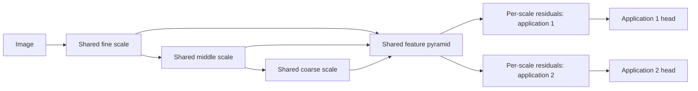
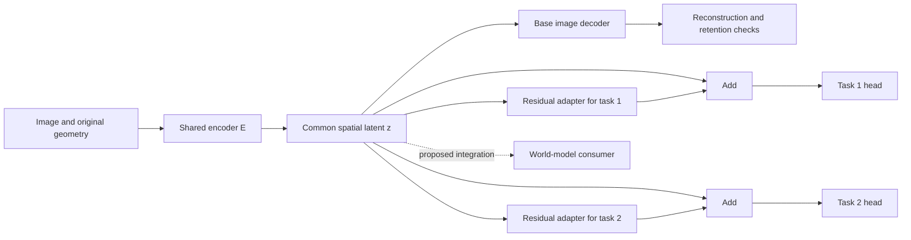

# Shared visual encoder with per-application residual adapters

Design proposal · updated 18 September 2026 · continued from `2beb97f` / `95a239a`.

**Current architecture direction:** [multiscale modality encoders and generic
loop-transformer consumers](multiscale-modality-design.md). Alex now specifies
repeated information-preserving preparation, **learnable filter banks**,
post-processing and compression, followed by a multiscale interface. Each generic
consumer applies its transformer loop and then its own layers. The residual/PCA
choices below are optional investigations within that broader design, not a
required input architecture or a fixed list of consumers.

The preceding adapter discussion established **one trainable shared base plus per-application
residuals, trained jointly from the start, with equal status for every application**.
The open choice is feature residuals, weight residuals, or both at multiple scales.
This supersedes the original requirement to complete per-task frozen/unfrozen
Phase A before joint Phase B. Phase A remains an optional diagnostic.

Current recommendation: begin with small nonlinear feature residuals on shared
multiscale readouts; compare selected interleaved/weight residuals subsequently.
This placement is an engineering proposal, not a user-approved or measured winner.
No adapter, checkpoint selection or training result is reported here. Continue
with the [session handoff](visual-adapter-handoff.md).

The 18 September discussion adds [residual correction and specialist/PCA
decomposition](#10-residual-correction-and-specialistpca-decomposition). This is
an alternative to investigate, not a decision to replace the joint-training path.

## 1. Objective and requirements

Build a compact visual representation that supports faithful reconstruction and
useful world-model tasks without deploying a complete encoder per application.
Parameter count should scale: as small as useful, with width/depth increases
available when justified by measured quality. Preserve spatial information for
large, rectangular and odd-sized images. Keep teacher-free and pretrained-teacher
training as separate options.

The user proposed residual specialization and now prioritizes joint equal-status
training. The original final-latent diagnostic remains a compact-interface control;
it is no longer the required first architecture. Bottleneck blocks, placements
and evaluation controls below are proposals, not adopted results.

The wider [codec review](visual-codec-review.md) remains the source for VAE
improvements and application requirements. This design isolates adaptation;
changing the codec architecture, latent bandwidth, teacher, data mixture and
adapter simultaneously would prevent useful attribution.

## 2. Current repository boundary

| Component | Existing interface and relevance |
| --- | --- |
| [SpatialVAE](../pathwm/models/spatial_vae.py) | `encode(x)` returns `Posterior(mu, logvar, original_size, padded_size)`; `decode(z, output_size)` consumes a spatial latent and geometry. Mean and sampled reconstructions are distinct. |
| [HierarchicalVAE](../pathwm/models/spatial_vae_v2.py) | Opt-in v2 implementation of rearrangement, processing, mixing and compression. Default C specimen: 122,979 encoder+decoder parameters, four latent channels, stride four, per-position channel normalization. Preserve as a small reference, not a quality winner. |
| [Spatial recipe](../experiments/spatial_vae.py) | Existing recipe supports v1 and v2 construction. There is no separate `experiments/spatial_vae_v2.py`. Reuse its data, checkpoint and reporting conventions. |
| [VideoVAE](../pathwm/models/video_vae.py) | Optional image-codec reuse with causal temporal refinement. Temporal adapters solve a different question and stay out of the first comparison. |
| [Categorical agent recipe](../experiments/multimodal.py) | Its visual path is not already replaced by this optional codec. Connecting the proposed common latent to agent dynamics/memory remains separate work. |

The [parameter audit](visual-codec-parameter-audit.json) establishes untrained
counts and small shape contracts only. Existing [v2 results](spatial-vae-v2-plan.md)
and [video results](shared-video-vae-plan.md) leave fidelity/generalization gaps.
Do not assume the current four-channel latent retains every detail a new task
needs. Select and hash the actual starting checkpoint before an experiment.
V2 diagnostic snapshots are detached; they are not a differentiable feature API
for intermediate adapters.

## 3. Candidate architecture

### Current recommendation: shared scales with private feature readouts

Let `f_s = B_s(f_(s-1); theta_s)` be the common feature at scale `s`. Each task
reads `g_(t,s) = f_s + A_(t,s)(f_s)` and predicts with
`y_t = H_t({g_(t,s)}, output_geometry)`. All tasks update the same `theta`;
each task alone updates its own adapter and head. The corrected `g_(t,s)` goes
to its task head, **not into the next shared encoder stage**.

The encoder runs once for multiple applications on the **same input**. Different
images or incompatible task-specific corruptions need their own forward passes.
Scale means spatial resolution; it does not require a private block after every
layer. Start with declared fine/middle/coarse taps available in the selected base,
equal private-capacity budgets per task, and the same tap access in all controls.
Task heads can fuse scales. Do not prescribe a separate hand-designed algorithm
for each task before the labels and failure modes justify it.

The first joint comparison uses deterministic shared features. It makes no
sampled-posterior, KL or compression-rate claim. If an existing posterior mean
is one tap, that does not turn the whole feature pyramid into a stochastic code.
Stochastic codec training needs its own declared sampling and regularization rules.

A candidate adapter is `1x1(C_s→r_s) → SiLU → depthwise 3x3 → SiLU →
1x1(r_s→C_s)` with a zero final projection and an ordinarily initialized first
projection. Without biases it costs `2*C_s*r_s + 9*r_s` parameters per scale/task.
The spatial term gives local context; the original pointwise adapter below is a
useful control. Widths, selected taps and head sizes are still unselected. Do not
zero both a residual gate and its final projection, which can block learning.

**Interface consequence:** a feature pyramid is more information and bandwidth
than the final compact latent. It may help observed-image applications while
leaving compact world-model prediction unchanged. Count all supplied feature
bytes/activations and any pyramid projections as model capacity. No raw target
image shortcut is allowed; no future image features may reach a prediction head.
For generation from a world-model state, these taps must themselves be represented
or predicted, or the head must operate on the available compact latent. A branch
cannot uniquely recover evidence discarded before its earliest available input.

### Feature residuals versus weight residuals

| Mechanism | What specializes | Compute and interpretation |
| --- | --- | --- |
| Readout feature residual `f_s + A_(t,s)(f_s)` | Features passed to one task head | One common pyramid per input; extra private readout work. Cannot change the base's forward feature extraction for that input, but task gradients train the base. |
| Interleaved feature residual `h_(t,s) = B_s(h_(t,s-1)) + A_(t,s)(h_(t,s-1))` | The task's representation entering later stages | Parameters of `B_s` remain shared, but later activations and base operations are usually repeated per task. Allows adaptation before later compression. |
| Weight residual `W_(t,s) = W_s + DeltaW_(t,s)` | A selected layer's operator, e.g. `DeltaW = U V` | Small private parameter storage; later feature computation generally differs per task. A chosen task can merge a compatible linear delta for inference, but different tasks do not then share one activation pass. |
| Both | Both mechanisms at declared locations | More private capacity, optimization choices and attribution ambiguity; useful only after separate comparisons justify it. |

Both kinds have learned parameters and produce input-dependent activations. For
one linear operator, `(W + U V)x = Wx + U(Vx)`: a low-rank weight residual is exactly
a linear parallel feature branch on that operator's input. If both branches use
the same input and are linear, their effects can be redundant (or increase total
rank). A nonlinear adapter **after** a block is generally not that same function.
Name insertion points, nonlinearities, spatial kernels and normalization when
comparing them; “feature versus weights” alone does not define a fair experiment.
An interleaved adapter must match its base block's output channels and geometry,
including any downsampling, before the two paths can be added.
Full-size `DeltaW` per task approaches private-network storage; low rank limits
storage, not the necessary repeated activation work.

Low-rank parameterization is motivated by [LoRA](https://arxiv.org/abs/2106.09685),
whose original frozen-base language-model evidence is not evidence that a jointly
trained visual base will work here. [Visual residual adapters](https://arxiv.org/abs/1803.10082)
motivate shallow as well as deep adaptation in their multi-domain setting.
[MTI-Net](https://arxiv.org/abs/2001.06902) motivates testing scale-dependent task
relationships; it does not validate this simpler readout architecture.

Joint weight training also does not uniquely identify the shared component:
where the parameterization permits it, a common shift can be moved from every
`DeltaW_t` into `W` without changing effective task weights. Rank constraints can
restrict that freedom, but neither they nor feature bottlenecks certify a semantic
split into common knowledge and missing task knowledge. Limited branch capacity
encourages shared work. It can also hurt genuinely conflicting tasks; diagnose
before increasing regularization or forcing residuals toward zero.

### Original final-latent diagnostic (optional)

The following compact-interface design is retained for controlled comparison.
Its frozen RGB retention anchor and variance rules apply to that diagnostic, not
automatically to the equal-status joint experiment in §5.

For task `t`, `z_t = z + A_t(z)` and `y_t = H_t(z_t, output_geometry)`.
The head handles output channels, resolution and likelihood appropriate to its
task. The adapter changes features while preserving the latent tensor's shape.
The base RGB decoder reads the **unadapted** common latent for retention checks.
An RGB-specific adapter/head, if evaluated later, is a separate branch; it must
not hide degradation of the common representation.

First candidate: bias-free `1x1(C→r) → SiLU → 1x1(r→C)`, where `r` is a declared
adapter width. It adds `2*C*r` parameters per task, excluding the task head.
Initialize only the last projection to zero so the branch initially makes no
correction. The first projection uses ordinary initialization. A zero final
projection means its upstream layers can initially have zero gradient; check
learning across multiple updates, not by requiring every gradient on step one.

This candidate mixes channels locally. A depthwise spatial convolution inside the
adapter can add neighborhood context, but is a separate ablation. Small `C` may
make even the initial bottleneck restrictive; adapter width and encoder latent
bandwidth are different variables. No universal rank or fixed parameter cap is
selected here. A null result with this pointwise function class does not show
that the input features lack the information a richer readout could recover.

### Placement and compute

| Placement | Benefit | Limitation |
| --- | --- | --- |
| After the final latent; compact-interface control | One encoder pass serves multiple heads; common representation stays explicit | Cannot uniquely recover detail absent from the latent; limited spatial context in a pointwise adapter |
| At selected intermediate stages; later comparison | Can change processing before later compression | Later activations become task-specific; shared weights no longer imply one shared forward pass |
| Side readouts from intermediate features; current first candidate | Can retain higher-resolution evidence with one base pass | More inputs, memory and bandwidth; a different information budget that must be counted |

Variable image shape is not constant compute or proven generalization to larger
resolutions. The adapter can be fully convolutional while its encoder/head remains
the limiting factor. Tiling needs halo, padding and normalization checks; large
image support and full/tile equivalence require measurement.

### Latent and gradient contract

The initial diagnostic uses `z = posterior.mu`. It does not transform `logvar`,
replace the posterior distribution, or claim that the adapted latent retains the
same Gaussian KL. During this mean-only diagnostic, freeze the variance head and
base RGB decoder. Trainable encoder groups are the shared feature extractor and
mean projection; their movement can still change variance outputs through shared
features, so sampled-codec behavior has no preservation guarantee.

For a later stochastic experiment, declare which posterior parameters train,
where sampling occurs, random-number coupling, and exact reconstruction/KL
reductions. Evaluate means and repeated samples separately. A nonlinear adapter
after sampling does not make its output a diagonal Gaussian automatically.

In the frozen case, encoder parameters, buffers and stochastic mode are fixed;
only adapters and heads train. The latent can be computed without an encoder
gradient graph for final-only adapters. In the trainable case, task gradients
flow through both the identity and residual paths into the common encoder.
For interleaved adapters, frozen base weights can still need autograd through their
operations to reach an earlier adapter; do not wrap that whole path in `no_grad`.

The shared latent is intended to remain independent of the requested output task.
The task selects its branch. That interface alone does not prevent latent drift:
encoder updates must be checked against existing consumers before deployment.

## 4. Evidence and limits

[Taskonomy](https://arxiv.org/abs/1804.08328) used a common encoder architecture
across visual tasks and studied transfer. Its
[RSA follow-up](https://arxiv.org/abs/1904.11740) found early commonality and deeper
task-family structure. These motivate measuring sharing rather than assuming all
tasks need identical final features.

[Residual adapters](https://arxiv.org/abs/1705.08045) and
[series/parallel adapters](https://arxiv.org/abs/1803.10082) provide direct precedent
for small specialized parameter sets around shared visual networks. Their
multi-domain classification evidence does not establish dense prediction,
reconstruction or world-model performance here. The later paper also motivates
considering shallow adaptation when final-only corrections are insufficient.
[Official implementation](https://github.com/srebuffi/residual_adapters).

[CKA](https://proceedings.mlr.press/v97/kornblith19a.html) and RSA can compare
representations despite channel reordering. Their scores are not percentages of
shared information, and [functional tests expose metric limitations](https://proceedings.neurips.cc/paper/2021/hash/0c0bf917c7942b5a08df71f9da626f97-Abstract.html).
Residual size, similarity and unfreezing gains cannot alone identify missing
information or the optimal sharing boundary.

## 5. Controlled experiment sequence

### Phase 0 — source and task readiness

Choose a base configuration and a random initialization or existing checkpoint.
Preserve the small v2 reference. If choosing a pretrained start that needs repair,
record that repair separately rather than hide it inside one comparison arm.
Random initialization does not require a preceding single-task codec fit. All
paired arms for a given seed start with the same base weights; distinguish joint
training seeds from independent source-pretraining seeds.

Choose a small set of labeled applications with complementary demands; RGB can
be an equally weighted application rather than an extra privileged anchor.
Geometry and segmentation are candidates if aligned supervision is available.
If only synthetic labels are available, label the experiment a mechanics or
controlled-task result. Do not invent depth/semantic ground truth from raw photos.
Split by source image, video or scene **before** extracting crops/frames.

### Joint study first — one shared deployed encoder (formerly Phase B)

Train the common base, all task adapters and all heads together from the first
logical update. A common initialization can be random or a named checkpoint;
that choice is still pending. A pretrained starting point does not require a
frozen-base period. Keep teacher-free and teacher-assisted starts separate.

For `T` applications, use the declared objective
`L_joint = (1/T) * sum_t [L_t / c_t]`, with fixed positive calibration constants
`c_t`. Define each task loss as a mean over its valid elements per example, then
examples, with explicit weighting among that task's component losses. Calibrate
units on a balanced training-only pilot or explicit task units, freeze the rule
before the comparison, and reuse the constants across paired arms. Near-zero
calibration values need a declared floor. Raw MSE, cross-entropy and geometry
errors are not comparable merely because all receive coefficient one.

Operational equal status means:

1. Each logical update includes an equal declared example budget from each task
   and averages their normalized losses once. Aligned labels allow one base pass
   on a shared image batch. Separate datasets may use per-task batches and gradient
   accumulation at the same parameter snapshot, with one optimizer step after all
   contributions. Different examples need different base forwards. State-buffer
   and random-number effects must be controlled; accumulation is not automatically
   bitwise equivalent to one large batch.
2. Missing labels have validity masks and valid-example denominators. Do not treat
   a missing task as zero loss or silently let label availability set task weights.
   Resample/defer an invalid task batch under a declared rule. Equal weighting of
   examples deliberately gives sparse and dense valid examples equal importance;
   report annotation density and dataset repetition. It does not imply equal
   unique information, difficulty, gradient noise or class/subgroup representation.
3. RGB is one application if included, with its own trained branch/head and equal
   task weight. The old frozen-decoder anchor is not an extra joint loss. A legacy
   frozen decoder/consumer can separately measure compatibility; requiring its
   retention is a declared deployment constraint, not proof of equal task influence.
4. Use the same optimizer policy and private-capacity budget rule across tasks;
   base versus private learning-rate groups may be declared explicitly. All tasks
   update the same base; only the selected task's private modules receive its loss.
   Keep base normalization shared (including buffers). Task-specific norm affine
   or statistics are a separate counted adaptation variant, not a hidden difference.
5. Log raw/normalized losses and per-task shared-base gradient norms and cosines
   at a fixed interval. Fixed loss scaling, sampling and Adam do not guarantee
   equal update influence. Opposing gradients can cancel. Dynamic weights,
   gradient surgery and residual penalties remain explicit later interventions.
6. Evaluate every task from the same final joint checkpoint at the declared
   exposure budget. Report each task's quality and resource cost, not only the
   average loss. A large aggregate gain cannot conceal a failed task floor.

The expectation that common work migrates into the base is a hypothesis. Shared
parameters receive every task's gradients and small private branches constrain
specialization, but base and branches can coadapt. Shared features can contain
information useful to only one task; no explicit disentanglement is promised.
Base-only/no-adapter joint training is the primary comparison. Adapter-off output
is a reliance diagnostic, not a fair standalone-base score when heads coadapted.
Small frozen-feature probes can separately test accessibility; their function
class and training budget limit conclusions. Residual magnitude and CKA do not
measure a fraction of private knowledge. If standalone base competence is itself
required, declare a separate probe gate or a symmetric all-task auxiliary objective;
that is an added requirement, not an automatic consequence of joint training.

### Minimal comparison and extension order

| Arm | Common base | Private adaptation | Information supplied to every head |
| --- | --- | --- | --- |
| J0 | Jointly trained | Ordinary task head only | Same declared multiscale taps |
| JF | Jointly trained | Per-scale feature residuals + same task head | Same declared multiscale taps |
| JH | Jointly trained | Expanded task head, matched private parameter budget | Same taps; match receptive field where possible and disclose differences |

JF versus J0 asks whether private residual capacity helps. JF versus JH asks
whether that placement/parameterization helps beyond expanded readout capacity;
it does not guarantee a uniquely different function class. Head projections,
spatial context, normalization, information access and parameter counts must be
explicit. Hold base initialization, examples, augmentation and final checkpoint
rule paired. Report compute differences; a parameter match does not match FLOPs.
Before confirmatory architecture claims use at least three paired training seeds,
per-task meaningful gains/floors and an untouched source split. Seed spread and
source-group uncertainty are distinct; three seeds do not justify a universal
significance rule. One short run is mechanics/development evidence only.

Next compare final-only versus selected multiscale **access** as its own factor.
Then compare interleaved feature and low-rank weight residuals at explicitly
matched operator locations/ranks where meaningful. Zero `DeltaW` is a valid null,
just as zero feature correction is. A norm-affine-only variant can help distinguish
cheap modulation from a projection change. Rank/width, tap allocation, base size
and hybrid combinations are later factors. Do not launch the entire Cartesian
product. Frozen-base and separate-task references are optional diagnoses, not
prerequisites for the requested joint experiment.

### Optional Phase A — per-task adaptation capacity

For each task, use an independent experimental copy of the same source encoder:

| Arm | Encoder feature/mean path | Adapter | Trained output module |
| --- | --- | --- | --- |
| F0 | Frozen | Absent | Task head |
| F1 | Frozen | Present | Adapter + same task head |
| U0 | Trainable | Absent | Same task head |
| U1 | Trainable | Present | Adapter + same task head |

Hold head architecture and paired initialization fixed, including unused adapter
RNG effects. Keep the task data, augmentation schedule and supervised exposures
matched. Heads always train; otherwise the adapter comparison becomes a head
training comparison. F1−F0 measures added adaptation on fixed features; U1−U0
measures its value with encoder adaptation; U−F measures the value of the permitted
encoder update regime. These are conditional comparisons, not unique causal
diagnoses of why information was inaccessible.

Before claiming that residual placement itself is beneficial, add a frozen-encoder
control with a parameter-matched expanded nonresidual task head. The four primary
arms alone do not distinguish placement from extra downstream capacity. Formal
Phase A conclusions require at least three paired adaptation seeds, with head
initialization, data order and augmentation streams explicitly paired; fewer seeds
are a development check only. Predeclare the primary contrasts and treatment of
multiple tasks/metrics rather than selecting whichever result looks best.

Use `L_task + lambda_rgb * L_rgb(D0(mu), image)` for the initial mean-only study,
with a fixed, documented retention coefficient and frozen decoder `D0`. It is
constant with respect to the trainable parameters in F arms and influences the
encoder in U arms. Thus U results measure adaptation **under the declared anchor**;
they are not unconstrained fine-tuning upper bounds. If the anchor is suspected
to limit adaptation, vary it only in a separate registered comparison.

With fixed evaluation inputs/mode, common-codec retention in F arms is invariant
by construction. Verify that contract and report it as the baseline, not as a
learned retention improvement. Keep task and retention scores separate. A fixed
anchor gives one conditional operating point, not a measured Pareto frontier.

These U arms produce separate task-specific encoders. They are specialization
references, not a claim that one shared deployed encoder can achieve all scores.
Freeze any additional existing consumer/readout used for retention evaluation;
retraining it would conceal interface drift.

### Phase C — only the extensions supported by earlier results

After the first joint comparison, shortlist widths or additional placements and
confirm with at least three paired training seeds and an untouched source split. Multiple source
pretraining seeds are needed before claiming insensitivity to initialization.
Test two codec sizes only after the small comparison works. Keep these changes
separate from teacher alignment and mean-versus-sampled VAE tuning.

Teacher-free means no pretrained teacher provides features or losses; ordinary
supervised task labels remain allowed. Teacher-assisted initial encoders form a
separate track with their training cost recorded. If a teacher labels evaluation
data, those scores measure agreement with that teacher, not independent truth.

Only later add temporal tasks, predicted latent inputs, or actual world-model
integration. Predicting a future output must not read the real future image,
latent, skip features or normalization statistics. Latents from the world model
may differ from encoded observations and require their own evaluation.

## 6. Applications, placement hypotheses and observable outputs

These are reasons to allocate capacity, not measured prescriptions. Start with
equal total private-capacity budgets and common scale access, then test task-specific
allocation. Equal task priority does not imply every task needs the same scales.

| Application | First feature-residual hypothesis | When to investigate interleaved/weight changes |
| --- | --- | --- |
| RGB reconstruction / restoration | Fine and middle scales for color, texture and local structure, with coarser context when needed | If required detail disappears before available taps, test earlier access or processing before compression. Restoration must declare degraded inputs/clean targets; it is not the same data path as reconstructing clean input. |
| Segmentation / boundaries | Coarse context plus fine/middle boundary corrections | If controlled readouts cannot make useful categories accessible, test selected middle/deep processing. A readout failure alone does not prove absent information. |
| Depth / normals | Fine edges, middle surfaces and sufficient coarse/global context | Test processing/context changes if the base lacks geometric cues; local weight changes alone do not add global context or resolve monocular scale ambiguity. |
| Small objects / text / exact attributes | High-resolution access before aggressive compression, with context from later scales | First distinguish bandwidth/resolution failure from adaptation capacity. Neither residual type recreates uniquely lost glyphs from an already ambiguous input. |
| Flow / tracking / change | Features from declared frame pairs or causal histories, with correspondence/temporal readouts | Neither single-image residual supplies the missing time evidence. Pairwise flow need not have persistent state; tracking may. Temporal feature/weight adapters are a separate comparison. |
| World-model / grounding | Corrections only on representations available to the consumer at prediction time | Observed-image pyramid success does not establish utility of a predicted compact latent or calibrated dynamics. Declare and test the actual shared interface. |

| Application | Required evidence | Useful debug output |
| --- | --- | --- |
| RGB reconstruction / retention | Paired source pixels; color/detail errors and PSNR | Original, base reconstruction, error maps and fixed detail crops |
| Segmentation / boundaries | Aligned masks; IoU and boundary metrics | Mask overlays, confidence, boundary errors |
| Depth / surface normals | Valid geometry labels or a declared geometry-supervision setup | Depth, normals, reprojection residuals and confidence |
| Small objects / text / exact attributes | Independent annotations; object/text/color metrics | Tiny-object crops, missed glyphs, region-level errors |
| Flow / tracking / change, later | Paired frames, correspondence/identity labels | Flow arrows, occlusion masks, ID switches and event timelines |
| Future prediction / control, later | Temporal splits; actions/interventions where required | Rollout strips, uncertainty, object trajectories and action-effect errors |
| Grounding / WorldState, later | Region/text links and entity/relation evidence | Linked regions, retrieval results, graph provenance and stale-state errors |

Decoder output quality, state accessibility and useful control are separate
endpoints. A graph or depth display requires a trained readout/association system;
it is not automatically a new VAE capability. See the wider review for restoration,
inpainting, novel-view and cross-modal extensions.

Diagnostics should include supplementary adapter-off evaluations, per-task shared
gradient norms (and anchor gradients only in the optional anchored diagnostic),
feature-drift maps, residual norms, and optionally layerwise CKA/RSA against
same-task/different-seed baselines. Use corresponding held-out inputs/spatial
positions; global pooling can hide lost geometry. Adapter magnitude is a debug
quantity, not a percentage of task-specific knowledge. Near-identity adapters
can have high similarity to the base by construction; that does not certify utility.

## 7. Run contract and acceptance

The first implementation session must fill these fields before formal fitting:

| Field | Current status |
| --- | --- |
| Base configuration and initialization identity | Unselected; declare random seed/state hash or source checkpoint/configuration/hash |
| Tasks, data rights/provenance, manifests and source-disjoint splits | Unselected; audit actual aligned labels first |
| Scale taps, adapter widths, task heads and matched control | J0/JF/JH proposed above; exact tap tensors, strides, widths and heads unselected |
| Seeds, initialization coupling and task sampling | Equal task exposures per logical update proposed; exact paired seeds/data schedule pending |
| Optimizer groups, rates, schedules, task-loss calibration | Pending; same task policy, fixed scales, no extra RGB anchor in joint study; optional Phase A declares its anchor |
| Precision, device, exposure budget and wall/memory/disk caps | Pending local preflight; RTX3050 8GiB is the recorded target, not a fit guarantee |
| Primary task metric, meaningful gain and allowed retention regressions | Pending task-specific preregistration |
| Uncertainty rule and confirmatory holdout | Paired source-group analysis and seed spread; exact decision rule pending |

Use an equal-exposure comparison and report actual time/memory; a separate equal-
compute comparison can answer deployment-budget questions. Do not claim exposure,
updates, FLOPs and wall time are all matched by one schedule. Frozen-only caching
changes speed; either disable it in the primary latency comparison or report it
as an explicit deployment variant.

For the first comparison, run all encoders online with the same paired image
augmentations. Caching only unaugmented frozen features would change the training
distribution. Use the final checkpoint at the declared exposure budget for the
primary comparison; development-based selection/early stopping is a separately
declared rule, not a post-result choice. Set encoder and head/adapter optimizer
groups explicitly. A single fixed schedule gives conditional results; before
claims about best attainable performance, allow a predeclared comparable tuning
budget per arm. Equal trial count and equal tuning compute are different controls;
report both and specify which is matched.

A candidate advances only with a declared primary benefit, all required retention
floors, and resource limits satisfied under the predeclared uncertainty rule.
An unset threshold cannot pass. The provisional thresholds in the broad codec
survey are not automatically the gates for this experiment. Report failed and
inconclusive arms; select on development data, confirm on untouched sources.
Every result summary must state its exposure budget, initialization, task weighting
and any added compatibility constraint (including an anchor only if one is used).
Fixed-budget rankings include convergence-rate differences;
they are not rankings of fully converged models. With three training seeds,
report per-seed differences and effect sizes rather than a training-seed
significance claim. Source-group intervals describe held-out data variability
conditional on the fitted models, not uncertainty over all possible training runs.

Count deployed encoder, base decoder, every adapter and every required head.
Report encoder-once/multiple-head latency separately from single-task latency and
from interleaved task-specific passes. Training memory/optimizer/teacher cost,
activation storage and serialized latent bytes are separate quantities.
Pin evaluation batch size, image resolution, precision and warmup/timing protocol.

## 8. Implementation and verification plan

Keep one readable recipe in `experiments/` and ordinary reusable PyTorch modules.
A proposed `pathwm/models/visual_adapter.py` and
`experiments/visual_adapters.py` are **future filenames, not existing APIs**.
Avoid a task registry, general trainer, new config system or report pipeline.
Reuse [Run/checkpoint helpers](../pathwm/io.py),
[report rendering](../pathwm/evaluation/report.py), and relevant
[spatial evaluation code](../pathwm/evaluation/spatial_vae.py).

Essential checks before fitting:

1. Zero correction reproduces base features and head outputs; one branch cannot
   change another branch or mutate the common latent in place.
2. Odd/rectangular geometry, crop alignment, masks, dtype/device and invalid
   shapes have explicit behavior; there is no hidden raw-image decoder shortcut.
3. Each joint task loss reaches the same base and its own head/adapter, not other
   private modules. Check multiple updates: zero final projection delays upstream
   adapter gradients. Frozen variants preserve weights and buffers.
4. Shared readout taps retain autograd (existing detached traces cannot be used);
   a multihead same-input call executes the base once. An interleaved variant
   preserves gradients through frozen operations where needed. Validate the loss
   denominators and one optimizer step per balanced logical update.
5. Save/load and interrupted/resumed updates retain source identity, optimizer,
   RNG, sampler/task schedule and geometry within declared reproducibility limits.
6. The joint study evaluates every branch on the final common encoder and detects
   wrong-task routing or silent replacement by separate encoders.

Each run owns raw metrics, resolved settings, checkpoint/source/data hashes,
representative fixed examples and a standalone `report.html`. Record run and report
completion separately. Reuse renderer checks; browser QA is required for a new or
changed renderer. Contract tests establish mechanics, not scientific quality.

The next bounded implementation deliverable is a source/data audit and a joint
J0/JF/JH run contract with minimal checks. The user has chosen the joint training
direction; exact tasks, labels, initial state, metrics and budget remain unselected.
This discussion does not report a fit or a validated residual placement.

## 9. Review record and continuation

The generic methodology received an actual Claude review under the repository's
[public-only review workflow](claude-collaboration-workflow.md). Exact local
receipts live in `runs/reviews/visual-adapter-design-20260917/`; no private source,
data or measured results were sent. An initial CLI response addressed unrelated
peer traffic and was excluded; the substantive retry and reconciliation are the
review evidence. Reviewer agreement is not empirical validation.

Accepted refinements: a matched-parameter expanded-head control before placement
claims; explicit tuning and checkpoint-selection policies; paired online
augmentations; formal seed/contrast requirements; invariant frozen retention as
a contract; and the limited interpretation of pointwise/near-identity adapters.
The reviewer acknowledged that the original four-arm design supports conditional
effects, withdrew an obligatory large anchor/weighting sweep for the first
diagnostic, and accepted fixed-exposure final-checkpoint evaluation.

One historical disagreement remains for optional Phase A: the reviewer requests a second anchor value even for
directional diagnostic interpretation. This design permits reporting measured
differences at one predeclared anchor while making no robustness/frontier claim;
an additional anchor is a useful sensitivity comparison whose cost and scope
must be fixed in the run protocol. Record that choice before fitting. No review
agreement selects an architecture or substitutes for measured outcomes. This
anchor question does not gate the current joint study, which has no extra RGB anchor.

Continue with [visual-adapter-handoff.md](visual-adapter-handoff.md). Keep the
architecture atlas discussion note current without adding proposed adapters as
existing modules or promoting capability colors.

### Joint-training continuation review, 17 September

Actual Claude reviewed a generic public-only methods brief and a correction
round; exact briefs, responses and execution receipts are saved under
`runs/reviews/visual-residual-joint-20260917/`. No repository text, private code,
data or measurements were exported. The user's joint/equal-status training
preference replaces the earlier phase ordering; it does not select a winning
residual type. No fit or new capability evidence was generated.

Adopted refinements: shared normalization is explicit; matched scale access and
private capacity are controlled; sparse-label weighting is a declared policy;
fixed loss calibration is checked with per-task shared-gradient diagnostics; and
adapter-off results are distinguished from frozen-feature probes. Same-input
shared computation, stored parameters and task-specific downstream passes are
accounted separately.

Claude explicitly withdrew its initial claims of a general weight/feature
expressivity ordering, missing zero-delta weight control, inevitable loss of RGB
detail, arbitrary absorption of all adapters into a fixed base, depth-specific
weight superiority, and mandatory persistent state for pairwise flow. It also
withdrew a universal seed-spread acceptance rule and an obligatory norm-only arm.
The design retains the corrected conditional claims, not those assertions.

Remaining scope differences: the reviewer would prohibit exploratory placement
search; this design permits a declared development search followed by fixed
confirmation on untouched sources, with search cost reported. Different degraded
inputs can still receive equal objective weight/exposure, though they may require
another base pass; equal task status is not equal compute. Restoration is not
selected for the first task set, so its corruption contract remains a run-contract
decision rather than an assumed clean-image shortcut. Adapter-off is supplementary
reliance evidence only. Three seeds support reporting paired effects; source-group
intervals remain conditional on fitted models and are not seed-level significance.

## 10. Residual correction and specialist/PCA decomposition

### What a residual can correct

For `g(z) = z + A(z)`, any desired same-shape mapping `g` can be represented **if**
the branch can represent `A(z) = g(z) - z`. Additive residuals can subtract, cancel,
invert or replace features; they are not restricted to small positive additions.
Feature coordinates have no intrinsic right/wrong meaning independently of their
consumer. Task performance and compatibility with the declared decoder/readout
determine whether a correction is useful.

This is a capacity statement, not a training/generalization guarantee. A narrow
pointwise branch has limited channel directions and spatial context. A last
projection `C x r` with `r < C` confines its correction at each position to a
learned subspace (or affine subspace if biased), even if its values are large.
The full available branch input matters: if `F(x1) = F(x2)` but the task requires
different outputs, no deterministic function of `F` alone can distinguish them.
A stochastic branch can model uncertainty, not identify which lost instance was
observed. Earlier taps or upstream feature/weight adaptation can change what
survives compression; later branches can only use surviving evidence and priors.

The proposed adapters have no hard output-amplitude bound. Zero initialization
specifies a starting point only. Low-rank weight deltas can have arbitrarily large
singular values; low rank limits directions, not norm. Weight decay is a soft
preference and gradient clipping is not a bound on accumulated parameter/output
magnitude. Explicit function/norm caps could restrict amplitude, but can prevent
necessary corrections. Capacity, amplitude, spatial reach and input information
are separate controls. A sufficiently capable private branch can perform much of
the task itself, reducing the intended sharing benefit. Large residual norm alone
does not establish that this occurred because norms depend on representation scale.

### Independent specialists as the expensive reference

Separate equal-architecture task models remove the sharing constraint. They are
a useful quality/resource reference, not a guaranteed held-out performance upper
bound: finite data, finite model capacity and optimization still matter; joint
training can benefit from positive transfer. Arbitrary compute does not supply
missing labels or make an ambiguous input identifiable.

Specify what makes a specialist task-specific. Identical VAEs trained on the same
data with the same reconstruction/KL objective have no explicit application
signal. Task losses, data distributions or supervision must differ appropriately.
Segmentation/depth heads need not be VAE image decoders. Compare corresponding
backbone/codec blocks while retaining incompatible task heads; do not average
tensors merely because their flattened lengths happen to match.

### Why raw PCA does not extract a shared VAE automatically

Equal architecture aligns tensor shapes, not learned coordinates. Permuting hidden
channels and adjusting adjoining layers can preserve the function while changing
its parameter vector. Skip connections and normalization constrain which
permutations are valid. A VAE encoder and decoder must agree on latent coordinates;
compatible latent permutations/sign flips illustrate this ambiguity. An isotropic
prior alone does not make an arbitrary rotation preserve a generic diagonal
posterior family.

An elementary mean-path example is `E1(x)=x, D1(z)=z` versus
`E2(x)=-x, D2(z)=-z`. Both reconstruct `x`; averaging their linear encoder and
decoder weights gives zero for both, destroying reconstruction. This is an
algebraic illustration, not a trained VAE experiment. Coordinates must be aligned
before interpreting parameter distances as differences in learned function.

[Git Re-Basin](https://arxiv.org/abs/2209.04836) studies function-preserving unit
permutations before weight merging. [ZipIt](https://arxiv.org/abs/2305.03053)
addresses additional differences between tasks and allows partial merging with
private later branches. [Model soups](https://proceedings.mlr.press/v162/wortsman22a.html)
provides evidence for averaging compatible fine-tuned models, not arbitrary
independently trained VAEs. These are relevant methods, not validation of a
merged PATH-WM codec. Common initialization can improve correspondence but is not
a guarantee; alignment cannot remove genuine task conflicts.

After choosing compatible parameter coordinates, put each task's flattened
`P`-parameter vector in a row of `Theta`, with tasks weighted equally. Centered PCA
approximates

`theta_t = mean_theta + sum_(j=1..r) a_(t,j) v_j + discarded_error_t`.

The mean minimizes the sum of squared parameter distances to all task models in
those coordinates. The components explain **variation across models**, which may
reflect task specialization or training randomness. They are not automatically
shared useful features; a principal direction is not a complete trained model.
Even the mean need not be a good standalone VAE. Uncentered SVD can emphasize a
common offset but still optimizes matrix approximation, not all-task quality.

Centered cross-task PCA has rank at most `T-1`. With only two distinct models,
one component captures 100% of their centered variation regardless of whether
their functions share useful structure. That statistic alone cannot demonstrate
sharing. With a dense mean and dense basis, storage is about `(r+1)*P + T*r`
scalars versus `T*P` originally, before task heads, buffers and any materialized
merged-weight cache. Full-rank recovery usually saves no storage. PCA rank across
whole checkpoints differs from the rank of an individual layer's weight matrix.
Neither factorization automatically reduces downstream per-task activation cost.

PCA on **activations** asks a different question. Use corresponding inputs/spatial
positions and explicit normalization/alignment. High variance is not necessarily
shared, predictive or useful: an important small attribute may vary little.
Cross-model correspondence/correlation can help diagnose common structure, but
an activation basis does not directly supply encoder, posterior and decoder
weights. Subtraction and feature-distillation targets must respect coordinate
alignment and the actual task interface.

### Can the residuals be set exactly after freezing a base?

For compatible **weight** blocks, yes: choose any frozen `theta0` and set full
`Delta_t = theta_t - theta0`. Then `theta0 + Delta_t` recovers each specialist's
weights exactly, with its corresponding buffers, architecture and head. Alignment
is not required for this arithmetic identity; it matters when interpreting or
compressing the deltas. Full deltas largely preserve separate-model storage and
task-specific computation. Exact recovery is possible even if the chosen base
alone is poor, so it does not establish useful common features.

Small residuals are the substantive question. For a matrix-shaped layer, truncated
SVD can approximate `W_t-W0` by `U_t V_t`, optimally in unweighted Frobenius norm
at fixed rank. This is neither a guarantee of small task loss nor proof that the
chosen `W0` minimizes the required ranks. Convolution reshaping, layer weighting,
biases, normalization, heads and activation costs must all be declared. PCA/SVD
can initialize a candidate; task-aware recovery training may still be needed.

For a **feature** branch, the target
`A_t(F0(x)) = F_t(x) - F0(x)` is input-dependent. Subtracting checkpoint weights
does not set that nonlinear branch. It must be fit on aligned examples and may
be impossible if `F0` has discarded information required by `F_t`. A constant
offset generally cannot reproduce the specialist, and storing per-image offsets
does not give a reusable unseen-image encoder.

### Bounded alternative to compare, not yet selected

1. Train or identify equally evaluated task specialists with matched backbone
   architecture, declared objectives and source-disjoint data. Count specialist
   training cost. Retain task-specific heads and encoder/decoder pair identities.
2. On development data, align permitted coordinates and compare simple candidate
   bases: a specialist reference, aligned mean, and a jointly trained base. Test
   standalone base utility separately from utility with private branches.
3. Verify full-delta recovery as an arithmetic control, then test small **per-layer**
   weight deltas or a genuinely compact cross-task factorization. Report actual
   stored bytes and materialization/multi-task compute, plus every task's loss
   relative to its original specialist. A parameter-space error cannot pass a
   task-quality gate. Same-task/different-seed specialists help separate training
   variability from task differences if a shared-structure claim is intended.
4. Compare a frozen base with an equally weighted joint recovery stage at the same
   residual capacity. Keep the direct joint J0/JF/JH path as a separate comparator;
   frozen mean + full weight deltas and final readout adapters are different
   capacity/compute regimes. Do not use one to certify the other.

An alternative proposed route is equal-status multi-teacher distillation into
the shared base plus private branches. Distill each teacher's corresponding task
outputs (or explicitly aligned features) and retain supervised task evaluation.
This avoids demanding literal equality of hidden coordinates when output matching
is available. It adds teacher generation/training cost and approximation error;
it is not established as superior here. Freezing a base is a controlled comparison,
not evidence that PCA has found a universal common representation.

No specialist fit, PCA merge, adapter fit or empirical sharing result was produced
in this discussion. The user's earlier joint/equal-status preference remains the
active direction; this follow-up opens a model-compression alternative.

Actual Claude reviewed a generic public-only brief and a correction round;
receipts are in `runs/reviews/visual-residual-pca-20260918/`. It acknowledged that
finite learning rate/step count alone does not bound residuals, residual norm does
not identify private capacity, PCA low-variance directions do not identify common
semantics, and CKA/SVCCA do not directly size a useful shared network. It withdrew
a blanket three-task prerequisite and an automatic gradient-normalization control.
Specialist references are required for specialist-relative/compression claims;
they remain optional for a direct joint-training comparison without those claims.
Report every task and meaningful worst-task degradation, with residual norms as
descriptive diagnostics only. No reviewer agreement constitutes local validation.
