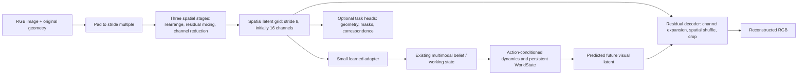

# A scalable visual codec for PATH-WM

Research and proposed design · 17 September 2026

**Recommendation:** develop a small, fully convolutional spatial codec family, starting with one continuous latent grid and a factual reconstruction decoder. Compare deterministic AE and KL-VAE training. Improve detail preservation and data coverage first; add semantic learning in two separate tracks, with and without pretrained teachers. Evaluate the representation with world-model tasks before selecting a winner. Introduce hierarchical latents, temporal compression, quantization or a generative refinement decoder only when a measured limitation justifies them.

This is a literature-backed proposal, not a trained architecture or a claim that combining successful papers will reproduce their results. The user’s size requirement is “as low as possible but as high as necessary,” with a path to larger models. Both teacher-free and teacher-assisted training are required comparisons. Neither track is assumed to win.

## Scope and evidence

This is a broad, selective survey of the main relevant improvement families, not an exhaustive systematic review of every VAE paper. It includes foundational work through sources available on 17 September 2026. Architecture, loss, data, latent design and training improvements are distinguished because many papers called “VAE improvements” change several simultaneously. Some candidates are deterministic AEs or tokenizers rather than probabilistic VAEs.

Searches included the exact Google queries **“vae”** and **“vae improvements.”** The former initially returned the German abbreviation for the United Arab Emirates; an additional “variational autoencoder” query disambiguated it. The improvements query surfaced VIVAT, LeanVAE, iterative decoding and video-codec work. Google’s AI overview and community posts were discovery aids only. Technical conclusions below use original papers, author project pages or official implementations. Additional targeted searches covered frequency losses, hierarchical VAEs, semantic alignment, compression, quantization, arbitrary-resolution decoding and video.

The methods and/or code of FA-VAE, VIVAT, VA-VAE, MAETok, LeanVAE and Qwen-Image-VAE-2.0 received closer inspection. Other entries are screened from primary abstracts/project pages or official repository descriptions; they are leads with appropriately limited claims, not reproduced results. Source links are attached to each entry. Published numerical results across different datasets, preprocessing and training budgets are not a common leaderboard.

## What the linked CVPR paper contributes

The linked paper is [**Catch Missing Details: Image Reconstruction with Frequency Augmented Variational Autoencoder**](https://arxiv.org/html/2305.02541v1), CVPR 2023. FA-VAE builds on VQGAN. It adds frequency-complement modules inside the decoder and trains them against encoder features using a dynamic spectrum loss. This addresses detail lost during compression, while balancing low and high frequencies rather than simply maximizing sharpness.

The [official implementation](https://github.com/oppo-us-research/FA-VAE) confirms that `decode(z)` receives the quantized latent. Encoder feature maps supply training supervision; they are **not an uncounted image shortcut into the decoder**. FCM blocks remain decoder computation at inference. The implementation also includes perceptual and adversarial training, so its full results cannot be attributed to frequency supervision alone.

**Proposed use:** first test a small multiscale image-frequency loss; then a separately measured FCM-style decoder ablation if needed. Porting the entire published system would change too many factors at once.

## Literature map and adoption priorities

“First” means a useful initial comparison, “later” means conditional on a demonstrated need, and “reference” means informative without recommending a direct replacement. These are our design judgments, not claims made by the papers.

### Fidelity and efficient architecture

| Work / family | Relevant idea from the source | Cost, limitation and proposed use |
|---|---|---|
| [VQGAN / Taming Transformers, 2021](https://arxiv.org/abs/2012.09841) | Perceptual and adversarial objectives with a spatial discrete tokenizer. | Sharpness can improve without exact detail recovery. Reference; GAN is a later, separately labelled perceptual branch. |
| [Latent Diffusion, 2022](https://arxiv.org/abs/2112.10752) | Perceptual spatial compression moves generation into a smaller representation. | Borrow the spatial interface. Its large pretrained codec’s quality is not evidence for tiny models trained on limited data. |
| [Focal Frequency Loss, 2021](https://arxiv.org/abs/2012.12821) | Reweights difficult reconstruction frequencies. | Training overhead, no required inference module. First comparison, with restrained weights and phase-aware errors; monitor ringing/noise. |
| [FA-VAE, 2023](https://arxiv.org/abs/2305.02541) | Decoder frequency compensation and multiscale spectrum supervision. | Extra decoder blocks. Later than a loss-only baseline; retain its distinction between supervision and decoder inputs. |
| [VIVAT, 2025](https://arxiv.org/html/2506.07863v1) | Diagnoses color, grid, blur, boundary and activation-outlier artifacts; studies loss balance, padding, normalization and decoder refinement. | First as a diagnostic guide. Its fixes are context-dependent, not a universal prescription. Spatial normalization can complicate tiling. |
| [DC-AE, 2024/ICLR 2025](https://hanlab.mit.edu/projects/dc-ae) | Residual autoencoding based on space-to-channel transforms; staged high-resolution adaptation. | Borrow residual/rearrangement ideas. High spatial compression speeds the downstream generator; it does not establish a tiny codec or faithful small-text recovery. |
| [DC-AE 1.5, 2025](https://hanlab.mit.edu/projects/dc-ae-1-5) | Structures latent channels from object structure toward detail and adjusts diffusion training. | Later if partial-channel decoding is useful. A better reconstruction latent can still be harder to generate; validate with our dynamics model. |
| [TinyAutoEncoder / TAESD, official code](https://github.com/madebyollin/taesd) | Small fully convolutional codecs compatible with established diffusion latent spaces. | Useful small-model/distillation baseline. Compatibility with a pretrained teacher space and preview quality are different requirements from a general world-model representation. |
| [Qwen-Image-VAE-2.0, 2026 report](https://arxiv.org/html/2605.13565v1) | Attention-free asymmetric architecture, global pixel-to-latent residual paths, semantic alignment and text-rich training. | Ideas to test individually. Reported encoder/decoder sizes are **76M/248M to 78M/250M**, far above our small configurations; training uses billions of images. |
| [Perception–Distortion Tradeoff, 2018](https://arxiv.org/abs/1711.06077) | Perceptual realism and fidelity are distinct objectives with a tradeoff. | Evaluation principle: an attractive reconstruction cannot certify exact color, identity, glyphs or geometry. |

### Features, regularization and latent organization

| Work / family | Relevant idea from the source | Cost, limitation and proposed use |
|---|---|---|
| [VAE foundations / overview, 2019](https://arxiv.org/abs/1906.02691) | Stochastic encoding, likelihood and approximate posterior/prior objectives. | Keep an explicit AE control; distinguish an engineering reconstruction objective from a calibrated likelihood. |
| [β-VAE capacity scheduling, 2018](https://arxiv.org/abs/1804.03599) | Controls information capacity while encouraging structured factors. | First: a small KL/capacity sweep with explicit reductions. More regularization can erase task-relevant details. |
| [Cyclical KL annealing, 2019](https://arxiv.org/abs/1903.10145) | Training schedule aimed at posterior collapse. | Later, only if collapse is observed. Published evidence includes text settings; do not assume it fixes image blur. |
| [Normalizing-flow posteriors, 2015](https://arxiv.org/abs/1505.05770) | More expressive approximate posteriors. | Later if posterior mismatch matters; added evaluation/training complexity does not directly solve large-image memory or semantics. |
| [VampPrior, 2018](https://arxiv.org/abs/1705.07120) | Learns a richer prior from pseudo-inputs. | Reference. A visual codec’s standalone prior and a world model’s history-conditioned prior solve different problems. |
| [Wasserstein Auto-Encoders, 2018](https://arxiv.org/abs/1711.01558) | Matches the aggregate encoded distribution using a different objective. | Alternative regularization arm, not another term to pile onto KL by default. |
| [VA-VAE / LightningDiT, 2025](https://arxiv.org/html/2501.01423v1) | Training-only foundation-model alignment with pointwise and relational similarities, margins and weighting. | First teacher-assisted candidate. Use spatially aligned targets and bounded training cost; do not replace color/geometry supervision with semantic similarity. |
| [REPA-E, 2025](https://github.com/End2End-Diffusion/REPA-E) | Representation alignment enables joint tokenizer/diffusion tuning; naive joint diffusion loss can degrade the latent. | Later analogy for joint world-model tuning, not direct evidence it improves control. Monitor representation drift and retain reconstruction. |
| [MAETok, 2025](https://arxiv.org/html/2502.03444v2) | Masked learning with auxiliary prediction targets improves latent organization. | First: pixel/HOG targets in the no-pretrained-teacher track. Its full recipe also uses DINO/CLIP targets, so do not call the published full model teacher-free. |
| [EQ-VAE, 2025](https://eq-vae.github.io/) | Regularizes useful transformations of spatial latents. | First/later after the baseline: small coordinate-aligned transformations. Equivariance should preserve transformed position, not erase it. |
| [RAE, 2025](https://rae-dit.github.io/) | Reuses a frozen pretrained representation encoder with a learned decoder. | Reference/teacher baseline. The large encoder remains deployed; this differs from a small student with a training-only teacher. |
| [VFM-VAE, 2025/2026](https://github.com/tianciB/VFM-VAE) | Integrates a frozen vision foundation encoder into a VAE tokenizer. | Same deployment-cost distinction. A strong semantic encoder is not automatically the smallest useful codec. |
| [SRL-VAE, 2025](https://arxiv.org/html/2504.17219v1) | Robustifies a pretrained encoder while preserving a frozen decoder’s representation. | Later if perturbation sensitivity is a measured failure. Inherited pretraining is central; it is not a from-scratch tiny-VAE recipe. |
| [Limits of unsupervised disentanglement, 2019](https://arxiv.org/abs/1811.12359) | Disentanglement claims require explicit assumptions and inductive biases. | Do not label channels “object,” “physics” or “cause” solely because a loss encourages separation. Test those meanings. |

### Hierarchy, quantization, resolution and video

| Work / family | Relevant idea from the source | Cost, limitation and proposed use |
|---|---|---|
| [NVAE, 2020](https://arxiv.org/abs/2007.03898) | Hierarchical stochastic latents and efficient depthwise convolutional design. | Borrow efficient blocks; a deep hierarchy and its training machinery are later options, not required for the first codec. |
| [VDVAE, 2021](https://github.com/openai/vdvae) | Very deep hierarchical VAEs increase generative expressivity. | Reference for hierarchy; do not equate excellent likelihood modelling with a small, fast observation encoder. |
| [VQ-VAE, 2017](https://arxiv.org/abs/1711.00937) | Discrete learned codebook and separate prior. | Later if discrete visual tokens are needed. The agent’s categorical belief state does not require a quantized image codec. |
| [VQ-VAE-2, 2019](https://arxiv.org/abs/1906.00446) | Multiscale discrete hierarchy. | Motivates an optional coarse/detail representation. Count every stream and its generative prior. |
| [Finite Scalar Quantization, 2024](https://arxiv.org/abs/2309.15505) | Simple scalar quantization in a small-dimensional space. | Useful discrete comparison without a learned VQ codebook. Quantization changes the codec contract and needs matched storage/rate evaluation. |
| [SoftVQ-VAE, 2025](https://openaccess.thecvf.com/content/CVPR2025/papers/Chen_SoftVQ-VAE_Efficient_1-Dimensional_Continuous_Tokenizer_CVPR_2025_paper.pdf) | Soft quantization and compact 1D continuous tokens. | Later global-summary baseline. Few tokens do not guarantee fidelity to dense local details as resolution grows. |
| [FlexTok, 2025](https://flextok.epfl.ch/) | Ordered variable-length token sequences, trained with nested dropout. | Later if variable compute/bandwidth is a real requirement. Its full system is not just a small variable-length image encoder. |
| [Scale-hyperprior learned compression, 2018](https://arxiv.org/abs/1802.01436) | Explicit entropy modelling and side information for image compression. | Later for an actual stored/transmitted bitstream. Count side information; activation dimensions alone are not an entropy-coded bitrate. |
| [LIIF, 2021](https://yinboc.github.io/liif/) | Decodes local features at continuous coordinates, enabling arbitrary output grids. | Optional resolution-query head. Query cost grows with output pixels and missing source detail cannot be recovered exactly by changing resolution. |
| [ε-VAE, 2025](https://proceedings.mlr.press/v267/zhao25w.html) | Iterative denoising replaces one-shot visual decoding. | Later perceptual refinement branch; measure latency and hallucinated detail. Keep a direct factual decoder for debugging. |
| [WF-VAE, 2024/2025](https://arxiv.org/abs/2411.17459) | Wavelet-based video autoencoding. | Later video/multiscale comparison; wavelets are reversible only while all required coefficients are retained. |
| [LeanVAE, 2025](https://arxiv.org/html/2503.14325v1) | Wavelet patchification, efficient video architecture and a learned compressed-sensing bottleneck. | Borrow components selectively. The paper’s model is **40M parameters**, with substantial video training; “lean” is relative. |
| [DreamerV3](https://arxiv.org/abs/2301.04104) and [V-JEPA 2, 2025](https://arxiv.org/abs/2506.09985) | Complementary examples of learned world models and predictive visual representations. | Motivation to measure prediction, action and state utility separately from image reconstruction. Neither licenses importing reported capabilities into our codec. |

## Proposed architecture family

### Minimal starting model

All new connections in this diagram are **proposed interfaces**. The existing optional spatial/video codec is not already an integrated replacement for the categorical agent’s visual path. `WorldState` and the knowledge graph remain structured downstream memory, not hidden components of the VAE.

1. **Local spatial pyramid.** Preserve the current explicit rearrangement → processing → projection structure. Compare a cheaper residual mixer against the existing dense 3×3 mixer. Initial candidate block: `x + PW(C→2C) → SiLU → DW3×3(2C) → SiLU → PW(2C→C)`, where the residual wraps the whole branch. It has `4C² + 18C` weights without biases, versus `18C²` for two dense 3×3 convolutions. This is an untrained design specimen, not a published new method.
2. **One spatial bottleneck first.** Test stride 8 with 8/16/32 channels independently of hidden width. For KL variants output mean and log variance, sample during the designated training arm, and evaluate both mean and sampled decoding. Include a deterministic AE arm. Avoid assuming that the default normal prior is the correct prior for future world states.
3. **Direct reconstruction.** No raw-image or encoder-feature skip around the transmitted latent. Decoder capacity can grow independently of encoder capacity, but encoding speed matters when every observation must be processed. Validate pixel-shuffle phases and compare interpolation plus convolution if grid artifacts persist.
4. **Task interface.** A small adapter makes the visual representation available to the existing multimodal state. Optional task heads receive transmitted latents or derived decoder features; a diagnostic probe reading richer pre-bottleneck features must be labelled separately. Do not claim that good probes equal working downstream outputs.
5. **No global spatial normalization or attention initially.** This makes tiled execution easier to specify. Spatially global operations can be added with explicit shared context and a measured benefit. Purely local features may lack global semantics; this is a deliberate baseline limitation, assessed by downstream tasks.

### Concrete size ladder

These are **exact counts of instantiated, untrained encoder + decoder specimens**, with no task heads, teachers, temporal modules or dynamics. The candidate only replaces residual mixer branches in a temporary model instance; repository model code and trained checkpoints were not changed. Two small regular/odd rectangular input shapes passed shape and finite-output checks. This is not a quality or large-image test. See [parameter audit](visual-codec-parameter-audit.json).

| Configuration | Stage widths | Latent channels / stride | Encoder + decoder parameters |
|---|---|---|---:|
| Retained v1 base, small | 8 / 16 / 32 | 8 / 8 | 195,796 |
| Retained v1 base, medium | 16 / 32 / 64 | 8 / 8 | 765,260 |
| Retained v1 base, default | 32 / 64 / 128 | 8 / 8 | 3,040,828 |
| Candidate, tiny | 16 / 32 / 64 | 16 / 8 | 196,684 |
| Candidate, small | 32 / 64 / 128 | 16 / 8 | 760,380 |
| Candidate, medium | 64 / 128 / 256 | 16 / 8 | 2,993,692 |
| Candidate, larger | 128 / 256 / 512 | 16 / 8 | 11,883,996 |

Keep the **0.123M v2 C baseline** and start the new family comparison around the **0.76M candidate**, with the smaller specimen as a lower-bound experiment and a roughly 3M alternative if necessary. The table is a sizing menu, not an outcome ranking. In a causal block comparison keep widths and latent channels equal; a separate deployment comparison can match total parameter/latency budgets. Cheap operations do not always run faster on a particular GPU, so count FLOPs and measure latency/memory too.

Width, depth, encoder/decoder asymmetry and latent bandwidth are independent scaling axes. Increasing width typically increases pointwise-convolution weights approximately quadratically. More latent channels increase information capacity and downstream cost even when model weights barely change. Increase size only after distinguishing insufficient capacity from inadequate data, objective conflicts or optimization failure.

### Resolution support: three different promises

**Variable input dimensions:** use the same weights on different heights and widths; record padding, original size, crop origin and valid-pixel masks. The existing spatial codec already pads to the stride multiple and crops back to the requested size. Training must include multiple scales/aspect ratios; accepting a tensor shape is not evidence of quality at that size.

**Large-image execution:** use aligned tiles with sufficient halos, interior cropping and a defined full-image boundary rule. Compare against untiled execution. Global context and spatial-statistic normalization invalidate naive independent-tile equivalence. Blending can conceal a seam without fixing an incorrect computation. Reflection padding also needs a policy for tiny dimensions; it is not a universal replacement for replication.

**Arbitrary output sampling:** a LIIF-style head can query a continuous coordinate grid later. This is distinct from accepting large inputs and cannot create exact observations that the bottleneck discarded.

At stride 8 with 16 latent channels, a 1024×1024 image yields 262,144 scalars: **0.5 MiB as FP16**, before metadata or optional streams. This is tensor storage, not an entropy-coded bit rate. Resolution increases the number of latents and activation memory. A fixed-size representation cannot retain arbitrary detail from arbitrarily large images.

The retained **v1** optional `CrossScaleAttention` needs special treatment: at 1024², its 128² coarse queries can read 512² + 256² fine keys. That is **5,368,709,120 query–key pairs per head**. Efficient attention kernels can reduce materialized memory, but do not make this all-to-all computation free. This finding applies to that v1 path, not the v2 capped coarsest attention or the main agent encoder. First compare the local baseline; later consider windows or a bounded context grid.

## Two training tracks

### A. No pretrained teachers

Use the same small student initialized from scratch. Start with RGB reconstruction, an explicit color-sensitive term where needed, and a modest multiscale gradient or wavelet term. Fix loss reductions across image sizes: average valid pixel/channel distortion; report KL both summed per image and normalized per latent element, and select the training convention explicitly. A candidate formulation is

`L = L_RGB + λ_detail L_detail + β R_KL + λ_aux L_aux`.

Begin with `λ_aux = 0`; this is a menu, not an instruction to activate every term. Compare deterministic AE, fixed weak KL and a schedule only when collapse/capacity diagnostics justify it. Log unweighted KL, posterior standard deviations, active dimensions, saturation and mean-versus-sample errors. Low weighted KL does not imply negligible sampling noise.

After establishing a strong reconstruction baseline, compare masked pixel/HOG prediction and limited geometric equivariance individually. Keep full-view reconstruction available; masked prediction and faithful copying demand different behavior. Avoid color/position invariances when color and position matter. An EMA target learned from the same data may be a separate self-distillation experiment, clearly distinguished from “no pretrained teacher.”

No pretrained LPIPS/VGG/DINO/CLIP loss belongs in this training track. Frozen external evaluators may be used at evaluation time with identical treatment across arms, labelled as such; include direct ground-truth metrics too.

### B. Training-only pretrained teachers

Keep the identical deployed student. Add a small training projection from spatial latents to aligned frozen teacher features. Start with one semantic teacher and one loss; compare intermediate versus final features if semantics improves while texture/color worsens. Introduce alignment after reconstruction begins to work, or compare a joint schedule explicitly. Mask invalid/cropped regions and preserve coordinate correspondence.

Compare semantic alignment alone, pretrained perceptual reconstruction loss alone, then their interaction. Do not hide teacher training cost, checkpoint provenance, licences or inherited data exposure. Removing the projection and teacher at deployment avoids their inference cost; it does not erase their training/data advantage. RAE/VFM-VAE, where the large encoder remains deployed, are separate reference baselines.

Open-vocabulary grounding needs language-related supervision; RGB reconstruction alone does not supply it. Teacher predictions of depth, masks or objects are pseudo-labels, not ground truth for validating the same teacher-guided model.

## Application and debugging-output requirements

Priorities: **P0** required to select the first useful codec; **P1** next world-model capabilities; **P2** optional output expansion. These are proposed requirements. Most need trained heads, dynamics, memory or additional supervision beyond an autoencoder.

| Priority / application | Information that must survive | Useful debugging output | Endpoint and dependency |
|---|---|---|---|
| P0 · faithful image reconstruction | Color, edges, texture, small details | Input / mean reconstruction / sampled reconstruction; zoom crops; RGB and frequency residual maps | PSNR/SSIM, perceptual metric, color ΔE and tail errors; direct paired images |
| P0 · small objects and counting | Tiny components, identity and boundaries | Boxes/masks over original and reconstruction; missed-object overlays | Recall by object size, counting and boundary errors; controlled labels plus natural-image data |
| P0 · spatial relations | Position, scale, overlap, orientation | Object centroids, relative-position arrows, paired opposite-answer examples | Relation accuracy and paired correctness; no global pooled probe alone |
| P0 · readable text / screens / diagrams | Glyph strokes, exact characters, fine lines | Enlarged text regions, OCR disagreement and character-difference overlays | Ground-truth character error / normalized edit distance; render text at varied sizes and backgrounds |
| P0 · action-conditioned prediction | Controllable objects, motion, consequences | Observed history, action sequence, predicted future, actual future, error filmstrip | Decoded rollout error and state/task accuracy at multiple horizons; matched dynamics budget |
| P0 · temporal order and object permanence | Trajectories and information absent from the final frame | Tracks, last-seen state, occlusion/reappearance timelines | Order/history accuracy; held-out object/trajectory identities; causal temporal processing |
| P0 · uncertainty and failure detection | Ambiguity, stochastic futures, evidence limits | Multiple future samples, calibrated error/coverage maps, confidence-versus-error plots | Coverage/calibration, predictive scores and failure recall; posterior variance alone is not calibrated world uncertainty |
| P1 · depth, normals, camera geometry | Boundaries, perspective, occlusion and relative/metric scale | Depth map, normals, reprojection residual, point cloud with confidence | Depth/normal/reprojection errors; metric depth needs scale supervision/calibration |
| P1 · flow and correspondence | Fine spatial locations and persistent appearance | Optical-flow colors/arrows, forward/backward disagreement, occlusion mask | Endpoint/correspondence errors; paired frames and labels or a justified self-supervised geometry setup |
| P1 · segmentation and object identity | Shape, material and boundaries across views | Instance colors, ID-switch timeline, object-centric crops | IoU/boundary metrics and tracking ID metrics; trained decoder/tracker |
| P1 · persistent WorldState / knowledge graph | Entity identity, attributes, relations, evidence and time | Graph nodes linked to image regions; changed attributes; source/time provenance | Entity/relation precision and recall, retrieval correctness, stale-state errors; explicit association and memory writer |
| P1 · language/image grounding and retrieval | Object/region semantics and exact distinguishing detail | Region-to-phrase links, retrieval neighbors, evidence omission comparisons | Grounding/retrieval and downstream answer accuracy; language supervision plus confound controls |
| P1 · change, anomaly and surprise | Novel objects/events, prediction residuals | Change masks, novelty timeline, residual hotspots | Event precision/recall and calibrated thresholds; reconstruction error alone is insufficient |
| P1 · affordances, contact and control | Interaction geometry and action-sensitive state | Contact/affordance maps, predicted action effects | Success/collision/contact metrics; interactive data or simulation, not photographs alone |
| P1 · cross-modal temporal grounding | Which visual event matches a sound or statement | Synchronized video/audio timeline and region links | Alignment/omission/swapped-source tests; actual synchronization labels |
| P2 · inpainting and counterfactual visualization | Visible evidence and conditional alternatives | Masked evidence, multiple completions, observed versus synthesized pixels | Conditional fidelity/diversity; counterfactual correctness needs paired interventions or a simulator |
| P2 · novel views and 3D reconstruction | Geometry, appearance and viewpoint consistency | Camera frusta, predicted views, occlusion/depth uncertainty | Held-out-view error and geometric consistency; multiview/camera information |
| P2 · denoising / restoration / super-resolution | Known degradation and recoverable detail | Degraded input, reconstruction, uncertainty and residuals | Paired restoration metrics and exact text/object checks; label invented detail |

A diagnostic panel should additionally show latent channel maps, activation norms, KL/variance per scale, gradient norms from each objective, objective-gradient conflicts, tile seams, down/up-sampling phase errors, channel ablations and decoder sensitivity. These inspect mechanisms; saliency and attractive latent traversals do not prove causal explanations.

## How to combine improvements without losing interpretability

**Likely compatible first combination, still untested here:** efficient local residual blocks + explicit spatial bottleneck + careful multiscale reconstruction/data coverage. This gives one architecture with separately trained teacher-free and teacher-assisted variants. Width/depth can scale without redesigning the interface.

**Conditional extensions:** if errors show a genuine single-grid bandwidth limitation, compare a coarse structure grid plus a finer residual grid. Account for both streams. “Structure” and “detail” are intended roles requiring ablations, not guaranteed semantics. During future prediction every future stream must come from history/actions or a conditional prior; encoding the real future’s fine grid would leak the answer. Test whether the coarse branch alone retains the control-relevant small objects before using it to reduce dynamics cost.

Only after image learning works, reuse the image encoder and decoder with causal temporal adapters. Measure image regression, frame rate sensitivity, latency, reset boundaries, chunk consistency and future leakage. Temporal smoothness penalties must respect real motion and occlusion; a frozen or blurred prediction can score well on naive flicker metrics.

**Do not activate all promising techniques together.** Strong KL, restrictive semantic alignment and aggressive spatial compression can compete with color/text fidelity. Masking and exact reconstruction create another tension. GAN or diffusion refinement may produce convincing but incorrect details. Wavelet/frequency penalties can oversharpen noise. Global context can improve semantics while complicating independent tiling. These are interactions to measure, not categorical impossibilities.

## Evaluation and experiment sequence

This is a proposed protocol, not authorization for a large sweep or a report of completed training. Before running, fix data manifests, source-disjoint splits, device/runtime budget, optimizer, schedules, loss reductions and primary endpoints in a bounded experiment plan. Missing acceptance thresholds cannot count as a pass.

1. **Contract and baseline.** Verify padding/crop alignment, odd sizes, latent-only decoding, gradients, sample/mean mode, decoder input checks and save/load. Preserve the current trained baseline and include a stronger reconstruction-only baseline, so auxiliary losses are not compared only with an undertrained model.
2. **Data before attribution.** Freeze a mixture covering natural scenes, tiny objects, exact colors, text/UI/diagrams and video. Keep mixture/splits identical across paired architectural arms. Run any change in mixture as its own ablation; split by source image/video/scene before extracting crops or frames.
3. **Small architecture × bottleneck study.** Compare dense versus factorized mixers at fixed width/latent contract, then compare deployment budgets separately. Compare AE versus KL-VAE; vary width and latent bandwidth separately. Mean and sample outputs remain separate endpoints. Report distributions, not only average reconstruction quality.
4. **Detail supervision.** Add one gradient/wavelet/frequency term. Only then compare an FCM-style block if decoder-stage measurements justify the added parameters. Include artifact-specific crops and color errors, not just perceptual sharpness.
5. **Task utility early.** On plausible candidates fit the same small and medium-capacity dynamics/readout models at matched budgets and at short and longer horizons. Rank using decoded images and fixed ground-truth task outputs. Raw latent prediction losses cannot rank different latent spaces because their scale and dimensionality differ. Include copy-last-frame and a simple pixel-prediction baseline.
6. **Representation learning.** Compare geometric equivariance, masked targets and teacher alignment individually. Keep teacher-free and teacher-assisted curves separate. Measure each objective’s reconstruction/task cost, then test the pairwise interactions of winners.
7. **High-resolution and video confirmation.** Evaluate 256, 512 and 1024 pixel scales, rectangular and odd sizes, with larger images only within a recorded memory budget. Test full versus tiled outputs, peak memory and encoder/decoder latency separately. Add temporal adapters after the spatial candidate passes its declared gates.
8. **Independent confirmation.** Use at least three paired seeds for shortlisted comparisons; freeze the choice before an untouched source split. Report seed spread and source-group bootstrap intervals. Repeatedly examined examples are development data.

Provisional engineering shortlist rule, to be preregistered or revised **before** a run: either ≥5% relative improvement in a declared primary task error at no more than 10% measured deployment-cost increase, or ≥20% deployment-cost reduction with task accuracy within one percentage point and PSNR within 0.2 dB. Also require no material regression on the predeclared color/text/small-object safety rails. These numbers are proposed decision thresholds, not empirical constants; task-specific floors and interval handling still need to be fixed for the chosen dataset. Statistical uncertainty or a missing endpoint means no promotion.

For action tests, distinguish **temporal causality** (no future information) from **interventional correctness**. Different predictions for different actions show sensitivity. Correct counterfactual predictions require paired interventions or a suitable simulator. Observational rollout accuracy alone cannot establish that stronger claim.

Report four different resource quantities separately:

- **Model weights:** encoder, decoder, optional heads, dynamics and deployed teacher, if any.
- **Runtime:** encoder/decoder latency, peak activation memory, FLOPs and number of pixels/tokens; train-time teacher expense separately.
- **Tensor storage:** latent elements × dtype bytes, plus all side streams/metadata.
- **Information/bitstream rate:** prior-specific KL diagnostics versus actual quantized entropy-coded bytes. They are not interchangeable. JPEG/WebP/AVIF may be useful storage anchors if compression becomes a deployment objective; they cannot decide latent dynamics utility by themselves.

## Fit to the current repository and review record

Both retained v1 (`spatial_vae.py`) and newer opt-in v2 (`spatial_vae_v2.py`) provide a Gaussian grid and size bookkeeping. V2 adds the explicit R/P/M/C experiment structure, a stem and per-position channel LayerNorm; its optional coarsest LoopTransformer enforces a 1,024-token cap by default. Its default C specimen has 122,979 parameters at stride 4 with four latent channels; A_local has 68,739 and D/E have 156,963. These existing small baselines must be preserved and compared before attributing any benefit to a larger design. The proposed factorized sizing ladder above was instantiated using the simpler retained v1 class as a counting scaffold, not as a decision to replace v2. A production experiment should use the v2 recipe and isolate block factorization from normalization and other changes. The optional video codec already reuses an image encoder/decoder with causal refinement. Existing documented experiments demonstrate limited mechanics/learning findings and unresolved image quality/generalization; this review does not upgrade those findings. The current understanding suite covers controlled relations/counts, motion/order/history and coarse multimodal scene tasks; natural OCR, detailed object tracking, richer geometry and long-lived memory need additional datasets/endpoints.

The repository’s required actual-Claude review was conducted with tools disabled and a generic public-only brief. Its useful additions were data-composition controls, fixed downstream capacity/horizons, intervention ground truth, explicit rate accounting and objective-conflict tests. In a second exchange the reviewer accepted corrections: FP16 tensor bytes are defined without entropy coding; deterministic AEs do not automatically win held-out distortion; training-time masking does not itself change deployed bitrate; weak weighted KL does not eliminate the need to inspect sampling; equivariance/detail and global-context/resolution are empirical tradeoffs rather than blanket incompatibilities. Reviewer agreement is not validation.

The remaining deliberate choice is to start with continuous latents and add quantization only if the deployment requirement supports it. The immediate deliverable is this review and a concrete candidate family. No architecture was promoted, no large training run launched, and no claim of publication-quality image reconstruction was made from parameter counts alone.

## Per-application residual adapters: proposed comparison, 17 September

Alex proposes small residual layers for each application, compared with the shared
encoder frozen and trainable. This is a research direction, not an implemented
replacement or a claim of improved task quality.

At the encoder output, the simple form is `z = E(x)`,
`z_task = z + A_task(z)`, `output = H_task(z_task)`. Each application has its own
adapter and head. The encoder output stays a common interface for the world model.
A small bottleneck adapter can start with a zero-initialized final projection,
so its initial correction is zero; do not initialize every layer to zero.

[Residual adapters (2017)](https://arxiv.org/abs/1705.08045) and
[series/parallel adapters (2018)](https://arxiv.org/abs/1803.10082) provide relevant
multi-domain classification evidence. The latter also found benefits from adapting
shallow as well as deep layers. This does not establish dense-task or world-model
quality for our small codec. [Official implementation](https://github.com/srebuffi/residual_adapters).

A matched 2x2 comparison separates encoder adaptation from added task capacity:

| Encoder | No adapter | Residual adapter |
| --- | --- | --- |
| Frozen | Train task head only | Train adapter and task head |
| Trainable | Train encoder and task head | Train encoder, adapter and task head |

Use the same starting encoder, heads, data splits and seeds; declare training
budgets and measure total parameters, compute and retention on other tasks.
The trainable condition must explicitly distinguish one encoder jointly trained
across applications from an independent encoder copy fine-tuned for each task.
The latter is a specialization reference, not a deployed shared encoder.
A frozen baseline also fixes running normalization statistics.

Post-encoder adapters allow a single encoder pass to serve multiple applications.
Adapters interleaved inside the encoder produce task-dependent intermediate
activations; later computation generally has to run separately per task, even
when base weights are shared. Compare these placements separately if final-only
adaptation is inadequate. A final adapter cannot uniquely recover information
already removed by compression; improvement after unfreezing alone does not
identify irreversible information loss, since capacity and optimization also matter.

For joint updates, track reconstruction, task performance and compatibility with
the world-model latent consumer. The adapter/encoder division is not unique when
both train, so residual magnitude is not a percentage of task-specific information.
Teacher-free and teacher-assisted initial encoders remain separate comparisons.
No new fit, parameter budget, threshold or production architecture is adopted here.
