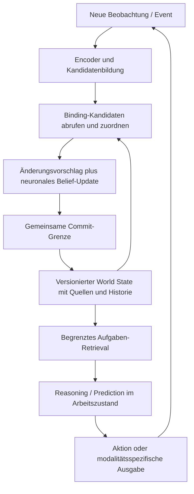

# Persistenter multimodaler World State: geprüfter Vorschlag

15. September 2026. Architekturberatung auf ausdrücklichen Wunsch des Nutzers;
zwei tatsächliche Claude-Reviews, anschließend Abgleich mit dem aktuellen Code.
Dieser Text präzisiert einen Vorschlag. Er implementiert keinen neuen Speicher,
ändert keine Modellgewichte und beansprucht keine neue experimentelle Validierung.

## Einschätzung

Die Grundrichtung passt: adressierbare Identitäten und Relationen, gelernte
Komponenten, getrennte Evidenz/Historie und ein begrenzter neuronaler Arbeitszustand.
Räumliche Karten sind optionale Spezialrepräsentationen. Ein Dokument oder Ziel
braucht keine künstliche Position. Ein großes Foundation Model ist keine
Voraussetzung; der eigene kleine Kern bleibt der Ausgangspunkt.

Die wichtigste Präzisierung: **World State ist die versionierte Kenntnis und
Überzeugung des Agenten über die Welt, keine garantierte Wahrheit.** Der Graph
organisiert Wissen. Er lernt weder Wahrnehmung noch Identität, Begriffe oder
Handlungsfähigkeit allein durch seine Existenz. Die Sample-Effizienz ist eine
Forschungshypothese, die gegen einfachere Speicher bei gleichen Daten geprüft wird.

Die vier Ebenen sind logische Ansichten, keine Aufforderung zu vier unabhängig
mutierenden Datenbanken. Einen gemeinsamen Snapshot veröffentlichen, aus dem
Entities, Komponenten, Relationen und abgeleitete Indizes konsistent lesbar sind.
Neuraler Filterzustand und Working Tokens bleiben enthalten bzw. daran gebunden;
sie werden nicht durch einen Graph-Dump ersetzt. Retrieval wird zweimal benötigt:
für Bindungskandidaten **vor** dem Update und für Aufgabenwissen danach.

Das letzte Feedback ist eine neue Beobachtung nur, wenn es tatsächlich extern
eingegangen ist. Imaginierte Vorhersagen und wieder abgerufene Erinnerungen sind
eigene Kontextarten und erzeugen keine neuen Beobachtungsbelege.

## Was im Repository schon vorhanden ist

| Baustein | Vorhandener Ansatz | Grenze für den neuen Vorschlag |
|---|---|---|
| Entity-Identität | `pathwm/models/entity_memory.py`: gelernter Matcher, lokale IDs, New/Unsicher, Retry-Receipts und Snapshots | Festes acht-dimensionales Descriptor-Format, kleine Kapazität, keine allgemeine multimodale Kandidatenbildung oder Merge/Split-Engine |
| Zustand je Entity | `pathwm/models/entity_state.py`: gelernte Zustandszelle, atomar vorbereitete Identitäts-/Latent-Updates | Spezialisierte Beobachtungen und binäre Auslese, kein generisches Komponentenmodell |
| Relationen | `pathwm/models/entity_relations.py`: gelernter Relationsschlüssel und Schreibentscheidung | Ein vorgegebener Relationstyp und Slot je Ziel; keine beliebigen typisierten Kanten oder Komponentenversionen |
| Event-Grenze | `BeliefAgent.begin_event/commit_event` in `pathwm/models/belief.py` | `commit_event` versiegelt einen vom Aufrufer gehaltenen Zustand; keine gemeinsame dauerhafte DB-Transaktion mit dem Entity Store |
| Evidenz/Belief/Hierarchie | `belief_state.py`, `hybrid_memory.py`: getrennte Ansichten, Zeit/Quellen und begrenzte Speichergruppen | Kein vollständiges Rohdaten-Event-Archiv; Leser verarbeiten vorhandene begrenzte Speichergruppen, nicht einen globalen ANN-Entity-Index |
| Entity → Reasoner | `KeyBoxReader` in `pathwm/models/key_box.py`: Entity-Latent → Projektion → echte Working Tokens | Kontrollierter Aufgabenpfad; Planungsdynamik ist vorgegeben, allgemeiner learned World State unvalidiert |

Die Integration sollte diese Grenzen erweitern und ihre Verträge wiederverwenden.
Die lange vorgeschlagene Modulstruktur wäre zunächst zu viel. Unser Paket heißt
`pathwm`, nicht `path_wm`. Wenige einfache Records und ein Adapter genügen als
Entwurfsrichtung; noch keine leeren Framework-Verzeichnisse oder ANN-Abhängigkeit.

## Vor einer Implementierung zu präzisieren

### 1. Identität, Granularität und Bindung

Eine stabile Speicher-ID ist eine Adresse. Ob zwei Beobachtungen dieselbe Sache
zeigen, bleibt eine inferierte Zuordnung. Ein eigenes unveränderliches
`identity_signature`-Feld ist dafür nicht zwingend. Wiedererkennungsmerkmale und
Zustandsmerkmale können sich unterscheiden, müssen aber nicht separate Netze sein.

Ein Bild kann mehrere Objekte enthalten; ein Satz kann mehrere Dinge erwähnen.
Darum fehlt vor dem Scorer ein Kandidatenvertrag: Region/Span/Slot, Features,
Modalität, Zeit, Quelle und gegebenenfalls Unsicherheit. Eine einzelne gemittelte
Bildrepräsentation genügt nicht automatisch zum Binden jedes Objekts.
[Slot Attention](https://arxiv.org/abs/2006.15055) illustriert gelernte austauschbare
Objektkandidaten; austauschbare Slotpositionen sind keine persistenten IDs.

Die vorgeschlagene gewichtete Summe ist eine mögliche Baseline, aber semantische
Ähnlichkeit darf nicht mit Instanzidentität gleichgesetzt werden. Fehlende räumliche
Merkmale eines Dokuments sind keine negative Evidenz. Merkmale brauchen kompatible
Skalen, Verfügbarkeitsmasken und Regeln für Konflikte. Mehrere Beobachtungsteile
können zu einer Entity gehören; konkurrierende Instanzkandidaten benötigen eine
gemeinsame Zuordnungsregel. Ambige Mischungen nicht in mehrere bestätigte Zustände
einschreiben.

Vorgeschlagenes Ergebnisformat:
`matched(entity_ref)`, `new(provisional_ref)` oder
`unresolved(candidate_refs, scores, reason, missing_evidence)`.
Scores sind zunächst keine kalibrierten Wahrscheinlichkeiten. Ein unklares Matching
darf keine bestätigte Entity überschreiben. Die konkrete Aufgaben-Granularität,
Schwellen, New/Abstain-Regeln und Maximalkapazität werden im ersten Versuchsplan
festgelegt; keine universelle Objektdefinition vorgeben.

### 2. Persistenz, Korrektur und Zeit

Quellenbelege und Änderungshistorie müssen **ab Phase 1** vorhanden sein. Sonst
lässt sich ein falsches Merge später nicht verlässlich reparieren. Nicht jede
vollständige Rohaufnahme muss unbegrenzt gespeichert werden; definieren, welche
Belege/Snapshots für welchen Korrekturzeitraum verfügbar bleiben.

MERGE zunächst als widerrufbare Identitätsauflösung: alte IDs und Zuordnungen
bleiben nachvollziehbar, eine kanonische Lesesicht kann Alias-IDs zusammenführen.
Ein abgelehnter Merge darf keine bereits vermischten Quellen verstecken. SPLIT
bedeutet dann Zuordnungen korrigieren und betroffene Zustände aus erhaltenen
Ereignissen/Snapshots neu aufbauen. Ein gemittelter Latent lässt sich nicht
allgemein in seine ursprünglichen Entity-Zustände zurückrechnen. Unsichere
pairwise `same_as`-Scores nicht blind transitiv zu einer Identität vereinigen.

Mindestens unterscheiden: Zeitpunkt des Inhalts/Ereignisses, Zeitpunkt des
Bekanntwerdens und Revision des gespeicherten Zustands. Eine heute gelesene Aussage
über gestern ist kein gestriges Wissen des Agenten. `last_seen` nur durch echte
Beobachtung verändern. Teilzustände brauchen Quellen, Gültigkeit, Modellversion
und Ableitungsstatus; diese Angaben dürfen nicht nur an der Entity-Wurzel hängen.

Komponenten-Endpunkte sind sinnvoll, brauchen jedoch stabile Referenzen und eine
klare Regel: dynamisch die aktuelle Komponente oder genau Revision r? Beides nicht
unter demselben Pointer verstecken. Für M1 reichen Entity-Kanten, sofern die
Aufgabe keine Komponentenkanten benötigt. Ein gewählter Relationstyp kann gelernt
repräsentiert werden; sein lesbarer Name bleibt ein Alias, keine garantierte
Interpretation jedes latenten Merkmals.

Bei einem Event zuerst Kandidaten und Änderungen vorbereiten, dann Belief,
Entity-Änderungen und Receipt gemeinsam als eine neue Snapshot-Version publizieren.
ID-Indizes und Nachbarschaften sind abgeleitete Ansichten. Tests für manuellen
CREATE/UPDATE/link/unlink, Retry, ungültige Referenzen, Abbruch und Wiederanlauf
sind möglich, bevor der Binder zuverlässig lernt. Der bestehende pure
`commit_event` darf nicht unbemerkt externe Nebenwirkungen erhalten.

### 3. Repräsentation, Inhalt und Ausgabe

Suchschlüssel, inhaltlicher Latent und originale Evidenz erfüllen verschiedene
Aufgaben. Ein globaler Wiedererkennungsvektor ist nicht automatisch ein räumlicher
Bildcode, ein Textgedächtnis oder eine gut decodierbare Personenbeschreibung.
Pro Komponente Shape/Modalität, Encoder-/Updater-Version und Quellenreferenzen
festhalten. Für M1 Encoder und Matcher-Version während einer Speicherepisode
fixieren. Unsere vorhandenen Snapshots prüfen bereits Modell-Fingerprints.

Spätere Versionswechsel: alten Snapshot behalten; neue Features aus verfügbaren
Quellen erzeugen; neuen Index separat aufbauen; Übereinstimmung validieren; neue
Revision atomar freigeben. Fehlen Quellen oder ein getesteter Übersetzer, alte
Features als inkompatibel kennzeichnen und erneute Beobachtung verlangen. Kein
stilles Vermischen verschiedener Embedding-Räume, kein Timestamp-only-Upgrade.

`information-preserving encoder` ist zu stark formuliert: nur R ist garantiert
reversibel; P/M können ebenfalls Informationen verlieren, C ist der explizite
Engpass. Das Prinzip lässt sich modalitätsspezifisch nutzen; PixelUnshuffle ist
kein universeller Text- oder Audiooperator. Ein Graph repariert keine verlorenen
Encoderinformationen. Frei erzeugte Ausgaben brauchen weiterhin einen trainierten
Übergang vom Arbeitszustand zum jeweiligen Decoder-Latent; die schon vorhandenen
Codec- und Generationsarbeiten bleiben eigenständige offene Punkte.

### 4. Lernvertrag und Retrieval

| Lernaufgabe | Konkretes anfängliches Signal | Abgrenzung |
|---|---|---|
| Instanz-Binding | Positive Korrespondenzen, ähnliche negative Instanzen, New-Fälle; etwa kontrastiver oder Klassifikationsverlust | Ground-Truth-Speicher-IDs sind Labels, keine Eingabefeatures |
| Zustandsupdate | Zeitlich passende Zustands-/Ereignisfragen, Erhalt unbetroffener Entities | Fehlende Observation darf nicht still als Zustandsänderung gelten |
| Prediction | Nächster Zustand/Outcome, bedingt auf Aktion und Zeit; Prüfung auf zurückgehaltenen Folgen | Neue echte Evidenz von Vorhersagen unterscheiden |
| Retrieval/Query | Relevante Quellen als Trainingsziele oder messbare spätere Aufgabenverbesserung | Zugriffspfad schon beim Training nutzen; diskrete Speicherschritte sind nicht automatisch differenzierbar |
| Konsolidierung | Neue Instanzen/Aufgaben nach wenigen Beispielen, gleiche Quellen- und Speicherbudgets | Wiederfinden gelernter Beispiele allein beweist kein abstrahiertes Konzept |

M1 kann mit festem Query und einfacher Ähnlichkeitssuche beginnen. Ein CPU-Scan
kleiner Bestände plus ID-/Adjazenz-Dictionaries reicht; ANN erst nach Profiling.
Nicht nur top-k Entities, sondern auch Ereigniszahl, Nachbarschaftstiefe,
Payload-/Tokenbudget und Zahl der erneuten Queries begrenzen. Der Binder und der
Reasoner können verschiedene Retrieval-Anfragen haben.

Jede Antwort trägt Snapshot-Version, Quelle und Gültigkeit. Reicht der abgerufene
Ausschnitt nicht aus, ist `unresolved` oder eine begrenzte weitere Query erlaubt.
Ein fehlender Treffer beweist weder Nichtexistenz noch fehlendes Wissen. Messbar
trennen: Kandidat nicht gefunden, falsch gebunden, Zustand falsch aktualisiert,
richtiger Zustand nicht ausgelesen. [RAG](https://arxiv.org/abs/2005.11401) ist ein
Beispiel für trainierte gemeinsame Nutzung parametrischen Wissens und Retrieval;
es validiert nicht automatisch diesen multimodalen Agentenentwurf.

### 5. Unsicherheit, Konzepte, Self und Exploration

Unsicherheit je Aussage zu speichern ist richtig. Nicht gesehen, veraltet,
unwahrscheinlich existent und aus Speicherplatzgründen verworfen sind verschiedene
Fälle. Ein Dokument wird nicht wegen fehlender neuer Beobachtung weniger existent.
Prediction Error ist Überraschung; er kann Datenmangel, Rauschen, Modellfehler oder
Optimierungsprobleme ausdrücken. Confidence auf Validierungsfällen kalibrieren
und auf getrennten Testfällen prüfen; die [Kalibrierungsarbeit von Guo et al.](https://arxiv.org/abs/1706.04599)
zeigt, warum Netzwerk-Confidence nicht einfach als Korrektheitswahrscheinlichkeit
übernommen werden sollte. Ein v1-Score trennt epistemisch/aleatorisch noch nicht.

Konzepte sind eine sinnvolle nächste Ebene. Clustering liefert erst Kandidaten
für gemeinsame Struktur, nicht automatisch eine Kategorie mit Funktion und
Affordanzen. [Prototypical Networks](https://arxiv.org/abs/1703.05175) zeigen einen
konkreten Few-shot-Klassifikationsweg mit gelerntem Merkmalsraum. Der Vergleich
für PATH-WM sollte zusätzlich k-NN über Episoden und einfache Klassenprototypen
einschließen, auf neuen Instanzen und Aufgaben. Pretraining-Daten/-Kosten sowie
Online-Beispiele getrennt berichten. Kein Foundation Model als notwendige Basis
oder unkontrollierten Vorsprung in die Vergleichsarme einschmuggeln.

Self-Entity als funktionales Selbstmodell ist schlüssig. Die tatsächliche
Sensor-/Aktuator-Zuordnung wird vom Harness vergeben; eine gelernte `owns`-Kante
erteilt keine ausführbare Berechtigung. Reale Ressourcen, deklarierte Ziele und
geschätzte Fähigkeiten unterscheiden. Eine Rollenrepräsentation und physische
Kontrollbindung sind verschiedene Operationen.

Mehrkanaliges Feedback behalten. Daraus folgt noch keine definierte Policy:
Aufgabenziele, harte Constraints und Lernsignale brauchen getrennte Verträge.
Affektparameter zunächst als optionale Rechen-/Prioritätsregler betrachten,
gegen einen einfachen Regler mit denselben Inputs/Budgets vergleichen. Benannte
Achsen belegen keine menschlichen Emotionen oder zusätzliche Fähigkeit.

Information Gain ist später sinnvoll, darf aber nicht durch die eigene
steigende Confidence ersetzt werden. Belohnte Vorhersagefehler können zu
unlernbaren Zufallssignalen führen; die [RND-Arbeit](https://arxiv.org/abs/1810.12894)
diskutiert diesen Noisy-TV-Effekt und mehrere Fehlerursachen. Vor Exploration
brauchen wir Vorhersage-/Kalibrierungsprüfungen auf zurückgehaltenen Daten; später random, Neuheit
und Informationsgewinn bei identischen Aktionen-, Beobachtungs- und Rechenbudgets
vergleichen. Affekt folgt erst auf einen funktionierenden aktiven Baseline-Lerner.

## Empfohlene Reihenfolge und erster Meilenstein

**M0 – Verträge:** Identitätsgranularität, Evidence/Claim-Semantik, Zeit/Revision,
Commit/Retry, begrenzte unresolved-Hypothesen und manuelle link/unlink-Korrektur.
Vorhandene Module wiederverwenden, keine neue Parallelarchitektur.

**M1 – Persistente Identität und korrigierbarer Zustand:** Zwei ähnliche Objekte,
unterschiedliche Historien, Zustandswechsel, Aus-/Wiedereintritt, Verdeckung und
mehrdeutige Fälle. Zunächst gelieferte Regionen/Objektvorschläge plus eingefrorener
Encoder; das testet Binding, nicht freie Objekterkennung. Simulatorzuordnungen
nur als Supervision. Beide Objekte und ähnliche negative Fälle sind notwendig:
immer dieselbe ID auszugeben darf Experiment A nicht bestehen.

Fragen müssen Historie benötigen: Paare mit gleichem letzten Bild, aber anderer
richtiger Antwort. Neustart und identischer Replay dürfen keine Duplikate anlegen.
Ein absichtlich falscher Identitätslink wird korrigiert; Quellen, Zustände und
Relationen müssen danach den richtigen Instanzen zugeordnet sein. Trenne manuell
gelieferte Korrektur von selbst gelerntem Erkennen eines Fehlers. Gekoppelte
Bild-/Textbeobachtungen sind ein anschließender M1b-Test; ein kleiner Dokument-
Versionsfall prüft, dass der Speicher keine räumlichen Pflichtfelder benötigt.

Vergleichsarme: korrekte vorgegebene Zuordnung/Retrieval als Diagnose, einfacher
Matcher mit flachem episodischem Speicher, strukturierter Speicher und kein
historischer Zugriff. Gleiches Observation-/Feature-/Kontextbudget. Zusätzlich
falsche/fehlende Erinnerungen einsetzen: Der Reasoner muss korrekt auf deren
Inhalt reagieren und Unsicherheit zulassen. Keine Pflicht zum Speicher-Vorteil
auf Aufgaben, die tatsächlich ohne Erinnerung lösbar sind.

Vor Ausführung sind Splits, Seeds, Budgets und numerische Mindestwerte für
Zuordnungspräzision, Coverage, falsche Merges/Neueinträge, Identity Switches,
Zustands-/Fragegenauigkeit, Recall@k und Latenz festzulegen. Mechanische
Commit-/Restore-Invarianten müssen ohne Verletzung bestehen. Ambige Fälle separat
mit erwarteter Abstention auswerten; sonst könnte immer schweigen gewinnen.
Dieses Review legt noch keine Trainingskampagne oder Erfolgsschwellen fest.

**M2 – Wenige Beispiele und Konzepte:** Der bisherige DoD-Punkt10 wird ein eigener
Meilenstein. Abstraktion von Instanzen, Konzept-/Funktionsübertragung und einfache
Beispielretrieval-Baselines separat messen. Wiedererkennen einer neuen Instanz
derselben Klasse und Erkennen derselben individuellen Entity sind verschiedene
Tests. Erst danach komplexeres Self-Prediction, aktive Exploration und Modulation;
Spatial Memory nur bei konkretem Aufgabenbedarf.

Der kleinere M1 ist glaubwürdig abgeschlossen, wenn Speichermechanik und
Referenzkontrollen passen, korrekte Bindung und state/history-Aufgaben die vorab
gesetzten Präzisions-/Coverage-Grenzen erreichen, Korrekturen nach Neustart wirken
und der Reasoner im festen Retrievalbudget arbeitet. Das allein validiert noch
keine allgemeine Sample-Effizienz oder alle späteren Meilensteine.

## Claude-Reconciliation und Status

Claude befürwortete die Hybridrichtung, wollte zunächst aber Existenz-Decay,
einen festen Identitätssignaturvertrag und die komplette ursprüngliche Reihenfolge
beibehalten. Korrigiert: kein universeller Existenzverfall; API-Tests können dem
Binder vorausgehen; feste separate Identitätssignaturen sind nicht zwingend;
Evidenz früh, Konzepte später. Die zweite Antwort akzeptiert alle sieben
vorgelegten Korrekturen und den kleineren M1. Die zusätzlich verlangten Angaben zu
unresolved-Ausgaben, Versionswechseln und Baseline-Kriterien stehen oben.

Receipts: `runs/reviews/world_state_proposal_v1/`. Extern gingen ausschließlich der
vom Nutzer zur Diskussion freigegebene Vorschlag und konzeptionelle Kritik,
keine privaten Quelltexte, Daten oder Messwerte. Übereinstimmung im Review ist
keine experimentelle Validierung. Code-/Linkprüfung und Dokumentation sind die
Arbeit dieses Turns; Implementierung und neue Trainingsexperimente sind offen.
