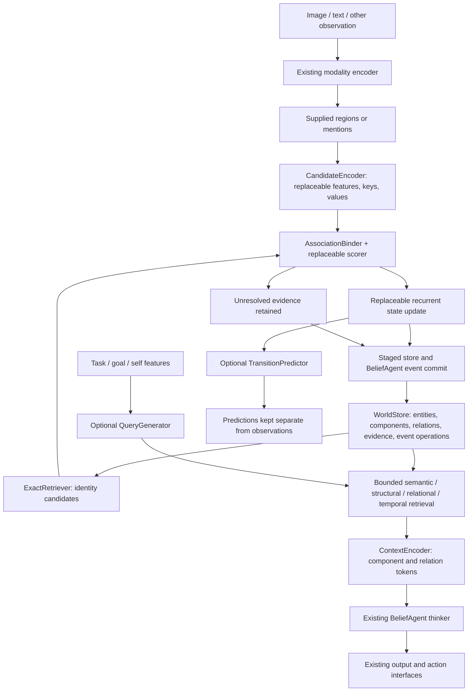

# Persistent World State foundation

The opt-in `pathwm.world_state` package adds persistent entities, components,
relations and evidence alongside the existing `BeliefAgent`. The
[editable recipe](../experiments/world_state.py) exercises the full path with tiny
supplied object descriptors. It does not replace the existing agent or modality
experiments. [Implementation protocol](world-state-foundation-plan.md).



## Modules and replacement points

| Location | Concrete pieces | How to replace/extend |
|---|---|---|
| `records.py` | Entity, Component, Endpoint, Relation, Evidence, Event, Limits | Components carry names, shaped numeric values and readable metadata; raw media stay referenced. No spatial requirement. |
| `store.py` | WorldStore, Transaction | Single-writer reference implementation. Keep atomic publication, revisions, provenance, retry and snapshot contracts when changing storage. |
| `retrieval.py` | Query, RetrievalBudget, RetrievedContext, ExactRetriever, intervene | Supply another callable returning the same pinned, bounded context. Exact CPU scan first; no ANN dependency. |
| `modules.py` | CandidateEncoder, AssociationScorer/CosineScorer, AssociationBinder | Replace backbone/projection or the whole scorer/policy. Candidate proposals and representation identities are explicit inputs. |
| `modules.py` | RecurrentUpdater, ReplaceUpdater, TransitionPredictor | Ordinary neural modules. Swap the cell/network or whole updater with the same tensor contract. |
| `modules.py` | QueryGenerator, ContextEncoder, RelationEncoder | Replace the query network, each component projection, relation encoder or complete token constructor. Context token budget stays explicit. |
| `session.py` | WorldSession, rebuild_entity_state | Connect storage to actual BeliefAgent events/working tokens; explicitly replay the foundation's retained feature evidence after correction. |
| `extensions.py` | create_prototype, ControlBinding, Feedback, ActionProposal, select_action, RegulatoryModulator | Small optional clients. Prototypes average examples; control authority is harness-owned; selection consumes supplied scores and never executes. Modulation is off unless explicitly used. |
| `inspection.py` | WorldTrace, inspect_store, snapshot_diff | One schema for detached tensor/attention/gradient summaries, capped exact arrays and decision records. |
| `evaluation/world_state.py` | world_state_inspection | Adds entity search, components, relations, evidence, event operations and neural traces to the existing portable report. |

No module registry, universal trainer, empty subsystem tree, graph database or new
configuration framework. Construct ordinary modules in the recipe. Tensor modules
can be optimized separately from Python storage/retrieval; no compilation-speed
claim is made by this foundation.

## Store and time semantics

```python
from pathwm.world_state import WorldStore
from pathwm.world_state.retrieval import ExactRetriever, Query
import torch

store = WorldStore()
tx = store.begin("frame-1", occurred_at=1, available_at=2)
entity = tx.create_entity("cup")
proof = tx.add_evidence("camera", "image", content_ref="frame-1.png")
tx.put_component(entity, "recognition", torch.tensor([1., 0.]),
                 space="visual-key", model_version="encoder-v1", evidence=(proof,))
store.commit(tx)
context = ExactRetriever()(store, Query(entity_ids=(entity,), known_at=2))
store.save("world.json")
```

`occurred_at` is content/event time; `available_at` is when the agent learned it.
Availability must not move backwards, but late event times are allowed. A query
first pins one revision/knowledge cutoff, then selects content by event-time range.
These are content-selection semantics, not a general bitemporal truth resolver for
arbitrary intervals. Corrections visible at revision 5 cannot alter revision 3.
Historical store retrieval does not rewind the neural recurrent state. For a
whole-agent "what was known then" evaluation, restore the corresponding session.

The event log is authoritative. Restore rebuilds materialized views and checks
operation fingerprints, references, capacities and receipts. Complete identical
retries return their original receipt even after later corrections; they do not
resurrect old state. New writes require the exact base revision. Limits fail loudly
rather than silently evicting correction evidence. Entity/component/relation/event
counts, numeric payload and total serialized log bytes are bounded.

`None` numeric value allows a readable-only component, e.g. a document with text in
`data`. `space` and `model_version` describe that representation too. Entity labels,
type hints and existence scores can be revised with `update_entity`; identity and
`last_seen` cannot be set this way. Non-observation causes no automatic existence
decay. Scores are not calibrated probabilities by declaration.

`same_as` links are accepted identity hypotheses. The canonical read view groups
IDs; original components retain their owners. Revoking a link (`split`) preserves
all original records. Reattributing a component (`reassign`) marks transitive
inferences that cite it through `parents` inactive. Retrieval suppresses invalid
latest values instead of falling back silently to an older state. Explicit replay
can build a fresh valid state from retained observations. The provided replay
adapter understands supplied candidate feature payloads; another observation schema
needs its own adapter. It does not invert mixed latents or recover deleted data.

Relation endpoints reference entities or components in the pinned snapshot.
Component endpoints follow corrected attribution in a new revision; the old view
remains available. Inferred relation meanings, learned concept discovery and general
merge/split *decision learning* remain separate experiments.

## Neural and persistence boundaries

CandidateEncoder takes supplied region/mention features `[N,input_width]` and
returns keys `[N,key_width]` and values `[N,value_width]`. This is not an object
proposal detector. Existing image/text encoders can produce those input features;
the test suite also exercises an actual image packet alongside a candidate.

A scorer takes `[Q,D]` queries and `[M,D]` keys. AssociationBinder groups scores by
accepted identity aliases and returns matched/new/unresolved. It requires a margin,
checks representation compatibility and abstains when candidate retrieval is
incomplete. An exclusive group can prevent two candidates from one view claiming
one entity. Multiple modalities may instead co-refer when exclusivity is omitted.

The recurrent updater takes previous `[B,state_width]`, observation
`[B,input_width]` and elapsed time. ContextEncoder accepts explicitly configured
representations and projections, preserving local entity attribution, role, age,
confidence presence and optional directed relation tokens. Unknown or budget-omitted
records are listed in diagnostics. Retrieval omission is not proof of absence.

Persistent `put_component` rejects tensors carrying an autograd graph. Functional
encoder/scorer/updater/query/context/predictor forwards remain differentiable.
`ContextEncoder.project_value` is shared by training and runtime; there is no second
training-only projection. WorldSession is deliberately an inference owner. Train
outside it with explicit losses/BPTT, then freeze runtime model/version identities.

The session fingerprints its agent, scorer, updater, context projection and relevant
contracts, and rejects changed runtime weights. Upstream supplied feature producers
must provide truthful representation versions; the store cannot infer which encoder
produced an arbitrary supplied vector. Use version changes/re-encoding rather than
mixing embedding spaces. Existing Run snapshots capture the complete recipe model,
optimizer and RNG for training resume.

WorldSession keeps stochastic state locally. Store changes, event state, receipts
and RNG are prepared before publication. `save_to=` writes one combined restart
snapshot before changing the live bundle, so failed writes leave it untouched.
Atomic file replacement protects process-level snapshots; this is not a
multi-process/concurrent/distributed or power-loss durability guarantee.
For internal changes/corrections, prepare a transaction with `session.store.begin`
and publish it using `session.commit(tx)`. This advances the core clock without
inventing source evidence. Direct store mutation ahead of the core clock is rejected
on subsequent session access. A standalone WorldStore can use `store.commit` directly.

An imagined branch cannot become a live event. Recalled/generated context enters
thinking, never `add_evidence`. The session updates only working context during
`think`; existing decoder/action interfaces remain explicit consumers. An action
proposal or a SELF/owns graph label cannot execute or grant capabilities.

## Training and inspection

```bash
.venv/bin/python -m experiments.world_state --check --output runs/my_world_check
.venv/bin/python -m experiments.world_state --output runs/my_world_training
.venv/bin/python -m experiments.world_state --resume runs/my_world_training
```

Default: CPU, 96 updates, 16 examples/update. Supplied descriptors identify two
objects; a property is shown then hidden. The final input is identical across
paired histories with different correct answers. Matching, recurrent state, actual
thinker readout and a toy action forecast have explicit losses. This is a
four-combination development task, not a held-out real-world capability study.

For controlled pause/resume use `--stop-after N`; it does not change the declared
training budget. A different model/recipe/objective requires a new output directory.
The result gate is fixed before the run: training loss falls at least 10%, store
restore agrees and the actual reasoner replay is exact. Other diagnostics remain
visible separately; neither a prototype nor an action proposal is a learned skill.

Run artifacts:

- `last.pt`, `run.json`, `metrics.jsonl`, source snapshots: existing Run contract.
- `session.pt`, `session_after_correction.pt`, `world_snapshot.json`: runtime and
  persistent world checkpoints, including correction history.
- `world_state.json`: inspectable entities, aliases, component statistics/dependencies,
  relations, evidence and event operations.
- `world_trace.json` / `world_trace.npz`: decisions, retrieval, attention, activations,
  gradients and optional bounded exact arrays; dropped-record counts are explicit.
- `debug/step_*/`: selected training snapshots using the same schema.
- `result.json` and standalone `report.html`: measured outcomes and local searchable
  debug view. No Internet/browser tool execution is part of the agent foundation.

Use `WorldTrace.capture(model, ["path.to.module"], gradients=True)` around both
forward and backward. Hooks are removed on exit, and retained captures are detached.
Nested dictionaries, tuples and dataclass feature pyramids are traversed too.
Attention keeps its normal numerical path; diagnostic pre-dropout probabilities
are computed separately without changing outputs, gradients or RNG.
`intervene(context, remove_entities=..., replacements=...)` creates a diagnostic
context without touching storage; its provenance explicitly marks the intervention.
Decoded latent visualizations require a compatible trained decoder and do not
constitute a literal picture of all the agent's beliefs.

## Remaining capability work

Free object/mention discovery, robust real multimodal identity, calibrated confidence,
learned retrieval relevance, concept/function transfer, general learned dynamics,
useful exploration/regulation, large maps and reliable outputs need their own data,
objectives and tests. Storage and interfaces now have concrete consumers; these
capabilities must not be inferred from module existence or this small exercise.
